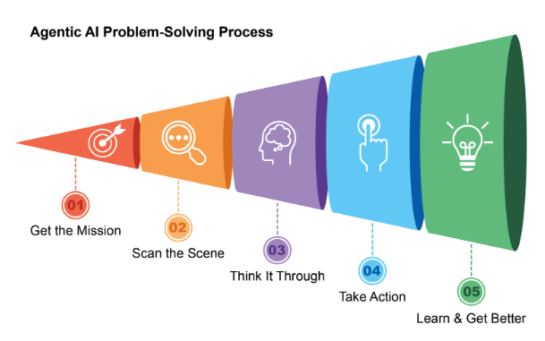
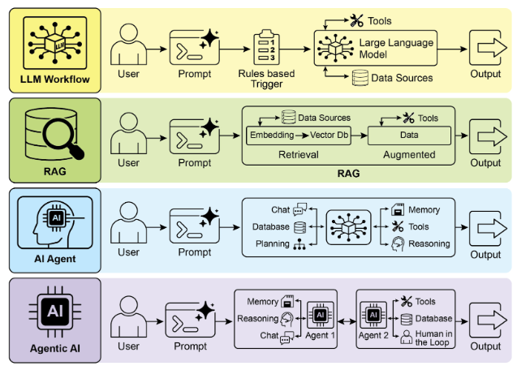
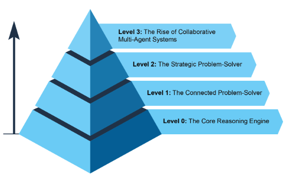
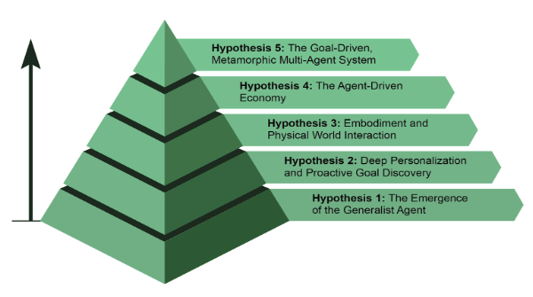

# 什么使 AI 系统成为智能体？

简单来说，**AI 智能体**是一个旨在感知其环境并采取行动以实现特定目标的系统。它是从标准大型语言模型（LLM）演变而来的，增强了规划、使用工具和与其周围环境交互的能力。将智能体 AI 视为一个在工作中学习的智能助手。它遵循一个简单的五步循环来完成工作（见图 1）：

1. **获取任务：** 你给它一个目标，比如"整理我的日程安排"。  
2. **扫描场景：** 它收集所有必要的信息——阅读电子邮件、查看日历和访问联系人——以了解正在发生什么。  
3. **仔细思考：** 它通过考虑实现目标的最佳方法来制定行动计划。  
4. **采取行动：** 它通过发送邀请、安排会议和更新你的日历来执行计划。  
5. **学习并改进：** 它观察成功的结果并相应调整。例如，如果会议被重新安排，系统会从这一事件中学习以增强其未来的性能。

图 1：智能体 AI 作为智能助手，通过经验不断学习。它通过一个简单的五步循环来完成任务。

智能体正在以惊人的速度变得越来越流行。根据最近的研究，大多数大型 IT 公司都在积极使用这些智能体，其中五分之一是在过去一年内刚刚开始的。金融市场也在关注。到 2024 年底，AI 智能体初创公司已筹集超过 20 亿美元，市场价值为 52 亿美元。预计到 2034 年将激增至近 2000 亿美元的价值。简而言之，所有迹象都表明 AI 智能体将在我们的未来经济中发挥巨大作用。

仅仅两年时间，AI 范式就发生了巨大变化，从简单的自动化转向复杂的自主系统（见图 2）。最初，工作流依赖基本提示和触发器来使用 LLM 处理数据。这随着检索增强生成（RAG）而发展，RAG 通过将模型建立在事实信息上来增强可靠性。然后我们看到了能够使用各种工具的个人 AI 智能体的发展。今天，我们正在进入智能体 AI 时代，专业智能体团队协同工作以实现复杂目标，这标志着 AI 协作能力的重大飞跃。

图 2：从 LLM 到 RAG，然后到智能体 RAG，最后到智能体 AI。

本书的意图是讨论专业智能体如何协同工作和协作以实现复杂目标的设计模式，你将在每章中看到一个协作和交互的范例。

在此之前，让我们检查跨越智能体复杂性范围的示例（见图 3）。

## 级别 0：核心推理引擎

虽然 LLM 本身不是智能体，但它可以作为基本智能体系统的推理核心。在"级别 0"配置中，LLM 在没有工具、内存或环境交互的情况下运行，仅根据其预训练知识进行响应。它的优势在于利用其广泛的训练数据来解释既定概念。这种强大的内部推理的代价是完全缺乏当前事件意识。例如，如果信息在其预训练知识之外，它将无法说出 2025 年奥斯卡"最佳影片"的获奖者。

## 级别 1：连接的问题解决器

在这个级别，LLM 通过连接和利用外部工具成为功能智能体。它的问题解决不再局限于其预训练知识。相反，它可以执行一系列操作，从互联网（通过搜索）或数据库（通过检索增强生成，或 RAG）等来源收集和处理信息。详细信息，请参阅第 14 章。

例如，要查找新电视节目，智能体识别对当前信息的需求，使用搜索工具找到它，然后综合结果。关键的是，它还可以使用专用工具以获得更高的准确性，例如调用金融 API 获取 AAPL 的实时股价。这种在多个步骤中与外部世界交互的能力是级别 1 智能体的核心能力。

## 级别 2：战略问题解决器

在这个级别，智能体的能力显著扩展，包括战略规划、主动协助和自我改进，提示工程和上下文工程作为核心使能技能。

首先，智能体超越单一工具使用，通过战略问题解决来处理复杂的多部分问题。当它执行一系列操作时，它主动执行上下文工程：为每个步骤选择、打包和管理最相关信息战略过程。例如，要在两个位置之间找到咖啡店，它首先使用地图工具。然后它工程化这个输出，策划一个简短、聚焦的上下文——可能只是街道名称列表——输入到本地搜索工具，防止认知过载并确保第二步高效准确。要从 AI 获得最大准确性，必须给它一个简短、聚焦和强大的上下文。上下文工程是通过战略选择、打包和管理所有可用来源中最关键信息来实现这一目标的学科。它有效地策划模型的有限注意力，防止过载并确保在任何给定任务上的高质量、高效性能。详细信息，请参阅附录 A。

这个级别导致主动和连续操作。连接到你的电子邮件的旅行助手通过工程化冗长的航班确认电子邮件的上下文来展示这一点；它只选择关键详细信息（航班号、日期、位置）打包，以便后续调用你的日历和天气 API 的工具调用。

在软件工程等专业领域，智能体通过应用这一学科来管理整个工作流。当分配错误报告时，它读取报告并访问代码库，然后战略性地将这些大型信息源工程化为强大的、聚焦的上下文，使其能够高效地编写、测试和提交正确的代码补丁。

最后，智能体通过改进自己的上下文工程过程来实现自我改进。当它询问如何改进提示的反馈时，它正在学习如何更好地策划其初始输入。这使它能够自动改进如何为未来任务打包信息，创建一个强大的、自动化的反馈循环，随着时间的推移提高其准确性和效率。详细信息，请参阅第 17 章。

图 3：展示智能体复杂性范围的各种实例。

## 级别 3：协作多智能体系统的兴起

在级别 3，我们看到 AI 开发的重大范式转变，从追求单一、全能的超级智能体转向复杂的协作多智能体系统的兴起。本质上，这种方法认识到复杂挑战通常不是由单一通才解决，而是由协同工作的专业团队解决。这个模型直接反映了人类组织的结构，其中不同部门被分配特定角色并协作处理多方面的目标。这样一个系统的集体力量在于这种劳动分工和通过协调努力产生的协同作用。详细信息，请参阅第 7 章。

为了将这个概念变为现实，考虑推出新产品的复杂工作流。与其让一个智能体尝试处理每个方面，不如让一个"项目经理"智能体充当中央协调器。这个管理器将通过将任务委派给其他专业智能体来编排整个过程：一个"市场研究"智能体来收集消费者数据，一个"产品设计"智能体来开发概念，以及一个"营销"智能体来制作宣传材料。他们成功的关键在于它们之间的无缝通信和信息共享，确保所有个人努力都对齐以实现集体目标。

虽然这种自主、基于团队的自动化愿景已经在开发中，但重要的是要承认当前的障碍。这种多智能体系统的有效性目前受到它们使用的 LLM 的推理限制的约束。此外，它们真正相互学习并作为一个有凝聚力的单元改进的能力仍处于早期阶段。克服这些技术瓶颈是关键下一步，这样做将释放这一级别的深刻承诺：从头到尾自动化整个业务工作流的能力。

## 智能体的未来：五大假设

AI 智能体开发正在软件自动化、科学研究和客户服务等多个领域以前所未有的速度发展。虽然当前系统令人印象深刻，但它们只是开始。下一波创新可能会专注于使智能体更加可靠、协作并深度融入我们的生活。以下是关于未来的五个主要假设（见图 4）。

### 假设 1：通才智能体的出现

第一个假设是 AI 智能体将从狭窄的专家演变为真正的通才，能够以高可靠性管理复杂、模糊和长期的目标。例如，你可以给智能体一个简单的提示，比如"为我公司计划下季度在里斯本为 30 人举行的场外静修"。然后智能体将管理整个项目数周，处理从预算批准和航班谈判到场地选择和根据员工反馈创建详细行程的所有事情，同时提供定期更新。实现这种级别的自主性将需要 AI 推理、内存和近乎完美的可靠性的根本性突破。另一种方法（但不相互排斥）是小型语言模型（SLM）的兴起。这种"乐高式"概念涉及从小型、专业专家智能体组合系统，而不是扩展单一整体模型。这种方法承诺系统更便宜、调试更快、部署更容易。最终，大型通才模型的开发和小型专业模型的组合都是可行的前进道路，它们甚至可以相互补充。

### 假设 2：深度个性化和主动目标发现

第二个假设认为智能体将成为深度个性化和主动的合作伙伴。我们正在见证新一类智能体的出现：主动合作伙伴。通过学习你独特的模式和目标，这些系统开始从仅仅遵循命令转向预测你的需求。AI 系统在超越仅仅响应聊天或指令时作为智能体运行。它们代表用户启动和执行任务，在此过程中主动协作。这超越了简单的任务执行，进入了主动目标发现的领域。

例如，如果你正在探索可持续能源，智能体可能会识别你的潜在目标，并通过建议课程或总结研究来主动支持它。虽然这些系统仍在开发中，但它们的轨迹是明确的。它们将变得越来越主动，学会在高度确信行动会有帮助时代表你采取主动。最终，智能体成为不可或缺的盟友，帮助你发现和实现你尚未完全表达的雄心。

图 4：关于智能体未来的五个假设

### 假设 3：具身化和物理世界交互

这个假设预见智能体将摆脱纯粹的数字限制，在物理世界中运行。通过将智能体 AI 与机器人技术集成，我们将看到"具身智能体"的兴起。与其仅仅预订修理工，你可能要求你的家庭智能体修理漏水的龙头。智能体将使用其视觉传感器感知问题，访问管道知识库制定计划，然后精确控制其机器人操纵器执行维修。这将代表一个里程碑式的步骤，弥合数字智能和物理行动之间的差距，并将从制造业和物流到老年护理和家庭维护的一切进行转变。

### 假设 4：智能体驱动的经济

第四个假设是高度自主的智能体将成为经济的积极参与者，创造新的市场和商业模式。我们可能会看到智能体作为独立的经济实体，任务是最大化特定结果，例如利润。企业家可以启动一个智能体来运行整个电子商务业务。智能体将通过分析社交媒体来识别趋势产品，生成营销文案和视觉内容，通过与其他自动化系统交互来管理供应链物流，并根据实时需求动态调整价格。这种转变将创建一个新的、超高效的"智能体经济"，以人类无法直接管理的速度和规模运行。

### 假设 5：目标驱动的变形多智能体系统

这个假设认为智能系统的出现不是基于显式编程，而是基于声明的目标。用户只需陈述期望的结果，系统就会自主找出如何实现它。这标志着向变形多智能体系统的根本转变，能够在个人和集体层面进行真正的自我改进。

这个系统将是一个动态实体，而不是单一智能体。它将能够分析自己的性能并修改其多智能体劳动力的拓扑，根据需要创建、复制或移除智能体，以形成手头任务最有效的团队。这种演变发生在多个层面：

* 架构修改：在最深层，个人智能体可以重写自己的源代码并重新架构其内部结构以提高效率，如原始假设中所述。  
* 指令修改：在更高层，系统持续执行自动提示工程和上下文工程。它改进给每个智能体的指令和信息，确保它们在没有任何人工干预的情况下以最佳指导运行。

例如，企业家只需声明意图："启动一个成功的销售手工咖啡的电子商务业务。"系统在无需进一步编程的情况下就会开始行动。它可能最初生成一个"市场研究"智能体和一个"品牌"智能体。根据初步发现，它可能决定移除品牌智能体并生成三个新的专业智能体：一个"标志设计"智能体、一个"网店平台"智能体和一个"供应链"智能体。它将不断调整它们的内部提示以获得更好的性能。如果网店智能体成为瓶颈，系统可能将其复制为三个并行智能体来处理站点的不同部分，有效地实时重新架构自己的结构以最好地实现声明的目标。

## 结论

本质上，AI 智能体代表了从传统模型的重大飞跃，作为感知、规划和行动以实现特定目标的自主系统运行。这项技术的演进正在从单一、使用工具的智能体发展到处理多方面目标的复杂协作多智能体系统。未来的假设预测将出现通才、个性化甚至物理具身的智能体，它们将成为经济的积极参与者。这种持续发展标志着向自我改进、目标驱动的系统的重大范式转变，这些系统准备自动化整个工作流并从根本上重新定义我们与技术的关系。

## 参考文献

1. Cloudera, Inc. (April 2025), 96% of enterprises are increasing their use of AI agents.[https://www.cloudera.com/about/news-and-blogs/press-releases/2025-04-16-96-percent-of-enterprises-are-expanding-use-of-ai-agents-according-to-latest-data-from-cloudera.html](https://www.cloudera.com/about/news-and-blogs/press-releases/2025-04-16-96-percent-of-enterprises-are-expanding-use-of-ai-agents-according-to-latest-data-from-cloudera.html)
2. Autonomous generative AI agents: [https://www.deloitte.com/us/en/insights/industry/technology/technology-media-and-telecom-predictions/2025/autonomous-generative-ai-agents-still-under-development.html](https://www.deloitte.com/us/en/insights/industry/technology/technology-media-and-telecom-predictions/2025/autonomous-generative-ai-agents-still-under-development.html)
3. Market.us. Global Agentic AI Market Size, Trends and Forecast 2025–2034. [https://market.us/report/agentic-ai-market/](https://market.us/report/agentic-ai-market/)
