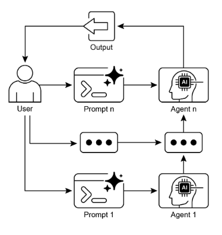

# 第 1 章：Prompt Chaining（提示链）

## Prompt Chaining 模式概述

Prompt chaining（提示链），有时也称为 Pipeline pattern（管道模式），是在利用大型语言模型（LLM）时处理复杂任务的强大范式。与其期望 LLM 在单一的、整体的步骤中解决复杂问题，提示链主张采用分而治之的策略。核心思想是将原始的、艰巨的问题分解为一系列更小、更易管理的子问题。每个子问题通过专门设计的提示单独处理，一个提示生成的输出策略性地作为输入传递给链中的下一个提示。

这种顺序处理技术本质上在与 LLM 的交互中引入了模块化和清晰性。通过分解复杂任务，更容易理解和调试每个单独的步骤，使整个过程更加健壮和可解释。链中的每个步骤都可以精心设计和优化，专注于更大问题的特定方面，从而产生更准确和聚焦的输出。

一个步骤的输出作为下一个步骤的输入是至关重要的。这种信息传递建立了依赖链，因此得名，其中先前操作的上下文和结果指导后续处理。这允许 LLM 在其先前工作的基础上构建，改进其理解，并逐步接近期望的解决方案。

此外，提示链不仅仅是分解问题；它还支持外部知识和工具的集成。在每个步骤中，可以指示 LLM 与外部系统、API 或数据库交互，丰富其知识和能力，超越其内部训练数据。这种能力极大地扩展了 LLM 的潜力，使它们不仅作为孤立的模型，而且作为更广泛的、更智能系统的组成部分。

提示链的重要性超越了简单的问题解决。它作为构建复杂 AI 智能体的基础技术。这些智能体可以利用提示链在动态环境中自主规划、推理和行动。通过策略性地构造提示序列，智能体可以参与需要多步推理、规划和决策的任务。这种智能体工作流可以更紧密地模仿人类思维过程，允许与复杂领域和系统进行更自然和有效的交互。

**单一提示的局限性：** 对于多方面任务，为 LLM 使用单一的、复杂的提示可能是低效的，导致模型在约束和指令方面挣扎，可能导致指令忽视（指令的部分被忽略）、上下文漂移（模型失去对初始上下文的跟踪）、错误传播（早期错误被放大）、需要更长上下文窗口的提示（模型获得的信息不足以及无法回复）和幻觉（认知负载增加导致错误信息的可能性增加）。例如，一个要求分析市场研究报告、总结发现、识别带有数据点的趋势并起草电子邮件的查询可能失败，因为模型可能很好地总结但无法提取数据或正确起草电子邮件。

**通过顺序分解增强可靠性：** 提示链通过将复杂任务分解为聚焦的、顺序的工作流来解决这些挑战，这显著提高了可靠性和控制。给定上述示例，管道或链式方法可以描述如下：

1. 初始提示（摘要）："总结以下市场研究报告的关键发现：[文本]。"模型的唯一焦点是摘要，提高了这个初始步骤的准确性。  
2. 第二个提示（趋势识别）："使用摘要，识别前三个新兴趋势并提取支持每个趋势的具体数据点：[步骤 1 的输出]。"这个提示现在更加受约束，并直接建立在已验证的输出之上。  
3. 第三个提示（电子邮件撰写）："向营销团队起草一封简洁的电子邮件，概述以下趋势及其支持数据：[步骤 2 的输出]。"

这种分解允许对过程进行更细粒度的控制。每个步骤更简单且更少歧义，这减少了模型上的认知负载，并导致更准确和可靠的最终输出。这种模块化类似于计算管道，其中每个函数在执行特定操作后将结果传递给下一个。为了确保每个特定任务的准确响应，模型可以在每个阶段被分配一个不同的角色。例如，在给定场景中，初始提示可以被指定为"市场分析师"，后续提示为"贸易分析师"，第三个提示为"专家文档编写者"，依此类推。

**结构化输出的作用：** 提示链的可靠性高度依赖于步骤之间传递的数据的完整性。如果一个提示的输出是模糊的或格式不佳的，后续提示可能由于错误的输入而失败。为了缓解这种情况，指定结构化输出格式（如 JSON 或 XML）是至关重要的。

例如，趋势识别步骤的输出可以格式化为 JSON 对象：

```json
{  "trends": [    
        {      
            "trend_name": "AI-Powered Personalization",      
            "supporting_data": "73% of consumers prefer to do business with brands that use personal information to make their shopping experiences more relevant."    
        },    
        {      
            "trend_name": "Sustainable and Ethical Brands",      
            "supporting_data": "Sales of products with ESG-related claims grew 28% over the last five years, compared to 20% for products without."    
        } 
    ] 
}
```

这种结构化格式确保数据是机器可读的，并且可以精确解析并插入到下一个提示中，没有歧义。这种做法最小化了可能因解释自然语言而产生的错误，是构建健壮的、基于 LLM 的多步系统的关键组件。

## 实际应用与用例

提示链是一个多功能的模式，适用于构建智能体系统时的各种场景。其核心效用在于将复杂问题分解为顺序的、可管理的步骤。以下是一些实际应用和用例：

### 1. 信息处理工作流

许多任务涉及通过多次转换处理原始信息。例如，总结文档、提取关键实体，然后使用这些实体查询数据库或生成报告。提示链可能如下所示：

* 提示 1：从给定 URL 或文档中提取文本内容。  
* 提示 2：总结清理后的文本。  
* 提示 3：从摘要或原始文本中提取特定实体（例如，名称、日期、位置）。  
* 提示 4：使用实体搜索内部知识库。  
* 提示 5：生成包含摘要、实体和搜索结果的最终报告。

这种方法应用于自动化内容分析、AI 驱动的研究助手开发和复杂报告生成等领域。

### 2. 复杂查询回答

回答需要多步推理或信息检索的复杂问题是主要用例。例如，"1929 年股市崩盘的主要原因是什么，政府政策如何回应？"

* 提示 1：识别用户查询中的核心子问题（崩盘原因、政府回应）。  
* 提示 2：研究或检索关于 1929 年崩盘原因的具体信息。  
* 提示 3：研究或检索关于政府对 1929 年股市崩盘的政策回应的具体信息。  
* 提示 4：将步骤 2 和 3 的信息综合成对原始查询的连贯回答。

这种顺序处理方法对于开发能够进行多步推理和信息综合的 AI 系统是必不可少的。当查询无法从单个数据点回答，而是需要一系列逻辑步骤或整合来自不同来源的信息时，需要这样的系统。

例如，一个设计用于生成特定主题综合报告的自动化研究智能体执行混合计算工作流。最初，系统检索大量相关文章。从每篇文章中提取关键信息的后续任务可以并发地为每个来源执行。这个阶段非常适合并行处理，其中独立的子任务同时运行以最大化效率。

然而，一旦各个提取完成，过程就变得本质上是顺序的。系统必须首先整理提取的数据，然后将其综合成连贯的草稿，最后审查和改进此草稿以产生最终报告。这些后续阶段中的每一个在逻辑上都依赖于前一个的成功完成。这就是应用提示链的地方：整理的数据作为综合提示的输入，生成的综合文本成为最终审查提示的输入。因此，复杂操作经常结合并行处理用于独立数据收集，结合提示链用于综合和改进的依赖步骤。

### 3. 数据提取和转换

将非结构化文本转换为结构化格式通常通过迭代过程实现，需要顺序修改以提高输出的准确性和完整性。

* 提示 1：尝试从发票文档中提取特定字段（例如，名称、地址、金额）。  
* 处理：检查是否提取了所有必需字段以及它们是否满足格式要求。  
* 提示 2（条件）：如果字段缺失或格式错误，创建一个新提示，要求模型专门查找缺失/格式错误的信息，可能提供来自失败尝试的上下文。  
* 处理：再次验证结果。如有必要，重复。  
* 输出：提供提取的、验证的结构化数据。

这种顺序处理方法特别适用于从表单、发票或电子邮件等非结构化来源进行数据提取和分析。例如，解决复杂的光学字符识别（OCR）问题，如处理 PDF 表单，通过分解的、多步骤方法更有效地处理。

最初，使用大型语言模型从文档图像中执行主要文本提取。随后，模型处理原始输出以规范化数据，这是一个步骤，它可能将数字文本（如"一千零五十"）转换为其数字等价物 1050。LLM 面临的重大挑战是执行精确的数学计算。因此，在后续步骤中，系统可以将任何所需的算术运算委托给外部计算器工具。LLM 识别必要的计算，将规范化的数字提供给工具，然后合并精确的结果。这种文本提取、数据规范和外部工具使用的链式序列实现了最终、准确的结果，这通常很难从单个 LLM 查询中可靠地获得。

### 4. 内容生成工作流

复杂内容的创作是一个过程性任务，通常分解为不同的阶段，包括初始构思、结构大纲、起草和后续修订

* 提示 1：基于用户的一般兴趣生成 5 个主题想法。  
* 处理：允许用户选择一个想法或自动选择最好的一个。  
* 提示 2：基于所选主题，生成详细大纲。  
* 提示 3：基于大纲中的第一个要点编写草稿部分。  
* 提示 4：基于大纲中的第二个要点编写草稿部分，提供前一部分作为上下文。对所有大纲要点继续此过程。  
* 提示 5：审查和改进完整草稿的一致性、语气和语法。

这种方法用于一系列自然语言生成任务，包括创意叙述、技术文档和其他形式的结构化文本内容的自动创作。

### 5. 有状态的对话智能体

虽然全面的状态管理架构采用比顺序链接更复杂的方法，但提示链提供了保持对话连续性的基础机制。这种技术通过将每个对话轮次构造为系统性地合并对话序列中先前交互的信息或提取实体的新提示来维护上下文。

* 提示 1：处理用户话语 1，识别意图和关键实体。  
* 处理：使用意图和实体更新对话状态。  
* 提示 2：基于当前状态，生成响应和/或识别下一个需要的信息。  
* 对后续轮次重复，每个新用户话语启动一个利用累积对话历史（状态）的链。

这个原理对于对话智能体的开发是基础的，使它们能够在扩展的、多轮对话中维护上下文和一致性。通过保留对话历史，系统可以理解并适当响应依赖于先前交换信息的用户输入。

### 6. 代码生成和改进

功能代码的生成通常是一个多阶段过程，需要将问题分解为逐步执行的离散逻辑操作序列

* 提示 1：理解用户对代码函数的请求。生成伪代码或大纲。  
* 提示 2：基于大纲编写初始代码草稿。  
* 提示 3：识别代码中的潜在错误或改进领域（可能使用静态分析工具或另一个 LLM 调用）。  
* 提示 4：基于识别的问题重写或改进代码。  
* 提示 5：添加文档或测试用例。

在 AI 辅助软件开发等应用中，提示链的效用源于其将复杂编码任务分解为一系列可管理的子问题的能力。这种模块化结构减少了大型语言模型在每个步骤上的操作复杂性。关键的是，这种方法还允许在模型调用之间插入确定性逻辑，使工作流中能够进行中间数据处理、输出验证和条件分支。通过这种方法，一个可能导致不可靠或不完整结果的单一、多方面的请求被转换为由底层执行框架管理的结构化操作序列。

### 7. 多模态和多步推理

分析具有不同模态的数据集需要将问题分解为更小的、基于提示的任务。例如，解释包含带有嵌入文本的图片、突出显示特定文本段的标签以及解释每个标签的表格数据的图像，需要这种方法。

* 提示 1：从用户的图像请求中提取和理解文本。  
* 提示 2：将提取的图像文本与其相应标签链接。  
* 提示 3：使用表格解释收集的信息以确定所需输出。

# 实践代码示例

实现提示链的范围从脚本内的直接、顺序函数调用到利用专门设计用于管理控制流、状态和组件集成的框架。诸如 LangChain、LangGraph、Crew AI 和 Google Agent Development Kit (ADK) 等框架为构建和执行这些多步过程提供结构化环境，这对于复杂架构特别有利。

为了演示目的，LangChain 和 LangGraph 是合适的选择，因为它们的核心 API 明确设计用于组合操作链和图。LangChain 为线性序列提供基础抽象，而 LangGraph 扩展这些能力以支持有状态和循环计算，这对于实现更复杂的智能体行为是必需的。此示例将专注于基本的线性序列。

以下代码实现了一个两步提示链，作为数据处理管道运行。初始阶段设计用于解析非结构化文本并提取特定信息。后续阶段然后接收此提取的输出并将其转换为结构化数据格式。

要复制此过程，必须首先安装所需的库。可以使用以下命令完成：

```bash
pip install langchain langchain-community langchain-openai langgraph
```

注意，langchain-openai 可以替换为不同模型提供商的相应包。随后，执行环境必须配置所选语言模型提供商（如 OpenAI、Google Gemini 或 Anthropic）所需的 API 凭据。

```python
import os 
from langchain_openai import ChatOpenAI 
from langchain_core.prompts import ChatPromptTemplate 
from langchain_core.output_parsers import StrOutputParser 

# For better security, load environment variables from a .env file 
# from dotenv import load_dotenv 
# load_dotenv() 
# Make sure your OPENAI_API_KEY is set in the .env file 

# Initialize the Language Model (using ChatOpenAI is recommended) 

llm = ChatOpenAI(temperature=0) 

# --- Prompt 1: Extract Information ---

prompt_extract = ChatPromptTemplate.from_template(
    "Extract the technical specifications from the following text:\n\n{text_input}" 
) 

# --- Prompt 2: Transform to JSON --- 

prompt_transform = ChatPromptTemplate.from_template(
    "Transform the following specifications into a JSON object with 'cpu', 'memory', and 'storage' as keys:\n\n{specifications}" 
) 

# --- Build the Chain using LCEL --- 
# The StrOutputParser() converts the LLM's message output to a simple string. 
extraction_chain = prompt_extract | llm | StrOutputParser() 

# The full chain passes the output of the extraction chain into the 'specifications' 
# variable for the transformation prompt. 
full_chain = (    
    {"specifications": extraction_chain}
        | 
    prompt_transform
        | 
    llm
        | 
    StrOutputParser() 
) 

# --- Run the Chain --- 

input_text = "The new laptop model features a 3.5 GHz octa-core processor, 16GB of RAM, and a 1TB NVMe SSD." 

# Execute the chain with the input text dictionary. 
final_result = full_chain.invoke({"text_input": input_text})
print("\n--- Final JSON Output ---")
print(final_result)
```

此 Python 代码演示了如何使用 LangChain 库处理文本。它利用两个独立的提示：一个从输入字符串中提取技术规格，另一个将这些规格格式化为 JSON 对象。ChatOpenAI 模型用于语言模型交互，StrOutputParser 确保输出是可用字符串格式。LangChain Expression Language (LCEL) 用于优雅地将这些提示和语言模型链接在一起。第一个链 `extraction_chain` 提取规格。然后 `full_chain` 获取提取的输出并将其用作转换提示的输入。提供了一个描述笔记本电脑的示例输入文本。使用此文本调用 `full_chain`，通过两个步骤处理它。然后打印最终结果，包含提取和格式化规格的 JSON 字符串。

## 上下文工程和提示工程

上下文工程（Context Engineering）（见图 1）是在生成令牌之前为 AI 模型设计、构建和交付完整信息环境的系统学科。这种方法论断言模型输出的质量较少依赖于模型架构本身，而更多依赖于提供的上下文的丰富性。


图 1：上下文工程是为 AI 构建丰富、全面信息环境的学科，因为此上下文的质量是启用高级智能体性能的主要因素。

它代表了从传统提示工程的重大演进，传统提示工程主要专注于优化用户即时查询的措辞。上下文工程扩展了这个范围，包括多个信息层，例如**系统提示**，这是定义 AI 操作参数的基础指令集——例如，*"你是一名技术作家；你的语气必须正式和精确。"* 上下文进一步用外部数据丰富。这包括检索的文档，其中 AI 主动从知识库获取信息以告知其响应，例如拉取项目的技术规格。它还包含工具输出，这是 AI 使用外部 API 获取实时数据的结果，例如查询日历以确定用户的可用性。这种显式数据与关键隐式数据（如用户身份、交互历史和环境状态）相结合。核心原则是，即使在提供操作环境的有限或构造不良视图时，高级模型也会表现不佳。

因此，这种做法将任务从仅仅回答问题重新定义为为智能体构建全面的操作图景。例如，上下文工程的智能体不仅会响应查询，还会首先整合用户的日历可用性（工具输出）、与电子邮件接收者的专业关系（隐式数据）以及先前会议的笔记（检索的文档）。这允许模型生成高度相关、个性化和实用有用的输出。"工程"组件涉及创建强大的管道以在运行时获取和转换此数据，并建立反馈循环以持续改进上下文质量。

要实现这一点，可以使用专门的调整系统来自动化大规模改进过程。例如，像 Google 的 Vertex AI 提示优化器这样的工具可以通过系统地评估响应与一组示例输入和预定义评估指标来增强模型性能。这种方法对于在不同模型之间适应提示和系统指令是有效的，而无需大量手动重写。通过向这样的优化器提供示例提示、系统指令和模板，它可以编程地改进上下文输入，提供实现复杂上下文工程所需的反馈循环的结构化方法。

这种结构化方法是将基本 AI 工具与更复杂和上下文感知系统区分开来的关键。它将上下文本身视为主要组件，对智能体知道什么、何时知道以及如何使用该信息给予关键重要性。这种做法确保模型对用户的意图、历史和当前环境有全面的理解。最终，上下文工程是将无状态聊天机器人推进到高度能力、情境感知系统的关键方法论。

## 概览

**什么：** 复杂任务在单个提示内处理时经常使 LLM 不堪重负，导致显著的性能问题。模型上的认知负载增加了错误的可能性，例如忽视指令、丢失上下文和生成错误信息。单一提示难以有效地管理多个约束和顺序推理步骤。这导致不可靠和不准确的输出，因为 LLM 无法处理多方面请求的所有方面。

**为什么：** 提示链通过将复杂问题分解为一系列更小的、互连的子任务来提供标准化解决方案。链中的每个步骤使用聚焦的提示执行特定操作，显著提高可靠性和控制。一个提示的输出作为输入传递给下一个，创建逻辑工作流，逐步构建最终解决方案。这种模块化、分而治之的策略使过程更易管理、更易调试，并允许在步骤之间集成外部工具或结构化数据格式。这种模式对于开发能够规划、推理和执行复杂工作流的复杂、多步智能体系统是基础的。

**经验法则：** 当任务对于单个提示太复杂、涉及多个不同的处理阶段、需要在步骤之间与外部工具交互，或构建需要执行多步推理并维护状态的智能体系统时，使用此模式。

**可视化摘要：**



图 2：Prompt Chaining 模式：智能体从用户接收一系列提示，每个智能体的输出作为链中下一个的输入。

## 关键要点

以下是一些关键要点：

* Prompt Chaining 将复杂任务分解为一系列更小、聚焦的步骤。这有时也称为 Pipeline pattern（管道模式）。  
* 链中的每个步骤涉及 LLM 调用或处理逻辑，使用前一个步骤的输出作为输入。  
* 这种模式提高了与语言模型的复杂交互的可靠性和可管理性。  
* 像 LangChain/LangGraph 和 Google ADK 这样的框架提供强大的工具来定义、管理和执行这些多步序列。

## 结论

通过将复杂问题解构为一系列更简单、更易管理的子任务，提示链为引导大型语言模型提供了强大的框架。这种"分而治之"策略通过一次专注于一个特定操作显著增强了输出的可靠性和控制。作为基础模式，它使能够开发能够进行多步推理、工具集成和状态管理的复杂 AI 智能体。最终，掌握提示链对于构建能够执行复杂工作流的健壮、上下文感知系统至关重要，这些工作流远远超出了单个提示的能力。

## 参考文献

1. LangChain Documentation on LCEL: [https://python.langchain.com/v0.2/docs/core_modules/expression_language/](https://python.langchain.com/v0.2/docs/core_modules/expression_language/)
2. LangGraph Documentation: [https://langchain-ai.github.io/langgraph/](https://langchain-ai.github.io/langgraph/)  
3. Prompt Engineering Guide \- Chaining Prompts: [https://www.promptingguide.ai/techniques/chaining](https://www.promptingguide.ai/techniques/chaining)
4. OpenAI API Documentation (General Prompting Concepts): [https://platform.openai.com/docs/guides/gpt/prompting](https://platform.openai.com/docs/guides/gpt/prompting)
5. Crew AI Documentation (Tasks and Processes): [https://docs.crewai.com/](https://docs.crewai.com/)
6. Google AI for Developers (Prompting Guides): [https://cloud.google.com/discover/what-is-prompt-engineering?hl=en](https://cloud.google.com/discover/what-is-prompt-engineering?hl=en)
7. Vertex Prompt Optimizer [https://cloud.google.com/vertex-ai/generative-ai/docs/learn/prompts/prompt-optimizer](https://cloud.google.com/vertex-ai/generative-ai/docs/learn/prompts/prompt-optimizer)
