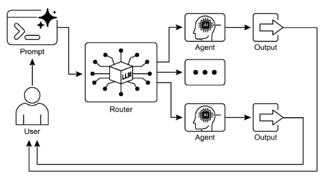

# 第 2 章：Routing（路由）

## Routing 模式概述

虽然通过提示链的顺序处理是使用语言模型执行确定性、线性工作流的基础技术，但它在需要自适应响应的场景中适用性有限。现实世界的智能体系统必须经常根据偶然因素（如环境状态、用户输入或先前操作的结果）在多个潜在行动之间进行仲裁。这种动态决策能力，控制流向不同专业函数、工具或子进程，通过称为路由（routing）的机制实现。

路由将条件逻辑引入智能体的操作框架，使能够从固定执行路径转向智能体动态评估特定条件以从一组可能的后续行动中选择的模型。这允许更灵活和上下文感知的系统行为。

例如，为客户询问设计的智能体，当配备路由功能时，可以首先对传入查询进行分类以确定用户的意图。基于此分类，它可以将查询引导到用于直接问答的专业智能体、用于账户信息的数据库检索工具，或用于复杂问题的升级程序，而不是默认到单一的、预定的响应路径。因此，使用路由的更复杂的智能体可以：

1. 分析用户的查询。  
2. **路由**基于其*意图*的查询：  
   * 如果意图是"检查订单状态"，路由到与订单数据库交互的子智能体或工具链。  
   * 如果意图是"产品信息"，路由到搜索产品目录的子智能体或链。  
   * 如果意图是"技术支持"，路由到访问故障排除指南或升级到人工的不同链。  
   * 如果意图不清楚，路由到澄清子智能体或提示链。

路由模式的核心组件是执行评估并引导流的机制。这种机制可以通过几种方式实现：

* **基于 LLM 的路由：** 语言模型本身可以被提示分析输入并输出指示下一步或目的地的特定标识符或指令。例如，提示可能要求 LLM "分析以下用户查询并仅输出类别：'订单状态'、'产品信息'、'技术支持'或'其他'。"智能体系统然后读取此输出并相应地引导工作流。  
* **基于嵌入的路由：** 输入查询可以转换为向量嵌入（参见 RAG，第 14 章）。然后将此嵌入与表示不同路由或能力的嵌入进行比较。查询被路由到嵌入最相似的路由。这对于语义路由很有用，其中决策基于输入的含义而不仅仅是关键词。  
* **基于规则的路由：** 这涉及使用基于从输入中提取的关键词、模式或结构化数据的预定义规则或逻辑（例如，if-else 语句、switch 情况）。这可能比基于 LLM 的路由更快、更确定性，但处理细微差别或新颖输入的灵活性较差。  
* **基于机器学习模型的路由：** 它采用判别模型，如分类器，该模型已经在标记数据的小语料库上专门训练以执行路由任务。虽然它与基于嵌入的方法在概念上有相似之处，但其关键特征是监督微调过程，该过程调整模型的参数以创建专门的路由函数。这种技术与基于 LLM 的路由不同，因为决策组件不是在推理时执行提示的生成模型。相反，路由逻辑编码在微调模型的学习权重中。虽然 LLM 可能在预处理步骤中用于生成合成数据以增强训练集，但它们不参与实时路由决策本身。

路由机制可以在智能体操作周期的多个连接点实现。它们可以在开始时应用以分类主要任务，在处理链中的中间点应用以确定后续行动，或在子例程中应用以从给定集合中选择最合适的工具。

诸如 LangChain、LangGraph 和 Google 的 Agent Developer Kit (ADK) 等计算框架为定义和管理此类条件逻辑提供了明确的构造。凭借其基于状态的图架构，LangGraph 特别适合复杂路由场景，其中决策取决于整个系统的累积状态。类似地，Google 的 ADK 为结构化智能体的能力和交互模型提供了基础组件，这作为实现路由逻辑的基础。在这些框架提供的执行环境中，开发者定义可能的操作路径和决定计算图中节点之间转换的函数或基于模型的评估。

路由的实现使系统能够超越确定性顺序处理。它促进了更自适应执行流的开发，这些执行流可以动态和适当地响应更广泛的输入和状态变化。

## 实际应用与用例

路由模式是自适应智能体系统设计中的关键控制机制，使它们能够动态改变其执行路径以响应可变输入和内部状态。通过提供必要的条件逻辑层，其效用跨越多个领域。

在人机交互中，例如虚拟助手或 AI 驱动的导师，路由用于解释用户意图。对自然语言查询的初始分析确定最合适的后续行动，无论是调用特定信息检索工具、升级到人工操作员，还是根据用户性能选择课程中的下一个模块。这允许系统超越线性对话流并上下文响应。

在自动化数据和文档处理管道中，路由作为分类和分发功能。传入数据，如电子邮件、支持票证或 API 负载，基于内容、元数据或格式进行分析。然后系统将每个项目引导到相应的工作流，例如销售线索摄取过程、用于 JSON 或 CSV 格式的特定数据转换函数，或紧急问题升级路径。

在涉及多个专业工具或智能体的复杂系统中，路由充当高级调度器。由用于搜索、总结和分析信息的不同智能体组成的研究系统将使用路由器根据当前目标将任务分配给最合适的智能体。类似地，AI 编码助手使用路由来识别编程语言和用户的意图——调试、解释或翻译——然后将代码片段传递给正确的专业工具。

最终，路由提供了逻辑仲裁能力，这对于创建功能多样化和上下文感知的系统至关重要。它将智能体从预定义序列的静态执行器转变为动态系统，可以在变化条件下决定完成任务的最有效方法。

## 实践代码示例（LangChain）

在代码中实现路由涉及定义可能的路径和决定采取哪条路径的逻辑。诸如 LangChain 和 LangGraph 等框架为此提供了特定的组件和结构。LangGraph 的基于状态的图结构对于可视化和实现路由逻辑特别直观。

此代码演示了使用 LangChain 和 Google 的 Generative AI 的简单类似智能体的系统。它设置一个"协调器"，根据请求的意图（预订、信息或不清楚）将用户请求路由到不同的模拟"子智能体"处理器。系统使用语言模型对请求进行分类，然后将其委派给适当的处理器函数，模拟多智能体架构中经常看到的基本委派模式。

首先，确保已安装必要的库：

```bash
pip install langchain langgraph google-cloud-aiplatform langchain-google-genai google-adk deprecated pydantic
```

您还需要使用所选语言模型的 API 密钥设置环境（例如，OpenAI、Google Gemini、Anthropic）。

```python
# Copyright (c) 2025 Marco Fago
# https://www.linkedin.com/in/marco-fago/
#
# This code is licensed under the MIT License.
# See the LICENSE file in the repository for the full license text.

from langchain_google_genai import ChatGoogleGenerativeAI
from langchain_core.prompts import ChatPromptTemplate
from langchain_core.output_parsers import StrOutputParser
from langchain_core.runnables import RunnablePassthrough, RunnableBranch


# --- Configuration ---
# Ensure your API key environment variable is set (e.g., GOOGLE_API_KEY)
try:
    llm = ChatGoogleGenerativeAI(model="gemini-2.5-flash", temperature=0)
    print(f"Language model initialized: {llm.model}")
except Exception as e:
    print(f"Error initializing language model: {e}")
    llm = None


# --- Define Simulated Sub-Agent Handlers (equivalent to ADK sub_agents) ---
def booking_handler(request: str) -> str:
    """Simulates the Booking Agent handling a request."""
    print("\n--- DELEGATING TO BOOKING HANDLER ---")
    return f"Booking Handler processed request: '{request}'. Result: Simulated booking action."


def info_handler(request: str) -> str:
    """Simulates the Info Agent handling a request."""
    print("\n--- DELEGATING TO INFO HANDLER ---")
    return f"Info Handler processed request: '{request}'. Result: Simulated information retrieval."


def unclear_handler(request: str) -> str:
    """Handles requests that couldn't be delegated."""
    print("\n--- HANDLING UNCLEAR REQUEST ---")
    return f"Coordinator could not delegate request: '{request}'. Please clarify."


# --- Define Coordinator Router Chain (equivalent to ADK coordinator's instruction) ---
# This chain decides which handler to delegate to.
coordinator_router_prompt = ChatPromptTemplate.from_messages([
    (
        "system",
        """Analyze the user's request and determine which specialist handler should process it.
        - If the request is related to booking flights or hotels,
           output 'booker'.
        - For all other general information questions, output 'info'.
        - If the request is unclear or doesn't fit either category,
           output 'unclear'.
        ONLY output one word: 'booker', 'info', or 'unclear'."""
    ),
    ("user", "{request}")
])

if llm:
    coordinator_router_chain = coordinator_router_prompt | llm | StrOutputParser()


# --- Define the Delegation Logic (equivalent to ADK's Auto-Flow based on sub_agents) ---
# Use RunnableBranch to route based on the router chain's output.

# Define the branches for the RunnableBranch
branches = {
    "booker": RunnablePassthrough.assign(
        output=lambda x: booking_handler(x['request']['request'])
    ),
    "info": RunnablePassthrough.assign(
        output=lambda x: info_handler(x['request']['request'])
    ),
    "unclear": RunnablePassthrough.assign(
        output=lambda x: unclear_handler(x['request']['request'])
    ),
}

# Create the RunnableBranch. It takes the output of the router chain
# and routes the original input ('request') to the corresponding handler.
delegation_branch = RunnableBranch(
    (lambda x: x['decision'].strip() == 'booker', branches["booker"]),  # Added .strip()
    (lambda x: x['decision'].strip() == 'info', branches["info"]),      # Added .strip()
    branches["unclear"]  # Default branch for 'unclear' or any other output
)

# Combine the router chain and the delegation branch into a single runnable
# The router chain's output ('decision') is passed along with the original input ('request')
# to the delegation_branch.
coordinator_agent = {
    "decision": coordinator_router_chain,
    "request": RunnablePassthrough()
} | delegation_branch | (lambda x: x['output'])  # Extract the final output


# --- Example Usage ---
def main():
    if not llm:
        print("\nSkipping execution due to LLM initialization failure.")
        return

    print("--- Running with a booking request ---")
    request_a = "Book me a flight to London."
    result_a = coordinator_agent.invoke({"request": request_a})
    print(f"Final Result A: {result_a}")

    print("\n--- Running with an info request ---")
    request_b = "What is the capital of Italy?"
    result_b = coordinator_agent.invoke({"request": request_b})
    print(f"Final Result B: {result_b}")

    print("\n--- Running with an unclear request ---")
    request_c = "Tell me about quantum physics."
    result_c = coordinator_agent.invoke({"request": request_c})
    print(f"Final Result C: {result_c}")


if __name__ == "__main__":
    main()
```

如前所述，此 Python 代码使用 LangChain 库和 Google 的 Generative AI 模型（特别是 gemini-2.5-flash）构建了一个简单的类似智能体的系统。详细来说，它定义了三个模拟子智能体处理器：`booking_handler`、`info_handler` 和 `unclear_handler`，每个都设计用于处理特定类型的请求。

核心组件是 `coordinator_router_chain`，它利用 ChatPromptTemplate 指示语言模型将传入的用户请求分类为三个类别之一：`booker`、`info` 或 `unclear`。然后，此路由器链的输出由 RunnableBranch 使用，将原始请求委派给相应的处理器函数。RunnableBranch 检查来自语言模型的决策，并将请求数据引导到 `booking_handler`、`info_handler` 或 `unclear_handler`。`coordinator_agent` 组合了这些组件，首先路由请求以做出决策，然后将请求传递给所选处理器。最终输出从处理器的响应中提取。

主函数演示了系统与三个示例请求的用法，展示了不同输入如何被路由和处理由模拟智能体。包括语言模型初始化的错误处理以确保健壮性。代码结构模仿了基本的多智能体框架，其中中央协调器根据意图将任务委派给专业智能体。

## 实践代码示例（Google ADK）

Agent Development Kit (ADK) 是用于工程智能体系统的框架，为定义智能体的能力和行为提供结构化环境。与基于显式计算图的架构相比，ADK 范式内的路由通常通过定义表示智能体功能的离散"工具"集合来实现。响应于用户查询选择适当工具由框架的内部逻辑管理，该逻辑利用底层模型将用户意图匹配到正确的功能处理器。

此 Python 代码演示了使用 Google 的 ADK 库的 Agent Development Kit (ADK) 应用程序示例。它设置一个"协调器"智能体，根据定义的指令将用户请求路由到专业子智能体（用于预订的"Booker"和用于一般信息的"Info"）。然后，子智能体使用特定工具来模拟处理请求，展示智能体系统内的基本委派模式

```python
# Copyright (c) 2025 Marco Fago
#
# This code is licensed under the MIT License.
# See the LICENSE file in the repository for the full license text.

import uuid
from typing import Dict, Any, Optional

from google.adk.agents import Agent
from google.adk.runners import InMemoryRunner
from google.adk.tools import FunctionTool
from google.genai import types
from google.adk.events import Event


# --- Define Tool Functions ---
# These functions simulate the actions of the specialist agents.
def booking_handler(request: str) -> str:
    """
    Handles booking requests for flights and hotels.

    Args:
        request: The user's request for a booking.

    Returns:
        A confirmation message that the booking was handled.
    """
    print("-------------------------- Booking Handler Called ----------------------------")
    return f"Booking action for '{request}' has been simulated."


def info_handler(request: str) -> str:
    """
    Handles general information requests.

    Args:
        request: The user's question.

    Returns:
        A message indicating the information request was handled.
    """
    print("-------------------------- Info Handler Called ----------------------------")
    return f"Information request for '{request}'. Result: Simulated information retrieval."


def unclear_handler(request: str) -> str:
    """Handles requests that couldn't be delegated."""
    return f"Coordinator could not delegate request: '{request}'. Please clarify."


# --- Create Tools from Functions ---
booking_tool = FunctionTool(booking_handler)
info_tool = FunctionTool(info_handler)

# Define specialized sub-agents equipped with their respective tools
booking_agent = Agent(
    name="Booker",
    model="gemini-2.0-flash",
    description="A specialized agent that handles all flight "
                "and hotel booking requests by calling the booking tool.",
    tools=[booking_tool],
)

info_agent = Agent(
    name="Info",
    model="gemini-2.0-flash",
    description="A specialized agent that provides general information "
                "and answers user questions by calling the info tool.",
    tools=[info_tool],
)

# Define the parent agent with explicit delegation instructions
coordinator = Agent(
    name="Coordinator",
    model="gemini-2.0-flash",
    instruction=(
        "You are the main coordinator. Your only task is to analyze "
        "incoming user requests "
        "and delegate them to the appropriate specialist agent. Do not try to answer the user directly.\n"
        "- For any requests related to booking flights or hotels, delegate to the 'Booker' agent.\n"
        "- For all other general information questions, delegate to the 'Info' agent."
    ),
    description="A coordinator that routes user requests to the correct specialist agent.",
    # The presence of sub_agents enables LLM-driven delegation (Auto-Flow) by default.
    sub_agents=[booking_agent, info_agent],
)


# --- Execution Logic ---
async def run_coordinator(runner: InMemoryRunner, request: str):
    """Runs the coordinator agent with a given request and delegates."""
    print(f"\n--- Running Coordinator with request: '{request}' ---")
    final_result = ""
    try:
        user_id = "user_123"
        session_id = str(uuid.uuid4())

        await runner.session_service.create_session(
            app_name=runner.app_name,
            user_id=user_id,
            session_id=session_id,
        )

        for event in runner.run(
            user_id=user_id,
            session_id=session_id,
            new_message=types.Content(
                role='user',
                parts=[types.Part(text=request)],
            ),
        ):
            if event.is_final_response() and event.content:
                # Try to get text directly from event.content to avoid iterating parts
                if hasattr(event.content, 'text') and event.content.text:
                    final_result = event.content.text
                elif event.content.parts:
                    # Fallback: Iterate through parts and extract text (might trigger warning)
                    text_parts = [part.text for part in event.content.parts if getattr(part, "text", None)]
                    final_result = "".join(text_parts)
                # Assuming the loop should break after the final response
                break

        print(f"Coordinator Final Response: {final_result}")
        return final_result

    except Exception as e:
        print(f"An error occurred while processing your request: {e}")
        return f"An error occurred while processing your request: {e}"


async def main():
    """Main function to run the ADK example."""
    print("--- Google ADK Routing Example (ADK Auto-Flow Style) ---")
    print("Note: This requires Google ADK installed and authenticated.")

    runner = InMemoryRunner(coordinator)

    # Example Usage
    result_a = await run_coordinator(runner, "Book me a hotel in Paris.")
    print(f"Final Output A: {result_a}")

    result_b = await run_coordinator(runner, "What is the highest mountain in the world?")
    print(f"Final Output B: {result_b}")

    result_c = await run_coordinator(runner, "Tell me a random fact.")  # Should go to Info
    print(f"Final Output C: {result_c}")

    result_d = await run_coordinator(runner, "Find flights to Tokyo next month.")  # Should go to Booker
    print(f"Final Output D: {result_d}")


if __name__ == "__main__":
    import nest_asyncio

    nest_asyncio.apply()
    await main()
```

此脚本由一个主协调器智能体和两个专业的 `sub_agents` 组成：Booker 和 Info。每个专业智能体都配备了一个 FunctionTool，该工具包装了一个模拟操作的 Python 函数。`booking_handler` 函数模拟处理航班和酒店预订，而 `info_handler` 函数模拟检索一般信息。`unclear_handler` 作为协调器无法委派的请求的回退包含，尽管当前的协调器逻辑在主 `run_coordinator` 函数中没有明确将其用于委派失败。

协调器智能体的主要角色，如其指令中定义的，是分析传入的用户消息并将它们委派给 Booker 或 Info 智能体。此委派由 ADK 的 Auto-Flow 机制自动处理，因为协调器定义了 `sub_agents`。`run_coordinator` 函数设置 InMemoryRunner，创建用户和会话 ID，然后使用运行器通过协调器智能体处理用户的请求。runner.run 方法处理请求并产生事件，代码从 event.content 中提取最终响应文本。

主函数通过使用不同请求运行协调器来演示系统的用法，展示它如何将预订请求委派给 Booker 和信息请求委派给 Info 智能体。

## 概览

**什么**：智能体系统必须经常响应无法由单一、线性过程处理的各种输入和情况。简单的顺序工作流缺乏基于上下文做出决策的能力。没有机制为特定任务选择正确的工具或子进程，系统保持僵化和非自适应性。这种限制使得难以构建能够管理现实世界用户请求的复杂性和可变性的复杂应用程序。

**为什么：** 路由模式通过在智能体的操作框架中引入条件逻辑来提供标准化解决方案。它使系统能够首先分析传入查询以确定其意图或性质。基于此分析，智能体动态引导控制流到最合适的专业工具、函数或子智能体。此决策可以由各种方法驱动，包括提示 LLM、应用预定义规则或使用基于嵌入的语义相似性。最终，路由将静态、预定的执行路径转变为灵活和上下文感知的工作流，能够选择最佳可能的行动。

**经验法则：** 当智能体必须根据用户的输入或当前状态在多个不同工作流、工具或子智能体之间做出决定时，使用路由模式。这对于需要分类或分类传入请求以处理不同类型任务的应用程序至关重要，例如客户支持机器人区分销售询问、技术支持和账户管理问题。

**可视化摘要：**



图 1：路由器模式，使用 LLM 作为路由器

## 关键要点

* 路由使智能体能够基于条件对工作流中的下一步做出动态决策。  
* 它允许智能体处理不同的输入并调整其行为，超越线性执行。  
* 路由逻辑可以使用 LLM、基于规则的系统或嵌入相似性来实现。  
* 像 LangGraph 和 Google ADK 这样的框架提供了在智能体工作流中定义和管理路由的结构化方法，尽管具有不同的架构方法。

## 结论

路由模式是构建真正动态和响应式智能体系统的关键步骤。通过实现路由，我们超越了简单的线性执行流，使我们的智能体能够就如何处理信息、响应用户输入和利用可用工具或子智能体做出智能决策。

我们已经看到路由如何应用于各种领域，从客户服务聊天机器人到复杂的数据处理管道。分析输入并条件性地引导工作流的能力对于创建能够处理现实世界任务固有可变性的智能体至关重要。

使用 LangChain 和 Google ADK 的代码示例演示了实现路由的两种不同但有效的方法。LangGraph 的基于图的结构提供了定义状态和转换的可视化和显式方式，使其非常适合具有复杂路由逻辑的复杂、多步工作流。另一方面，Google ADK 通常专注于定义不同的能力（工具）并依赖框架将用户请求路由到适当工具处理器的能力，这对于具有明确定义的离散操作集的智能体可能更简单。

掌握路由模式对于构建能够智能导航不同场景并根据上下文提供定制响应或行动的智能体至关重要。它是创建多功能和健壮的智能体应用程序的关键组件。

## 参考文献

1. LangGraph Documentation: [https://www.langchain.com/](https://www.langchain.com/)
2. Google Agent Developer Kit Documentation: [https://google.github.io/adk-docs/](https://google.github.io/adk-docs/)
