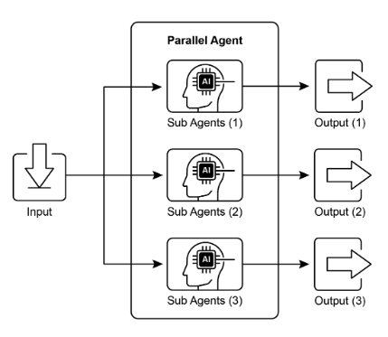
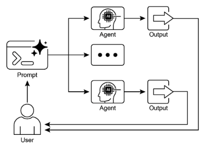

# 第 3 章：Parallelization（并行化）

## Parallelization 模式概述

在前面的章节中，我们已经探索了用于顺序工作流的 Prompt Chaining 和用于动态决策以及不同路径之间转换的 Routing。虽然这些模式是必不可少的，但许多复杂的智能体任务涉及可以*同时*执行而不是一个接一个执行的多个子任务。这就是**并行化（Parallelization）**模式变得至关重要的地方。

并行化涉及并发执行多个组件，如 LLM 调用、工具使用，甚至整个子智能体（见图 1）。不是等待一个步骤完成后再开始下一个，并行执行允许独立任务同时运行，显著减少可以分解为独立部分的任务的总执行时间。

考虑一个设计用于研究主题并总结其发现的智能体。顺序方法可能：

1. 搜索源 A。  
2. 总结源 A。  
3. 搜索源 B。  
4. 总结源 B。  
5. 从摘要 A 和 B 综合最终答案。

并行方法可以改为：

1. *同时*搜索源 A*和*搜索源 B。  
2. 一旦两个搜索都完成，*同时*总结源 A*和*总结源 B。  
3. 从摘要 A 和 B 综合最终答案（此步骤通常是顺序的，等待并行步骤完成）。

核心思想是识别工作流中不依赖于其他部分输出的部分并并行执行它们。这在处理具有延迟的外部服务（如 API 或数据库）时特别有效，因为您可以同时发出多个请求。

实现并行化通常需要支持异步执行或多线程/多处理的框架。现代智能体框架在设计时考虑了异步操作，允许您轻松定义可以并行运行的步骤。



图 1. 使用子智能体并行化的示例

像 LangChain、LangGraph 和 Google ADK 这样的框架提供了并行执行机制。在 LangChain Expression Language (LCEL) 中，您可以通过使用运算符（如 |（用于顺序））组合可运行对象来实现并行执行，并通过构建链或图以具有并发执行的分支。LangGraph 凭借其图结构，允许您定义可以从单个状态转换执行的多个节点，有效地在工作流中实现并行分支。Google ADK 提供了强大的、本机机制来促进和管理智能体的并行执行，显著提高了复杂、多智能体系统的效率和可扩展性。ADK 框架内的这种固有能力允许开发者设计和实现解决方案，其中多个智能体可以并发运行，而不是顺序运行。

并行化模式对于提高智能体系统的效率和响应能力至关重要，特别是在处理涉及多个独立查找、计算或与外部服务交互的任务时。这是优化复杂智能体工作流性能的关键技术。

## 实际应用与用例

并行化是跨各种应用程序优化智能体性能的强大模式：

### 1. 信息收集和研究

同时从多个来源收集信息是经典用例。

* **用例：** 研究公司的智能体。  
  * **并行任务：** 同时搜索新闻文章、提取股票数据、检查社交媒体提及和查询公司数据库。  
  * **好处：** 比顺序查找更快地收集全面视图。

### 2. 数据处理和分析

同时应用不同的分析技术或处理不同的数据段。

* **用例：** 分析客户反馈的智能体。  
  * **并行任务：** 在一批反馈条目中同时运行情感分析、提取关键词、分类反馈和识别紧急问题。  
  * **好处：** 快速提供多方面的分析。

### 3. 多 API 或工具交互

调用多个独立的 API 或工具以收集不同类型的信息或执行不同的操作。

* **用例：** 旅行规划智能体。  
  * **并行任务：** 同时检查航班价格、搜索酒店可用性、查找本地活动和查找餐厅推荐。  
  * **好处：** 更快地呈现完整的旅行计划。

### 4. 具有多个组件的内容生成

并行生成复杂内容的不同部分。

* **用例：** 创建营销电子邮件的智能体。  
  * **并行任务：** 同时生成主题行、起草电子邮件正文、查找相关图像和创建行动号召按钮文本。  
  * **好处：** 更高效地组装最终电子邮件。

### 5. 验证和确认

同时执行多个独立的检查或验证。

* **用例：** 验证用户输入的智能体。  
  * **并行任务：** 同时检查电子邮件格式、验证电话号码、针对数据库验证地址和检查不当内容。  
  * **好处：** 更快地提供关于输入有效性的反馈。

### 6. 多模态处理

同时处理同一输入的不同模态（文本、图像、音频）。

* **用例：** 分析带有文本和图像的社交媒体帖子的智能体。  
  * **并行任务：** *同时*分析文本的情感和关键词*以及*分析图像的对象和场景描述。  
  * **好处：** 更快地整合来自不同模态的洞察。

### 7. A/B 测试或多个选项生成

并行生成响应的多个变体或输出以选择最佳的一个。

* **用例：** 生成不同创意文本选项的智能体。  
  * **并行任务：** 使用略有不同的提示或模型同时生成文章的三个不同标题。  
  * **好处：** 允许快速比较和选择最佳选项。

并行化是智能体设计中的基本优化技术，允许开发者通过利用独立任务的并发执行来构建更高性能和响应性的应用程序。

## 实践代码示例（LangChain）

在 LangChain 框架内的并行执行由 LangChain Expression Language (LCEL) 促进。主要方法涉及在字典或列表构造中构建多个可运行组件。当此集合作为输入传递给链中的后续组件时，LCEL 运行时并发执行包含的可运行对象。

在 LangGraph 的上下文中，此原理应用于图的拓扑。并行工作流通过构建图来定义，使得多个节点（缺乏直接顺序依赖）可以从单个公共节点启动。这些并行路径独立执行，然后它们的结果可以在图中的后续汇合点聚合。

以下实现演示了使用 LangChain 框架构建的并行处理工作流。此工作流设计用于响应单个用户查询并发执行两个独立操作。这些并行过程被实例化为不同的链或函数，它们各自的输出随后被聚合为统一的结果。

此实现的先决条件包括安装所需的 Python 包，如 langchain、langchain-community 和模型提供商库（如 langchain-openai）。此外，必须在本地环境中配置所选语言模型的有效 API 密钥以进行身份验证。

```python
import os
import asyncio
from typing import Optional

from langchain_openai import ChatOpenAI
from langchain_core.prompts import ChatPromptTemplate
from langchain_core.output_parsers import StrOutputParser
from langchain_core.runnables import Runnable, RunnableParallel, RunnablePassthrough


# --- Configuration ---
# Ensure your API key environment variable is set (e.g., OPENAI_API_KEY)
try:
    llm: Optional[ChatOpenAI] = ChatOpenAI(model="gpt-4o-mini", temperature=0.7)
except Exception as e:
    print(f"Error initializing language model: {e}")
    llm = None


# --- Define Independent Chains ---
# These three chains represent distinct tasks that can be executed in parallel.
summarize_chain: Runnable = (
    ChatPromptTemplate.from_messages([
        ("system", "Summarize the following topic concisely:"),
        ("user", "{topic}"),
    ])
    | llm
    | StrOutputParser()
)

questions_chain: Runnable = (
    ChatPromptTemplate.from_messages([
        ("system", "Generate three interesting questions about the following topic:"),
        ("user", "{topic}"),
    ])
    | llm
    | StrOutputParser()
)

terms_chain: Runnable = (
    ChatPromptTemplate.from_messages([
        ("system", "Identify 5-10 key terms from the following topic, separated by commas:"),
        ("user", "{topic}"),
    ])
    | llm
    | StrOutputParser()
)


# --- Build the Parallel + Synthesis Chain ---
# 1. Define the block of tasks to run in parallel. The results of these,
#    along with the original topic, will be fed into the next step.
map_chain = RunnableParallel(
    {
        "summary": summarize_chain,
        "questions": questions_chain,
        "key_terms": terms_chain,
        "topic": RunnablePassthrough(),  # Pass the original topic through
    }
)

# 2. Define the final synthesis prompt which will combine the parallel results.
synthesis_prompt = ChatPromptTemplate.from_messages([
    (
        "system",
        """Based on the following information:
        Summary: {summary}
        Related Questions: {questions}
        Key Terms: {key_terms}
        Synthesize a comprehensive answer."""
    ),
    ("user", "Original topic: {topic}"),
])

# 3. Construct the full chain by piping the parallel results directly
#    into the synthesis prompt, followed by the LLM and output parser.
full_parallel_chain = map_chain | synthesis_prompt | llm | StrOutputParser()


# --- Run the Chain ---
async def run_parallel_example(topic: str) -> None:
    """
    Asynchronously invokes the parallel processing chain with a specific topic
    and prints the synthesized result.

    Args:
        topic: The input topic to be processed by the LangChain chains.
    """
    if not llm:
        print("LLM not initialized. Cannot run example.")
        return

    print(f"\n--- Running Parallel LangChain Example for Topic: '{topic}' ---")
    try:
        # The input to `ainvoke` is the single 'topic' string,
        # then passed to each runnable in the `map_chain`.
        response = await full_parallel_chain.ainvoke(topic)
        print("\n--- Final Response ---")
        print(response)
    except Exception as e:
        print(f"\nAn error occurred during chain execution: {e}")


if __name__ == "__main__":
    test_topic = "The history of space exploration"
    # In Python 3.7+, asyncio.run is the standard way to run an async function.
    asyncio.run(run_parallel_example(test_topic))
```

提供的 Python 代码实现了一个 LangChain 应用程序，设计用于通过利用并行执行高效处理给定主题。注意，asyncio 提供并发性，而不是并行性。它通过使用事件循环在单个线程上实现这一点，该事件循环在任务空闲时（例如，等待网络请求）智能地在任务之间切换。这创造了多个任务同时进行的效果，但代码本身仍然只由一个线程执行，受到 Python 的全局解释器锁（GIL）的约束。

代码首先从 `langchain_openai` 和 `langchain_core` 导入基本模块，包括语言模型、提示、输出解析和可运行结构的组件。代码尝试初始化 ChatOpenAI 实例， specifically 使用 "gpt-4o-mini" 模型，具有用于控制创造性的指定温度。使用 try-except 块在语言模型初始化期间保持健壮性。然后定义三个独立的 LangChain "链"，每个都设计用于对输入主题执行不同的任务。第一个链用于简洁地总结主题，使用系统消息和包含主题占位符的用户消息。第二个链配置为生成与主题相关的三个有趣问题。第三个链设置为从输入主题中识别 5 到 10 个关键词，要求它们以逗号分隔。这些独立链中的每一个都由针对其特定任务定制的 ChatPromptTemplate 组成，后跟初始化的语言模型和 StrOutputParser 以将输出格式化为字符串。

然后构造 RunnableParallel 块以将这些三个链捆绑在一起，允许它们同时执行。此并行可运行还包括 RunnablePassthrough 以确保原始输入主题可用于后续步骤。为最终综合步骤定义单独的 ChatPromptTemplate，将摘要、问题、关键词和原始主题作为输入以生成综合答案。完整的端到端处理链，名为 `full_parallel_chain`，通过将 `map_chain`（并行块）排序到综合提示中来创建，后跟语言模型和输出解析器。提供异步函数 `run_parallel_example` 来演示如何调用此 `full_parallel_chain`。此函数将主题作为输入，并使用 invoke 运行异步链。最后，标准 Python `if __name__ \== "__main__":` 块显示了如何使用示例主题执行 `run_parallel_example`，在这种情况下，"The history of space exploration"，使用 asyncio.run 管理异步执行。

本质上，此代码设置了工作流，其中多个 LLM 调用（用于总结、问题和术语）同时发生在给定主题上，然后它们的结果由最终 LLM 调用组合。这展示了使用 LangChain 在智能体工作流中并行化的核心思想。

## 实践代码示例（Google ADK）

好的，现在让我们将注意力转向在 Google ADK 框架内说明这些概念的具体示例。我们将检查 ADK 原语（如 ParallelAgent 和 SequentialAgent）如何应用于构建利用并发执行以提高效率的智能体流。

```python
from google.adk.agents import LlmAgent, ParallelAgent, SequentialAgent
from google.adk.tools import google_search

GEMINI_MODEL = "gemini-2.0-flash"


# --- 1. Define Researcher Sub-Agents (to run in parallel) ---

# Researcher 1: Renewable Energy
researcher_agent_1 = LlmAgent(
    name="RenewableEnergyResearcher",
    model=GEMINI_MODEL,
    instruction="""You are an AI Research Assistant specializing in energy. Research the latest advancements in 'renewable energy sources'. Use the Google Search tool provided. Summarize your key findings concisely (1-2 sentences). Output *only* the summary. """,
    description="Researches renewable energy sources.",
    tools=[google_search],
    # Store result in state for the merger agent
    output_key="renewable_energy_result",
)

# Researcher 2: Electric Vehicles
researcher_agent_2 = LlmAgent(
    name="EVResearcher",
    model=GEMINI_MODEL,
    instruction="""You are an AI Research Assistant specializing in transportation. Research the latest developments in 'electric vehicle technology'. Use the Google Search tool provided. Summarize your key findings concisely (1-2 sentences). Output *only* the summary. """,
    description="Researches electric vehicle technology.",
    tools=[google_search],
    # Store result in state for the merger agent
    output_key="ev_technology_result",
)

# Researcher 3: Carbon Capture
researcher_agent_3 = LlmAgent(
    name="CarbonCaptureResearcher",
    model=GEMINI_MODEL,
    instruction="""You are an AI Research Assistant specializing in climate solutions. Research the current state of 'carbon capture methods'. Use the Google Search tool provided. Summarize your key findings concisely (1-2 sentences). Output *only* the summary. """,
    description="Researches carbon capture methods.",
    tools=[google_search],
    # Store result in state for the merger agent
    output_key="carbon_capture_result",
)


# --- 2. Create the ParallelAgent (Runs researchers concurrently) ---
# This agent orchestrates the concurrent execution of the researchers.
# It finishes once all researchers have completed and stored their results in state.
parallel_research_agent = ParallelAgent(
    name="ParallelWebResearchAgent",
    sub_agents=[researcher_agent_1, researcher_agent_2, researcher_agent_3],
    description="Runs multiple research agents in parallel to gather information.",
)


# --- 3. Define the Merger Agent (Runs after the parallel agents) ---
# This agent takes the results stored in the session state by the parallel agents
# and synthesizes them into a single, structured response with attributions.
merger_agent = LlmAgent(
    name="SynthesisAgent",
    model=GEMINI_MODEL,  # Or potentially a more powerful model if needed for synthesis
    instruction="""You are an AI Assistant responsible for combining research findings into a structured report. Your primary task is to synthesize the following research summaries, clearly attributing findings to their source areas. Structure your response using headings for each topic. Ensure the report is coherent and integrates the key points smoothly.

**Crucially:** Your entire response MUST be grounded *exclusively* on the information provided in the 'Input Summaries' below. Do NOT add any external knowledge, facts, or details not present in these specific summaries.

**Input Summaries:**
*   **Renewable Energy:**
    {renewable_energy_result}
*   **Electric Vehicles:**
    {ev_technology_result}
*   **Carbon Capture:**
    {carbon_capture_result}

**Output Format:**
## Summary of Recent Sustainable Technology Advancements

### Renewable Energy Findings (Based on RenewableEnergyResearcher's findings)
[Synthesize and elaborate *only* on the renewable energy input summary provided above.]

### Electric Vehicle Findings (Based on EVResearcher's findings)
[Synthesize and elaborate *only* on the EV input summary provided above.]

### Carbon Capture Findings (Based on CarbonCaptureResearcher's findings)
[Synthesize and elaborate *only* on the carbon capture input summary provided above.]

### Overall Conclusion
[Provide a brief (1-2 sentence) concluding statement that connects *only* the findings presented above.]

Output *only* the structured report following this format. Do not include introductory or concluding phrases outside this structure, and strictly adhere to using only the provided input summary content.
""",
    description="Combines research findings from parallel agents into a structured, cited report, strictly grounded on provided inputs.",
    # No tools needed for merging
    # No output_key needed here, as its direct response is the final output of the sequence
)


# --- 4. Create the SequentialAgent (Orchestrates the overall flow) ---
# This is the main agent that will be run. It first executes the ParallelAgent
# to populate the state, and then executes the MergerAgent to produce the final output.
sequential_pipeline_agent = SequentialAgent(
    name="ResearchAndSynthesisPipeline",
    # Run parallel research first, then merge
    sub_agents=[parallel_research_agent, merger_agent],
    description="Coordinates parallel research and synthesizes the results.",
)

root_agent = sequential_pipeline_agent
```

此代码定义了用于研究和综合可持续技术进展信息的多智能体系统。它设置了三个 LlmAgent 实例作为专业研究人员。`ResearcherAgent_1` 专注于可再生能源，`ResearcherAgent_2` 研究电动汽车技术，`ResearcherAgent_3` 研究碳捕获方法。每个研究人员智能体都配置为使用 `GEMINI_MODEL` 和 `google_search` 工具。它们被指示简洁地总结其发现（1-2 句），并使用 `output_key` 将这些摘要存储在会话状态中。

然后创建一个名为 ParallelWebResearchAgent 的 ParallelAgent 以并发运行这三个研究人员智能体。这允许并行进行研究，可能节省时间。ParallelAgent 一旦其所有子智能体（研究人员）完成并填充状态，就完成其执行。

接下来，定义一个 MergerAgent（也是 LlmAgent）来综合研究结果。此智能体将并行研究人员存储在会话状态中的摘要作为输入。其指令强调输出必须严格基于提供的输入摘要，禁止添加外部知识。MergerAgent 设计用于将组合的发现构建为具有每个主题标题和简要总体结论的报告。

最后，创建一个名为 ResearchAndSynthesisPipeline 的 SequentialAgent 来编排整个工作流。作为主控制器，此主智能体首先执行 ParallelAgent 进行研究。一旦 ParallelAgent 完成，SequentialAgent 然后执行 MergerAgent 以综合收集的信息。`sequential_pipeline_agent` 被设置为 `root_agent`，表示运行此多智能体系统的入口点。整个过程设计用于高效地从多个来源并行收集信息，然后将其组合为单一、结构化的报告。

## 概览

**什么：** 许多智能体工作流涉及必须完成以实现最终目标的多个子任务。纯粹的顺序执行，其中每个任务等待前一个任务完成，通常是低效且缓慢的。当任务依赖于外部 I/O 操作（如调用不同的 API 或查询多个数据库）时，这种延迟成为显著的瓶颈。没有并发执行机制，总处理时间是所有单个任务持续时间的总和，阻碍了系统的整体性能和响应能力。

**为什么：** 并行化模式通过启用独立任务的同时执行来提供标准化解决方案。它通过识别工作流的组件（如工具使用或 LLM 调用）来工作，这些组件不依赖于彼此的即时输出。像 LangChain 和 Google ADK 这样的智能体框架提供了内置构造来定义和管理这些并发操作。例如，主进程可以调用几个并行运行的子任务，并等待所有子任务完成后再继续下一步。通过同时运行这些独立任务而不是一个接一个，这种模式显著减少了总执行时间。

**经验法则：** 当工作流包含可以同时运行的多个独立操作时，使用此模式，例如从多个 API 获取数据、处理不同的数据块或生成多个内容片段以供后续综合。

**可视化摘要：**



图 2：并行化设计模式

## 关键要点

以下是一些关键要点：

* 并行化是一种并发执行独立任务以提高效率的模式。  
* 当任务涉及等待外部资源（如 API 调用）时，它特别有用。  
* 采用并发或并行架构引入了大量复杂性和成本，影响关键开发阶段，如设计、调试和系统日志记录。  
* 像 LangChain 和 Google ADK 这样的框架提供了定义和管理并行执行的内置支持。  
* 在 LangChain Expression Language (LCEL) 中，RunnableParallel 是并行运行多个可运行对象的关键构造。  
* Google ADK 可以通过 LLM 驱动的委派促进并行执行，其中协调器智能体的 LLM 识别独立的子任务并触发专业子智能体的并发处理。  
* 并行化有助于减少总体延迟，并使智能体系统对复杂任务更具响应性。

## 结论

并行化模式是一种通过并发执行独立子任务来优化计算工作流的方法。这种方法减少了总体延迟，特别是在涉及多个模型推理或调用外部服务的复杂操作中。

框架为实现此模式提供了不同的机制。在 LangChain 中，像 RunnableParallel 这样的构造用于显式定义和同时执行多个处理链。相比之下，像 Google Agent Developer Kit (ADK) 这样的框架可以通过多智能体委派实现并行化，其中主协调器模型将不同的子任务分配给可以并发运行的专业智能体。

通过将并行处理与顺序（链式）和条件（路由）控制流集成，可以构建能够高效管理多样化和复杂任务的复杂、高性能计算系统。

## 参考文献

以下是一些关于并行化模式和相关概念的进一步阅读资源：

1. LangChain Expression Language (LCEL) Documentation (Parallelism): [https://python.langchain.com/docs/concepts/lcel/](https://python.langchain.com/docs/concepts/lcel/)
2. Google Agent Developer Kit (ADK) Documentation (Multi-Agent Systems): [https://google.github.io/adk-docs/agents/multi-agents/](https://google.github.io/adk-docs/agents/multi-agents/)  
3. Python `asyncio` Documentation: [https://docs.python.org/3/library/asyncio.html](https://docs.python.org/3/library/asyncio.html)
