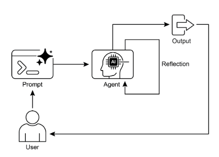
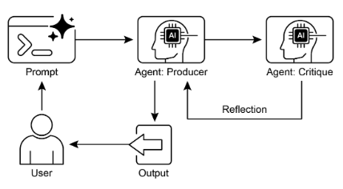

# 第 4 章：Reflection（反思）

## Reflection 模式概述

在前面的章节中，我们已经探索了基本的智能体模式：用于顺序执行的 Chaining、用于动态路径选择的 Routing，以及用于并发任务执行的 Parallelization。这些模式使智能体能够更高效、更灵活地执行复杂任务。然而，即使有复杂的工作流，智能体的初始输出或计划也可能不是最优的、准确的或完整的。这就是**反思（Reflection）**模式发挥作用的地方。

反思模式涉及智能体评估自己的工作、输出或内部状态，并使用该评估来提高其性能或改进其响应。这是一种自我纠正或自我改进的形式，允许智能体基于反馈、内部批评或与期望标准的比较来迭代改进其输出或调整其方法。反思有时可以通过一个单独的智能体来促进，该智能体的特定角色是分析初始智能体的输出。

与输出直接传递给下一步的简单顺序链不同，或选择路径的路由不同，反思引入了反馈循环。智能体不仅仅是产生输出；它还检查该输出（或生成它的过程），识别潜在问题或改进领域，并使用这些洞察生成更好的版本或修改其未来行动。

该过程通常涉及：

1. **执行：** 智能体执行任务或生成初始输出。  
2. **评估/批评：** 智能体（通常使用另一个 LLM 调用或一组规则）分析上一步的结果。此评估可能检查事实准确性、连贯性、风格、完整性、对指令的遵守或其他相关标准。  
3. **反思/改进：** 基于批评，智能体确定如何改进。这可能涉及生成改进的输出、调整后续步骤的参数，甚至修改整体计划。  
4. **迭代（可选但常见）：** 然后可以执行改进的输出或调整的方法，反思过程可以重复，直到达到满意的结果或满足停止条件。

反思模式的一个关键且高效的实现将过程分为两个不同的逻辑角色：生产者（Producer）和批评者（Critic）。这通常称为"生成器-批评者"或"生产者-审查者"模型。虽然单个智能体可以执行自我反思，但使用两个专业智能体（或具有不同系统提示的两个单独的 LLM 调用）通常产生更健壮和公正的结果。

1. 生产者智能体：此智能体的主要责任是执行任务的初始执行。它完全专注于生成内容，无论是编写代码、起草博客文章还是创建计划。它接受初始提示并产生输出的第一个版本。

2. 批评者智能体：此智能体的唯一目的是评估生产者生成的输出。它被给予不同的指令集，通常是不同的人格（例如，"你是一名高级软件工程师"，"你是一名细致的事实检查员"）。批评者的指令指导它根据特定标准分析生产者的工作，如事实准确性、代码质量、风格要求或完整性。它旨在发现缺陷、建议改进并提供结构化反馈。

这种关注点分离是强大的，因为它防止了智能体审查自己工作的"认知偏差"。批评者智能体以全新的视角处理输出，完全致力于发现错误和改进领域。来自批评者的反馈然后被传递回生产者智能体，生产者智能体使用它作为指导生成新的、改进的输出版本。提供的 LangChain 和 ADK 代码示例都实现了这种两智能体模型：LangChain 示例使用特定的 `reflector_prompt` 创建批评者人格，而 ADK 示例显式定义了生产者和审查者智能体。

实现反思通常需要构建智能体的工作流以包括这些反馈循环。这可以通过代码中的迭代循环来实现，或使用支持状态管理和基于评估结果的条件转换的框架。虽然单个评估和改进步骤可以在 LangChain/LangGraph、ADK 或 Crew.AI 链中实现，但真正的迭代反思通常涉及更复杂的编排。

反思模式对于构建能够产生高质量输出、处理细致任务并表现出一定程度的自我意识和适应性的智能体至关重要。它将智能体从简单地执行指令转向更复杂的问题解决和内容生成形式。

反思与目标设定和监控（参见第 11 章）的交集值得注意。目标为智能体的自我评估提供最终基准，而监控跟踪其进度。在许多实际案例中，反思然后可能充当纠正引擎，使用监控反馈来分析偏差并调整其策略。这种协同作用将智能体从被动执行器转变为有目的的系统，适应性地工作以实现其目标。

此外，当 LLM 保留对话的内存（参见第 8 章）时，反思模式的有效性显著增强。此对话历史为评估阶段提供了关键上下文，允许智能体不仅孤立地评估其输出，而且在先前交互、用户反馈和演进目标的背景下评估。它使智能体能够从过去的批评中学习并避免重复错误。没有内存，每次反思都是独立的事件；有了内存，反思成为一个累积过程，其中每个周期都建立在上一个周期之上，导致更智能和上下文感知的改进。

## 实际应用与用例

反思模式在输出质量、准确性或遵守复杂约束至关重要的场景中很有价值：

### 1. 创意写作和内容生成

改进生成的文本、故事、诗歌或营销文案。

* **用例：** 撰写博客文章的智能体。  
  * **反思：** 生成草稿，批评其流畅性、语气和清晰度，然后基于批评重写。重复直到文章满足质量标准。  
  * **好处：** 产生更精致和有效的内容。

### 2. 代码生成和调试

编写代码、识别错误并修复它们。

* **用例：** 编写 Python 函数的智能体。  
  * **反思：** 编写初始代码，运行测试或静态分析，识别错误或低效率，然后基于发现修改代码。  
  * **好处：** 生成更健壮和功能性的代码。

### 3. 复杂问题解决

在多步推理任务中评估中间步骤或提议的解决方案。

* **用例：** 解决逻辑谜题的智能体。  
  * **反思：** 提议一个步骤，评估它是否更接近解决方案或引入矛盾，如果需要则回溯或选择不同的步骤。  
  * **好处：** 提高智能体导航复杂问题空间的能力。

### 4. 摘要和信息综合

改进摘要的准确性、完整性和简洁性。

* **用例：** 总结长文档的智能体。  
  * **反思：** 生成初始摘要，与原始文档中的关键点进行比较，改进摘要以包含缺失信息或提高准确性。  
  * **好处：** 创建更准确和全面的摘要。

### 5. 规划和策略

评估提议的计划并识别潜在缺陷或改进。

* **用例：** 规划一系列行动以实现目标的智能体。  
  * **反思：** 生成计划，模拟其执行或根据约束评估其可行性，基于评估修订计划。  
  * **好处：** 制定更有效和现实的计划。

### 6. 对话智能体

审查对话中的先前轮次以维护上下文、纠正误解或提高响应质量。

* **用例：** 客户支持聊天机器人。  
  * **反思：** 在用户响应后，审查对话历史和最后生成的消息，以确保连贯性并准确处理用户的最新输入。  
  * **好处：** 导致更自然和有效的对话。

反思为智能体系统添加了元认知层，使它们能够从自己的输出和过程中学习，导致更智能、更可靠和高质量的结果。

## 实践代码示例（LangChain）

完整、迭代反思过程的实现需要状态管理和循环执行的机制。虽然这些在图基框架（如 LangGraph）中本机处理或通过自定义过程代码处理，但单个反思周期的基本原理可以使用 LCEL（LangChain Expression Language）的组合语法有效演示。

此示例使用 Langchain 库和 OpenAI 的 GPT-4o 模型实现反思循环，迭代生成和改进计算数字阶乘的 Python 函数。该过程从任务提示开始，生成初始代码，然后基于来自模拟高级软件工程师角色的批评重复反思代码，在每次迭代中改进代码，直到批评阶段确定代码完美或达到最大迭代次数。最后，它打印生成的改进代码。

首先，确保已安装必要的库：

```bash
pip install langchain langchain-community langchain-openai
```

您还需要使用所选语言模型的 API 密钥设置环境（例如，OpenAI、Google Gemini、Anthropic）。

```python
import os
from dotenv import load_dotenv
from langchain_openai import ChatOpenAI
from langchain_core.prompts import ChatPromptTemplate
from langchain_core.messages import SystemMessage, HumanMessage


# --- Configuration ---
# Load environment variables from .env file (for OPENAI_API_KEY)
load_dotenv()

# Check if the API key is set
if not os.getenv("OPENAI_API_KEY"):
    raise ValueError("OPENAI_API_KEY not found in .env file. Please add it.")

# Initialize the Chat LLM. We use gpt-4o for better reasoning.
# A lower temperature is used for more deterministic outputs.
llm = ChatOpenAI(model="gpt-4o", temperature=0.1)


def run_reflection_loop():
    """
    Demonstrates a multi-step AI reflection loop to progressively improve a Python function.
    """
    # --- The Core Task ---
    task_prompt = """
    Your task is to create a Python function named `calculate_factorial`.
    This function should do the following:
    1.  Accept a single integer `n` as input.
    2.  Calculate its factorial (n!).
    3.  Include a clear docstring explaining what the function does.
    4.  Handle edge cases: The factorial of 0 is 1.
    5.  Handle invalid input: Raise a ValueError if the input is a negative number.
    """

    # --- The Reflection Loop ---
    max_iterations = 3
    current_code = ""

    # We will build a conversation history to provide context in each step.
    message_history = [HumanMessage(content=task_prompt)]

    for i in range(max_iterations):
        print("\n" + "=" * 25 + f" REFLECTION LOOP: ITERATION {i + 1} " + "=" * 25)

        # --- 1. GENERATE / REFINE STAGE ---
        # In the first iteration, it generates. In subsequent iterations, it refines.
        if i == 0:
            print("\n>>> STAGE 1: GENERATING initial code...")
            # The first message is just the task prompt.
            response = llm.invoke(message_history)
            current_code = response.content
        else:
            print("\n>>> STAGE 1: REFINING code based on previous critique...")
            # The message history now contains the task,
            # the last code, and the last critique.
            # We instruct the model to apply the critiques.
            message_history.append(HumanMessage(content="Please refine the code using the critiques provided."))
            response = llm.invoke(message_history)
            current_code = response.content

        print("\n--- Generated Code (v" + str(i + 1) + ") ---\n" + current_code)
        message_history.append(response)  # Add the generated code to history

        # --- 2. REFLECT STAGE ---
        print("\n>>> STAGE 2: REFLECTING on the generated code...")
        # Create a specific prompt for the reflector agent.
        # This asks the model to act as a senior code reviewer.
        reflector_prompt = [
            SystemMessage(content="""
                You are a senior software engineer and an expert
                in Python.
                Your role is to perform a meticulous code review.
                Critically evaluate the provided Python code based
                on the original task requirements.
                Look for bugs, style issues, missing edge cases,
                and areas for improvement.
                If the code is perfect and meets all requirements,
                respond with the single phrase 'CODE_IS_PERFECT'.
                Otherwise, provide a bulleted list of your critiques.
            """),
            HumanMessage(content=f"Original Task:\n{task_prompt}\n\nCode to Review:\n{current_code}"),
        ]

        critique_response = llm.invoke(reflector_prompt)
        critique = critique_response.content

        # --- 3. STOPPING CONDITION ---
        if "CODE_IS_PERFECT" in critique:
            print("\n--- Critique ---\nNo further critiques found. The code is satisfactory.")
            break

        print("\n--- Critique ---\n" + critique)
        # Add the critique to the history for the next refinement loop.
        message_history.append(HumanMessage(content=f"Critique of the previous code:\n{critique}"))

    print("\n" + "=" * 30 + " FINAL RESULT " + "=" * 30)
    print("\nFinal refined code after the reflection process:\n")
    print(current_code)


if __name__ == "__main__":
    run_reflection_loop()
```

代码首先设置环境，加载 API 密钥，并初始化像 GPT-4o 这样的强大语言模型，具有低温度用于聚焦输出。核心任务由提示定义，要求创建一个计算数字阶乘的 Python 函数，包括文档字符串、边缘情况（0 的阶乘）和负输入错误处理的特定要求。`run_reflection_loop` 函数编排迭代改进过程。在循环内，在第一次迭代中，语言模型基于任务提示生成初始代码。在后续迭代中，它基于上一步的批评改进代码。单独的"反思者"角色，也由语言模型扮演，但具有不同的系统提示，充当高级软件工程师来批评生成的代码与原始任务要求。此批评作为问题要点列表或短语 `CODE_IS_PERFECT`（如果未发现任何问题）提供。循环继续，直到批评表明代码完美或达到最大迭代次数。对话历史被维护并在每个步骤中传递给语言模型，以为生成/改进和反思阶段提供上下文。最后，脚本在循环结束后打印最后生成的代码版本。

## 实践代码示例（ADK）

现在让我们看一下使用 Google ADK 实现的概念代码示例。具体来说，代码通过采用生成器-批评者结构来展示这一点，其中一个组件（生成器）产生初始结果或计划，另一个组件（批评者）提供关键反馈或批评，指导生成器朝向更精致或准确的最终输出。

```python
from google.adk.agents import SequentialAgent, LlmAgent


# The first agent generates the initial draft.
generator = LlmAgent(
    name="DraftWriter",
    description="Generates initial draft content on a given subject.",
    instruction="Write a short, informative paragraph about the user's subject.",
    output_key="draft_text",  # The output is saved to this state key.
)

# The second agent critiques the draft from the first agent.
reviewer = LlmAgent(
    name="FactChecker",
    description="Reviews a given text for factual accuracy and provides a structured critique.",
    instruction="""
    You are a meticulous fact-checker.
    1. Read the text provided in the state key 'draft_text'.
    2. Carefully verify the factual accuracy of all claims.
    3. Your final output must be a dictionary containing two keys:
       - "status": A string, either "ACCURATE" or "INACCURATE".
       - "reasoning": A string providing a clear explanation for your status, citing specific issues if any are found.
    """,
    output_key="review_output",  # The structured dictionary is saved here.
)

# The SequentialAgent ensures the generator runs before the reviewer.
review_pipeline = SequentialAgent(
    name="WriteAndReview_Pipeline",
    sub_agents=[generator, reviewer],
)

# Execution Flow:
# 1. generator runs -> saves its paragraph to state['draft_text'].
# 2. reviewer runs -> reads state['draft_text'] and saves its dictionary output to state['review_output'].
```

此代码演示了在 Google ADK 中使用顺序智能体管道生成和审查文本。它定义了两个 LlmAgent 实例：generator 和 reviewer。生成器智能体设计用于创建关于给定主题的初始草稿段落。它被指示编写简短且信息丰富的文章，并将其输出保存到状态键 `draft_text`。审查者智能体充当生成器生成的文本的事实检查员。它被指示从 `draft_text` 读取文本并验证其事实准确性。审查者的输出是一个包含两个键的结构化字典：status 和 reasoning。status 指示文本是"ACCURATE"还是"INACCURATE"，而 reasoning 提供状态解释。此字典保存到状态键 `review_output`。创建一个名为 `review_pipeline` 的 SequentialAgent 来管理两个智能体的执行顺序。它确保生成器首先运行，然后是审查者。整体执行流程是生成器产生文本，然后保存到状态。随后，审查者从状态读取此文本，执行其事实检查，并将其发现（状态和推理）保存回状态。此管道允许使用单独的智能体进行结构化的内容创建和审查过程。 

**注意：** 对于感兴趣的人，还提供了利用 ADK 的 LoopAgent 的替代实现。

在结束之前，重要的是要考虑虽然反思模式显著提高了输出质量，但它带来了重要的权衡。迭代过程虽然强大，但可能导致更高的成本和延迟，因为每个改进循环可能需要新的 LLM 调用，使其对时间敏感的应用程序不是最优的。此外，该模式是内存密集型的；随着每次迭代，对话历史扩展，包括初始输出、批评和后续改进。

## 概览

**什么：** 智能体的初始输出通常不是最优的，存在不准确、不完整或未能满足复杂要求的问题。基本智能体工作流缺乏智能体识别和修复自身错误的内置过程。这通过让智能体评估自己的工作或更健壮地通过引入单独的逻辑智能体充当批评者来解决，防止初始响应成为最终响应，无论质量如何。

**为什么：** 反思模式通过引入自我纠正和改进机制提供解决方案。它建立了一个反馈循环，其中"生产者"智能体生成输出，然后"批评者"智能体（或生产者本身）根据预定义标准评估它。然后使用此批评生成改进的版本。这种生成、评估和改进的迭代过程逐步提高最终结果的质量，导致更准确、连贯和可靠的结果。

**经验法则：** 当最终输出的质量、准确性和细节比速度和成本更重要时，使用反思模式。它对于生成精致的长篇内容、编写和调试代码以及创建详细计划等任务特别有效。当任务需要高客观性或专业评估（通用生产者智能体可能会错过）时，使用单独的批评者智能体。

**可视化摘要：**



图 1：反思设计模式，自我反思



图 2：反思设计模式，生产者和批评智能体

## 关键要点

* 反思模式的主要优势是其迭代自我纠正和改进输出的能力，导致显著更高的质量、准确性和对复杂指令的遵守。  
* 它涉及执行、评估/批评和改进的反馈循环。反思对于需要高质量、准确或细致输出的任务至关重要。  
* 一个强大的实现是生产者-批评者模型，其中单独的智能体（或提示的角色）评估初始输出。这种关注点分离增强了客观性，并允许更专业、结构化的反馈。  
* 然而，这些好处是以增加的延迟和计算成本为代价的，以及超过模型上下文窗口或被 API 服务限制的更高风险。  
* 虽然完整的迭代反思通常需要有状态工作流（如 LangGraph），但单个反思步骤可以使用 LCEL 在 LangChain 中实现，以传递输出进行批评和后续改进。  
* Google ADK 可以通过顺序工作流促进反思，其中一个智能体的输出被另一个智能体批评，允许后续改进步骤。  
* 此模式使智能体能够执行自我纠正并随时间提高其性能。

## 结论

反思模式为智能体工作流内的自我纠正提供了关键机制，使能够超越单次执行的迭代改进。这是通过创建循环来实现的，其中系统生成输出，根据特定标准评估它，然后使用该评估产生改进的结果。此评估可以由智能体本身（自我反思）执行，或通常更有效地由不同的批评者智能体执行，这代表了模式内的关键架构选择。

虽然完全自主的多步反思过程需要强大的状态管理架构，但其核心原理在单个生成-批评-改进周期中有效演示。作为控制结构，反思可以与其他基础模式集成，以构建更健壮和功能复杂的智能体系统。

## 参考文献

以下是一些关于反思模式和相关概念的进一步阅读资源：

1. Training Language Models to Self-Correct via Reinforcement Learning, [https://arxiv.org/abs/2409.12917](https://arxiv.org/abs/2409.12917)
2. LangChain Expression Language (LCEL) Documentation: [https://python.langchain.com/docs/introduction/](https://python.langchain.com/docs/introduction/)
3. LangGraph Documentation:[https://www.langchain.com/langgraph](https://www.langchain.com/langgraph)
4. Google Agent Developer Kit (ADK) Documentation (Multi-Agent Systems): [https://google.github.io/adk-docs/agents/multi-agents/](https://google.github.io/adk-docs/agents/multi-agents/)
