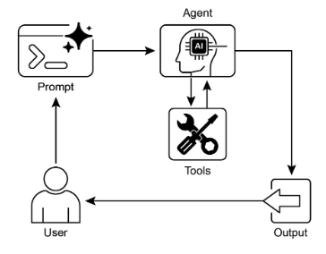

# 第 5 章：Tool Use（工具使用，函数调用）

## Tool Use 模式概述

到目前为止，我们已经讨论了主要涉及编排语言模型之间交互和管理智能体内部工作流中信息流的智能体模式（Chaining、Routing、Parallelization、Reflection）。然而，对于智能体来说，要真正有用并与现实世界或外部系统交互，它们需要能够使用工具（Tools）。

工具使用（Tool Use）模式，通常通过称为函数调用（Function Calling）的机制实现，使智能体能够与外部 API、数据库、服务交互，甚至执行代码。它允许智能体核心的 LLM 根据用户的请求或任务的当前状态决定何时以及如何使用特定的外部函数。

该过程通常涉及：

1. **工具定义：** 向 LLM 定义和描述外部函数或能力。此描述包括函数的用途、名称以及它接受的参数，以及它们的类型和描述。  
2. **LLM 决策：** LLM 接收用户的请求和可用的工具定义。基于其对请求和工具的理解，LLM 决定是否调用一个或多个工具来满足请求。  
3. **函数调用生成：** 如果 LLM 决定使用工具，它生成结构化输出（通常是 JSON 对象），指定要调用的工具名称和传递给它的参数（从用户的请求中提取）。  
4. **工具执行：** 智能体框架或编排层拦截此结构化输出。它识别请求的工具并使用提供的参数执行实际的外部函数。  
5. **观察/结果：** 工具执行的输出或结果返回给智能体。  
6. **LLM 处理（可选但常见）：** LLM 接收工具的输出作为上下文，并使用它来制定对用户的最终响应或决定工作流中的下一步（这可能涉及调用另一个工具、反思或提供最终答案）。

这种模式是基础的，因为它打破了 LLM 训练数据的限制，允许它访问最新信息、执行它无法在内部执行的计算、与用户特定数据交互或触发现实世界的行动。函数调用是连接 LLM 推理能力和大量可用外部功能的技术机制。

虽然"函数调用"恰当地描述了调用特定的、预定义的代码函数，但考虑更广泛的"工具调用"概念是有用的。这个更广泛的术语承认智能体的能力可以远远超出简单的函数执行。一个"工具"可以是传统函数，但它也可以是复杂的 API 端点、对数据库的请求，甚至是针对另一个专业智能体的指令。这种观点允许我们设想更复杂的系统，例如，主智能体可能将复杂的数据分析任务委托给专门的"分析师智能体"或通过其 API 查询外部知识库。以"工具调用"的方式思考更好地捕捉了智能体作为数字资源和其他智能实体多样化生态系统中的编排器的全部潜力。

像 LangChain、LangGraph 和 Google Agent Developer Kit (ADK) 这样的框架为定义工具并将其集成到智能体工作流中提供了强大的支持，通常利用现代 LLM（如 Gemini 或 OpenAI 系列）的原生函数调用能力。在这些框架的"画布"上，您定义工具，然后配置智能体（通常是 LLM 智能体）以了解并能够使用这些工具。

工具使用是构建强大的、交互式的和外部感知的智能体的基石模式。

## 实际应用与用例

工具使用模式适用于智能体需要超越生成文本以执行操作或检索特定的、动态信息的几乎任何场景：

### 1. 从外部来源检索信息

访问不在 LLM 训练数据中的实时数据或信息。

* **用例：** 天气智能体。  
  * **工具：** 接受位置并返回当前天气条件的天气 API。  
  * **智能体流程：** 用户询问"伦敦的天气如何？"，LLM 识别需要天气工具，使用"伦敦"调用工具，工具返回数据，LLM 将数据格式化为用户友好的响应。

### 2. 与数据库和 API 交互

对结构化数据执行查询、更新或其他操作。

* **用例：** 电子商务智能体。  
  * **工具：** 检查产品库存、获取订单状态或处理支付的 API 调用。  
  * **智能体流程：** 用户询问"产品 X 有库存吗？"，LLM 调用库存 API，工具返回库存数量，LLM 告诉用户库存状态。

### 3. 执行计算和数据分析

使用外部计算器、数据分析库或统计工具。

* **用例：** 金融智能体。  
  * **工具：** 计算器函数、股票市场数据 API、电子表格工具。  
  * **智能体流程：** 用户询问"AAPL 的当前价格是多少，如果我以 150 美元购买 100 股，计算潜在利润？"，LLM 调用股票 API，获取当前价格，然后调用计算器工具，获取结果，格式化响应。

### 4. 发送通信

发送电子邮件、消息或对外部通信服务进行 API 调用。

* **用例：** 个人助手智能体。  
  * **工具：** 电子邮件发送 API。  
  * **智能体流程：** 用户说"向 John 发送一封关于明天会议的电子邮件。", LLM 使用从请求中提取的收件人、主题和正文调用电子邮件工具。

### 5. 执行代码

在安全环境中运行代码片段以执行特定任务。

* **用例：** 编码助手智能体。  
  * **工具：** 代码解释器。  
  * **智能体流程：** 用户提供 Python 片段并询问"这段代码做什么？", LLM 使用解释器工具运行代码并分析其输出。

### 6. 控制其他系统或设备

与智能家居设备、IoT 平台或其他连接系统交互。

* **用例：** 智能家居智能体。  
  * **工具：** 控制智能灯的 API。  
  * **智能体流程：** 用户说"关闭客厅的灯。" LLM 使用命令和目标设备调用智能家居工具。

工具使用是将语言模型从文本生成器转变为能够在数字或物理世界中感知、推理和行动的智能体的关键（见图 1）


图 1：智能体使用工具的一些示例

## 实践代码示例（LangChain）

在 LangChain 框架内实现工具使用是一个两阶段过程。最初，定义一个或多个工具，通常通过封装现有的 Python 函数或其他可运行组件。随后，这些工具绑定到语言模型，从而授予模型在确定需要外部函数调用来满足用户查询时生成结构化工具使用请求的能力。

以下实现将通过首先定义一个简单函数来模拟信息检索工具来演示此原理。随后，将构建并配置一个智能体以利用此工具响应用户输入。执行此示例需要安装核心 LangChain 库和模型特定的提供商包。此外，与所选语言模型服务的适当身份验证（通常通过本地环境中配置的 API 密钥）是必要的先决条件。

```python
import os
import getpass
import asyncio
import nest_asyncio
from typing import List
from dotenv import load_dotenv
import logging

from langchain_google_genai import ChatGoogleGenerativeAI
from langchain_core.prompts import ChatPromptTemplate
from langchain_core.tools import tool as langchain_tool
from langchain.agents import create_tool_calling_agent, AgentExecutor


# UNCOMMENT
# Prompt the user securely and set API keys as environment variables
os.environ["GOOGLE_API_KEY"] = getpass.getpass("Enter your Google API key: ")
os.environ["OPENAI_API_KEY"] = getpass.getpass("Enter your OpenAI API key: ")

try:
    # A model with function/tool calling capabilities is required.
    llm = ChatGoogleGenerativeAI(model="gemini-2.0-flash", temperature=0)
    print(f"✅ Language model initialized: {llm.model}")
except Exception as e:
    print(f"🛑 Error initializing language model: {e}")
    llm = None


# --- Define a Tool ---
@langchain_tool
def search_information(query: str) -> str:
    """
    Provides factual information on a given topic. Use this tool to find answers to phrases
    like 'capital of France' or 'weather in London?'.
    """
    print(f"\n--- 🛠️ Tool Called: search_information with query: '{query}' ---")

    # Simulate a search tool with a dictionary of predefined results.
    simulated_results = {
        "weather in london": "The weather in London is currently cloudy with a temperature of 15°C.",
        "capital of france": "The capital of France is Paris.",
        "population of earth": "The estimated population of Earth is around 8 billion people.",
        "tallest mountain": "Mount Everest is the tallest mountain above sea level.",
        "default": f"Simulated search result for '{query}': No specific information found, but the topic seems interesting.",
    }
    result = simulated_results.get(query.lower(), simulated_results["default"])
    print(f"--- TOOL RESULT: {result} ---")
    return result


tools = [search_information]


# --- Create a Tool-Calling Agent ---
if llm:
    # This prompt template requires an `agent_scratchpad` placeholder for the agent's internal steps.
    agent_prompt = ChatPromptTemplate.from_messages([
        ("system", "You are a helpful assistant."),
        ("human", "{input}"),
        ("placeholder", "{agent_scratchpad}"),
    ])

    # Create the agent, binding the LLM, tools, and prompt together.
    agent = create_tool_calling_agent(llm, tools, agent_prompt)

    # AgentExecutor is the runtime that invokes the agent and executes the chosen tools.
    # The 'tools' argument is not needed here as they are already bound to the agent.
    agent_executor = AgentExecutor(agent=agent, verbose=True, tools=tools)


async def run_agent_with_tool(query: str):
    """Invokes the agent executor with a query and prints the final response."""
    print(f"\n--- 🏃 Running Agent with Query: '{query}' ---")
    try:
        response = await agent_executor.ainvoke({"input": query})
        print("\n--- ✅ Final Agent Response ---")
        print(response["output"])
    except Exception as e:
        print(f"\n🛑 An error occurred during agent execution: {e}")


async def main():
    """Runs all agent queries concurrently."""
    tasks = [
        run_agent_with_tool("What is the capital of France?"),
        run_agent_with_tool("What's the weather like in London?"),
        run_agent_with_tool("Tell me something about dogs."),  # Should trigger the default tool response
    ]
    await asyncio.gather(*tasks)


nest_asyncio.apply()
asyncio.run(main())

```

代码使用 LangChain 库和 Google Gemini 模型设置了一个工具调用智能体。它定义了一个 `search_information` 工具，模拟为特定查询提供事实答案。该工具为"weather in london"、"capital of france"和"population of earth"预定义了响应，并为其他查询提供默认响应。初始化 ChatGoogleGenerativeAI 模型，确保其具有工具调用能力。创建 ChatPromptTemplate 以指导智能体的交互。使用 `create_tool_calling_agent` 函数将语言模型、工具和提示组合成智能体。然后设置 AgentExecutor 来管理智能体的执行和工具调用。定义 `run_agent_with_tool` 异步函数以使用给定查询调用智能体并打印结果。主异步函数准备多个查询以并发运行。这些查询设计用于测试 `search_information` 工具的特定和默认响应。最后，asyncio.run(main()) 调用执行所有智能体任务。代码包括在继续智能体设置和执行之前检查成功的 LLM 初始化。

# 实践代码示例（CrewAI）

此代码提供了如何在 CrewAI 框架内实现函数调用（工具）的实用示例。它设置了一个简单场景，其中智能体配备了查找信息的工具。该示例特别演示了使用此智能体和工具获取模拟股价。

```python
# pip install crewai langchain-openai

import os
from crewai import Agent, Task, Crew
from crewai.tools import tool
import logging


# --- Best Practice: Configure Logging ---
# A basic logging setup helps in debugging and tracking the crew's execution.
logging.basicConfig(level=logging.INFO, format='%(asctime)s - %(levelname)s - %(message)s')


# --- Set up your API Key ---
# For production, it's recommended to use a more secure method for key management
# like environment variables loaded at runtime or a secret manager.
#
# Set the environment variable for your chosen LLM provider (e.g., OPENAI_API_KEY)
# os.environ["OPENAI_API_KEY"] = "YOUR_API_KEY"
# os.environ["OPENAI_MODEL_NAME"] = "gpt-4o"


# --- 1. Refactored Tool: Returns Clean Data ---
# The tool now returns raw data (a float) or raises a standard Python error.
# This makes it more reusable and forces the agent to handle outcomes properly.
@tool("Stock Price Lookup Tool")
def get_stock_price(ticker: str) -> float:
    """
    Fetches the latest simulated stock price for a given stock ticker symbol.
    Returns the price as a float. Raises a ValueError if the ticker is not found.
    """
    logging.info(f"Tool Call: get_stock_price for ticker '{ticker}'")
    simulated_prices = {
        "AAPL": 178.15,
        "GOOGL": 1750.30,
        "MSFT": 425.50,
    }
    price = simulated_prices.get(ticker.upper())
    if price is not None:
        return price
    else:
        # Raising a specific error is better than returning a string.
        # The agent is equipped to handle exceptions and can decide on the next action.
        raise ValueError(f"Simulated price for ticker '{ticker.upper()}' not found.")


# --- 2. Define the Agent ---
# The agent definition remains the same, but it will now leverage the improved tool.
financial_analyst_agent = Agent(
    role='Senior Financial Analyst',
    goal='Analyze stock data using provided tools and report key prices.',
    backstory="You are an experienced financial analyst adept at using data sources to find stock information. You provide clear, direct answers.",
    verbose=True,
    tools=[get_stock_price],
    # Allowing delegation can be useful, but is not necessary for this simple task.
    allow_delegation=False,
)


# --- 3. Refined Task: Clearer Instructions and Error Handling ---
# The task description is more specific and guides the agent on how to react
# to both successful data retrieval and potential errors.
analyze_aapl_task = Task(
    description=(
        "What is the current simulated stock price for Apple (ticker: AAPL)? "
        "Use the 'Stock Price Lookup Tool' to find it. "
        "If the ticker is not found, you must report that you were unable to retrieve the price."
    ),
    expected_output=(
        "A single, clear sentence stating the simulated stock price for AAPL. "
        "For example: 'The simulated stock price for AAPL is $178.15.' "
        "If the price cannot be found, state that clearly."
    ),
    agent=financial_analyst_agent,
)


# --- 4. Formulate the Crew ---
# The crew orchestrates how the agent and task work together.
financial_crew = Crew(
    agents=[financial_analyst_agent],
    tasks=[analyze_aapl_task],
    verbose=True  # Set to False for less detailed logs in production
)


# --- 5. Run the Crew within a Main Execution Block ---
# Using a __name__ == "__main__": block is a standard Python best practice.
def main():
    """Main function to run the crew."""
    # Check for API key before starting to avoid runtime errors.
    if not os.environ.get("OPENAI_API_KEY"):
        print("ERROR: The OPENAI_API_KEY environment variable is not set.")
        print("Please set it before running the script.")
        return

    print("\n## Starting the Financial Crew...")
    print("---------------------------------")

    # The kickoff method starts the execution.
    result = financial_crew.kickoff()

    print("\n---------------------------------")
    print("## Crew execution finished.")
    print("\nFinal Result:\n", result)


if __name__ == "__main__":
    main()
```

此代码演示了使用 Crew.ai 库模拟金融分析任务的简单应用程序。它定义了一个自定义工具 `get_stock_price`，模拟查找预定义股票代码的股价。该工具设计为为有效股票代码返回浮点数，或为无效股票代码引发 ValueError。创建一个名为 `financial_analyst_agent` 的 Crew.ai 智能体，角色为高级金融分析师。此智能体被赋予 `get_stock_price` 工具以进行交互。定义了一个任务 `analyze_aapl_task`，特别指示智能体使用工具查找 AAPL 的模拟股价。任务描述包括有关在使用工具时如何处理成功和失败情况的清晰说明。组装了一个 Crew，包括 `financial_analyst_agent` 和 `analyze_aapl_task`。为智能体和 crew 启用了详细设置，以在执行期间提供详细的日志记录。脚本的主要部分在标准的 `if __name__ \== "__main__":` 块中使用 kickoff() 方法运行 crew 的任务。在启动 crew 之前，它检查是否设置了 `OPENAI_API_KEY` 环境变量，这是智能体运行所必需的。然后，crew 执行的结果（即任务的输出）被打印到控制台。代码还包括基本日志配置，以便更好地跟踪 crew 的操作和工具调用。它使用环境变量进行 API 密钥管理，尽管它指出推荐在生产环境中使用更安全的方法。简而言之，核心逻辑展示了如何定义工具、智能体和任务以在 Crew.ai 中创建协作工作流。

## 实践代码（Google ADK）

Google Agent Developer Kit (ADK) 包括一个本机集成工具库，可以直接纳入智能体的能力。

**Google 搜索：** 此类组件的一个主要示例是 Google Search 工具。此工具作为 Google Search 引擎的直接接口，为智能体提供执行网络搜索和检索外部信息的功能。

```python
from google.adk.agents import Agent as ADKAgent
from google.adk.runners import Runner
from google.adk.sessions import InMemorySessionService
from google.adk.tools import google_search
from google.genai import types
import nest_asyncio
import asyncio


# Define variables required for Session setup and Agent execution
APP_NAME = "Google Search Agent"
USER_ID = "user1234"
SESSION_ID = "1234"


# Define Agent with access to search tool
root_agent = ADKAgent(
    name="basic_search_agent",
    model="gemini-2.0-flash-exp",
    description="Agent to answer questions using Google Search.",
    instruction="I can answer your questions by searching the internet. Just ask me anything!",
    tools=[google_search],  # Google Search is a pre-built tool to perform Google searches.
)


# Agent Interaction
async def call_agent(query: str):
    """
    Helper function to call the agent with a query.
    """
    # Session and Runner
    session_service = InMemorySessionService()
    await session_service.create_session(
        app_name=APP_NAME,
        user_id=USER_ID,
        session_id=SESSION_ID,
    )

    runner = Runner(agent=root_agent, app_name=APP_NAME, session_service=session_service)

    content = types.Content(role='user', parts=[types.Part(text=query)])
    events = runner.run(user_id=USER_ID, session_id=SESSION_ID, new_message=content)

    for event in events:
        if event.is_final_response() and event.content:
            # Safely extract text from the final response
            if hasattr(event.content, "text") and event.content.text:
                final_response = event.content.text
            elif event.content.parts:
                final_response = "".join(
                    part.text for part in event.content.parts if getattr(part, "text", None)
                )
            else:
                final_response = ""
            print("Agent Response:", final_response)


nest_asyncio.apply()
asyncio.run(call_agent("what's the latest ai news?"))
```

此代码演示了如何创建和使用由 Google ADK for Python 提供支持的基本智能体。该智能体设计用于通过利用 Google Search 作为工具来回答问题。首先，从 IPython、google.adk 和 google.genai 导入必要的库。定义应用程序名称、用户 ID 和会话 ID 的常量。创建一个名为 `basic_search_agent` 的 Agent 实例，具有指示其用途的描述和指令。它配置为使用 Google Search 工具，这是 ADK 提供的预构建工具。初始化 InMemorySessionService（参见第 8 章）以管理智能体的会话。为指定的应用程序、用户和会话 ID 创建新会话。实例化 Runner，将创建的智能体与会话服务链接。此运行器负责在执行会话内执行智能体的交互。定义辅助函数 `call_agent` 以简化向智能体发送查询和处理响应的过程。在 `call_agent` 内部，用户的查询被格式化为具有角色 'user' 的 types.Content 对象。使用用户 ID、会话 ID 和新消息内容调用 runner.run 方法。runner.run 方法返回表示智能体操作和响应的事件列表。代码遍历这些事件以查找最终响应。如果事件被识别为最终响应，则提取该响应的文本内容。然后将提取的智能体响应打印到控制台。最后，使用查询"what's the latest ai news?"调用 `call_agent` 函数以演示智能体的运行。

**代码执行：** Google ADK 具有用于专门任务的集成组件，包括用于动态代码执行的环境。`built_in_code_execution` 工具为智能体提供沙箱化的 Python 解释器。这允许模型编写和运行代码以执行计算任务、操作数据结构和执行过程脚本。这种功能对于解决需要确定性逻辑和精确计算的问题至关重要，这些问题超出了概率语言生成的范围。

```python
import os
import getpass
import asyncio
import nest_asyncio
from typing import List
from dotenv import load_dotenv
import logging

from google.adk.agents import Agent as ADKAgent, LlmAgent
from google.adk.runners import Runner
from google.adk.sessions import InMemorySessionService
from google.adk.tools import google_search
from google.adk.code_executors import BuiltInCodeExecutor
from google.genai import types


# Define variables required for Session setup and Agent execution
APP_NAME = "calculator"
USER_ID = "user1234"
SESSION_ID = "session_code_exec_async"


# Agent Definition
code_agent = LlmAgent(
    name="calculator_agent",
    model="gemini-2.0-flash",
    code_executor=BuiltInCodeExecutor(),
    instruction="""You are a calculator agent.
    When given a mathematical expression, write and execute Python code to calculate the result.
    Return only the final numerical result as plain text, without markdown or code blocks.
    """,
    description="Executes Python code to perform calculations.",
)


# Agent Interaction (Async)
async def call_agent_async(query: str):
    # Session and Runner
    session_service = InMemorySessionService()
    await session_service.create_session(app_name=APP_NAME, user_id=USER_ID, session_id=SESSION_ID)

    runner = Runner(agent=code_agent, app_name=APP_NAME, session_service=session_service)

    content = types.Content(role='user', parts=[types.Part(text=query)])
    print(f"\n--- Running Query: {query} ---")

    try:
        # Use run_async
        async for event in runner.run_async(user_id=USER_ID, session_id=SESSION_ID, new_message=content):
            print(f"Event ID: {event.id}, Author: {event.author}")

            if event.content and event.content.parts and event.is_final_response():
                for part in event.content.parts:  # Iterate through all parts
                    if getattr(part, "executable_code", None):
                        # Access the actual code string via .code
                        print(f"  Debug: Agent generated code:\n```python\n{part.executable_code.code}\n```")
                    elif getattr(part, "code_execution_result", None):
                        # Access outcome and output correctly
                        print(
                            "  Debug: Code Execution Result: "
                            f"{part.code_execution_result.outcome} - Output:\n{part.code_execution_result.output}"
                        )
                    elif getattr(part, "text", None) and not part.text.isspace():
                        # Also print any text parts found in any event for debugging
                        print(f"  Text: '{part.text.strip()}'")

                # --- Check for final response AFTER specific parts ---
                text_parts = [part.text for part in event.content.parts if getattr(part, "text", None)]
                final_result = "".join(text_parts)
                print(f"==> Final Agent Response: {final_result}")

    except Exception as e:
        print(f"ERROR during agent run: {e}")

    print("-" * 30)


# Main async function to run the examples
async def main():
    await call_agent_async("Calculate the value of (5 + 7) * 3")
    await call_agent_async("What is 10 factorial?")


# Execute the main async function
try:
    nest_asyncio.apply()
    asyncio.run(main())
except RuntimeError as e:
    # Handle specific error when running asyncio.run in an already running loop (like Jupyter/Colab)
    if "cannot be called from a running event loop" in str(e):
        print("\nRunning in an existing event loop (like Colab/Jupyter).")
        print("Please run `await main()` in a notebook cell instead.")
        # If in an interactive environment like a notebook, you might need to run:
        # await main()
    else:
        raise e  # Re-raise other runtime errors
```

此脚本使用 Google 的 Agent Development Kit (ADK) 创建一个通过编写和执行 Python 代码来解决数学问题的智能体。它定义了一个 LlmAgent，特别指示充当计算器，为其配备 `built_in_code_execution` 工具。主要逻辑位于 `call_agent_async` 函数中，该函数将用户的查询发送到智能体的运行器并处理结果事件。在此函数内部，异步循环遍历事件，打印生成的 Python 代码及其执行结果以进行调试。代码仔细区分这些中间步骤和包含数字答案的最终事件。最后，主函数使用两个不同的数学表达式运行智能体，以演示其执行计算的能力。

**企业搜索：** 此代码定义了一个使用 Python 中的 google.adk 库的 Google ADK 应用程序。它特别使用了 VSearchAgent，该智能体设计用于通过搜索指定的 Vertex AI Search 数据存储来回答问题。代码初始化一个名为 `q2_strategy_vsearch_agent` 的 VSearchAgent，提供描述、要使用的模型（"gemini-2.0-flash-exp"）和 Vertex AI Search 数据存储的 ID。`DATASTORE_ID` 预期设置为环境变量。然后，它使用 InMemorySessionService 管理对话历史为智能体设置 Runner。定义异步函数 `call_vsearch_agent_async` 以与智能体交互。此函数接受查询，构造消息内容对象，并调用运行器的 `run_async` 方法将查询发送到智能体。然后，函数将智能体的响应流式传输回控制台。它还打印有关最终响应的信息，包括来自数据存储的任何源归属。包括错误处理以捕获智能体执行期间的异常，提供有关潜在问题（如错误的数据存储 ID 或缺少权限）的信息性消息。提供另一个异步函数 `run_vsearch_example` 以演示如何使用示例查询调用智能体。主执行块检查是否设置了 `DATASTORE_ID`，然后使用 asyncio.run 运行示例。它包括一个检查以处理在已经有运行事件循环的环境中运行代码的情况，如 Jupyter notebook。

```python
import asyncio
import os

from google.genai import types
from google.adk import agents
from google.adk.runners import Runner
from google.adk.sessions import InMemorySessionService


# --- Configuration ---
# Ensure you have set your GOOGLE_API_KEY and DATASTORE_ID environment variables
# For example:
# os.environ["GOOGLE_API_KEY"] = "YOUR_API_KEY"
# os.environ["DATASTORE_ID"] = "YOUR_DATASTORE_ID"
DATASTORE_ID = os.environ.get("DATASTORE_ID")


# --- Application Constants ---
APP_NAME = "vsearch_app"
USER_ID = "user_123"  # Example User ID
SESSION_ID = "session_456"  # Example Session ID


# --- Agent Definition (Updated with the newer model from the guide) ---
vsearch_agent = agents.VSearchAgent(
    name="q2_strategy_vsearch_agent",
    description="Answers questions about Q2 strategy documents using Vertex AI Search.",
    model="gemini-2.0-flash-exp",  # Updated model based on the guide's examples
    datastore_id=DATASTORE_ID,
    model_parameters={"temperature": 0.0},
)


# --- Runner and Session Initialization ---
runner = Runner(
    agent=vsearch_agent,
    app_name=APP_NAME,
    session_service=InMemorySessionService(),
)


# --- Agent Invocation Logic ---
async def call_vsearch_agent_async(query: str):
    """Initializes a session and streams the agent's response."""
    print(f"User: {query}")
    print("Agent: ", end="", flush=True)
    try:
        # Construct the message content correctly
        content = types.Content(role='user', parts=[types.Part(text=query)])

        # Process events as they arrive from the asynchronous runner
        async for event in runner.run_async(
            user_id=USER_ID,
            session_id=SESSION_ID,
            new_message=content,
        ):
            # For token-by-token streaming of the response text
            if hasattr(event, "content_part_delta") and event.content_part_delta:
                print(event.content_part_delta.text, end="", flush=True)

            # Process the final response and its associated metadata
            if event.is_final_response():
                print()  # Newline after the streaming response
                if getattr(event, "grounding_metadata", None):
                    print(
                        f"  (Source Attributions: "
                        f"{len(event.grounding_metadata.grounding_attributions)} sources found)"
                    )
                else:
                    print("  (No grounding metadata found)")
                print("-" * 30)
    except Exception as e:
        print(f"\nAn error occurred: {e}")
        print("Please ensure your datastore ID is correct and that the service account has the necessary permissions.")
        print("-" * 30)


# --- Run Example ---
async def run_vsearch_example():
    # Replace with a question relevant to YOUR datastore content
    await call_vsearch_agent_async("Summarize the main points about the Q2 strategy document.")
    await call_vsearch_agent_async("What safety procedures are mentioned for lab X?")


# --- Execution ---
if __name__ == "__main__":
    if not DATASTORE_ID:
        print("Error: DATASTORE_ID environment variable is not set.")
    else:
        try:
            asyncio.run(run_vsearch_example())
        except RuntimeError as e:
            # This handles cases where asyncio.run is called in an environment
            # that already has a running event loop (like a Jupyter notebook).
            if "cannot be called from a running event loop" in str(e):
                print("Skipping execution in a running event loop. Please run this script directly.")
            else:
                raise e
```

总体而言，此代码为构建利用 Vertex AI Search 基于存储在数据存储中的信息回答问题的对话式 AI 应用程序提供了基本框架。它演示了如何定义智能体、设置运行器以及异步与智能体交互，同时流式传输响应。重点是检索和综合来自特定数据存储的信息以回答用户查询。

**Vertex 扩展：** Vertex AI 扩展是一个结构化 API 包装器，使模型能够连接到外部 API 以进行实时数据处理和操作执行。扩展提供企业级安全性、数据隐私和性能保证。它们可用于生成和运行代码、查询网站以及从私有数据存储分析信息等任务。Google 为常见用例（如 Code Interpreter 和 Vertex AI Search）提供预构建扩展，并提供创建自定义扩展的选项。扩展的主要好处包括强大的企业控制和与其他 Google 产品的无缝集成。扩展和函数调用之间的关键区别在于它们的执行：Vertex AI 自动执行扩展，而函数调用需要用户或客户端手动执行。

## 概览

**什么：** LLM 是强大的文本生成器，但它们从根本上与外部世界断开连接。它们的知识是静态的，仅限于它们接受训练的数据，它们缺乏执行操作或检索实时信息的能力。这种固有的限制阻止它们完成需要与外部 API、数据库或服务交互的任务。没有与这些外部系统的桥梁，它们解决现实世界问题的实用性受到严重限制。

**为什么：** 工具使用模式（通常通过函数调用实现）为此问题提供了标准化解决方案。它通过以 LLM 可以理解的方式向 LLM 描述可用的外部函数或"工具"来工作。基于用户的请求，智能体 LLM 然后可以决定是否需要工具并生成结构化数据对象（如 JSON），指定要调用哪个函数以及使用什么参数。编排层执行此函数调用，检索结果，并将其反馈给 LLM。这允许 LLM 将最新的、外部信息或操作的结果纳入其最终响应，有效地赋予它行动的能力。

**经验法则：** 每当智能体需要突破 LLM 的内部知识并与外部世界交互时，使用工具使用模式。这对于需要实时数据（例如，检查天气、股价）、访问私有或专有信息（例如，查询公司数据库）、执行精确计算、执行代码或触发其他系统中的操作（例如，发送电子邮件、控制智能设备）的任务至关重要。

**可视化摘要：**



图 2：工具使用设计模式

## 关键要点

* 工具使用（函数调用）允许智能体与外部系统交互并访问动态信息。  
* 它涉及定义具有 LLM 可以理解的清晰描述和参数的工具。  
* LLM 决定何时使用工具并生成结构化函数调用。  
* 智能体框架执行实际工具调用并将结果返回给 LLM。  
* 工具使用对于构建能够执行现实世界操作并提供最新信息的智能体至关重要。  
* LangChain 使用 @tool 装饰器简化工具定义，并提供 `create_tool_calling_agent` 和 AgentExecutor 用于构建使用工具的智能体。  
* Google ADK 有许多非常有用的预构建工具，如 Google Search、Code Execution 和 Vertex AI Search Tool。

## 结论

工具使用模式是扩展大型语言模型功能范围超越其固有文本生成能力的关键架构原则。通过为模型配备与外部软件和数据源接口的能力，此范式允许智能体执行操作、执行计算并从其他系统检索信息。此过程涉及模型在确定需要这样做来满足用户查询时生成调用外部工具的结构化请求。诸如 LangChain、Google ADK 和 Crew AI 这样的框架提供了促进这些外部工具集成的结构化抽象和组件。这些框架管理向模型暴露工具规格并解析其后续工具使用请求的过程。这简化了能够与外部数字环境交互并在其中采取行动的复杂智能体系统的开发。

## 参考文献

1. LangChain Documentation (Tools): [https://python.langchain.com/docs/integrations/tools/](https://python.langchain.com/docs/integrations/tools/)
2. Google Agent Developer Kit (ADK) Documentation (Tools): [https://google.github.io/adk-docs/tools/](https://google.github.io/adk-docs/tools/)
3. OpenAI Function Calling Documentation: [https://platform.openai.com/docs/guides/function-calling](https://platform.openai.com/docs/guides/function-calling)
4. CrewAI Documentation (Tools): [https://docs.crewai.com/concepts/tools](https://docs.crewai.com/concepts/tools)
