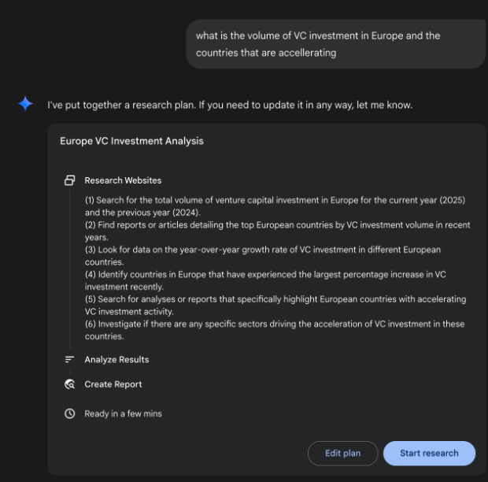
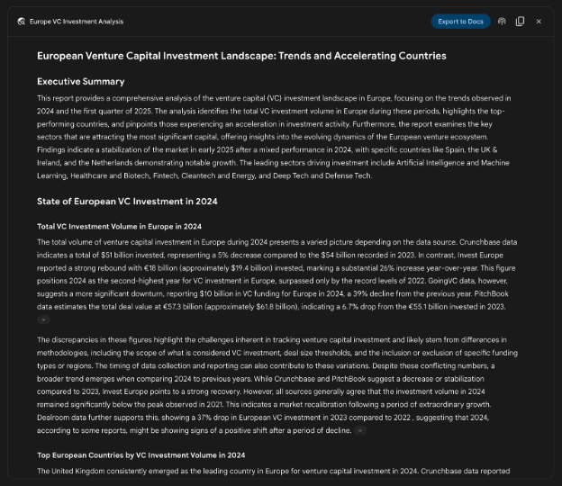
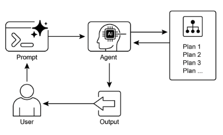

# 第 6 章：Planning（规划）

智能行为通常不仅仅是对即时输入做出反应。它需要预见性，将复杂任务分解为更小、可管理的步骤，并制定实现期望结果的策略。这就是规划（Planning）模式发挥作用的地方。核心而言，规划是智能体或智能体系统制定一系列行动以从初始状态向目标状态移动的能力。

## Planning 模式概述

在 AI 的上下文中，将规划智能体视为您委托复杂目标的专家是有帮助的。当您要求它"组织团队场外活动"时，您正在定义什么——目标及其约束——但不是如何。智能体的核心任务是自主绘制达到该目标的路径。它必须首先理解初始状态（例如，预算、参与者数量、期望日期）和目标状态（成功预订的场外活动），然后发现连接它们的最佳行动序列。计划不是预先知道的；它是响应请求而创建的。

这个过程的一个标志是适应性。初始计划仅仅是一个起点，而不是僵化的脚本。智能体的真正力量是其纳入新信息并引导项目绕过障碍的能力。例如，如果首选场地变得不可用或选择的餐饮服务商已满，有能力的智能体不会简单地失败。它会适应。它记录新约束，重新评估其选项，并制定新计划，可能通过建议替代场地或日期。

然而，重要的是要认识到灵活性和可预测性之间的权衡。动态规划是一个特定工具，而不是通用解决方案。当问题的解决方案已经被充分理解且可重复时，将智能体约束到预定的、固定的工作流更有效。这种方法限制了智能体的自主性以减少不确定性和不可预测行为的风险，保证可靠和一致的结果。因此，使用规划智能体还是简单任务执行智能体的决定取决于一个问题："如何"需要被发现，还是已经知道？

## 实际应用与用例

规划模式是自主系统中的核心计算过程，使智能体能够综合一系列行动以实现指定目标，特别是在动态或复杂环境中。此过程将高级目标转换为由离散、可执行步骤组成的结构化计划。

在过程任务自动化等领域，规划用于编排复杂的工作流。例如，像入职新员工这样的业务流程可以分解为有向的子任务序列，如创建系统账户、分配培训模块和协调不同部门。智能体生成一个计划，以逻辑顺序执行这些步骤，调用必要的工具或与各种系统交互以管理依赖关系。

在机器人和自主导航中，规划对于状态空间遍历是基础的。系统（无论是物理机器人还是虚拟实体）必须生成路径或行动序列以从初始状态转换到目标状态。这涉及优化时间或能耗等指标，同时遵守环境约束，如避开障碍或遵守交通法规。

这种模式对于结构化信息综合也是关键的。当被要求生成像研究报告这样的复杂输出时，智能体可以制定一个计划，包括信息收集、数据摘要、内容构建和迭代改进的不同阶段。类似地，在涉及多步问题解决的客户支持场景中，智能体可以创建并遵循诊断、解决方案实施和升级的系统计划。

本质上，规划模式允许智能体超越简单的、反应性的行动转向目标导向的行为。它提供了解决需要连贯的相互依赖操作序列的问题所必需的逻辑框架。

## 实践代码（Crew AI）

以下部分将演示使用 Crew AI 框架实现规划器（Planner）模式。此模式涉及一个智能体，它首先制定多步计划以处理复杂查询，然后顺序执行该计划。

```python
import os
from dotenv import load_dotenv
from crewai import Agent, Task, Crew, Process
from langchain_openai import ChatOpenAI


# Load environment variables from .env file for security
load_dotenv()


# 1. Explicitly define the language model for clarity
llm = ChatOpenAI(model="gpt-4-turbo")


# 2. Define a clear and focused agent
planner_writer_agent = Agent(
    role='Article Planner and Writer',
    goal='Plan and then write a concise, engaging summary on a specified topic.',
    backstory=(
        'You are an expert technical writer and content strategist. '
        'Your strength lies in creating a clear, actionable plan before writing, '
        'ensuring the final summary is both informative and easy to digest.'
    ),
    verbose=True,
    allow_delegation=False,
    llm=llm,  # Assign the specific LLM to the agent
)


# 3. Define a task with a more structured and specific expected output
topic = "The importance of Reinforcement Learning in AI"

high_level_task = Task(
    description=(
        f"1. Create a bullet-point plan for a summary on the topic: '{topic}'.\n"
        f"2. Write the summary based on your plan, keeping it around 200 words."
    ),
    expected_output=(
        "A final report containing two distinct sections:\n\n"
        "### Plan\n"
        "- A bulleted list outlining the main points of the summary.\n\n"
        "### Summary\n"
        "- A concise and well-structured summary of the topic."
    ),
    agent=planner_writer_agent,
)


# Create the crew with a clear process
crew = Crew(
    agents=[planner_writer_agent],
    tasks=[high_level_task],
    process=Process.sequential,
)


# Execute the task
print("## Running the planning and writing task ##")
result = crew.kickoff()

print("\n\n---\n## Task Result ##\n---")
print(result)
```

此代码使用 CrewAI 库创建一个 AI 智能体，该智能体规划并撰写关于给定主题的摘要。它首先导入必要的库，包括 Crew.ai 和 `langchain_openai`，并从 .env 文件加载环境变量。为与智能体一起使用，显式定义 ChatOpenAI 语言模型。创建一个名为 `planner_writer_agent` 的智能体，具有特定角色和目标：规划然后撰写简洁摘要。智能体的背景强调其在规划和技术写作方面的专业知识。定义了一个任务，具有清晰的描述，首先创建计划，然后撰写关于"强化学习在 AI 中的重要性"主题的摘要，具有特定的预期输出格式。使用智能体和任务组装 Crew，设置为顺序处理它们。最后，调用 crew.kickoff() 方法来执行定义的任务并打印结果。

## Google DeepResearch

Google Gemini DeepResearch（见图 1）是一个基于智能体的系统，设计用于自主信息检索和综合。它通过多步智能体管道运行，动态和迭代地查询 Google Search 以系统地探索复杂主题。该系统设计用于处理大量基于网络的来源，评估收集的数据的相关性和知识差距，并执行后续搜索以解决它们。最终输出将经过审查的信息合并为结构化、多页摘要，并引用原始来源。

扩展这一点，系统的操作不是单个查询-响应事件，而是管理的、长期运行的过程。它首先将用户的提示解构为多点研究计划（见图 1），然后呈现给用户以供审查和修改。这允许在执行之前协作塑造研究轨迹。一旦计划获得批准，智能体管道启动其迭代搜索和分析循环。这不仅仅涉及执行一系列预定义搜索；智能体根据其收集的信息动态制定和完善其查询，主动识别知识差距、确证数据点并解决差异。



图 1：Google Deep Research 智能体生成使用 Google Search 作为工具的执行计划。

一个关键的架构组件是系统异步管理此过程的能力。这种设计确保调查（可能涉及分析数百个来源）对单点故障具有弹性，并允许用户脱离并在完成时收到通知。系统还可以集成用户提供的文档，将来自私有来源的信息与其基于网络的研究相结合。最终输出不仅仅是发现结果的连接列表，而是结构化、多页的报告。在综合阶段，模型对收集的信息执行关键评估，识别主要主题并将内容组织为具有逻辑部分的连贯叙述。报告设计为交互式，通常包括音频概述、图表和指向原始引用来源的链接等功能，允许用户验证和进一步探索。除了综合结果外，模型显式返回其搜索和咨询的完整来源列表（见图 2）。这些作为引用呈现，提供完全透明和对主要信息的直接访问。这整个过程将简单查询转换为全面的、综合的知识体。


图 2：Deep Research 计划执行的示例，导致使用 Google Search 作为工具搜索各种网络来源。

通过减轻手动数据获取和综合所需的大量时间和资源投资，Gemini DeepResearch 为信息发现提供了更结构化和详尽的方法。系统的价值在各种领域的复杂、多方面研究任务中特别明显。

例如，在竞争分析中，智能体可以被指示系统地收集和整理关于市场趋势、竞争对手产品规格、来自不同在线来源的公众情绪以及营销策略的数据。此自动化过程取代了手动跟踪多个竞争对手的繁琐任务，允许分析师专注于更高级别的战略解释而不是数据收集（见图 3）。



图 3：Google Deep Research 智能体生成的最终输出，代表我们分析使用 Google Search 作为工具获得的来源。

类似地，在学术探索中，系统作为进行广泛文献综述的强大工具。它可以识别和总结基础论文，追踪概念在众多出版物中的发展，并绘制特定领域内的新兴研究前沿，从而加速学术探究的初始和最耗时的阶段。

这种方法效率源于迭代搜索和过滤循环的自动化，这是手动研究中的核心瓶颈。全面性是通过系统处理比人类研究者在可比时间段内通常可行的更大数量和多样性的信息来源的能力来实现的。这种更广泛的分析范围有助于减少选择偏差的可能性，并增加发现不太明显但可能关键信息的可能性，导致对主题的更健壮和充分支持的理解。

## OpenAI Deep Research API

OpenAI Deep Research API 是一个专门设计用于自动化复杂研究任务的工具。它利用先进的智能体模型，可以独立推理、规划并从现实世界来源综合信息。与简单的 Q&A 模型不同，它接受高级查询并自主将其分解为子问题，使用其内置工具执行网络搜索，并交付结构化、引用丰富的最终报告。API 提供对此整个过程的直接编程访问，在撰写时使用 o3-deep-research-2025-06-26 等模型进行高质量综合，使用更快的 o4-mini-deep-research-2025-06-26 用于延迟敏感的应用程序。

Deep Research API 很有用，因为它自动化了否则需要数小时手动研究的工作，交付适合为业务战略、投资决策或政策建议提供信息的专业级、数据驱动的报告。其主要好处包括：

* **结构化、引用的输出：** 它产生组织良好的报告，具有链接到源元数据的行内引用，确保声明是可验证的且有数据支持的。  
* **透明度：** 与 ChatGPT 中的抽象过程不同，API 暴露所有中间步骤，包括智能体的推理、它执行的特定网络搜索查询以及它运行的任何代码。这允许详细的调试、分析和更深入地理解最终答案是如何构建的。  
* **可扩展性：** 它支持模型上下文协议（MCP），使开发者能够将智能体连接到私有知识库和内部数据源，将公共网络研究与专有信息混合。

要使用 API，您向 client.responses.create 端点发送请求，指定模型、输入提示和智能体可以使用的工具。输入通常包括定义智能体人格和期望输出格式的 `system_message`，以及 `user_query`。您还必须包括 `web_search_preview` 工具，并可以选择添加其他工具，如 `code_interpreter` 或自定义 MCP 工具（参见第 10 章）用于内部数据。

```python
from openai import OpenAI


# Initialize the client with your API key
client = OpenAI(api_key="YOUR_OPENAI_API_KEY")


# Define the agent's role and the user's research question
system_message = """
You are a professional researcher preparing a structured, data-driven report.
Focus on data-rich insights, use reliable sources, and include inline citations.
"""

user_query = "Research the economic impact of semaglutide on global healthcare systems."


# Create the Deep Research API call
response = client.responses.create(
    model="o3-deep-research-2025-06-26",
    input=[
        {
            "role": "developer",
            "content": [{"type": "input_text", "text": system_message}],
        },
        {
            "role": "user",
            "content": [{"type": "input_text", "text": user_query}],
        },
    ],
    reasoning={"summary": "auto"},
    tools=[{"type": "web_search_preview"}],
)


# Access and print the final report from the response
final_report = response.output[-1].content[0].text
print(final_report)


# --- ACCESS INLINE CITATIONS AND METADATA ---
print("--- CITATIONS ---")
annotations = response.output[-1].content[0].annotations

if not annotations:
    print("No annotations found in the report.")
else:
    for i, citation in enumerate(annotations):
        # The text span the citation refers to
        cited_text = final_report[citation.start_index : citation.end_index]
        print(f"Citation {i + 1}:")
        print(f"  Cited Text: {cited_text}")
        print(f"  Title: {citation.title}")
        print(f"  URL: {citation.url}")
        print(f"  Location: chars {citation.start_index}–{citation.end_index}")

print("\n" + "=" * 50 + "\n")


# --- INSPECT INTERMEDIATE STEPS ---
print("--- INTERMEDIATE STEPS ---")

# 1. Reasoning Steps: Internal plans and summaries generated by the model.
try:
    reasoning_step = next(item for item in response.output if item.type == "reasoning")
    print("\n[Found a Reasoning Step]")
    for summary_part in reasoning_step.summary:
        print(f"  - {summary_part.text}")
except StopIteration:
    print("\nNo reasoning steps found.")

# 2. Web Search Calls: The exact search queries the agent executed.
try:
    search_step = next(item for item in response.output if item.type == "web_search_call")
    print("\n[Found a Web Search Call]")
    print(f"  Query Executed: '{search_step.action['query']}'")
    print(f"  Status: {search_step.status}")
except StopIteration:
    print("\nNo web search steps found.")

# 3. Code Execution: Any code run by the agent using the code interpreter.
try:
    code_step = next(item for item in response.output if item.type == "code_interpreter_call")
    print("\n[Found a Code Execution Step]")
    print("  Code Input:")
    print(f"  ```python\n{code_step.input}\n  ```")
    print("  Code Output:")
    print(f"  {code_step.output}")
except StopIteration:
    print("\nNo code execution steps found.")
```

此代码片段利用 OpenAI API 执行"Deep Research"任务。它首先使用您的 API 密钥初始化 OpenAI 客户端，这对于身份验证至关重要。然后，它将 AI 智能体的角色定义为专业研究员，并设置用户关于 semaglutide 对全球医疗系统经济影响的研究问题。代码构造对 o3-deep-research-2025-06-26 模型的 API 调用，提供定义的系统消息和用户查询作为输入。它还请求推理的自动摘要并启用网络搜索功能。在进行 API 调用后，它提取并打印最终生成的报告。

随后，它尝试访问并显示报告注释中的行内引用和元数据，包括引用的文本、标题、URL 和报告中的位置。最后，它检查并打印模型采取的中间步骤的详细信息，如推理步骤、网络搜索调用（包括执行的查询）以及如果使用了代码解释器，任何代码执行步骤。

## 概览

**什么：** 复杂问题通常无法通过单个行动解决，需要预见性以实现期望的结果。没有结构化方法，智能体系统难以处理涉及多个步骤和依赖关系的多方面请求。这使得难以将高级目标分解为可管理的较小、可执行任务序列。因此，系统无法有效制定战略，在面对复杂目标时导致不完整或不正确的结果。

**为什么：** 规划模式通过让智能体系统首先创建处理目标的连贯计划来提供标准化解决方案。它涉及将高级目标分解为一系列较小的、可操作的步骤或子目标。这允许系统管理复杂的工作流、编排各种工具并逻辑顺序处理依赖关系。LLM 特别适合这一点，因为它们可以基于其广泛的训练数据生成合理且有效的计划。这种结构化方法将简单的反应性智能体转变为战略执行器，可以主动朝着复杂目标努力，并在必要时调整其计划。

**经验法则：** 当用户的请求太复杂而无法通过单个行动或工具处理时，使用此模式。它对于自动化多步过程是理想的，如生成详细的研究报告、入职新员工或执行竞争分析。每当任务需要一系列相互依赖的操作以达到最终、综合的结果时，应用规划模式。

**可视化摘要**  



图 4：规划设计模式

## 关键要点

* 规划使智能体能够将复杂目标分解为可操作的、顺序的步骤。  
* 它对于处理多步任务、工作流自动化和导航复杂环境至关重要。  
* LLM 可以通过基于任务描述生成逐步方法来执行规划。  
* 显式提示或设计任务以要求规划步骤鼓励智能体框架中的这种行为。  
* Google Deep Research 是一个代表我们分析使用 Google Search 作为工具获得的来源的智能体。它反思、规划并执行。

## 结论

总之，规划模式是一个基础组件，它将智能体系统从简单的反应性响应者提升为战略的、目标导向的执行器。现代大型语言模型为此提供了核心能力，自主地将高级目标分解为连贯的、可操作的步骤。这种模式从简单的、顺序的任务执行扩展（如 CrewAI 智能体创建并遵循写作计划所演示的）到更复杂和动态的系统。Google DeepResearch 智能体展示了这种高级应用，创建基于持续信息收集而适应和演变的迭代研究计划。最终，规划为复杂问题提供了人类意图和自动化执行之间的基本桥梁。通过构建问题解决方法，这种模式使智能体能够管理复杂的工作流并交付全面的、综合的结果。

## 参考文献

1. Google DeepResearch (Gemini Feature): [gemini.google.com](http://gemini.google.com)
2. OpenAI ,Introducing deep research  [https://openai.com/index/introducing-deep-research/](https://openai.com/index/introducing-deep-research/)
3. Perplexity, Introducing Perplexity Deep Research, [https://www.perplexity.ai/hub/blog/introducing-perplexity-deep-research](https://www.perplexity.ai/hub/blog/introducing-perplexity-deep-research)
