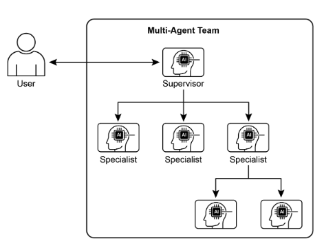
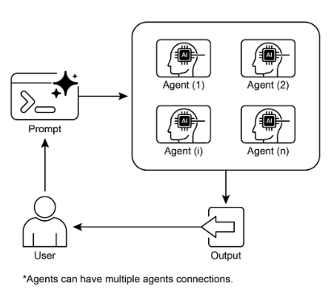

# 第 7 章：Multi-Agent Collaboration（多智能体协作）

虽然单一智能体架构对于明确定义的问题可能有效，但面对复杂的、多领域的任务时，其能力往往受到限制。多智能体协作（Multi-Agent Collaboration）模式通过将系统构建为不同、专业智能体的协作集合来解决这些限制。这种方法基于任务分解的原则，将高级目标分解为离散的子问题。然后将每个子问题分配给拥有最适合该任务的特定工具、数据访问或推理能力的智能体。

例如，复杂的研究查询可能被分解并分配给用于信息检索的研究智能体、用于统计处理的数据分析智能体以及用于生成最终报告的综合智能体。这种系统的有效性不仅源于劳动分工，而且关键依赖于智能体间通信的机制。这需要标准化的通信协议和共享本体，允许智能体交换数据、委派子任务并协调其行动以确保最终输出是一致的。

这种分布式架构提供了几个优势，包括增强的模块化、可扩展性和健壮性，因为单个智能体的故障不一定导致整个系统故障。协作允许产生协同效应，其中多智能体系统的集体性能超过集合内任何单个智能体的潜在能力。

## 多智能体协作模式概述

多智能体协作模式涉及设计多个独立或半独立的智能体协作以实现共同目标的系统。每个智能体通常具有定义的角色、与总体目标一致的特定目标，以及可能访问不同工具或知识库的能力。这种模式的力量在于这些智能体之间的交互和协同作用。

协作可以采取各种形式：

* **顺序交接：** 一个智能体完成任务并将其输出传递给另一个智能体以进行管道中的下一步（类似于规划模式，但明确涉及不同的智能体）。  
* **并行处理：** 多个智能体同时处理问题的不同部分，然后合并它们的结果。  
* **辩论和共识：** 多智能体协作，其中具有不同视角和信息来源的智能体参与讨论以评估选项，最终达成共识或更明智的决策。  
* **层次结构：** 管理器智能体可以根据其工具访问或插件能力动态地将任务委派给工作智能体并综合它们的结果。每个智能体还可以处理相关的工具组，而不是单个智能体处理所有工具。  
* **专家团队：** 在不同领域具有专业知识的智能体（例如，研究员、作家、编辑）协作产生复杂输出。

* **批评者-审查者：** 智能体创建初始输出，如计划、草稿或答案。第二组智能体然后对此输出进行关键评估，以检查其对政策、安全性、合规性、正确性、质量和组织目标的一致性。原始创建者或最终智能体基于此反馈修订输出。这种模式对于代码生成、研究写作、逻辑检查和确保伦理对齐特别有效。这种方法的好处包括增加的健壮性、改进的质量以及减少幻觉或错误的可能性。

多智能体系统（见图 1）基本上包括智能体角色和责任的划分、建立智能体交换信息的通信渠道，以及制定指导其协作努力的任务流或交互协议。



图 1：多智能体系统示例

像 Crew AI 和 Google ADK 这样的框架旨在通过提供用于指定智能体、任务及其交互过程的结构来促进这种范式。这种方法对于需要各种专业知识、包含多个离散阶段或利用并发处理和智能体间信息确证优势的挑战特别有效。

## 实际应用与用例

多智能体协作是一种强大的模式，适用于众多领域：

* **复杂研究和分析：** 智能体团队可以协作进行研究项目。一个智能体可能专门搜索学术数据库，另一个专门总结发现，第三个专门识别趋势，第四个专门将信息综合成报告。这反映了人类研究团队可能如何运作。  
* **软件开发：** 想象智能体协作构建软件。一个智能体可以是需求分析师，另一个是代码生成器，第三个是测试人员，第四个是文档编写者。它们可以在彼此之间传递输出以构建和验证组件。  
* **创意内容生成：** 创建营销活动可能涉及市场研究智能体、文案撰写智能体、图形设计智能体（使用图像生成工具）和社交媒体调度智能体，所有这些都一起工作。  
* **金融分析：** 多智能体系统可以分析金融市场。智能体可能专门用于获取股票数据、分析新闻情绪、执行技术分析并生成投资建议。  
* **客户支持升级：** 一线支持智能体可以处理初始查询，在需要时将复杂问题升级到专业智能体（例如，技术专家或计费专家），展示基于问题复杂性的顺序交接。  
* **供应链优化：** 智能体可以代表供应链中的不同节点（供应商、制造商、分销商）并协作优化库存水平、物流和调度以响应不断变化的需求或中断。  
* **网络分析与修复：** 自主操作从智能体架构中受益匪浅，特别是在故障定位方面。多个智能体可以协作分类和修复问题，建议最佳操作。这些智能体还可以与传统机器学习模型和工具集成，利用现有系统，同时提供生成式 AI 的优势。

划分专业智能体并精心编排它们相互关系的能力使开发者能够构建表现出增强模块化、可扩展性和解决复杂性的系统，这些复杂性对于单一、集成的智能体来说将是不可克服的。

## 多智能体协作：探索相互关系和通信结构

理解智能体交互和通信的复杂方式是设计有效的多智能体系统的基础。如图 2 所示，存在一系列相互关系和通信模型，从最简单的单智能体场景到复杂的、定制设计的协作框架。每个模型都呈现独特的优势和挑战，影响多智能体系统的整体效率、健壮性和适应性。

### 1. 单智能体

在最基本的级别，"单智能体"自主运行，不与其他实体直接交互或通信。虽然此模型易于实现和管理，但其能力本质上受到单个智能体的范围和资源的限制。它适用于可以分解为独立子问题的任务，每个子问题都可以由单个、自给自足的智能体解决。

### 2. 网络

"网络"模型代表了朝着协作的重要一步，其中多个智能体以分散的方式直接相互交互。通信通常以点对点方式进行，允许共享信息、资源甚至任务。此模型促进弹性，因为一个智能体的故障不一定使整个系统瘫痪。然而，管理通信开销并确保大型、非结构化网络中的连贯决策可能具有挑战性。

### 3. 监督者

在"监督者"模型中，专门的智能体"监督者"监督和协调一组下属智能体的活动。监督者充当通信、任务分配和冲突解决的中心枢纽。这种层次结构提供清晰的权限线，可以简化管理和控制。然而，它引入了单点故障（监督者），如果监督者被大量下属或复杂任务压垮，可能会成为瓶颈。

### 4. 作为工具的监督者

此模型是"监督者"概念的细微扩展，其中监督者的角色较少涉及直接命令和控制，而更多涉及为其他智能体提供资源、指导或分析支持。监督者可能提供工具、数据或计算服务，使其他智能体能够更有效地执行任务，而不一定控制它们的每个行动。这种方法旨在利用监督者的能力而不强加僵化的自上而下控制。

### 5. 层次化

"层次化"模型扩展了监督者概念，创建多层组织结构。这涉及多个级别的监督者，较高级别的监督者监督较低级别的监督者，最终，最低级别是一组操作智能体。此结构非常适合可以分解为子问题的复杂问题，每个子问题由层次结构的特定层管理。它为可扩展性和复杂性管理提供了结构化方法，允许在定义的边界内进行分布式决策。


图 2：智能体以各种方式通信和交互。

### 6. 自定义

"自定义"模型代表了多智能体系统设计中的最终灵活性。它允许创建精确针对给定问题或应用程序特定要求的独特相互关系和通信结构。这可能涉及结合先前提到的模型元素的混合方法，或从环境的独特约束和机会中出现的全新设计。自定义模型通常源于优化特定性能指标、处理高度动态环境或将领域特定知识纳入系统架构的需要。设计和实现自定义模型通常需要深入理解多智能体系统原则，并仔细考虑通信协议、协调机制和涌现行为。

总之，为多智能体系统选择相互关系和通信模型是一个关键的设计决策。每个模型都提供独特的优势和劣势，最佳选择取决于诸如任务的复杂性、智能体的数量、期望的自主级别、对健壮性的需求以及可接受的通信开销等因素。多智能体系统的未来进步可能会继续探索和完善这些模型，以及开发协作智能的新范式。

## 实践代码（Crew AI）

此 Python 代码使用 CrewAI 框架定义了一个 AI 驱动的团队，以生成关于 AI 趋势的博客文章。它首先设置环境，从 .env 文件加载 API 密钥。应用程序的核心涉及定义两个智能体：一个研究员用于查找和总结 AI 趋势，一个作家用于基于研究创建博客文章。

相应地定义了两个任务：一个用于研究趋势，另一个用于撰写博客文章，写作任务依赖于研究任务的输出。然后将这些智能体和任务组装到 Crew 中，指定顺序过程，其中任务按顺序执行。Crew 使用智能体、任务和语言模型（特别是"gemini-2.0-flash"模型）初始化。主函数使用 kickoff() 方法执行此团队，编排智能体之间的协作以产生期望的输出。最后，代码打印团队执行的最终结果，即生成的博客文章。

```python
import os
from dotenv import load_dotenv
from crewai import Agent, Task, Crew, Process
from langchain_google_genai import ChatGoogleGenerativeAI


def setup_environment():
    """Loads environment variables and checks for the required API key."""
    load_dotenv()
    if not os.getenv("GOOGLE_API_KEY"):
        raise ValueError("GOOGLE_API_KEY not found. Please set it in your .env file.")


def main():
    """
    Initializes and runs the AI crew for content creation using the latest Gemini model.
    """
    setup_environment()

    # Define the language model to use.
    # Updated to a model from the Gemini 2.0 series for better performance and features.
    # For cutting-edge (preview) capabilities, you could use "gemini-2.5-flash".
    llm = ChatGoogleGenerativeAI(model="gemini-2.0-flash")

    # Define Agents with specific roles and goals
    researcher = Agent(
        role='Senior Research Analyst',
        goal='Find and summarize the latest trends in AI.',
        backstory="You are an experienced research analyst with a knack for identifying key trends and synthesizing information.",
        verbose=True,
        allow_delegation=False,
    )

    writer = Agent(
        role='Technical Content Writer',
        goal='Write a clear and engaging blog post based on research findings.',
        backstory="You are a skilled writer who can translate complex technical topics into accessible content.",
        verbose=True,
        allow_delegation=False,
    )

    # Define Tasks for the agents
    research_task = Task(
        description="Research the top 3 emerging trends in Artificial Intelligence in 2024-2025. Focus on practical applications and potential impact.",
        expected_output="A detailed summary of the top 3 AI trends, including key points and sources.",
        agent=researcher,
    )

    writing_task = Task(
        description="Write a 500-word blog post based on the research findings. The post should be engaging and easy for a general audience to understand.",
        expected_output="A complete 500-word blog post about the latest AI trends.",
        agent=writer,
        context=[research_task],
    )

    # Create the Crew
    blog_creation_crew = Crew(
        agents=[researcher, writer],
        tasks=[research_task, writing_task],
        process=Process.sequential,
        llm=llm,
        verbose=2,  # Set verbosity for detailed crew execution logs
    )

    # Execute the Crew
    print("## Running the blog creation crew with Gemini 2.0 Flash... ##")
    try:
        result = blog_creation_crew.kickoff()
        print("\n------------------\n")
        print("## Crew Final Output ##")
        print(result)
    except Exception as e:
        print(f"\nAn unexpected error occurred: {e}")


if __name__ == "__main__":
    main()
```

我们现在将在 Google ADK 框架内深入研究更多示例，特别强调层次化、并行和顺序协调范式，以及将智能体实现为操作工具。

## 实践代码（Google ADK）

以下代码示例演示了在 Google ADK 内通过创建父子关系建立层次智能体结构。代码定义了两种类型的智能体：LlmAgent 和从 BaseAgent 派生的自定义 TaskExecutor 智能体。TaskExecutor 设计用于特定的、非 LLM 任务，在此示例中，它简单地产生一个"任务成功完成"事件。一个名为 greeter 的 LlmAgent 使用指定的模型和指令初始化，以充当友好的问候者。自定义 TaskExecutor 被实例化为 `task_doer`。创建一个名为 coordinator 的父 LlmAgent，也带有模型和指令。协调器的指令指导它将问候委派给 greeter，将任务执行委派给 `task_doer`。将 greeter 和 `task_doer` 作为子智能体添加到协调器，建立父子关系。然后代码断言此关系已正确设置。最后，它打印一条消息，指示智能体层次结构已成功创建。

```python
from typing import AsyncGenerator

from google.adk.agents import LlmAgent, BaseAgent
from google.adk.agents.invocation_context import InvocationContext
from google.adk.events import Event


# Correctly implement a custom agent by extending BaseAgent
class TaskExecutor(BaseAgent):
    """A specialized agent with custom, non-LLM behavior."""
    name: str = "TaskExecutor"
    description: str = "Executes a predefined task."

    async def _run_async_impl(self, context: InvocationContext) -> AsyncGenerator[Event, None]:
        """Custom implementation logic for the task."""
        # This is where your custom logic would go.
        # For this example, we'll just yield a simple event.
        yield Event(author=self.name, content="Task finished successfully.")


# Define individual agents with proper initialization
# LlmAgent requires a model to be specified.
greeter = LlmAgent(
    name="Greeter",
    model="gemini-2.0-flash-exp",
    instruction="You are a friendly greeter.",
)

# Instantiate our concrete custom agent
task_doer = TaskExecutor()

# Create a parent agent and assign its sub-agents
# The parent agent's description and instructions should guide its delegation logic.
coordinator = LlmAgent(
    name="Coordinator",
    model="gemini-2.0-flash-exp",
    description="A coordinator that can greet users and execute tasks.",
    instruction="When asked to greet, delegate to the Greeter. When asked to perform a task, delegate to the TaskExecutor.",
    sub_agents=[
        greeter,
        task_doer,
    ],
)

# The ADK framework automatically establishes the parent-child relationships.
# These assertions will pass if checked after initialization.
assert greeter.parent_agent == coordinator
assert task_doer.parent_agent == coordinator

print("Agent hierarchy created successfully.")
```

此代码摘录说明了在 Google ADK 框架内使用 LoopAgent 建立迭代工作流。代码定义了两个智能体：ConditionChecker 和 ProcessingStep。ConditionChecker 是一个自定义智能体，检查会话状态中的"status"值。如果"status"是"completed"，ConditionChecker 升级一个事件以停止循环。否则，它产生一个事件以继续循环。`ProcessingStep` 是使用"gemini-2.0-flash-exp"模型的 LlmAgent。其指令是执行任务，如果是最后一步，则将会话 `status` 设置为"completed"。创建一个名为 StatusPoller 的 LoopAgent。StatusPoller 配置有 `max_iterations=10`。StatusPoller 包括 ProcessingStep 和 ConditionChecker 的实例作为子智能体。LoopAgent 将顺序执行子智能体最多 10 次迭代，如果 ConditionChecker 发现状态是"completed"则停止。

```python
import asyncio
from typing import AsyncGenerator

from google.adk.agents import LoopAgent, LlmAgent, BaseAgent
from google.adk.events import Event, EventActions
from google.adk.agents.invocation_context import InvocationContext


# Best Practice: Define custom agents as complete, self-describing classes.
class ConditionChecker(BaseAgent):
    """A custom agent that checks for a 'completed' status in the session state."""
    name: str = "ConditionChecker"
    description: str = "Checks if a process is complete and signals the loop to stop."

    async def _run_async_impl(
        self, context: InvocationContext
    ) -> AsyncGenerator[Event, None]:
        """Checks state and yields an event to either continue or stop the loop."""
        status = context.session.state.get("status", "pending")
        is_done = status == "completed"

        if is_done:
            # Escalate to terminate the loop when the condition is met.
            yield Event(author=self.name, actions=EventActions(escalate=True))
        else:
            # Yield a simple event to continue the loop.
            yield Event(author=self.name, content="Condition not met, continuing loop.")


# Correction: The LlmAgent must have a model and clear instructions.
process_step = LlmAgent(
    name="ProcessingStep",
    model="gemini-2.0-flash-exp",
    instruction=(
        "You are a step in a longer process. Perform your task. "
        "If you are the final step, update session state by setting 'status' to 'completed'."
    ),
)


# The LoopAgent orchestrates the workflow.
poller = LoopAgent(
    name="StatusPoller",
    max_iterations=10,
    sub_agents=[
        process_step,
        ConditionChecker(),  # Instantiating the well-defined custom agent.
    ],
)

# This poller will now execute 'process_step'
# and then 'ConditionChecker' repeatedly until the status is 'completed'
# or 10 iterations have passed.
```

此代码摘录阐明了 Google ADK 内的 SequentialAgent 模式，设计用于构建线性工作流。此代码使用 google.adk.agents 库定义了一个顺序智能体管道。管道由两个智能体组成，step1 和 step2。step1 名为 `Step1_Fetch`，其输出将存储在会话状态中的键 `data` 下。step2 名为 `Step2_Process`，被指示分析存储在 `session.state["data"]` 中的信息并提供摘要。名为 "MyPipeline" 的 SequentialAgent 编排这些子智能体的执行。当使用初始输入运行管道时，step1 将首先执行。来自 step1 的响应将保存到会话状态中的键 "data" 下。随后，step2 将执行，利用 step1 根据其指令放入状态的信息。此结构允许构建工作流，其中一个智能体的输出成为下一个智能体的输入。这是创建多步 AI 或数据处理管道的常见模式。

```python
from google.adk.agents import SequentialAgent, Agent


# This agent's output will be saved to session.state["data"]
step1 = Agent(
    name="Step1_Fetch",
    output_key="data",
)

# This agent will use the data from the previous step.
# We instruct it on how to find and use this data.
step2 = Agent(
    name="Step2_Process",
    instruction="Analyze the information found in state['data'] and provide a summary.",
)

pipeline = SequentialAgent(
    name="MyPipeline",
    sub_agents=[step1, step2],
)

# When the pipeline is run with an initial input, Step1 will execute,
# its response will be stored in session.state["data"], and then
# Step2 will execute, using the information from the state as instructed.
```

以下代码示例说明了 Google ADK 内的 ParallelAgent 模式，它促进了多个智能体任务的并发执行。`data_gatherer` 设计为并发运行两个子智能体：`weather_fetcher` 和 `news_fetcher`。`weather_fetcher` 智能体被指示获取给定位置的天气并将结果存储在 `session.state["weather_data"]` 中。类似地，`news_fetcher` 智能体被指示检索给定主题的顶级新闻故事并将其存储在 `session.state["news_data"]` 中。每个子智能体都配置为使用 "gemini-2.0-flash-exp" 模型。ParallelAgent 编排这些子智能体的执行，允许它们并行工作。来自 `weather_fetcher` 和 `news_fetcher` 的结果将被收集并存储在会话状态中。最后，示例显示了如何在智能体执行完成后从 `final_state` 访问收集的天气和新闻数据。

```python
from google.adk.agents import Agent, ParallelAgent


# It's better to define the fetching logic as tools for the agents.
# For simplicity in this example, we'll embed the logic in the agent's instruction.
# In a real-world scenario, you would use tools.

# Define the individual agents that will run in parallel
weather_fetcher = Agent(
    name="weather_fetcher",
    model="gemini-2.0-flash-exp",
    instruction="Fetch the weather for the given location and return only the weather report.",
    output_key="weather_data",  # The result will be stored in session.state["weather_data"]
)

news_fetcher = Agent(
    name="news_fetcher",
    model="gemini-2.0-flash-exp",
    instruction="Fetch the top news story for the given topic and return only that story.",
    output_key="news_data",  # The result will be stored in session.state["news_data"]
)

# Create the ParallelAgent to orchestrate the sub-agents
data_gatherer = ParallelAgent(
    name="data_gatherer",
    sub_agents=[
        weather_fetcher,
        news_fetcher,
    ],
)
```

提供的代码段例示了 Google ADK 内的"智能体作为工具"范式，使智能体能够以类似于函数调用的方式利用另一个智能体的能力。具体来说，代码使用 Google 的 LlmAgent 和 AgentTool 类定义了一个图像生成系统。它由两个智能体组成：一个父 `artist_agent` 和一个子智能体 `image_generator_agent`。`generate_image` 函数是一个简单的工具，模拟图像创建，返回模拟图像数据。`image_generator_agent` 负责基于其接收的文本提示使用此工具。`artist_agent` 的角色是首先发明一个创意图像提示。然后它通过 AgentTool 包装器调用 `image_generator_agent`。AgentTool 充当桥梁，允许一个智能体将另一个智能体用作工具。当 `artist_agent` 调用 `image_tool` 时，AgentTool 使用艺术家的发明提示调用 `image_generator_agent`。然后 `image_generator_agent` 使用该提示的 `generate_image` 函数。最后，生成的图像（或模拟数据）通过智能体返回。此架构演示了分层智能体系统，其中更高级别的智能体编排较低级别的专业智能体来执行任务。

```python
from google.adk.agents import LlmAgent
from google.adk.tools import agent_tool
from google.genai import types


# 1. A simple function tool for the core capability.
# This follows the best practice of separating actions from reasoning.
def generate_image(prompt: str) -> dict:
    """
    Generates an image based on a textual prompt.

    Args:
        prompt: A detailed description of the image to generate.

    Returns:
        A dictionary with the status and the generated image bytes.
    """
    print(f"TOOL: Generating image for prompt: '{prompt}'")
    # In a real implementation, this would call an image generation API.
    # For this example, we return mock image data.
    mock_image_bytes = b"mock_image_data_for_a_cat_wearing_a_hat"
    return {
        "status": "success",
        # The tool returns the raw bytes, the agent will handle the Part creation.
        "image_bytes": mock_image_bytes,
        "mime_type": "image/png",
    }


# 2. Refactor the ImageGeneratorAgent into an LlmAgent.
# It now correctly uses the input passed to it.
image_generator_agent = LlmAgent(
    name="ImageGen",
    model="gemini-2.0-flash",
    description="Generates an image based on a detailed text prompt.",
    instruction=(
        "You are an image generation specialist. Your task is to take the user's request "
        "and use the `generate_image` tool to create the image. "
        "The user's entire request should be used as the 'prompt' argument for the tool. "
        "After the tool returns the image bytes, you MUST output the image."
    ),
    tools=[generate_image],
)


# 3. Wrap the corrected agent in an AgentTool.
# The description here is what the parent agent sees.
image_tool = agent_tool.AgentTool(
    agent=image_generator_agent,
    description="Use this tool to generate an image. The input should be a descriptive prompt of the desired image.",
)


# 4. The parent agent remains unchanged. Its logic was correct.
artist_agent = LlmAgent(
    name="Artist",
    model="gemini-2.0-flash",
    instruction=(
        "You are a creative artist. First, invent a creative and descriptive prompt for an image. "
        "Then, use the `ImageGen` tool to generate the image using your prompt."
    ),
    tools=[image_tool],
)
```

## 概览

**什么：** 复杂问题通常超出单个、基于 LLM 的智能体的能力。单一智能体可能缺乏多样化的、专业的技能或访问解决多方面任务所有部分所需的特定工具。这种限制创造了瓶颈，降低了系统的整体有效性和可扩展性。因此，处理复杂的、多领域目标变得低效，并可能导致不完整或次优的结果。

**为什么：** 多智能体协作模式通过创建多个协作智能体系统提供标准化解决方案。复杂问题被分解为更小、更易管理的子问题。然后将每个子问题分配给具有解决它所需的精确工具和能力的专业智能体。这些智能体通过定义的通信协议和交互模型（如顺序交接、并行工作流或层次委派）一起工作。这种智能体的、分布式的方法创造了协同效应，允许团队实现任何单个智能体都不可能实现的结果。

**经验法则：** 当任务对单个智能体来说太复杂并且可以分解为需要专业技能或工具的不同子任务时，使用此模式。它对于从多样化专业知识、并行处理或多阶段结构化工作流中受益的问题是理想的，例如复杂的研究和分析、软件开发或创意内容生成。

**可视化摘要：**



图 3：多智能体设计模式

## 关键要点

* 多智能体协作涉及多个智能体协作以实现共同目标。  
* 此模式利用专业角色、分布式任务和智能体间通信。  
* 协作可以采取顺序交接、并行处理、辩论或层次结构等形式。  
* 此模式对于需要多样化专业知识或多个不同阶段的复杂问题是理想的。

## 结论

本章探讨了多智能体协作模式，展示了在系统内编排多个专业智能体的好处。我们研究了各种协作模型，强调了该模式在解决跨不同领域的复杂、多方面问题中的重要作用。理解智能体协作自然地导致对其与外部环境交互的探究。

## 参考文献

1. Multi-Agent Collaboration Mechanisms: A Survey of LLMs, [https://arxiv.org/abs/2501.06322](https://arxiv.org/abs/2501.06322)
2. Multi-Agent System — The Power of Collaboration, [https://aravindakumar.medium.com/introducing-multi-agent-frameworks-the-power-of-collaboration-e9db31bba1b6](https://aravindakumar.medium.com/introducing-multi-agent-frameworks-the-power-of-collaboration-e9db31bba1b6)
