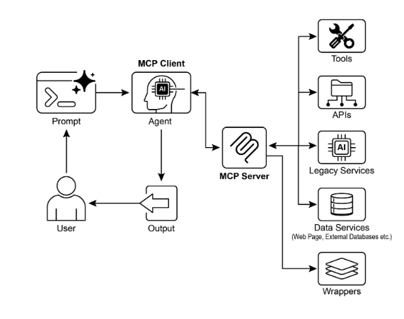

# 第 10 章：Model Context Protocol（模型上下文协议，MCP）

要使 LLM 作为智能体有效运行，它们的能力必须超越多模态生成。与外部环境的交互是必要的，包括访问当前数据、利用外部软件和执行特定的操作任务。模型上下文协议（Model Context Protocol，MCP）通过为 LLM 提供与外部资源接口的标准化接口来解决这一需求。此协议作为促进一致和可预测集成的关键机制。

## MCP 模式概述

想象一个通用适配器，允许任何 LLM 插入任何外部系统、数据库或工具，而无需为每个系统进行自定义集成。这本质上就是模型上下文协议（MCP）的作用。它是一个开放标准，旨在标准化像 Gemini、OpenAI 的 GPT 模型、Mixtral 和 Claude 这样的 LLM 如何与外部应用程序、数据源和工具通信。将其视为通用连接机制，简化了 LLM 获取上下文、执行行动和与各种系统交互的方式。

MCP 在客户端-服务器架构上运行。它定义了不同的元素——数据（称为资源）、交互模板（本质上是提示）和可操作的函数（称为工具）——如何由 MCP 服务器公开。然后由 MCP 客户端使用，该客户端可能是 LLM 主机应用程序或 AI 智能体本身。这种标准化方法极大地降低了将 LLM 集成到多样化操作环境中的复杂性。

然而，MCP 是"智能体接口"的合同，其有效性很大程度上取决于它公开的底层 API 的设计。存在开发者简单地包装预先存在的、遗留的 API 而不进行修改的风险，这可能对智能体来说不是最优的。例如，如果票务系统的 API 只允许一个一个地检索完整的票证详细信息，被要求总结高优先级票证的智能体在大量数据时将变得缓慢和不准确。要真正有效，底层 API 应该通过过滤和排序等确定性功能进行改进，以帮助非确定性智能体高效工作。这强调了智能体不会神奇地替代确定性工作流；它们通常需要更强的确定性支持才能成功。

此外，MCP 可以包装一个其输入或输出仍然不是智能体固有可理解的 API。只有当其数据格式是智能体友好的时，API 才有用，这是 MCP 本身不强制保证的。例如，为文档存储创建一个返回文件为 PDF 的 MCP 服务器在消费智能体无法解析 PDF 内容的情况下基本上是无用的。更好的方法是首先创建一个返回文档文本版本（如 Markdown）的 API，智能体实际上可以读取和处理它。这演示了开发者必须考虑的不仅是连接，还有被交换数据的性质，以确保真正的兼容性。

## MCP vs. 工具函数调用

模型上下文协议（MCP）和工具函数调用是使 LLM 能够与外部能力（包括工具）交互并执行行动的不同机制。虽然两者都用于将 LLM 能力扩展到文本生成之外，但它们在方法和抽象级别上有所不同。

工具函数调用可以被视为从 LLM 到特定、预定义工具或函数的直接请求。请注意，在此上下文中，我们互换使用"工具"和"函数"这两个词。此交互的特征是一对一通信模型，其中 LLM 基于其对需要外部行动的用户意图的理解格式化请求。然后应用程序代码执行此请求并将结果返回给 LLM。此过程通常是专有的，在不同的 LLM 提供商之间有所不同。

相比之下，模型上下文协议（MCP）作为 LLM 发现、通信和利用外部能力的标准化接口运行。它作为一个开放协议运行，促进与各种工具和系统的交互，旨在建立一个生态系统，其中任何兼容的工具都可以被任何兼容的 LLM 访问。这促进了不同系统和实现之间的互操作性、可组合性和可重用性。通过采用联邦模型，我们显著提高了互操作性并解锁了现有资产的价值。此策略允许我们通过简单地将它们包装在符合 MCP 的接口中，将不同的和遗留的服务带入现代生态系统。这些服务继续独立运行，但现在可以组合到新的应用程序和工作流中，它们的协作由 LLM 编排。这促进了敏捷性和可重用性，而无需对基础系统进行昂贵的重写。

以下是 MCP 和工具函数调用之间基本区别的细分：

| 特性 | 工具函数调用 | 模型上下文协议（MCP） |
| ----- | ----- | ----- |
| **标准化** | 专有且特定于供应商。格式和实现因 LLM 提供商而异。 | 开放的、标准化的协议，促进不同 LLM 和工具之间的互操作性。 |
| **范围** | LLM 请求执行特定、预定义函数的直接机制。 | LLM 和外部工具如何发现和相互通信的更广泛框架。 |
| **架构** | LLM 和应用程序的工具处理逻辑之间的一对一交互。 | 客户端-服务器架构，其中由 LLM 驱动的应用程序（客户端）可以连接并利用各种 MCP 服务器（工具）。 |
| **发现** | LLM 被明确告知在特定对话上下文中哪些工具可用。 | 启用可用工具的动态发现。MCP 客户端可以查询服务器以查看它提供哪些能力。 |
| **可重用性** | 工具集成通常与正在使用的特定应用程序和 LLM 紧密耦合。 | 促进开发可重用的、独立的"MCP 服务器"，可以被任何兼容的应用程序访问。 |

将工具函数调用视为给 AI 一组特定的定制工具，如特定的扳手和螺丝刀。这对于具有固定任务集的车间是高效的。另一方面，MCP（模型上下文协议）就像创建一个通用的、标准化的电源插座系统。它本身不提供工具，但它允许来自任何制造商的任何兼容工具插入并工作，使车间动态且不断扩展。

简而言之，函数调用提供对几个特定函数的直接访问，而 MCP 是标准化通信框架，允许 LLM 发现和使用广泛的外部资源。对于具有固定和有限数量的预定义函数的简单应用程序，直接工具函数调用可能就足够了；对于需要适应的复杂、互连的 AI 系统，像 MCP 这样的通用标准是必不可少的。

## MCP 的其他考虑因素

虽然 MCP 呈现了一个强大的框架，但彻底评估需要考虑几个影响其对给定用例适用性的关键方面。让我们更详细地查看一些方面：

* **工具 vs. 资源 vs. 提示：** 理解这些组件的特定角色很重要。资源是静态数据（例如，PDF 文件、数据库记录）。工具是执行操作的可执行函数（例如，发送电子邮件、查询 API）。提示是指导 LLM 如何与资源或工具交互的模板，确保交互是结构化和有效的。  
* **可发现性：** MCP 的一个关键优势是 MCP 客户端可以动态查询服务器以了解它提供哪些工具和资源。这种"即时"发现机制对于需要适应新能力而无需重新部署的智能体是强大的。  
* **安全性：** 通过任何协议公开工具和数据需要强大的安全措施。MCP 实现必须包括身份验证和授权，以控制哪些客户端可以访问哪些服务器以及它们被允许执行哪些特定操作。  
* **实现：** 虽然 MCP 是一个开放标准，但其实现可能很复杂。然而，提供商正在开始简化此过程。例如，像 Anthropic 或 FastMCP 这样的模型提供商提供 SDK，抽象了大部分样板代码，使开发者更容易创建和连接 MCP 客户端和服务器。  
* **错误处理：** 全面的错误处理策略至关重要。协议必须定义如何将错误（例如，工具执行失败、服务器不可用、无效请求）传达回 LLM，以便它能够理解失败并可能尝试替代方法。  
* **本地 vs. 远程服务器：** MCP 服务器可以本地部署在智能体所在的同一台机器上，也可以远程部署在不同的服务器上。可以选择本地服务器以提高速度和敏感数据的安全性，而远程服务器架构允许在组织内共享、可扩展地访问公共工具。  
* **按需 vs. 批处理：** MCP 可以支持按需、交互式会话和更大规模的批处理。选择取决于应用程序，从需要立即工具访问的实时对话智能体到批处理记录的数据分析管道。  
* **传输机制：** 协议还定义了用于通信的底层传输层。对于本地交互，它使用通过 STDIO（标准输入/输出）的 JSON-RPC 进行高效的进程间通信。对于远程连接，它利用网络友好的协议（如可流式传输的 HTTP 和服务器发送事件（SSE））来实现持久和高效的客户端-服务器通信。

模型上下文协议使用客户端-服务器模型来标准化信息流。理解组件交互是 MCP 高级智能体行为的关键：

1. **大型语言模型（LLM）：** 核心智能。它处理用户请求、制定计划，并决定何时需要访问外部信息或执行操作。  
2. **MCP 客户端：** 这是围绕 LLM 的应用程序或包装器。它充当中介，将 LLM 的意图转换为符合 MCP 标准的正式请求。它负责发现、连接到 MCP 服务器并与其通信。  
3. **MCP 服务器：** 这是通往外部世界的网关。它向任何授权的 MCP 客户端公开一组工具、资源和提示。每个服务器通常负责特定领域，例如连接到公司的内部数据库、电子邮件服务或公共 API。  
4. **可选的第三方（3P）服务：** 这代表 MCP 服务器管理和公开的实际外部工具、应用程序或数据源。它是执行请求操作的最终端点，例如查询专有数据库、与 SaaS 平台交互或调用公共天气 API。

交互流程如下：

1. **发现：** MCP 客户端代表 LLM 查询 MCP 服务器以询问它提供哪些能力。服务器响应一个清单，列出其可用工具（例如，send_email）、资源（例如，customer_database）和提示。  
2. **请求制定：** LLM 确定需要使用已发现的工具之一。例如，它决定发送电子邮件。它制定请求，指定要使用的工具（send_email）和必要的参数（收件人、主题、正文）。  
3. **客户端通信：** MCP 客户端接受 LLM 制定的请求，并将其作为标准化调用发送到适当的 MCP 服务器。  
4. **服务器执行：** MCP 服务器接收请求。它验证客户端、验证请求，然后通过与底层软件接口（例如，调用电子邮件 API 的 send() 函数）执行指定的操作。  
5. **响应和上下文更新：** 执行后，MCP 服务器将标准化响应发送回 MCP 客户端。此响应指示操作是否成功，并包括任何相关输出（例如，已发送电子邮件的确认 ID）。然后客户端将此结果传递回 LLM，更新其上下文并使其能够继续执行任务的下一步。

## 实际应用与用例

MCP 显著扩展了 AI/LLM 能力，使它们更加通用和强大。以下是九个关键用例：

* **数据库集成：** MCP 允许 LLM 和智能体无缝访问和交互数据库中的结构化数据。例如，使用 MCP 数据库工具箱，智能体可以查询 Google BigQuery 数据集以检索实时信息、生成报告或更新记录，所有这些都由自然语言命令驱动。  
* **生成式媒体编排：** MCP 使智能体能够与高级生成式媒体服务集成。通过 MCP 生成媒体服务工具，智能体可以编排涉及 Google 的 Imagen 进行图像生成、Google 的 Veo 进行视频创建、Google 的 Chirp 3 HD 生成逼真声音或 Google 的 Lyria 进行音乐创作的工作流，允许在 AI 应用程序中进行动态内容创建。  
* **外部 API 交互：** MCP 为 LLM 提供调用和接收来自任何外部 API 的响应的标准化方式。这意味着智能体可以获取实时天气数据、拉取股价、发送电子邮件或与 CRM 系统交互，将其能力扩展到其核心语言模型之外。  
* **基于推理的信息提取：** 利用 LLM 的强大推理技能，MCP 促进有效的、依赖于查询的信息提取，超越了传统的搜索和检索系统。与返回整个文档的传统搜索工具不同，智能体可以分析文本并提取直接回答用户复杂问题的精确条款、数字或陈述。  
* **自定义工具开发：** 开发者可以构建自定义工具并通过 MCP 服务器公开它们（例如，使用 FastMCP）。这允许将专业内部函数或专有系统以标准化、易于使用的格式提供给 LLM 和其他智能体，而无需直接修改 LLM。  
* **标准化 LLM 到应用程序的通信：** MCP 确保 LLM 和它们交互的应用程序之间的一致通信层。这减少了集成开销，促进了不同 LLM 提供商和主机应用程序之间的互操作性，并简化了复杂智能体系统的开发。  
* **复杂工作流编排：** 通过组合各种 MCP 公开的工具和数据源，智能体可以编排高度复杂的多步工作流。例如，智能体可以从数据库检索客户数据、生成个性化营销图像、起草定制电子邮件，然后发送它，所有这些都通过与不同的 MCP 服务交互来完成。  
* **IoT 设备控制：** MCP 可以促进 LLM 与物联网（IoT）设备的交互。智能体可以使用 MCP 向智能家居设备、工业传感器或机器人发送命令，实现物理系统的自然语言控制和自动化。  
* **金融服务自动化：** 在金融服务中，MCP 可以使 LLM 与各种金融数据源、交易平台或合规系统交互。智能体可以分析市场数据、执行交易、生成个性化财务建议或自动化监管报告，同时保持安全和标准化的通信。

简而言之，模型上下文协议（MCP）使智能体能够从数据库、API 和网络资源访问实时信息。它还允许智能体通过集成和处理来自各种来源的数据来执行操作，如发送电子邮件、更新记录、控制设备和执行复杂任务。此外，MCP 支持 AI 应用程序的媒体生成工具。

## 使用 ADK 的实践代码示例

本节概述了如何连接到提供文件系统操作的本地 MCP 服务器，使 ADK 智能体能够与本地文件系统交互。

### 使用 MCPToolset 的智能体设置

要配置用于文件系统交互的智能体，必须创建 `agent.py` 文件（例如，在 `./adk_agent_samples/mcp_agent/agent.py`）。`MCPToolset` 在 `LlmAgent` 对象的 `tools` 列表内实例化。至关重要的是，将 `args` 列表中的 `"/path/to/your/folder"` 替换为 MCP 服务器可以访问的本地系统上的目录的绝对路径。此目录将是智能体执行的文件系统操作的根目录。

```python
import os

from google.adk.agents import LlmAgent
from google.adk.tools.mcp_tool.mcp_toolset import MCPToolset, StdioServerParameters


# Create a reliable absolute path to a folder named 'mcp_managed_files'
# within the same directory as this agent script.
# This ensures the agent works out-of-the-box for demonstration.
# For production, you would point this to a more persistent and secure location.
TARGET_FOLDER_PATH = os.path.join(
    os.path.dirname(os.path.abspath(__file__)),
    "mcp_managed_files",
)

# Ensure the target directory exists before the agent needs it.
os.makedirs(TARGET_FOLDER_PATH, exist_ok=True)

root_agent = LlmAgent(
    model="gemini-2.0-flash",
    name="filesystem_assistant_agent",
    instruction=(
        "Help the user manage their files. You can list files, read files, and write files. "
        f"You are operating in the following directory: {TARGET_FOLDER_PATH}"
    ),
    tools=[
        MCPToolset(
            connection_params=StdioServerParameters(
                command="npx",
                args=[
                    "-y",  # Argument for npx to auto-confirm install
                    "@modelcontextprotocol/server-filesystem",
                    # This MUST be an absolute path to a folder.
                    TARGET_FOLDER_PATH,
                ],
            ),
            # Optional: You can filter which tools from the MCP server are exposed.
            # For example, to only allow reading:
            # tool_filter=['list_directory', 'read_file']
        )
    ],
)
```

`npx`（Node Package Execute），与 npm（Node Package Manager）5.2.0 及更高版本捆绑，是一个实用程序，使能够直接从 npm 注册表执行 Node.js 包。这消除了全局安装的需要。本质上，`npx` 用作 npm 包运行器，它通常用于运行许多社区 MCP 服务器，这些服务器作为 Node.js 包分发。

创建 `__init__.py` 文件是必要的，以确保 agent.py 文件被识别为 Agent Development Kit (ADK) 的可发现 Python 包的一部分。此文件应位于与 [agent.py](http://agent.py) 相同的目录中。

```python
# ./adk_agent_samples/mcp_agent/__init__.py 
from . import agent
```

当然，还有其他支持的命令可供使用。例如，可以通过以下方式连接到 python3：

```python
connection_params = StdioConnectionParams(
    server_params={
        "command": "python3",
        "args": ["./agent/mcp_server.py"],
        "env": {
            "SERVICE_ACCOUNT_PATH": SERVICE_ACCOUNT_PATH,
            "DRIVE_FOLDER_ID": DRIVE_FOLDER_ID,
        },
    }
)
```

UVX，在 Python 的上下文中，指的是使用 uv 在临时的、隔离的 Python 环境中执行命令的命令行工具。本质上，它允许您运行 Python 工具和包，而无需在全局或项目环境中安装它们。您可以通过 MCP 服务器运行它。

```python
connection_params = StdioConnectionParams(
    server_params={
        "command": "uvx",
        "args": ["mcp-google-sheets@latest"],
        "env": {
            "SERVICE_ACCOUNT_PATH": SERVICE_ACCOUNT_PATH,
            "DRIVE_FOLDER_ID": DRIVE_FOLDER_ID,
        },
    }
)
```

一旦 MCP 服务器被创建，下一步就是连接到它。

## 将 MCP 服务器与 ADK Web 连接

首先，执行 'adk web'。在您的终端中导航到 mcp_agent 的父目录（例如，adk_agent_samples）并运行：

```python
cd ./adk_agent_samples # Or your equivalent parent directory 
adk web
```

一旦 ADK Web UI 在您的浏览器中加载，从智能体菜单中选择 `filesystem_assistant_agent`。接下来，尝试使用如下提示：

* "显示此文件夹的内容。"  
* "读取 `sample.txt` 文件。"（这假设 `sample.txt` 位于 `TARGET_FOLDER_PATH`。）  
* "`another_file.md` 中有什么？"

## 使用 FastMCP 创建 MCP 服务器

FastMCP 是一个高级 Python 框架，旨在简化 MCP 服务器的开发。它提供了一个抽象层，简化了协议复杂性，允许开发者专注于核心逻辑。

该库使能够使用简单的 Python 装饰器快速定义工具、资源和提示。一个显著优势是其自动模式生成，它智能地解释 Python 函数签名、类型提示和文档字符串以构建必要的 AI 模型接口规范。此自动化最小化手动配置并减少人为错误。

除了基本工具创建之外，FastMCP 还促进高级架构模式，如服务器组合和代理。这使能够开发复杂的、多组件的模块化系统，并将现有服务无缝集成到 AI 可访问的框架中。此外，FastMCP 包括针对高效、分布式和可扩展的 AI 驱动应用程序的优化。

## 使用 FastMCP 的服务器设置

## 为了说明，考虑服务器提供的基本"问候"工具。ADK 智能体和其他 MCP 客户端可以在其激活后使用 HTTP 与此工具交互

```python
# fastmcp_server.py
# This script demonstrates how to create a simple MCP server using FastMCP.
# It exposes a single tool that generates a greeting.
# 1. Make sure you have FastMCP installed:
# pip install fastmcp

from fastmcp import FastMCP, Client


# Initialize the FastMCP server.
mcp_server = FastMCP()


# Define a simple tool function.
# The `@mcp_server.tool` decorator registers this Python function as an MCP tool.
# The docstring becomes the tool's description for the LLM.
@mcp_server.tool
def greet(name: str) -> str:
    """
    Generates a personalized greeting.

    Args:
        name: The name of the person to greet.

    Returns:
        A greeting string.
    """
    return f"Hello, {name}! Nice to meet you."


# Or if you want to run it from the script:
if __name__ == "__main__":
    mcp_server.run(
        transport="http",
        host="127.0.0.1",
        port=8000,
    )
```

此 Python 脚本定义了一个名为 greet 的函数，它接受一个人的名字并返回个性化问候。此函数上方的 @tool() 装饰器自动将其注册为 AI 或其他程序可以使用的工具。函数的文档字符串和类型提示由 FastMCP 用于告诉智能体工具如何工作、它需要什么输入以及它将返回什么。

当脚本执行时，它启动 FastMCP 服务器，该服务器在 localhost:8000 上监听请求。这使 greet 函数可作为网络服务使用。然后可以将智能体配置为连接到此服务器并使用 greet 工具生成问候，作为更大任务的一部分。服务器持续运行，直到手动停止。

## 使用 ADK 智能体消费 FastMCP 服务器

可以将 ADK 智能体设置为 MCP 客户端以使用正在运行的 FastMCP 服务器。这需要配置 HttpServerParameters 与 FastMCP 服务器的网络地址，通常是 <http://localhost:8000>。

可以包含 `tool_filter` 参数以将智能体的工具使用限制为服务器提供的特定工具，如 'greet'。当提示像"问候 John Doe"这样的请求时，智能体的嵌入式 LLM 识别通过 MCP 可用的 'greet' 工具，使用参数"John Doe"调用它，并返回服务器的响应。此过程演示了通过 MCP 公开的用户定义工具与 ADK 智能体的集成。

要建立此配置，需要一个智能体文件（例如，位于 ./adk_agent_samples/fastmcp_client_agent/ 的 agent.py）。此文件将实例化 ADK 智能体并使用 HttpServerParameters 与正在运行的 FastMCP 服务器建立连接。

```python
# ./adk_agent_samples/fastmcp_client_agent/agent.py
import os

from google.adk.agents import LlmAgent
from google.adk.tools.mcp_tool.mcp_toolset import MCPToolset, HttpServerParameters


# Define the FastMCP server's address.
# Make sure your fastmcp_server.py (defined previously) is running on this port.
FASTMCP_SERVER_URL = "http://localhost:8000"

root_agent = LlmAgent(
    model="gemini-2.0-flash",  # Or your preferred model
    name="fastmcp_greeter_agent",
    instruction='You are a friendly assistant that can greet people by their name. Use the "greet" tool.',
    tools=[
        MCPToolset(
            connection_params=HttpServerParameters(
                url=FASTMCP_SERVER_URL,
            ),
            # Optional: Filter which tools from the MCP server are exposed
            # For this example, we're expecting only 'greet'
            tool_filter=["greet"],
        )
    ],
)
```

该脚本定义了一个名为 `fastmcp_greeter_agent` 的智能体，它使用 Gemini 语言模型。它被赋予特定的指令，作为友好助手，其目的是问候人们。关键的是，代码为此智能体配备了执行其任务的工具。它配置了一个 MCPToolset 以连接到在 localhost:8000 上运行的单独服务器，该服务器预期是来自先前示例的 FastMCP 服务器。智能体被特别授予访问托管在该服务器上的 greet 工具。本质上，此代码设置了系统的客户端，创建了一个理解其目标是问候人们并确切知道使用哪个外部工具来完成它的智能智能体。

在 `fastmcp_client_agent` 目录内创建 `__init__.py` 文件是必要的。这确保智能体被识别为 ADK 的可发现 Python 包。

首先，打开一个新终端并运行 `python fastmcp_server.py` 以启动 FastMCP 服务器。接下来，转到终端中 `fastmcp_client_agent` 的父目录（例如，`adk_agent_samples`）并执行 `adk web`。一旦 ADK Web UI 在您的浏览器中加载，从智能体菜单中选择 `fastmcp_greeter_agent`。然后，您可以通过输入像"问候 John Doe"这样的提示来测试它。智能体将使用您 FastMCP 服务器上的 `greet` 工具创建响应。

## 概览

**什么：** 要作为有效的智能体运行，LLM 必须超越简单的文本生成。它们需要与外部环境交互以访问当前数据并利用外部软件的能力。没有标准化的通信方法，LLM 和外部工具或数据源之间的每次集成都成为自定义、复杂且不可重用的工作。这种临时方法阻碍了可扩展性，并使构建复杂的、互连的 AI 系统变得困难且低效。

**为什么：** 模型上下文协议（MCP）通过充当 LLM 和外部系统之间的通用接口来提供标准化解决方案。它建立了一个开放的、标准化的协议，定义了如何发现和使用外部能力。在客户端-服务器模型上运行，MCP 允许服务器向任何兼容的客户端公开工具、数据资源和交互提示。由 LLM 驱动的应用程序充当这些客户端，以可预测的方式动态发现和交互可用资源。这种标准化方法促进了一个互操作和可重用组件的生态系统，极大地简化了复杂智能体工作流的开发。

**经验法则：** 在构建需要与多样化和演进的外部工具、数据源和 API 集交互的复杂、可扩展或企业级智能体系统时，使用模型上下文协议（MCP）。当不同 LLM 和工具之间的互操作性是优先考虑时，以及当智能体需要动态发现新能力而无需重新部署的能力时，它是理想的。对于具有固定和有限数量的预定义函数的简单应用程序，直接工具函数调用可能就足够了。

**可视化摘要：**



图 1：模型上下文协议

## 关键要点

以下是一些关键要点：

* 模型上下文协议（MCP）是一个开放标准，促进 LLM 和外部应用程序、数据源和工具之间的标准化通信。  
* 它采用客户端-服务器架构，定义了公开和使用资源、提示和工具的方法。  
* Agent Development Kit (ADK) 支持利用现有 MCP 服务器和通过 MCP 服务器公开 ADK 工具。  
* FastMCP 简化了 MCP 服务器的开发和管理，特别是对于公开用 Python 实现的工具。  
* MCP 生成媒体服务工具允许智能体与 Google Cloud 的生成式媒体能力（Imagen、Veo、Chirp 3 HD、Lyria）集成。  
* MCP 使 LLM 和智能体能够与现实世界系统交互、访问动态信息并执行超越文本生成的操作。

## 结论

模型上下文协议（MCP）是一个开放标准，促进大型语言模型（LLM）和外部系统之间的通信。它采用客户端-服务器架构，使 LLM 能够访问资源、利用提示并通过标准化工具执行操作。MCP 允许 LLM 与数据库交互、管理生成式媒体工作流、控制 IoT 设备并自动化金融服务。实际示例演示了设置智能体与 MCP 服务器（包括文件系统服务器和使用 FastMCP 构建的服务器）通信，说明了它与 Agent Development Kit (ADK) 的集成。MCP 是开发超越基本语言能力的交互式 AI 智能体的关键组件。

## 参考文献

1. Model Context Protocol (MCP) Documentation. (Latest). *Model Context Protocol (MCP)*. [https://google.github.io/adk-docs/mcp/](https://google.github.io/adk-docs/mcp/)  
2. FastMCP Documentation. FastMCP. [https://github.com/jlowin/fastmcp](https://github.com/jlowin/fastmcp)  
3. MCP Tools for Genmedia Services. *MCP Tools for Genmedia Services*. [https://google.github.io/adk-docs/mcp/\#mcp-servers-for-google-cloud-genmedia](https://google.github.io/adk-docs/mcp/#mcp-servers-for-google-cloud-genmedia)  
4. MCP Toolbox for Databases Documentation. (Latest). *MCP Toolbox for Databases*. [https://google.github.io/adk-docs/mcp/databases/](https://google.github.io/adk-docs/mcp/databases/)
