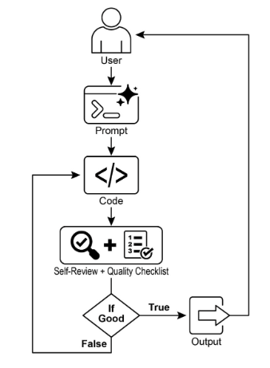
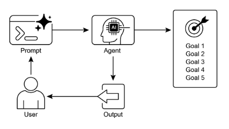

# 第 11 章：Goal Setting and Monitoring（目标设置和监控）

对于 AI 智能体来说，要真正有效和有目的，它们需要的不仅仅是处理信息或使用工具的能力；它们需要明确的方向感和知道是否真正成功的方法。这就是目标设置和监控（Goal Setting and Monitoring）模式发挥作用的地方。它是关于为智能体提供要实现的特定目标，并为其配备跟踪其进度和确定是否已实现这些目标的方法。

## 目标设置和监控模式概述

想想规划一次旅行。您不会只是自发地出现在目的地。您决定要去哪里（目标状态），确定从哪里开始（初始状态），考虑可用选项（交通、路线、预算），然后规划一系列步骤：预订票、打包行李、前往机场/车站、登机、到达、找住宿等。这个逐步过程，通常考虑依赖关系和约束，从根本上来说就是我们在智能体系统中所谓的规划。

在 AI 智能体的上下文中，规划通常涉及智能体接受高级目标并自主或半自主地生成一系列中间步骤或子目标。然后可以顺序执行这些步骤或在更复杂的流程中执行，可能涉及其他模式，如工具使用、路由或多智能体协作。规划机制可能涉及复杂的搜索算法、逻辑推理，或越来越多地利用大型语言模型（LLM）的能力，基于其训练数据和对任务的理解生成合理且有效的计划。

良好的规划能力使智能体能够处理不是简单的单步查询的问题。它使它们能够处理多方面的请求，通过重新规划适应变化的情况，并编排复杂的工作流。这是一个基础模式，支撑着许多高级智能体行为，将简单的反应系统转变为可以主动朝着定义的目标工作的系统。

## 实际应用与用例

目标设置和监控模式对于构建能够在复杂的、现实世界的场景中自主和可靠运行的智能体至关重要。以下是一些实际应用：

* **客户支持自动化：** 智能体的目标可能是"解决客户的计费询问"。它监控对话、检查数据库条目，并使用工具调整计费。通过确认计费更改和收到积极的客户反馈来监控成功。如果问题未解决，它会升级。  
* **个性化学习系统：** 学习智能体的目标可能是"提高学生对代数的理解"。它监控学生在练习中的进度、调整教学材料，并跟踪准确性和完成时间等性能指标，如果学生遇到困难，则调整其方法。  
* **项目管理助手：** 智能体可能被要求"确保项目里程碑 X 在 Y 日期之前完成"。它监控任务状态、团队通信和资源可用性，标记延迟并在目标处于风险时建议纠正措施。  
* **自动化交易机器人：** 交易智能体的目标可能是"在风险承受能力范围内最大化投资组合收益"。它持续监控市场数据、当前投资组合价值和风险指标，当条件与其目标一致时执行交易，如果风险阈值被突破，则调整策略。  
* **机器人和自动驾驶车辆：** 自动驾驶车辆的主要目标是"安全地将乘客从 A 运输到 B"。它不断监控其环境（其他车辆、行人、交通信号）、自身状态（速度、燃料）以及沿计划路线的进度，调整其驾驶行为以安全高效地实现目标。  
* **内容审核：** 智能体的目标可能是"识别并删除平台 X 上的有害内容"。它监控传入内容、应用分类模型，并跟踪误报/漏报等指标，调整其过滤标准或将模糊案例升级给人工审查员。

此模式对于需要可靠运行、实现特定结果并适应动态条件的智能体至关重要，为智能自我管理提供了必要的框架。

## 实践代码示例

为了说明目标设置和监控模式，我们有一个使用 LangChain 和 OpenAI API 的示例。此 Python 脚本概述了一个设计用于生成和改进 Python 代码的自主 AI 智能体。其核心功能是为指定问题生成解决方案，确保遵守用户定义的质量基准。

它采用"目标设置和监控"模式，不仅仅生成一次代码，而是进入创建、自我评估和改进的迭代循环。智能体的成功由其自己的 AI 驱动判断来衡量，即生成的代码是否成功满足初始目标。最终输出是一个精炼的、注释的、可立即使用的 Python 文件，代表了此改进过程的顶峰。

 **依赖项**：

```python
pip install langchain_openai openai python-dotenv .env file with key in OPENAI_API_KEY
```

您可以通过想象一个被分配到项目的自主 AI 程序员来最好地理解此脚本（见图 1）。当您向 AI 提供详细的项目简介时，过程开始，这是它需要解决的特定编码问题。

```python
# MIT License
# Copyright (c) 2025 Mahtab Syed
# https://www.linkedin.com/in/mahtabsyed/

"""
Hands-On Code Example - Iteration 2
-  To illustrate the Goal Setting and Monitoring pattern, we have an example using LangChain and OpenAI APIs:

Objective: Build an AI Agent which can write code for a specified use case based on specified goals:
-  Accepts a coding problem (use case) in code or can be as input.
-  Accepts a list of goals (e.g., "simple", "tested", "handles edge cases")  in code or can be input.
-  Uses an LLM (like GPT-4o) to generate and refine Python code until the goals are met. (I am using max 5 iterations, this could be based on a set goal as well)
-  To check if we have met our goals I am asking the LLM to judge this and answer just True or False which makes it easier to stop the iterations.
-  Saves the final code in a .py file with a clean filename and a header comment.
"""

import os
import random
import re
from pathlib import Path

from langchain_openai import ChatOpenAI
from dotenv import load_dotenv, find_dotenv


# 🔐 Load environment variables
_ = load_dotenv(find_dotenv())
OPENAI_API_KEY = os.getenv("OPENAI_API_KEY")
if not OPENAI_API_KEY:
    raise EnvironmentError("❌ Please set the OPENAI_API_KEY environment variable.")

# ✅ Initialize OpenAI model
print("📡 Initializing OpenAI LLM (gpt-4o)...")
llm = ChatOpenAI(
    model="gpt-4o",  # If you dont have access to got-4o use other OpenAI LLMs
    temperature=0.3,
    openai_api_key=OPENAI_API_KEY,
)


# --- Utility Functions ---
def generate_prompt(
    use_case: str, goals: list[str], previous_code: str = "", feedback: str = ""
) -> str:
    print("📝 Constructing prompt for code generation...")
    base_prompt = f"""
You are an AI coding agent. Your job is to write Python code based on the following use case:

Use Case: {use_case}

Your goals are:
{chr(10).join(f"- {g.strip()}" for g in goals)}
"""
    if previous_code:
        print("🔄 Adding previous code to the prompt for refinement.")
        base_prompt += f"\nPreviously generated code:\n{previous_code}"
    if feedback:
        print("📋 Including feedback for revision.")
        base_prompt += f"\nFeedback on previous version:\n{feedback}\n"

    base_prompt += "\nPlease return only the revised Python code. Do not include comments or explanations outside the code."
    return base_prompt


def get_code_feedback(code: str, goals: list[str]) -> str:
    print("🔍 Evaluating code against the goals...")
    feedback_prompt = f"""
You are a Python code reviewer. A code snippet is shown below. Based on the following goals:

{chr(10).join(f"- {g.strip()}" for g in goals)}

Please critique this code and identify if the goals are met. Mention if improvements are needed for clarity, simplicity, correctness, edge case handling, or test coverage.

Code:
{code}
"""
    return llm.invoke(feedback_prompt)


def goals_met(feedback_text: str, goals: list[str]) -> bool:
    """
    Uses the LLM to evaluate whether the goals have been met based on the feedback text.
    Returns True or False (parsed from LLM output).
    """
    review_prompt = f"""
You are an AI reviewer.

Here are the goals:
{chr(10).join(f"- {g.strip()}" for g in goals)}

Here is the feedback on the code:
\"\"\"
{feedback_text}
\"\"\"

Based on the feedback above, have the goals been met?

Respond with only one word: True or False.
"""
    response = llm.invoke(review_prompt).content.strip().lower()
    return response == "true"


def clean_code_block(code: str) -> str:
    lines = code.strip().splitlines()
    if lines and lines[0].strip().startswith("```"):
        lines = lines[1:]
    if lines and lines[-1].strip() == "```":
        lines = lines[:-1]
    return "\n".join(lines).strip()


def add_comment_header(code: str, use_case: str) -> str:
    comment = f"# This Python program implements the following use case:\n# {use_case.strip()}\n"
    return comment + "\n" + code


def to_snake_case(text: str) -> str:
    text = re.sub(r"[^a-zA-Z0-9 ]", "", text)
    return re.sub(r"\s+", "_", text.strip().lower())


def save_code_to_file(code: str, use_case: str) -> str:
    print("💾 Saving final code to file...")

    summary_prompt = (
        f"Summarize the following use case into a single lowercase word or phrase, "
        f"no more than 10 characters, suitable for a Python filename:\n\n{use_case}"
    )
    raw_summary = llm.invoke(summary_prompt).content.strip()
    short_name = re.sub(r"[^a-zA-Z0-9_]", "", raw_summary.replace(" ", "_").lower())[:10]

    random_suffix = str(random.randint(1000, 9999))
    filename = f"{short_name}_{random_suffix}.py"
    filepath = Path.cwd() / filename

    with open(filepath, "w") as f:
        f.write(code)

    print(f"✅ Code saved to: {filepath}")
    return str(filepath)


# --- Main Agent Function ---
def run_code_agent(use_case: str, goals_input: str, max_iterations: int = 5) -> str:
    goals = [g.strip() for g in goals_input.split(",")]

    print(f"\n🎯 Use Case: {use_case}")
    print("🎯 Goals:")
    for g in goals:
        print(f"  - {g}")

    previous_code = ""
    feedback = ""

    for i in range(max_iterations):
        print(f"\n=== 🔁 Iteration {i + 1} of {max_iterations} ===")
        prompt = generate_prompt(
            use_case,
            goals,
            previous_code,
            feedback if isinstance(feedback, str) else feedback.content,
        )

        print("🚧 Generating code...")
        code_response = llm.invoke(prompt)
        raw_code = code_response.content.strip()
        code = clean_code_block(raw_code)
        print("\n🧾 Generated Code:\n" + "-" * 50 + f"\n{code}\n" + "-" * 50)

        print("\n📤 Submitting code for feedback review...")
        feedback = get_code_feedback(code, goals)
        feedback_text = feedback.content.strip()
        print("\n📥 Feedback Received:\n" + "-" * 50 + f"\n{feedback_text}\n" + "-" * 50)

        if goals_met(feedback_text, goals):
            print("✅ LLM confirms goals are met. Stopping iteration.")
            break

        print("🛠️ Goals not fully met. Preparing for next iteration...")
        previous_code = code

    final_code = add_comment_header(code, use_case)
    return save_code_to_file(final_code, use_case)


# --- CLI Test Run ---
if __name__ == "__main__":
    print("\n🧠 Welcome to the AI Code Generation Agent")

    # Example 1
    use_case_input = "Write code to find BinaryGap of a given positive integer"
    goals_input = "Code simple to understand, Functionally correct, Handles comprehensive edge cases, Takes positive integer input only, prints the results with few examples"
    run_code_agent(use_case_input, goals_input)

    # Example 2
    # use_case_input = "Write code to count the number of files in current directory and all its nested sub directories, and print the total count"
    # goals_input = (
    #     "Code simple to understand, Functionally correct, Handles comprehensive edge cases, Ignore recommendations for performance, Ignore recommendations for test suite use like unittest or pytest"
    # )
    # run_code_agent(use_case_input, goals_input)

    # Example 3
    # use_case_input = "Write code which takes a command line input of a word doc or docx file and opens it and counts the number of words, and characters in it and prints all"
    # goals_input = "Code simple to understand, Functionally correct, Handles edge cases"
    # run_code_agent(use_case_input, goals_input)
```

与此简介一起，您提供了一个严格的质量检查清单，它代表了最终代码必须满足的目标——如"解决方案必须简单"、"它必须在功能上正确"或"它需要处理意外的边缘情况"等标准。



图 1：目标设置和监控示例

有了这个任务，AI 程序员开始工作并产生其第一版代码草稿。然而，它不是立即提交此初始版本，而是暂停执行一个关键步骤：严格的自我审查。它仔细地将其自己的创作与您提供的质量检查清单上的每一项进行比较，充当自己的质量保证检查员。在此检查之后，它对自己的进度做出简单、公正的判决："True"如果工作满足所有标准，或"False"如果它未能满足。

如果判决是"False"，AI 不会放弃。它进入一个深思熟虑的修订阶段，使用来自其自我批评的洞察来精确定位弱点并智能地重写代码。这个起草、自我审查和改进的循环继续进行，每次迭代都旨在更接近目标。此过程重复，直到 AI 最终通过满足每个要求达到"True"状态，或直到达到预定义的尝试限制，就像开发者针对截止日期工作一样。一旦代码通过此最终检查，脚本打包精炼的解决方案，添加有用的注释并将其保存到干净的、新的 Python 文件中， ready for use。

**注意事项和考虑因素：** 重要的是要注意，这是一个示例性说明，而不是生产就绪的代码。对于现实世界的应用程序，必须考虑几个因素。LLM 可能无法完全掌握目标的预期含义，并可能错误地将其性能评估为成功。即使目标被很好地理解，模型也可能产生幻觉。当同一个 LLM 负责编写代码和判断其质量时，它可能更难发现它正朝着错误的方向前进。

最终，LLM 不会通过魔法产生完美的代码；您仍然需要运行和测试生成的代码。此外，简单示例中的"监控"是基本的，并创建了过程永远运行的风险。

```text
Act as an expert code reviewer with a deep commitment to producing clean, correct, and simple code. Your core mission is to eliminate code "hallucinations" by ensuring every suggestion is grounded in reality and best practices. When I provide you with a code snippet, I want you to: -- Identify and Correct Errors: Point out any logical flaws, bugs, or potential runtime errors. -- Simplify and Refactor: Suggest changes that make the code more readable, efficient, and maintainable without sacrificing correctness. -- Provide Clear Explanations: For every suggested change, explain why it is an improvement, referencing principles of clean code, performance, or security. -- Offer Corrected Code: Show the "before" and "after" of your suggested changes so the improvement is clear. Your feedback should be direct, constructive, and always aimed at improving the quality of the code.
```

更健壮的方法涉及通过为智能体团队分配特定角色来分离这些关注点。例如，我使用 Gemini 构建了一个个人 AI 智能体团队，每个智能体都有特定角色：

* 同行程序员：帮助编写和头脑风暴代码。  
* 代码审查者：捕获错误并建议改进。  
* 文档编写者：生成清晰简洁的文档。  
* 测试编写者：创建全面的单元测试。  
* 提示改进者：优化与 AI 的交互。

在此多智能体系统中，代码审查者（作为与程序员智能体分离的实体）具有类似于示例中法官的提示，这显著改善了客观评估。这种结构自然导致更好的实践，因为测试编写者智能体可以满足为同行程序员生成的代码编写单元测试的需求。

我将添加这些更复杂的控制并使代码更接近生产就绪的任务留给感兴趣的读者。

## 概览

**什么**：AI 智能体通常缺乏明确的方向，阻止它们在简单的、反应性任务之外有目的地行动。没有定义的目标，它们无法独立处理复杂的、多步骤的问题或编排复杂的工作流。此外，没有固有的机制来确定它们的行动是否正在导致成功的结果。这限制了它们的自主性，并阻止它们在动态的、现实世界的场景中真正有效，其中仅仅执行任务是不够的。

**为什么：** 目标设置和监控模式通过将目的感和自我评估嵌入智能体系统来提供标准化解决方案。它涉及为智能体要实现的明确、可衡量的目标进行明确定义。同时，它建立了监控机制，持续跟踪智能体的进度和其环境状态与这些目标的关系。这创建了一个关键的反馈循环，使智能体能够评估其性能、纠正其路线，并在偏离成功路径时调整其计划。通过实现此模式，开发者可以将简单的反应性智能体转变为能够自主和可靠运行的主动、目标导向的系统。

**经验法则：** 当 AI 智能体必须自主执行多步任务、适应动态条件并在没有持续人工干预的情况下可靠地实现特定、高级目标时，使用此模式。

**可视化摘要：**



图 2：目标设计模式

## 关键要点

关键要点包括：

* 目标设置和监控为智能体配备目的和跟踪进度的机制。  
* 目标应该是具体的、可衡量的、可实现的、相关的和有时限的（SMART）。  
* 明确定义指标和成功标准对于有效监控至关重要。  
* 监控涉及观察智能体行动、环境状态和工具输出。  
* 来自监控的反馈循环允许智能体适应、修订计划或升级问题。  
* 在 Google 的 ADK 中，目标通常通过智能体指令传达，监控通过状态管理和工具交互完成。

## 结论

本章重点关注目标设置和监控的关键范式。我强调了这一概念如何将 AI 智能体从仅仅反应性系统转变为主动的、目标驱动的实体。文本强调了定义明确的、可衡量的目标和建立严格的监控程序以跟踪进度的重要性。实际应用展示了此范式如何支持跨各种领域（包括客户服务和机器人）的可靠自主操作。概念性编码示例说明了这些原则在结构化框架内的实现，使用智能体指令和状态管理来指导和评估智能体实现其指定目标的情况。最终，为智能体配备制定和监督目标的能力是构建真正智能和负责任的 AI 系统的基本步骤。

## 参考文献

1. SMART Goals Framework. [https://en.wikipedia.org/wiki/SMART\_criteria](https://en.wikipedia.org/wiki/SMART_criteria)
