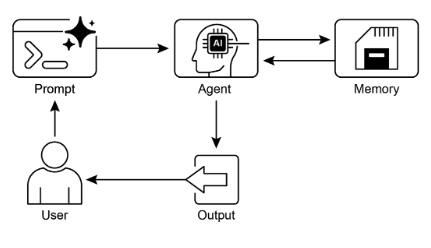

# 第 8 章：Memory Management（内存管理）

有效的内存管理对于智能智能体保留信息至关重要。智能体需要不同类型的内存，就像人类一样，以便高效运行。本章深入探讨内存管理，特别解决智能体的即时（短期）和持久（长期）内存需求。

在智能体系统中，内存指的是智能体保留和利用来自过去交互、观察和学习经历的信息的能力。这种能力允许智能体做出明智的决策、维护对话上下文并随时间改进。智能体内存通常分为两种主要类型：

* **短期内存（上下文内存）：** 类似于工作内存，它保存正在处理或最近访问的信息。对于使用大型语言模型（LLM）的智能体，短期内存主要存在于上下文窗口中。此窗口包含最近的消息、智能体回复、工具使用结果和来自当前交互的智能体反思，所有这些都为 LLM 的后续响应和行动提供信息。上下文窗口具有有限的容量，限制了智能体可以直接访问的最近信息量。高效的短期内存管理涉及在此有限空间内保留最相关信息，可能通过总结较旧的对话段或强调关键细节等技术。具有"长上下文"窗口的模型的到来只是扩展了这种短期内存的大小，允许在单个交互中保存更多信息。然而，此上下文仍然是短暂的，一旦会话结束就会丢失，并且每次处理都可能昂贵且低效。因此，智能体需要单独的内存类型来实现真正的持久性，从过去的交互中回忆信息，并构建持久的知识库。  
* **长期内存（持久内存）：** 这充当智能体需要在各种交互、任务或延长时间内保留的信息的存储库，类似于长期知识库。数据通常存储在智能体的即时处理环境之外，通常在数据库、知识图或向量数据库中。在向量数据库中，信息被转换为数值向量并存储，使智能体能够基于语义相似性而不是精确的关键词匹配来检索数据，这个过程称为语义搜索。当智能体需要来自长期内存的信息时，它查询外部存储，检索相关数据，并将其集成到短期上下文中以供即时使用，从而将先验知识与当前交互相结合。

## 实际应用与用例

内存管理对于智能体跟踪信息并随时间智能执行至关重要。这对于智能体超越基本问答能力至关重要。应用包括：

* **聊天机器人和对话式 AI：** 维护对话流程依赖于短期内存。聊天机器人需要记住先前的用户输入以提供连贯的响应。长期内存使聊天机器人能够回忆用户偏好、过去的问题或先前的讨论，提供个性化和连续的交互。  
* **面向任务的智能体：** 管理多步任务的智能体需要短期内存来跟踪先前的步骤、当前进度和总体目标。此信息可能驻留在任务的上下文或临时存储中。长期内存对于访问不在即时上下文中的特定用户相关数据至关重要。  
* **个性化体验：** 提供定制交互的智能体利用长期内存来存储和检索用户偏好、过去的行为和个人信息。这允许智能体调整其响应和建议。  
* **学习和改进：** 智能体可以通过从过去的交互中学习来改进其性能。成功的策略、错误和新信息存储在长期内存中，促进未来的适应。强化学习智能体以这种方式存储学习的策略或知识。  
* **信息检索（RAG）：** 设计用于回答问题的智能体访问知识库，它们的长期内存，通常在检索增强生成（RAG）内实现。智能体检索相关文档或数据以告知其响应。  
* **自主系统：** 机器人或自动驾驶汽车需要内存用于地图、路线、对象位置和学习的行为。这涉及用于即时环境的短期内存和用于一般环境知识的长期内存。

内存使智能体能够维护历史、学习、个性化交互并管理复杂的、时间相关的问题。

## 实践代码：Google Agent Developer Kit (ADK) 中的内存管理

Google Agent Developer Kit (ADK) 提供了管理上下文和内存的结构化方法，包括用于实际应用的组件。牢固掌握 ADK 的 Session、State 和 Memory 对于构建需要保留信息的智能体至关重要。

就像在人类交互中一样，智能体需要能够回忆先前的交流以进行连贯和自然的对话。ADK 通过三个核心概念及其相关服务简化了上下文管理。

与智能体的每次交互都可以被视为唯一的对话线程。智能体可能需要访问来自早期交互的数据。ADK 将此构建如下：

* **Session（会话）：** 一个单独的聊天线程，记录该特定交互的消息和操作（事件），还存储与该对话相关的临时数据（状态）。  
* **State (`session.state`)：** 存储在会话内的数据，包含仅与当前活动聊天线程相关的信息。  
* **Memory（内存）：** 来自各种过去聊天或外部来源的信息的可搜索存储库，作为超出即时对话的数据检索资源。

ADK 提供了用于管理构建复杂的、有状态的上下文感知智能体所必需的关键组件的专用服务。SessionService 通过处理其启动、记录和终止来管理聊天线程（Session 对象），而 MemoryService 监督长期知识（Memory）的存储和检索。

SessionService 和 MemoryService 都提供各种配置选项，允许用户根据应用程序需求选择存储方法。内存选项可用于测试目的，尽管数据不会在重启之间持久化。对于持久存储和可扩展性，ADK 还支持数据库和基于云的服务。

### Session：跟踪每个聊天

ADK 中的 Session 对象设计用于跟踪和管理单个聊天线程。在与智能体开始对话时，SessionService 生成一个 Session 对象，表示为 `google.adk.sessions.Session`。此对象封装与特定对话线程相关的所有数据，包括唯一标识符（`id`、`app\_name`、`user\_id`）、作为 Event 对象的事件的时间顺序记录、用于会话特定临时数据的存储区域（称为 state），以及指示最后更新的时间戳（`last\_update\_time`）。开发者通常通过 SessionService 间接与 Session 对象交互。SessionService 负责管理对话会话的生命周期，包括启动新会话、恢复先前的会话、记录会话活动（包括状态更新）、识别活动会话以及管理会话数据的删除。ADK 提供了几种 SessionService 实现，具有用于会话历史和临时数据的不同存储机制，如 InMemorySessionService，它适合测试但不提供跨应用程序重启的数据持久性。

```python
# Example: Using InMemorySessionService 
# This is suitable for local development and testing where data 
# persistence across application restarts is not required. 
from google.adk.sessions import InMemorySessionService
session_service = InMemorySessionService()
```

然后，如果您想要可靠地保存到您管理的数据库，还有 DatabaseSessionService。

```python
# Example: Using DatabaseSessionService 
# This is suitable for production or development requiring persistent storage. 
# You need to configure a database URL (e.g., for SQLite, PostgreSQL, etc.). 
# Requires: pip install google-adk[sqlalchemy] and a database driver (e.g., psycopg2 for PostgreSQL) 
from google.adk.sessions import DatabaseSessionService 
# Example using a local SQLite file: 
db_url = "sqlite:///./my_agent_data.db"
session_service = DatabaseSessionService(db_url=db_url)
```

此外，还有 VertexAiSessionService，它使用 Vertex AI 基础设施在 Google Cloud 上进行可扩展的生产。

```python
# Example: Using VertexAiSessionService
# This is suitable for scalable production on Google Cloud Platform, leveraging
# Vertex AI infrastructure for session management.
# Requires: pip install google-adk[vertexai] and GCP setup/authentication

from google.adk.sessions import VertexAiSessionService


PROJECT_ID = "your-gcp-project-id"  # Replace with your GCP project ID
LOCATION = "us-central1"  # Replace with your desired GCP location

# The app_name used with this service should correspond to the Reasoning Engine ID or name
REASONING_ENGINE_APP_NAME = (
    "projects/your-gcp-project-id/locations/us-central1/reasoningEngines/your-engine-id"
)  # Replace with your Reasoning Engine resource name

session_service = VertexAiSessionService(project=PROJECT_ID, location=LOCATION)

# When using this service, pass REASONING_ENGINE_APP_NAME to service methods:
# session_service.create_session(app_name=REASONING_ENGINE_APP_NAME, ...)
# session_service.get_session(app_name=REASONING_ENGINE_APP_NAME, ...)
# session_service.append_event(session, event, app_name=REASONING_ENGINE_APP_NAME)
# session_service.delete_session(app_name=REASONING_ENGINE_APP_NAME, ...)
```

选择适当的 SessionService 至关重要，因为它决定了智能体的交互历史和临时数据的存储方式及其持久性。

每次消息交换都涉及循环过程：接收消息，Runner 使用 SessionService 检索或建立 Session，智能体使用 Session 的上下文（状态和历史交互）处理消息，智能体生成响应并可能更新状态，Runner 将此封装为 Event，`session\_service.append\_event` 方法记录新事件并更新存储中的状态。然后 Session 等待下一条消息。理想情况下，当交互结束时，使用 `delete\_session` 方法来终止会话。此过程说明了 SessionService 如何通过管理会话特定的历史和临时数据来维护连续性。

### State：会话的便笺

在 ADK 中，每个 Session（代表聊天线程）包括一个状态组件，类似于智能体在该特定对话期间临时工作内存。虽然 session.events 记录整个聊天历史，但 session.state 存储和更新与活动聊天相关的动态数据点。

基本上，session.state 作为字典运行，以键值对的形式存储数据。其核心功能是使智能体能够保留和管理对连贯对话至关重要的详细信息，如用户偏好、任务进度、增量数据收集或影响后续智能体操作的条件标志。

状态的结构包括字符串键与可序列化 Python 类型的值配对，包括字符串、数字、布尔值、列表和包含这些基本类型的字典。状态是动态的，在整个对话过程中演变。这些更改的持久性取决于配置的 SessionService。

可以使用键前缀来定义数据范围和持久性来实现状态组织。没有前缀的键是会话特定的。

* user: 前缀将数据与跨所有会话的用户 ID 关联。  
* app: 前缀指定应用程序所有用户之间共享的数据。  
* temp: 前缀指示仅在当前处理轮次有效且不持久存储的数据。

智能体通过单个 session.state 字典访问所有状态数据。SessionService 处理数据检索、合并和持久化。应通过 `session\_service.append\_event()` 在向会话历史添加事件时更新状态。这确保了准确的跟踪、在持久服务中的正确保存以及状态更改的安全处理。

#### 1. 简单方法：使用 `output\_key`（用于智能体文本回复）

如果您只想将智能体的最终文本响应直接保存到状态中，这是最简单的方法。当您设置 LlmAgent 时，只需告诉它您要使用的 output\_key。Runner 看到这一点，并在追加事件时自动创建必要的操作以将响应保存到状态。让我们看一个通过 `output\_key` 演示状态更新的代码示例。

```python
# Import necessary classes from the Google Agent Developer Kit (ADK)
from google.adk.agents import LlmAgent
from google.adk.sessions import InMemorySessionService, Session
from google.adk.runners import Runner
from google.genai.types import Content, Part


# Define an LlmAgent with an output_key.
greeting_agent = LlmAgent(
 name="Greeter",
 model="gemini-2.0-flash",
 instruction="Generate a short, friendly greeting.",
 output_key="last_greeting",
)


# --- Setup Runner and Session ---
app_name, user_id, session_id = "state_app", "user1", "session1"

session_service = InMemorySessionService()

runner = Runner(
    agent=greeting_agent,
    app_name=app_name,
    session_service=session_service,
)

session = session_service.create_session(
    app_name=app_name,
    user_id=user_id,
    session_id=session_id,
)

print(f"Initial state: {session.state}")


# --- Run the Agent ---
user_message = Content(parts=[Part(text="Hello")])

print("\n--- Running the agent ---")
for event in runner.run(
    user_id=user_id,
    session_id=session_id,
    new_message=user_message,
):
    if event.is_final_response():
        print("Agent responded.")


# --- Check Updated State ---
# Correctly check the state after the runner has finished processing all events.
updated_session = session_service.get_session(app_name, user_id, session_id)
print(f"\nState after agent run: {updated_session.state}")
```

在幕后，Runner 看到您的 `output\_key`，并在调用 `append\_event` 时自动创建带有 `state\_delta` 的必要操作。

#### 2. 标准方法：使用 `EventActions.state\_delta`（用于更复杂的更新）

当您需要做更复杂的事情时——比如同时更新多个键、保存不仅仅是文本的东西、针对特定范围（如 user: 或 app:），或进行与智能体的最终文本回复无关的更新——您将手动构建状态更改字典（`state\_delta`）并将其包含在您要追加的事件的 EventActions 中。让我们看一个示例：

```python
import time

from google.adk.tools.tool_context import ToolContext
from google.adk.sessions import InMemorySessionService


# --- Define the Recommended Tool-Based Approach ---
def log_user_login(tool_context: ToolContext) -> dict:
    """
    Updates the session state upon a user login event.
    This tool encapsulates all state changes related to a user login.

    Args:
        tool_context: Automatically provided by ADK, gives access to session state.

    Returns:
        A dictionary confirming the action was successful.
    """
    # Access the state directly through the provided context.
    state = tool_context.state

    # Get current values or defaults, then update the state.
    # This is much cleaner and co-locates the logic.
    login_count = state.get("user:login_count", 0) + 1
    state["user:login_count"] = login_count
    state["task_status"] = "active"
    state["user:last_login_ts"] = time.time()
    state["temp:validation_needed"] = True

    print("State updated from within the `log_user_login` tool.")

    return {
        "status": "success",
        "message": f"User login tracked. Total logins: {login_count}.",
    }


# --- Demonstration of Usage ---
# In a real application, an LLM Agent would decide to call this tool.
# Here, we simulate a direct call for demonstration purposes.

# 1. Setup
session_service = InMemorySessionService()
app_name, user_id, session_id = "state_app_tool", "user3", "session3"

session = session_service.create_session(
    app_name=app_name,
    user_id=user_id,
    session_id=session_id,
    state={"user:login_count": 0, "task_status": "idle"},
)

print(f"Initial state: {session.state}")

# 2. Simulate a tool call (in a real app, the ADK Runner does this)
# We create a ToolContext manually just for this standalone example.
from google.adk.tools.tool_context import InvocationContext

mock_context = ToolContext(
    invocation_context=InvocationContext(
        app_name=app_name,
        user_id=user_id,
        session_id=session_id,
        session=session,
        session_service=session_service,
    )
)

# 3. Execute the tool
log_user_login(mock_context)

# 4. Check the updated state
updated_session = session_service.get_session(app_name, user_id, session_id)
print(f"State after tool execution: {updated_session.state}")

# Expected output will show the same state change as the "Before" case,
# but the code organization is significantly cleaner and more robust.
```

此代码演示了在应用程序中管理用户会话状态的基于工具的方法。它定义了一个函数 *log\_user\_login*，它充当工具。此工具负责在用户登录时更新会话状态。  
该函数接受 ADK 提供的 ToolContext 对象，以访问和修改会话的状态字典。在工具内部，它增加 *user:login\_count*，将 t*ask\_status* 设置为 "active"，记录 *user:last\_login\_ts (timestamp)*，并添加临时标志 temp:validation\_needed。

代码的演示部分模拟了此工具的使用方式。它设置了内存会话服务并创建具有一些预定义状态的初始会话。然后手动创建 ToolContext 以模拟 ADK Runner 将执行工具的环境。使用此模拟上下文调用 `log\_user\_login` 函数。最后，代码再次检索会话以显示状态已通过工具的执行而更新。目标是展示将状态更改封装在工具内如何使代码比在工具外部直接操作状态更清晰、更有组织。

注意，在检索会话后直接修改 `session.state` 字典是强烈不推荐的，因为它绕过了标准事件处理机制。这种直接更改不会记录在会话的事件历史中，可能不会被所选 `SessionService` 持久化，可能导致并发问题，并且不会更新时间戳等基本元数据。更新会话状态的推荐方法是在 `LlmAgent` 上使用 `output\_key` 参数（特别适用于智能体的最终文本响应），或在通过 `session\_service.append\_event()` 追加事件时在 `EventActions.state\_delta` 中包含状态更改。`session.state` 应该主要用于读取现有数据。

回顾一下，在设计状态时，保持简单，使用基本数据类型，给键清晰的名称并正确使用前缀，避免深度嵌套，并始终使用 append\_event 过程更新状态。

## Memory：使用 MemoryService 的长期知识

在智能体系统中，Session 组件维护当前聊天历史（事件）和特定于单个对话的临时数据（状态）的记录。然而，对于智能体在多次交互中保留信息或访问外部数据，需要长期知识管理。这由 MemoryService 促进。

```python
# Example: Using InMemoryMemoryService
# This is suitable for local development and testing where data
# persistence across application restarts is not required.
# Memory content is lost when the app stops.

from google.adk.memory import InMemoryMemoryService

memory_service = InMemoryMemoryService()
```

Session 和 State 可以概念化为单个聊天会话的短期内存，而由 MemoryService 管理的长期知识作为持久且可搜索的存储库运行。此存储库可能包含来自多个过去交互或外部来源的信息。MemoryService（由 BaseMemoryService 接口定义）建立了管理此可搜索、长期知识的标准。其主要功能包括添加信息（涉及从会话中提取内容并使用 add\_session\_to\_memory 方法存储它）和检索信息（允许智能体查询存储并使用 search\_memory 方法接收相关数据）。

ADK 提供了几种实现来创建此长期知识存储。InMemoryMemoryService 提供适合测试目的的临时存储解决方案，但数据不会在应用程序重启之间保留。对于生产环境，通常使用 VertexAiRagMemoryService。此服务利用 Google Cloud 的检索增强生成（RAG）服务，实现可扩展、持久和语义搜索功能（另请参阅第 14 章关于 RAG）。

```python
# Example: Using VertexAiRagMemoryService
# This is suitable for scalable production on GCP, leveraging
# Vertex AI RAG (Retrieval Augmented Generation) for persistent,
# searchable memory.
# Requires: pip install google-adk[vertexai], GCP
# setup/authentication, and a Vertex AI RAG Corpus.

from google.adk.memory import VertexAiRagMemoryService


# The resource name of your Vertex AI RAG Corpus
RAG_CORPUS_RESOURCE_NAME = (
    "projects/your-gcp-project-id/locations/us-central1/ragCorpora/your-corpus-id"
)  # Replace with your Corpus resource name

# Optional configuration for retrieval behavior
SIMILARITY_TOP_K = 5  # Number of top results to retrieve
VECTOR_DISTANCE_THRESHOLD = 0.7  # Threshold for vector similarity

memory_service = VertexAiRagMemoryService(
    rag_corpus=RAG_CORPUS_RESOURCE_NAME,
    similarity_top_k=SIMILARITY_TOP_K,
    vector_distance_threshold=VECTOR_DISTANCE_THRESHOLD,
)

# When using this service, methods like add_session_to_memory
# and search_memory will interact with the specified Vertex AI
# RAG Corpus.
```

## 实践代码：LangChain 和 LangGraph 中的内存管理

在 LangChain 和 LangGraph 中，内存是创建智能和自然感觉的对话应用程序的关键组件。它允许 AI 智能体记住来自过去交互的信息，从反馈中学习，并适应用户偏好。LangChain 的内存功能通过引用存储的历史来丰富当前提示，然后记录最新的交换以供将来使用，为此提供了基础。随着智能体处理更复杂的任务，这种能力对于效率和用户满意度都变得至关重要。

**短期内存：** 这是线程范围的，意味着它跟踪单个会话或线程内的持续对话。它提供即时上下文，但完整历史可能会挑战 LLM 的上下文窗口，可能导致错误或性能不佳。LangGraph 将短期内存作为智能体状态的一部分进行管理，该状态通过检查点持久化，允许随时恢复线程。

**长期内存：** 这存储跨会话的用户特定或应用程序级别的数据，并在对话线程之间共享。它保存在自定义"命名空间"中，可以在任何线程中的任何时间回忆。LangGraph 提供存储以保存和回忆长期内存，使智能体能够无限期保留知识。

LangChain 提供了几种用于管理对话历史的工具，从手动控制到链内的自动集成。

**ChatMessageHistory：手动内存管理。** 对于在正式链之外对对话历史进行直接和简单的控制，ChatMessageHistory 类是理想的。它允许手动跟踪对话交换。

```python
from langchain.memory import ChatMessageHistory


# Initialize the history object
history = ChatMessageHistory()

# Add user and AI messages
history.add_user_message("I'm heading to New York next week.")
history.add_ai_message("Great! It's a fantastic city.")

# Access the list of messages
print(history.messages)
```

**ConversationBufferMemory：链的自动内存。** 对于将内存直接集成到链中，ConversationBufferMemory 是常见选择。它保存对话缓冲区并将其提供给您的提示。其行为可以使用两个关键参数进行自定义：

* `memory\_key`：指定提示中保存聊天历史的变量名称的字符串。它默认为 "history"。  
* `return\_messages`：决定历史格式的布尔值。  
  * 如果 `False`（默认值），它返回单个格式化字符串，这对于标准 LLM 是理想的。  
  * 如果 `True`，它返回消息对象列表，这是聊天模型的推荐格式。

```python
from langchain.memory import ConversationBufferMemory


# Initialize memory
memory = ConversationBufferMemory()

# Save a conversation turn
memory.save_context(
    {"input": "What's the weather like?"},
    {"output": "It's sunny today."},
)

# Load the memory as a string
print(memory.load_memory_variables({}))
```

将此外存集成到 LLMChain 中允许模型访问对话历史并提供上下文相关的响应

```python
from langchain_openai import OpenAI
from langchain.chains import LLMChain
from langchain.prompts import PromptTemplate
from langchain.memory import ConversationBufferMemory


# 1. Define LLM and Prompt
llm = OpenAI(temperature=0)

template = """You are a helpful travel agent.
Previous conversation: {history}
New question: {question}
Response:"""
prompt = PromptTemplate.from_template(template)

# 2. Configure Memory
# The memory_key "history" matches the variable in the prompt
memory = ConversationBufferMemory(memory_key="history")

# 3. Build the Chain
conversation = LLMChain(llm=llm, prompt=prompt, memory=memory)

# 4. Run the Conversation
response = conversation.predict(question="I want to book a flight.")
print(response)

response = conversation.predict(question="My name is Sam, by the way.")
print(response)

response = conversation.predict(question="What was my name again?")
print(response)
```

为了与聊天模型提高有效性，建议通过设置 \`return\_messages=True\` 使用结构化的消息对象列表。

```python
from langchain_openai import ChatOpenAI
from langchain.chains import LLMChain
from langchain.memory import ConversationBufferMemory
from langchain_core.prompts import (
    ChatPromptTemplate,
    MessagesPlaceholder,
    SystemMessagePromptTemplate,
    HumanMessagePromptTemplate,
)


# 1. Define Chat Model and Prompt
llm = ChatOpenAI()

prompt = ChatPromptTemplate(
    messages=[
        SystemMessagePromptTemplate.from_template("You are a friendly assistant."),
        MessagesPlaceholder(variable_name="chat_history"),
        HumanMessagePromptTemplate.from_template("{question}"),
    ]
)

# 2. Configure Memory
# return_messages=True is essential for chat models
memory = ConversationBufferMemory(memory_key="chat_history", return_messages=True)

# 3. Build the Chain
conversation = LLMChain(llm=llm, prompt=prompt, memory=memory)

# 4. Run the Conversation
response = conversation.predict(question="Hi, I'm Jane.")
print(response)

response = conversation.predict(question="Do you remember my name?")
print(response)
```

**长期内存类型：** 长期内存允许系统在不同对话中保留信息，提供更深层次的上下文和个性化。它可以分解为三种类似于人类内存的类型：

* **语义内存：记住事实：** 这涉及保留特定事实和概念，如用户偏好或领域知识。它用于为基础智能体的响应，导致更个性化和相关的交互。此信息可以作为 continuously updated user "profile"（JSON 文档）或作为个别事实文档的"集合"进行管理。  
* **情景内存：记住经历：** 这涉及回忆过去的事件或行动。对于 AI 智能体，情景内存通常用于记住如何完成任务。在实践中，它经常通过 few-shot 示例提示实现，其中智能体从过去成功的交互序列中学习以正确执行任务。  
* **程序内存：记住规则：** 这是如何执行任务的记忆——智能体的核心指令和行为，通常包含在其系统提示中。智能体修改自己的提示以适应和改进是常见的。一个有效的技术是"反思"，其中智能体使用其当前指令和最近的交互进行提示，然后要求改进自己的指令。

下面是伪代码，演示智能体如何使用反思更新存储在 LangGraph BaseStore 中的程序内存

```python
# Node that updates the agent's instructions
def update_instructions(state: State, store: BaseStore):
    namespace = ("instructions",)

    # Get the current instructions from the store
    current_instructions = store.search(namespace)[0]

    # Create a prompt to ask the LLM to reflect on the conversation
    # and generate new, improved instructions
    prompt = prompt_template.format(
        instructions=current_instructions.value["instructions"],
        conversation=state["messages"],
    )

    # Get the new instructions from the LLM
    output = llm.invoke(prompt)
    new_instructions = output["new_instructions"]

    # Save the updated instructions back to the store
    store.put(("agent_instructions",), "agent_a", {"instructions": new_instructions})


# Node that uses the instructions to generate a response
def call_model(state: State, store: BaseStore):
    namespace = ("agent_instructions",)

    # Retrieve the latest instructions from the store
    instructions = store.get(namespace, key="agent_a")[0]

    # Use the retrieved instructions to format the prompt
    prompt = prompt_template.format(
        instructions=instructions.value["instructions"]
    )
    # ... application logic continues
```

LangGraph 将长期内存存储为存储中的 JSON 文档。每个内存都组织在自定义命名空间（如文件夹）和不同键（如文件名）下。这种层次结构允许轻松组织和检索信息。以下代码演示了如何使用 InMemoryStore 放置、获取和搜索内存。

```python
from langgraph.store.memory import InMemoryStore


# A placeholder for a real embedding function
def embed(texts: list[str]) -> list[list[float]]:
    # In a real application, use a proper embedding model
    return [[1.0, 2.0] for _ in texts]


# Initialize an in-memory store. For production, use a database-backed store.
store = InMemoryStore(index={"embed": embed, "dims": 2})

# Define a namespace for a specific user and application context
user_id = "my-user"
application_context = "chitchat"
namespace = (user_id, application_context)

# 1. Put a memory into the store
store.put(
    namespace,
    "a-memory",  # The key for this memory
    {
        "rules": [
            "User likes short, direct language",
            "User only speaks English & python",
        ],
        "my-key": "my-value",
    },
)

# 2. Get the memory by its namespace and key
item = store.get(namespace, "a-memory")
print("Retrieved Item:", item)

# 3. Search for memories within the namespace, filtering by content
# and sorting by vector similarity to the query.
items = store.search(
    namespace,
    filter={"my-key": "my-value"},
    query="language preferences",
)
print("Search Results:", items)
```

## Vertex Memory Bank

Memory Bank 是 Vertex AI Agent Engine 中的托管服务，为智能体提供持久的长期内存。该服务使用 Gemini 模型异步分析对话历史以提取关键事实和用户偏好。

此信息持久存储，由定义的 scope（如用户 ID）组织，并智能更新以合并新数据并解决矛盾。启动新会话时，智能体通过完整数据回忆或使用嵌入的相似性搜索检索相关内存。此过程允许智能体跨会话维护连续性，并基于回忆的信息个性化响应。

智能体的运行器与 VertexAiMemoryBankService 交互，该服务首先初始化。此服务处理在智能体对话期间生成的内存的自动存储。每个内存都标记有唯一的 USER\_ID 和 APP\_NAME，确保将来准确检索。

```python
from google.adk.memory import VertexAiMemoryBankService


agent_engine_id = agent_engine.api_resource.name.split("/")[-1]

memory_service = VertexAiMemoryBankService(
    project="PROJECT_ID",
    location="LOCATION",
    agent_engine_id=agent_engine_id,
)

session = await session_service.get_session(
    app_name=app_name,
    user_id="USER_ID",
    session_id=session.id,
)

await memory_service.add_session_to_memory(session)
```

Memory Bank 提供与 Google ADK 的无缝集成，提供即开即用的体验。对于其他智能体框架（如 LangGraph 和 CrewAI）的用户，Memory Bank 还通过直接 API 调用提供支持。在线代码示例展示了这些集成，可供感兴趣的读者使用。

## 概览

**什么**：智能体系统需要记住来自过去交互的信息以执行复杂任务并提供连贯的体验。没有内存机制，智能体是无状态的，无法维护对话上下文、从经验中学习或为用户个性化响应。这从根本上将它们限制为简单的、一次性的交互，无法处理多步过程或不断发展的用户需求。核心问题是如何有效管理单个对话的即时、临时信息和随时间收集的庞大、持久知识。

**为什么：** 标准化解决方案是实现区分短期和长期存储的双组件内存系统。短期、上下文内存在 LLM 的上下文窗口内保存最近的交互数据以维护对话流程。对于必须持久化的信息，长期内存解决方案使用外部数据库（通常是向量存储）进行高效的语义检索。像 Google ADK 这样的智能体框架提供了用于管理此的特定组件，如用于对话线程的 Session 和用于其临时数据的 State。使用专用的 MemoryService 与长期知识库接口，允许智能体检索并将相关的过去信息纳入其当前上下文。

**经验法则：** 当智能体需要做的不仅仅是回答单个问题时，使用此模式。这对于必须在整个对话中维护上下文、跟踪多步任务中的进度或通过回忆用户偏好和历史来个性化交互的智能体至关重要。每当智能体需要基于过去的成功、失败或新获得的信息进行学习或适应时，实现内存管理。

**可视化摘要：**



图 1：内存管理设计模式

## 关键要点

快速回顾有关内存管理的主要点：

* 内存对于智能体跟踪事物、学习和个性化交互非常重要。  
* 对话式 AI 依赖于短期内存（用于单个聊天中的即时上下文）和长期内存（用于跨多个会话的持久知识）。  
* 短期内存（即时内容）是临时的，通常受到 LLM 的上下文窗口或框架传递上下文的方式的限制。  
* 长期内存（持续的内容）使用外部存储（如向量数据库）在不同聊天之间保存信息，并通过搜索访问。  
* 像 ADK 这样的框架具有特定部分，如 Session（聊天线程）、State（临时聊天数据）和 MemoryService（可搜索的长期知识）来管理内存。  
* ADK 的 SessionService 处理整个聊天会话的生命周期，包括其历史（事件）和临时数据（状态）。  
* ADK 的 session.state 是用于临时聊天数据的字典。前缀（user:、app:、temp:）告诉您数据属于哪里以及它是否持续存在。  
* 在 ADK 中，您应该通过在添加事件时使用 EventActions.state\_delta 或 output\_key 来更新状态，而不是通过直接更改状态字典。  
* ADK 的 MemoryService 用于将信息放入长期存储并让智能体搜索它，通常使用工具。  
* LangChain 提供实用工具（如 ConversationBufferMemory）以自动将单个对话的历史注入提示，使智能体能够回忆即时上下文。  
* LangGraph 通过使用存储保存和检索语义事实、情景经历甚至可更新的程序规则（跨不同用户会话）来实现高级长期内存。  
* Memory Bank 是一个托管服务，通过自动提取、存储和回忆用户特定信息，为智能体提供持久的长期内存，以在 Google 的 ADK、LangGraph 和 CrewAI 等框架中实现个性化、连续的对话。

## 结论

本章深入探讨了智能体系统的内存管理这一重要工作，展示了短暂上下文和长期持续知识之间的区别。我们讨论了这些类型的内存是如何设置的，以及在哪里看到它们在构建能够记住事物的更智能智能体中使用。我们详细研究了 Google ADK 如何为您提供特定部分（如 Session、State 和 MemoryService）来处理这一点。既然我们已经涵盖了智能体如何记住事物（短期和长期），我们可以继续研究它们如何学习和适应。下一个模式"学习和适应"是关于智能体基于新经历或数据改变其思考、行动或知道的方式。

## 参考文献

1. ADK Memory, [https://google.github.io/adk-docs/sessions/memory/](https://google.github.io/adk-docs/sessions/memory/)
2. LangGraph Memory, [https://langchain-ai.github.io/langgraph/concepts/memory/](https://langchain-ai.github.io/langgraph/concepts/memory/)
3. Vertex AI Agent Engine Memory Bank, [https://cloud.google.com/blog/products/ai-machine-learning/vertex-ai-memory-bank-in-public-preview](https://cloud.google.com/blog/products/ai-machine-learning/vertex-ai-memory-bank-in-public-preview)
