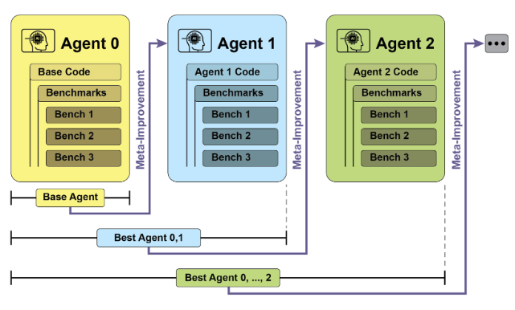
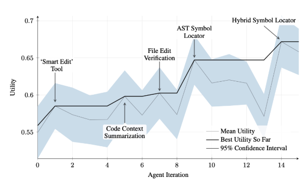
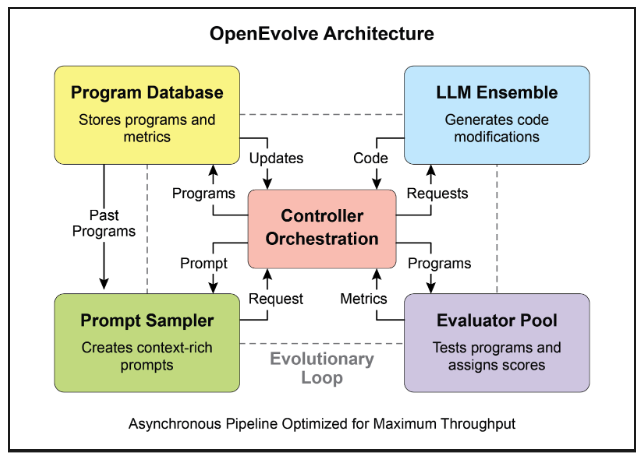
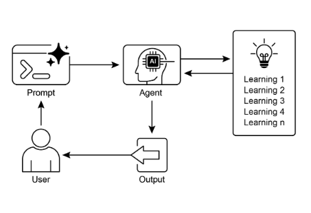

# 第 9 章：Learning and Adaptation（学习和适应）

学习和适应对于增强人工智能智能体的能力至关重要。这些过程使智能体能够超越预定义参数而演进，允许它们通过经验和环境交互自主改进。通过学习和适应，智能体可以有效地管理新情况并优化其性能，而无需持续的手动干预。本章详细探讨支撑智能体学习和适应的原理和机制。

## 大局观

智能体通过基于新经历和数据改变其思维、行动或知识来学习和适应。这允许智能体从简单地遵循指令演进为随时间变得 smarter。

* **强化学习（Reinforcement Learning）：** 智能体尝试行动，对积极结果获得奖励，对消极结果受到惩罚，在变化的情况下学习最优行为。适用于控制机器人或玩游戏的智能体。  
* **监督学习（Supervised Learning）：** 智能体从标记示例中学习，将输入连接到期望输出，使能够执行决策和模式识别等任务。适用于分类电子邮件或预测趋势的智能体。  
* **无监督学习（Unsupervised Learning）：** 智能体在未标记数据中发现隐藏的连接和模式，有助于洞察、组织并创建其环境的心理地图。适用于在没有特定指导的情况下探索数据的智能体。  
* **基于 LLM 的智能体的 Few-Shot/Zero-Shot 学习：** 利用 LLM 的智能体可以通过最少的示例或清晰的指令快速适应新任务，使能够快速响应新命令或情况。  
* **在线学习（Online Learning）：** 智能体使用新数据连续更新知识，对于动态环境中的实时反应和持续适应至关重要。对于处理连续数据流的智能体至关重要。  
* **基于内存的学习（Memory-Based Learning）：** 智能体回忆过去的经历以在类似情况下调整当前行动，增强上下文感知和决策。对于具有内存回忆能力的智能体有效。

智能体通过基于学习改变策略、理解或目标来适应。这对于在不可预测、变化或新环境中的智能体至关重要。

**近端策略优化（Proximal Policy Optimization，PPO）** 是一种强化学习算法，用于在具有连续动作范围的环境中训练智能体，如控制机器人的关节或游戏中的角色。其主要目标是可靠且稳定地改进智能体的决策策略，称为其策略（policy）。

PPO 背后的核心思想是对智能体的策略进行小而谨慎的更新。它避免可能导致性能崩溃的剧烈变化。工作原理如下：

1. 收集数据：智能体使用其当前策略与环境交互（例如，玩游戏）并收集一批经历（状态、行动、奖励）。  
2. 评估"替代"目标：PPO 计算潜在策略更新将如何改变期望奖励。然而，它不仅仅最大化此奖励，而是使用特殊的"裁剪"目标函数。  
3. "裁剪"机制：这是 PPO 稳定性的关键。它在当前策略周围创建一个"信任区域"或安全区。算法被阻止进行与当前策略差异太大的更新。此裁剪充当安全制动器，确保智能体不会采取可能撤销其学习的大而冒险的步骤。

简而言之，PPO 在提高性能和保持接近已知、工作的策略之间取得平衡，这防止了训练期间的灾难性故障并导致更稳定的学习。

**直接偏好优化（Direct Preference Optimization，DPO）** 是一种更新的方法，专门设计用于将大型语言模型（LLM）与人类偏好对齐。它提供了一个更简单、更直接的替代方案，用于使用 PPO 完成此任务。

要理解 DPO，首先理解传统的基于 PPO 的对齐方法是有帮助的：

* PPO 方法（两步过程）：  
  1. 训练奖励模型：首先，您收集人类反馈数据，其中人们评分或比较不同的 LLM 响应（例如，"响应 A 优于响应 B"）。此数据用于训练一个单独的 AI 模型，称为奖励模型，其工作是预测人类会给任何新响应什么分数。  
  2. 使用 PPO 进行微调：接下来，使用 PPO 微调 LLM。LLM 的目标是生成从奖励模型获得最高可能分数的响应。奖励模型在训练游戏中充当"法官"。

这种两步过程可能复杂且不稳定。例如，LLM 可能找到漏洞并学习"黑客"奖励模型以获得坏响应的高分。

* DPO 方法（直接过程）：DPO 完全跳过奖励模型。它不是将人类偏好转换为奖励分数然后优化该分数，而是直接使用偏好数据来更新 LLM 的策略。  
* 它通过使用直接链接偏好数据到最优策略的数学关系来工作。它本质上教导模型："增加生成*偏好*响应的概率，减少生成*不偏好*响应的概率。"

本质上，DPO 通过直接在人类偏好数据上优化语言模型来简化对齐。这避免了训练和使用单独奖励模型的复杂性和潜在不稳定性，使对齐过程更高效和健壮。

## 实际应用与用例

自适应智能体通过由经验数据驱动的迭代更新，在可变环境中表现出增强的性能。

* **个性化助手智能体** 通过个体用户行为的纵向分析来改进交互协议，确保高度优化的响应生成。  
* **交易机器人智能体** 通过基于高分辨率、实时市场数据动态调整模型参数来优化决策算法，从而最大化财务回报并减轻风险因素。  
* **应用程序智能体** 通过基于观察到的用户行为进行动态修改来优化用户界面和功能，从而提高用户参与度和系统直观性。  
* **机器人和自动驾驶车辆智能体** 通过集成传感器数据和历史行动分析来增强导航和响应能力，使能够在各种环境条件下安全高效地运行。  
* **欺诈检测智能体** 通过使用新识别的欺诈模式改进预测模型来改善异常检测，增强系统安全性并最小化财务损失。  
* **推荐智能体** 通过采用用户偏好学习算法来提高内容选择精度，提供高度个性化和上下文相关的推荐。  
* **游戏 AI 智能体** 通过动态适应战略算法来增强玩家参与度，从而增加游戏复杂性和挑战性。  
* **知识库学习智能体：** 智能体可以利用检索增强生成（RAG）维护问题描述和经过验证的解决方案的动态知识库（参见第 14 章）。通过存储成功的策略和遇到的挑战，智能体可以在决策过程中引用此数据，使能够通过应用先前成功的模式或避免已知陷阱更有效地适应新情况。

## 案例研究：自我改进编码智能体（SICA）

自我改进编码智能体（SICA），由 Maxime Robeyns、Laurence Aitchison 和 Martin Szummer 开发，代表了基于智能体的学习方面的进步，展示了智能体修改自己源代码的能力。这与传统方法（其中一个智能体可能训练另一个智能体）形成对比；SICA 既充当修改者又充当被修改的实体，迭代地改进其代码库以提高各种编码挑战的性能。

SICA 的自我改进通过迭代循环运行（见图 1）。最初，SICA 审查其过去版本的档案及其在基准测试上的性能。它选择具有最高性能分数的版本，该分数基于考虑成功、时间和计算成本的加权公式计算。然后，此选定的版本进行下一轮自我修改。它分析档案以识别潜在改进，然后直接更改其代码库。随后，修改后的智能体针对基准进行测试，结果记录在档案中。此过程重复，促进直接从过去的性能中学习。这种自我改进机制允许 SICA 演进其能力，而无需传统的训练范式。



图 1：SICA 的自我改进，基于其过去版本学习和适应

SICA 经历了显著的自我改进，导致代码编辑和导航方面的进步。最初，SICA 使用基本的文件覆盖方法进行代码更改。随后，它开发了一个能够进行更智能和上下文编辑的"智能编辑器"。这演变为"差异增强智能编辑器"，结合差异进行有针对性的修改和基于模式的编辑，以及"快速覆盖工具"以减少处理需求。

SICA 进一步实现了"最小差异输出优化"和"上下文敏感差异最小化"，使用抽象语法树（AST）解析以提高效率。此外，添加了"SmartEditor 输入规范化器"。在导航方面，SICA 独立创建了一个"AST 符号定位器"，使用代码的结构地图（AST）来识别代码库内的定义。后来，开发了一个"混合符号定位器"，将快速搜索与 AST 检查相结合。这通过"混合符号定位器中的优化 AST 解析"进一步优化，专注于相关代码部分，提高搜索速度。（见图 2）



图 2：跨迭代的性能。关键改进已用其相应的工具或智能体修改进行注释。（由 Maxime Robeyns、Martin Szummer、Laurence Aitchison 提供）

SICA 的架构包括用于基本文件操作、命令执行和算术计算的基础工具包。它包括结果提交机制和调用专业子智能体（编码、问题解决和推理）的机制。这些子智能体分解复杂任务并管理 LLM 的上下文长度，特别是在扩展的改进周期期间。

一个异步监督者（另一个 LLM）监控 SICA 的行为，识别潜在问题，如循环或停滞。它与 SICA 通信，并可以在必要时进行干预以停止执行。监督者接收 SICA 操作的详细报告，包括调用图和消息和工具操作日志，以识别模式和低效率。

SICA 的 LLM 在其上下文窗口（其短期内存）内以对其操作至关重要的结构化方式组织信息。此结构包括定义智能体目标的系统提示、工具和子智能体文档以及系统指令。核心提示包含问题陈述或指令、打开文件的内容以及目录地图。助手消息记录智能体的逐步推理、工具和子智能体调用记录和结果，以及监督者通信。这种组织促进了有效的信息流，增强了 LLM 操作并减少了处理时间和成本。最初，文件更改被记录为差异，仅显示修改并定期合并。

**SICA：代码一览：** 深入研究 SICA 的实现揭示了支撑其能力的几个关键设计选择。如所讨论的，系统构建为模块化架构，包含几个子智能体，如编码智能体、问题解决智能体和推理智能体。这些子智能体由主智能体调用，就像工具调用一样，用于分解复杂任务并有效管理上下文长度，特别是在那些扩展的元改进迭代期间。

该项目正在积极开发，旨在为那些对工具使用和其他智能体任务的后训练 LLM 感兴趣的人提供健壮的框架，完整代码可在 [https://github.com/MaximeRobeyns/self_improving_coding_agent/](https://github.com/MaximeRobeyns/self_improving_coding_agent/) GitHub 存储库中进一步探索和贡献。

为了安全，该项目强烈强调 Docker 容器化，意味着智能体在专用 Docker 容器内运行。这是一个关键措施，因为它提供与主机的隔离，减轻风险，如由于智能体执行 shell 命令的能力而无意中的文件系统操作。

为了确保透明度和控制，系统通过交互式网页提供了强大的可观察性，该网页可视化事件总线上的事件和智能体的调用图。这提供了对智能体操作的全面洞察，允许用户检查个别事件、阅读监督者消息并折叠子智能体跟踪以更清晰地理解。

就其核心智能而言，智能体框架支持来自各种提供商的 LLM 集成，使能够使用不同模型进行实验以找到最适合特定任务的模型。最后，一个关键组件是异步监督者，一个与主智能体并发运行的 LLM。此监督者定期评估智能体的行为是否存在病理偏差或停滞，并可以通过发送通知或甚至在必要时取消智能体的执行进行干预。它接收系统状态的详细文本表示，包括调用图和 LLM 消息、工具调用和响应的事件流，这允许它检测低效模式或重复工作。

在初始 SICA 实现中的一个显著挑战是提示基于 LLM 的智能体在每个元改进迭代中独立提出新颖、创新、可行且引人入胜的修改。这种限制，特别是在促进 LLM 智能体的开放学习和真实创造力方面，仍然是当前研究的关键调查领域。

## AlphaEvolve 和 OpenEvolve

**AlphaEvolve** 是由 Google 开发的 AI 智能体，设计用于发现和优化算法。它利用 LLM 的组合，特别是 Gemini 模型（Flash 和 Pro）、自动化评估系统和进化算法框架。该系统旨在推进理论数学和实际计算应用。

AlphaEvolve 采用 Gemini 模型的集合。Flash 用于生成广泛的初始算法提案，而 Pro 提供更深入的分析和改进。然后根据预定义标准自动评估和评分提议的算法。此评估提供用于迭代改进解决方案的反馈，导致优化的和新颖的算法。

在实际计算中，AlphaEvolve 已在 Google 的基础设施内部署。它已展示了数据中心调度方面的改进，导致全球计算资源使用量减少 0.7%。它还通过为即将推出的张量处理单元（TPU）中的 Verilog 代码建议优化，为硬件设计做出了贡献。此外，AlphaEvolve 加速了 AI 性能，包括 Gemini 架构核心内核的速度提高 23%，以及 FlashAttention 的低级 GPU 指令优化高达 32.5%。

在基础研究领域，AlphaEvolve 为矩阵乘法的新算法发现做出了贡献，包括一种使用 48 个标量乘法的 4x4 复值矩阵的方法，超越了先前已知的解决方案。在更广泛的数学研究中，它在 75% 的情况下重新发现了超过 50 个开放问题的现有最先进解决方案，并在 20% 的情况下改进了现有解决方案，示例包括 kissing number 问题的进步。

**OpenEvolve** 是一个利用 LLM 的进化编码智能体（见图 3），用于迭代优化代码。它编排了一个由 LLM 驱动的代码生成、评估和选择的管道，以持续增强各种任务的程序。OpenEvolve 的一个关键方面是其演进整个代码文件的能力，而不是仅限于单个函数。该智能体设计为多功能，提供对多种编程语言的支持，并与任何 LLM 的 OpenAI 兼容 API 兼容。此外，它结合了多目标优化，允许灵活的提示工程，并且能够进行分布式评估以高效处理复杂的编码挑战。



图 3：OpenEvolve 内部架构由控制器管理。此控制器编排几个关键组件：程序采样器、程序数据库、评估器池和 LLM 集合。其主要功能是促进它们的学习和适应过程以提高代码质量。

此代码片段使用 OpenEvolve 库对程序执行进化优化。它使用初始程序、评估文件和配置文件的路径初始化 OpenEvolve 系统。evolve.run(iterations=1000) 行启动进化过程，运行 1000 次迭代以找到程序的改进版本。最后，它打印在进化期间找到的最佳程序的指标，格式化为四位小数。

```python
from openevolve import OpenEvolve


# Initialize the system
evolve = OpenEvolve(
    initial_program_path="path/to/initial_program.py",
    evaluation_file="path/to/evaluator.py",
    config_path="path/to/config.yaml",
)

# Run the evolution
best_program = await evolve.run(iterations=1000)

print("Best program metrics:")
for name, value in best_program.metrics.items():
    print(f"  {name}: {value:.4f}")
```

## 概览

**什么：** AI 智能体通常在动态和不可预测的环境中运行，其中预编程逻辑是不够的。当面临在其初始设计中未预料到的新情况时，它们的性能可能会下降。没有从经验中学习的能力，智能体无法优化其策略或随时间个性化其交互。这种僵化限制了它们的有效性，并阻止它们在复杂的、现实世界的场景中实现真正的自主性。

**为什么：** 标准化解决方案是集成学习和适应机制，将静态智能体转变为动态、演进的系统。这允许智能体基于新数据和交互自主改进其知识和行为。智能体系统可以使用各种方法，从强化学习到更先进的技术（如自我修改），如自我改进编码智能体（SICA）中看到的。像 Google 的 AlphaEvolve 这样的高级系统利用 LLM 和进化算法来发现全新的、更高效的复杂问题解决方案。通过持续学习，智能体可以掌握新任务、增强其性能并适应变化的条件，而无需持续的手动重新编程。

**经验法则：** 当构建必须在动态、不确定或演进环境中运行的智能体时，使用此模式。这对于需要个性化、持续性能改进以及自主处理新情况能力的应用程序至关重要。

**可视化摘要：**



图 4：学习和适应模式

## 关键要点

* 学习和适应是关于智能体通过使用它们的经验来更好地完成工作并处理新情况。  
* "适应"是智能体行为或知识中可见的变化，来自于学习。  
* SICA，自我改进编码智能体，通过基于过去性能修改其代码来自我改进。这导致了智能编辑器和 AST 符号定位器等工具。  
* 拥有专业的"子智能体"和"监督者"有助于这些自我改进系统管理大型任务并保持在正轨上。  
* LLM 的"上下文窗口"的设置方式（具有系统提示、核心提示和助手消息）对于智能体的工作效率至关重要。  
* 此模式对于需要在始终变化、不确定或需要个性化触动的环境中运行的智能体至关重要。  
* 构建学习的智能体通常意味着将它们与机器学习工具连接并管理数据流。  
* 配备基本编码工具的智能体系统可以自主编辑自身，从而改进其在基准任务上的性能  
* AlphaEvolve 是 Google 的 AI 智能体，利用 LLM 和进化框架自主发现和优化算法，显著增强了基础研究和实际计算应用。

## 结论

本章考察了学习和适应在人工智能中的关键作用。AI 智能体通过持续的数据获取和经验增强其性能。自我改进编码智能体（SICA）通过代码修改自主改进其能力，展示了这一点。

我们已经审查了智能体 AI 的基本组件，包括架构、应用程序、规划、多智能体协作、内存管理和学习与适应。学习原理对于多智能体系统中的协调改进尤其重要。为了实现这一点，调整数据必须准确反映完整的交互轨迹，捕获每个参与智能体的个体输入和输出。

这些元素促成了重大进步，如 Google 的 AlphaEvolve。此 AI 系统通过 LLM、自动化评估和进化方法独立发现和改进算法，推动科学研究和计算技术的进步。这些模式可以组合以构建复杂的 AI 系统。像 AlphaEvolve 这样的发展表明，AI 智能体的自主算法发现和优化是可以实现的。

## 参考文献

1. Sutton, R. S., & Barto, A. G. (2018). *Reinforcement Learning: An Introduction*. MIT Press.
2. Goodfellow, I., Bengio, Y., & Courville, A. (2016). *Deep Learning*. MIT Press.
3. Mitchell, T. M. (1997). *Machine Learning*. McGraw-Hill.
4. **Proximal Policy Optimization Algorithms** by John Schulman, Filip Wolski, Prafulla Dhariwal, Alec Radford, and Oleg Klimov. You can find it on arXiv: [https://arxiv.org/abs/1707.06347](https://arxiv.org/abs/1707.06347)
5. Robeyns, M., Aitchison, L., & Szummer, M. (2025). *A Self-Improving Coding Agent*. arXiv:2504.15228v2. [https://arxiv.org/pdf/2504.15228](https://arxiv.org/pdf/2504.15228)  [https://github.com/MaximeRobeyns/self_improving_coding_agent](https://github.com/MaximeRobeyns/self_improving_coding_agent)
6. AlphaEvolve blog, [https://deepmind.google/discover/blog/alphaevolve-a-gemini-powered-coding-agent-for-designing-advanced-algorithms/](https://deepmind.google/discover/blog/alphaevolve-a-gemini-powered-coding-agent-for-designing-advanced-algorithms/)
7. OpenEvolve, [https://github.com/codelion/openevolve](https://github.com/codelion/openevolve)
