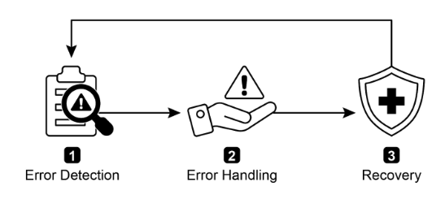
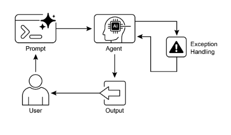

# 第 12 章：Exception Handling and Recovery（异常处理和恢复）

对于 AI 智能体来说，要在多样化的现实世界环境中可靠运行，它们必须能够管理意外情况、错误和故障。就像人类适应意外障碍一样，智能智能体需要强大的系统来检测问题、启动恢复程序，或至少确保受控故障。这一基本需求构成了异常处理和恢复（Exception Handling and Recovery）模式的基础。

此模式专注于开发异常耐用和弹性的智能体，这些智能体可以在各种困难和异常情况下保持不间断的功能和操作完整性。它强调了主动准备和反应策略的重要性，以确保即使在面临挑战时也能持续运行。这种适应性对于智能体在复杂和不可预测的环境中成功运行至关重要，最终提高了它们的整体有效性和可信度。

处理意外事件的能力确保这些 AI 系统不仅智能，而且稳定可靠，这促进了对其部署和性能的更大信心。集成全面的监控和诊断工具进一步增强了智能体快速识别和解决问题的能力，防止潜在的干扰并确保在不断变化的条件下的更平稳运行。这些高级系统对于维护 AI 操作的完整性和效率至关重要，加强了它们管理复杂性和不可预测性的能力。

此模式有时可以与反思一起使用。例如，如果初始尝试失败并引发异常，反思过程可以分析失败并使用改进的方法（如改进的提示）重新尝试任务，以解决错误。

## 异常处理和恢复模式概述

异常处理和恢复模式解决了 AI 智能体管理操作失败的需求。此模式涉及预期潜在问题，如工具错误或服务不可用，并制定策略来缓解它们。这些策略可能包括错误日志记录、重试、回退、优雅降级和通知。此外，该模式强调恢复机制，如状态回滚、诊断、自我纠正和升级，以将智能体恢复到稳定运行。实现此模式增强了 AI 智能体的可靠性和健壮性，使它们能够在不可预测的环境中运行。实际应用的示例包括管理数据库错误的聊天机器人、处理金融错误的交易机器人以及解决设备故障的智能家居智能体。该模式确保智能体在遇到复杂性和失败时能够继续有效运行。



图 1：AI 智能体异常处理和恢复的关键组件

**错误检测：** 这涉及仔细识别出现的操作问题。这可能表现为无效或格式错误的工具输出、特定的 API 错误（如 404（未找到）或 500（内部服务器错误）代码）、来自服务或 API 的异常长的响应时间，或偏离预期格式的连贯和无意义的响应。此外，可能会实现由其他智能体或专业监控系统进行的监控，以便更主动地检测异常，使系统能够在潜在问题升级之前捕获它们。

**错误处理：** 一旦检测到错误，仔细考虑的响应计划是必要的。这包括在日志中仔细记录错误详细信息以供以后调试和分析（日志记录）。重试操作或请求，有时使用稍微调整的参数，可能是一个可行的策略，特别是对于瞬态错误（重试）。利用替代策略或方法（回退）可以确保维持某些功能。在不可能立即完全恢复的情况下，智能体可以保持部分功能以至少提供一些价值（优雅降级）。最后，对于需要人工干预或协作的情况，向人工操作员或其他智能体发出警报可能是至关重要的（通知）。

**恢复：** 此阶段是关于在错误后将智能体或系统恢复到稳定和操作状态。它可能涉及反转最近的更改或事务以撤销错误的影响（状态回滚）。对错误原因进行彻底调查对于防止再次发生至关重要。可能需要通过自我纠正机制或重新规划过程调整智能体的计划、逻辑或参数，以避免将来出现相同的错误。在复杂或严重的情况下，将问题委托给人工操作员或更高级别的系统（升级）可能是最佳行动方案。

实现此强大的异常处理和恢复模式可以将 AI 智能体从脆弱和不可靠的系统转变为能够在具有挑战性和高度不可预测的环境中有效和弹性运行的强大、可靠的组件。这确保智能体保持功能、最小化停机时间，即使在面临意外问题时也能提供无缝和可靠的体验。

## 实际应用与用例

异常处理和恢复对于部署在无法保证完美条件的现实世界场景中的任何智能体都是至关重要的。

* **客户服务聊天机器人：** 如果聊天机器人尝试访问客户数据库，而数据库暂时关闭，它不应该崩溃。相反，它应该检测 API 错误，告知用户临时问题，可能建议稍后再试，或将查询升级给人工代理。  
* **自动化金融交易：** 尝试执行交易的交易机器人可能遇到"资金不足"错误或"市场关闭"错误。它需要通过记录错误、不重复尝试相同的无效交易以及可能通知用户或调整其策略来处理这些异常。  
* **智能家居自动化：** 控制智能灯的智能体可能由于网络问题或设备故障而无法打开灯。它应该检测此失败，可能重试，如果仍然不成功，通知用户无法打开灯并建议手动干预。  
* **数据处理智能体：** 负责处理一批文档的智能体可能遇到损坏的文件。它应该跳过损坏的文件，记录错误，继续处理其他文件，并在最后报告跳过的文件，而不是停止整个过程。  
* **网络爬取智能体：** 当网络爬取智能体遇到 CAPTCHA、更改的网站结构或服务器错误（例如，404 未找到、503 服务不可用）时，它需要优雅地处理这些。这可能涉及暂停、使用代理或报告失败的特定 URL。  
* **机器人和制造业：** 执行装配任务的机械臂可能由于未对准而无法拾取组件。它需要检测此失败（例如，通过传感器反馈），尝试重新调整，重试拾取，如果持续，则向人工操作员发出警报或切换到不同的组件。

简而言之，此模式对于构建不仅智能而且可靠、弹性并在面对现实世界复杂性时用户友好的智能体至关重要。

## 实践代码示例（ADK）

异常处理和恢复对于系统健壮性和可靠性至关重要。例如，考虑智能体对失败工具调用的响应。这种失败可能源于不正确的工具输入或工具依赖的外部服务的问题。

```python
from google.adk.agents import Agent, SequentialAgent


# Agent 1: Tries the primary tool. Its focus is narrow and clear.
primary_handler = Agent(
    name="primary_handler",
    model="gemini-2.0-flash-exp",
    instruction="""
    Your job is to get precise location information. Use the get_precise_location_info
    tool with the user's provided address.
    """,
    tools=[get_precise_location_info],
)

# Agent 2: Acts as the fallback handler, checking state to decide its action.
fallback_handler = Agent(
    name="fallback_handler",
    model="gemini-2.0-flash-exp",
    instruction="""
    Check if the primary location lookup failed by looking at state["primary_location_failed"].
    - If it is True, extract the city from the user's original query and use the get_general_area_info tool.
    - If it is False, do nothing.
    """,
    tools=[get_general_area_info],
)

# Agent 3: Presents the final result from the state.
response_agent = Agent(
    name="response_agent",
    model="gemini-2.0-flash-exp",
    instruction="""
    Review the location information stored in state["location_result"]. Present this information
    clearly and concisely to the user. If state["location_result"] does not exist or is empty,
    apologize that you could not retrieve the location.
    """,
    tools=[],  # This agent only reasons over the final state.
)

# The SequentialAgent ensures the handlers run in a guaranteed order.
robust_location_agent = SequentialAgent(
    name="robust_location_agent",
    sub_agents=[primary_handler, fallback_handler, response_agent],
)
```

此代码使用 ADK 的 SequentialAgent 定义了一个健壮的位置检索系统，具有三个子智能体。`primary_handler` 是第一个智能体，尝试使用 `get_precise_location_info` 工具获取精确位置信息。`fallback_handler` 充当备份，通过检查状态变量来检查主要查找是否失败。如果主要查找失败，回退智能体从用户的查询中提取城市并使用 `get_general_area_info` 工具。`response_agent` 是序列中的最终智能体。它审查存储在状态中的位置信息。此智能体设计用于向用户呈现最终结果。如果未找到位置信息，它会道歉。SequentialAgent 确保这三个智能体以预定义的顺序执行。此结构允许对位置信息检索采用分层方法。

## 概览

**什么：** 在现实世界环境中运行的 AI 智能体不可避免地会遇到意外情况、错误和系统故障。这些中断可能范围从工具失败和网络问题到无效数据，威胁智能体完成任务的能力。没有结构化方式来管理这些问题，智能体可能是脆弱的、不可靠的，并且在面临意外障碍时容易完全失败。这种不可靠性使得难以在需要一致性能的关键或复杂应用程序中部署它们。

**为什么：** 异常处理和恢复模式为构建强大和弹性的 AI 智能体提供了标准化解决方案。它使它们具备预期、管理和从操作失败中恢复的智能体能力。该模式涉及主动错误检测，如监控工具输出和 API 响应，以及反应性处理策略，如用于诊断的日志记录、重试瞬态失败或使用回退机制。对于更严重的问题，它定义了恢复协议，包括恢复到稳定状态、通过调整其计划进行自我纠正，或将问题升级给人工操作员。这种系统方法确保智能体能够维护操作完整性、从失败中学习，并在不可预测的环境中可靠地运行。

**经验法则：** 对于部署在动态、现实世界环境中的任何 AI 智能体使用此模式，其中系统失败、工具错误、网络问题或不可预测的输入是可能的，操作可靠性是关键要求。

**可视化摘要：**



图 2：异常处理模式

## 关键要点

要记住的要点：

* 异常处理和恢复对于构建强大和可靠的智能体至关重要。  
* 此模式涉及检测错误、优雅地处理它们并实现恢复策略。  
* 错误检测可能涉及验证工具输出、检查 API 错误代码和使用超时。  
* 处理策略包括日志记录、重试、回退、优雅降级和通知。  
* 恢复侧重于通过诊断、自我纠正或升级恢复稳定运行。  
* 此模式确保智能体即使在不可预测的现实世界环境中也能有效运行。

## 结论

本章探讨了异常处理和恢复模式，这对于开发强大和可靠的 AI 智能体至关重要。此模式解决了 AI 智能体如何识别和管理意外问题、实施适当的响应并恢复到稳定的操作状态。本章讨论了此模式的各种方面，包括错误检测、通过日志记录、重试和回退等机制处理这些错误，以及用于将智能体或系统恢复到正常功能的策略。异常处理和恢复模式的实际应用在几个领域中进行了说明，以展示其在处理现实世界复杂性和潜在失败方面的相关性。这些应用展示了为 AI 智能体配备异常处理能力如何有助于它们在动态环境中的可靠性和适应性。

## 参考文献

1. McConnell, S. (2004). *Code Complete (2nd ed.)*. Microsoft Press.
2. Shi, Y., Pei, H., Feng, L., Zhang, Y., & Yao, D. (2024). *Towards Fault Tolerance in Multi-Agent Reinforcement Learning*. arXiv preprint arXiv:2412.00534.
3. O'Neill, V. (2022). *Improving Fault Tolerance and Reliability of Heterogeneous Multi-Agent IoT Systems Using Intelligence Transfer*. Electronics, 11(17), 2724.
