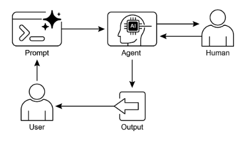

# 第 13 章：Human-in-the-Loop（人在回路）

人在回路（Human-in-the-Loop，HITL）模式代表了智能体开发和部署中的关键策略。它有意地将人类认知的独特优势（如判断、创造力和细致理解）与 AI 的计算能力和效率交织在一起。这种战略集成不仅仅是一个选项，而且往往是一个必要条件，特别是当 AI 系统越来越多地嵌入到关键决策过程中时。

HITL 的核心原则是确保 AI 在道德边界内运行，遵守安全协议，并以最佳有效性实现其目标。这些关注在以复杂性、模糊性或重大风险为特征的领域中尤其突出，其中 AI 错误或误解的影响可能是重大的。在这种情况下，完全自主——AI 系统在没有任何人工干预的情况下独立运行——可能被证明是不明智的。HITL 承认这一现实，并强调即使 AI 技术快速进步，人工监督、战略输入和协作交互仍然不可或缺。

HITL 方法从根本上围绕着人工和人类智能之间协同作用的思想。与其将 AI 视为人类工人的替代品，HITL 将 AI 定位为增强和提升人类能力的工具。这种增强可以采取各种形式，从自动化日常任务到提供数据驱动的洞察以告知人类决策。最终目标是创建一个协作生态系统，其中人类和 AI 智能体都可以利用它们的独特优势来实现任何一方都无法单独完成的成果。

在实践中，HITL 可以以多种方式实现。一种常见方法涉及人类充当验证者或审查者，检查 AI 输出以确保准确性并识别潜在错误。另一种实现涉及人类主动指导 AI 行为，提供反馈或实时进行纠正。在更复杂的设置中，人类可能与 AI 作为合作伙伴协作，通过交互式对话或共享接口共同解决问题或做出决策。无论具体实现如何，HITL 模式都强调了维护人类控制和监督的重要性，确保 AI 系统与人类道德、价值观、目标和社会期望保持一致。

## 人在回路模式概述

人在回路（Human-in-the-Loop，HITL）模式将人工智能与人类输入集成，以增强智能体能力。此方法承认，最优 AI 性能通常需要自动化处理和人类洞察的组合，特别是在具有高复杂性或道德考虑的场景中。与其替代人类输入，HITL 旨在通过确保关键判断和决策由人类理解告知来增强人类能力。

HITL 包括几个关键方面：人工监督，涉及监控 AI 智能体性能和输出（例如，通过日志审查或实时仪表板）以确保遵守指南并防止不良结果。干预和纠正发生在 AI 智能体遇到错误或模糊场景并可能请求人工干预时；人工操作员可以纠正错误、提供缺失数据或指导智能体，这也为未来的智能体改进提供信息。用于学习的人类反馈被收集并用于改进 AI 模型，在像人类反馈强化学习这样的方法中尤为突出，其中人类偏好直接影响智能体的学习轨迹。决策增强是 AI 智能体向人类提供分析和建议，然后人类做出最终决策，通过 AI 生成的洞察增强人类决策，而不是完全自主。人-智能体协作是一种协作交互，其中人类和 AI 智能体贡献各自优势；常规数据处理可能由智能体处理，而创造性问题解决或复杂谈判由人类管理。最后，升级策略是建立的协议，规定智能体何时以及如何将任务升级给人工操作员，防止在超出智能体能力的情况下的错误。

实现 HITL 模式使能够在完全自主不可行或不允许的敏感部门中使用智能体。它还通过反馈循环提供了持续改进的机制。例如，在金融领域，大型公司贷款的最终批准需要人工贷款官员评估定性因素，如领导力 character。类似地，在法律领域，正义和问责的核心原则要求人类法官保留对关键决策（如量刑）的最终权威，这些决策涉及复杂的道德推理。

> **注意事项：** 尽管有其好处，HITL 模式有重要的注意事项，其中最主要的是缺乏可扩展性。虽然人工监督提供高准确性，但操作员无法管理数百万个任务，创造了基本的权衡，通常需要结合自动化的规模和 HITL 的准确性的混合方法。此外，此模式的有效性在很大程度上依赖于人工操作员的专业知识；例如，虽然 AI 可以生成软件代码，但只有熟练的开发者才能准确识别细微错误并提供正确的指导来修复它们。这种对专业知识的需求也适用于使用 HITL 生成训练数据时，因为人类注释者可能需要特殊培训来学习如何以产生高质量数据的方式纠正 AI。最后，实现 HITL 提出了重大的隐私关注，因为敏感信息在暴露给人工操作员之前通常必须严格匿名化，增加了过程的复杂性。

## 实际应用与用例

人在回路模式在广泛的行业和应用程序中至关重要，特别是在准确性、安全性、道德或细致理解至关重要的地方。

* **内容审核：** AI 智能体可以快速过滤大量在线内容以查找违规行为（例如，仇恨言论、垃圾邮件）。然而，模糊案例或边界内容被升级给人工审核员进行审查和最终决策，确保细致判断并遵守复杂政策。  
* **自动驾驶：** 虽然自动驾驶汽车自主处理大多数驾驶任务，但它们设计为在 AI 无法自信导航的复杂、不可预测或危险情况（例如，极端天气、异常道路条件）中将控制权移交给人类驾驶员。  
* **金融欺诈检测：** AI 系统可以基于模式标记可疑交易。然而，高风险或模糊的警报通常发送给人工分析师，他们进一步调查、联系客户并做出交易是否欺诈的最终确定。  
* **法律文件审查：** AI 可以快速扫描和分类数千份法律文件以识别相关条款或证据。然后，人类法律专业人士审查 AI 的发现以获取准确性、上下文和法律含义，特别是对于关键案例。  
* **客户支持（复杂查询）：** 聊天机器人可能处理常规客户询问。如果用户的问题太复杂、情绪激动或需要 AI 无法提供的同理心，对话会无缝移交给人工支持代理。  
* **数据标注和注释：** AI 模型通常需要大量标记数据的数据集进行训练。人类被置于循环中以准确标记图像、文本或音频，提供 AI 学习的真实数据。这是一个持续的过程，因为模型在演进。  
* **生成式 AI 改进：** 当 LLM 生成创意内容（例如，营销文案、设计想法）时，人类编辑或设计师审查和改进输出，确保它满足品牌指南、与目标受众产生共鸣并保持质量。  
* **自主网络：** AI 系统能够通过利用关键性能指标（KPI）和识别的模式分析警报并预测网络问题和流量异常。然而，关键决策——如处理高风险警报——经常升级给人工分析师。这些分析师进行进一步调查并做出关于批准网络更改的最终确定。

此模式展示了 AI 实现的实用方法。它利用 AI 来增强可扩展性和效率，同时保持人工监督以确保质量、安全和道德合规。

"人在回路外（Human-on-the-loop）"是此模式的一种变体，其中人类专家定义总体政策，然后 AI 处理即时行动以确保合规。让我们考虑两个示例：

* **自动化金融交易系统：** 在此场景中，人类金融专家设置总体投资策略和规则。例如，人类可能将政策定义为："保持 70% 科技股和 30% 债券的投资组合，不要在任何单一公司投资超过 5%，并自动卖出任何低于其购买价格 10% 的股票。"然后 AI 实时监控股票市场，当满足这些预定义条件时立即执行交易。AI 基于人工操作员设置的较慢、更具战略性的政策处理即时、高速的行动。  
* **现代呼叫中心：** 在此设置中，人类管理者建立客户交互的高级政策。例如，管理者可能设置规则，如"任何提及'服务中断'的呼叫应立即路由到技术支持专家"，或"如果客户的语气表明高度沮丧，系统应主动将他们直接连接到人工代理。"然后 AI 系统处理初始客户交互，实时听取和解释他们的需求。它自主执行管理者的政策，通过即时路由呼叫或提供升级而无需为每个个别案例进行人工干预。这允许 AI 根据人工操作员提供的较慢、战略性指导管理大量的即时行动。

## 实践代码示例

为了演示人在回路模式，ADK 智能体可以识别需要人工审查的场景并启动升级过程。这允许在智能体的自主决策能力有限或需要复杂判断的情况下进行人工干预。这不是一个孤立的功能；其他流行的框架也采用了类似的能力。例如，LangChain 还提供了实现这些类型交互的工具。

```python
from typing import Optional

from google.adk.agents import Agent
from google.adk.tools.tool_context import ToolContext
from google.adk.callbacks import CallbackContext
from google.adk.models.llm import LlmRequest
from google.genai import types


# Placeholder for tools (replace with actual implementations if needed)
def troubleshoot_issue(issue: str) -> dict:
    return {"status": "success", "report": f"Troubleshooting steps for {issue}."}


def create_ticket(issue_type: str, details: str) -> dict:
    return {"status": "success", "ticket_id": "TICKET123"}


def escalate_to_human(issue_type: str) -> dict:
    # This would typically transfer to a human queue in a real system
    return {"status": "success", "message": f"Escalated {issue_type} to a human specialist."}


technical_support_agent = Agent(
    name="technical_support_specialist",
    model="gemini-2.0-flash-exp",
    instruction="""
    You are a technical support specialist for our electronics company.
    FIRST, check if the user has a support history in state["customer_info"]["support_history"].
    If they do, reference this history in your responses.

    For technical issues:
    1. Use the troubleshoot_issue tool to analyze the problem.
    2. Guide the user through basic troubleshooting steps.
    3. If the issue persists, use create_ticket to log the issue.

    For complex issues beyond basic troubleshooting:
    1. Use escalate_to_human to transfer to a human specialist.

    Maintain a professional but empathetic tone. Acknowledge the frustration technical issues can cause,
    while providing clear steps toward resolution.
    """,
    tools=[troubleshoot_issue, create_ticket, escalate_to_human],
)


def personalization_callback(
    callback_context: CallbackContext, llm_request: LlmRequest
) -> Optional[LlmRequest]:
    """Adds personalization information to the LLM request."""
    # Get customer info from state
    customer_info = callback_context.state.get("customer_info")
    if customer_info:
        customer_name = customer_info.get("name", "valued customer")
        customer_tier = customer_info.get("tier", "standard")
        recent_purchases = customer_info.get("recent_purchases", [])

        personalization_note = (
            f"\nIMPORTANT PERSONALIZATION:\n"
            f"Customer Name: {customer_name}\n"
            f"Customer Tier: {customer_tier}\n"
        )
        if recent_purchases:
            personalization_note += f"Recent Purchases: {', '.join(recent_purchases)}\n"

        if llm_request.contents:
            # Add as a system message before the first content
            system_content = types.Content(
                role="system",
                parts=[types.Part(text=personalization_note)],
            )
            llm_request.contents.insert(0, system_content)

    return None  # Return None to continue with the modified request
```

此代码提供了使用 Google 的 ADK 创建技术支持智能体的蓝图，围绕 HITL 框架设计。智能体充当智能的第一线支持，配置了特定指令并配备了工具（如 `troubleshoot_issue`、`create_ticket` 和 `escalate_to_human`）以管理完整的支持工作流。升级工具是 HITL 设计的核心部分，确保复杂或敏感的案例被传递给人类专家。

此架构的一个关键特征是其深度个性化的能力，通过专用回调函数实现。在联系 LLM 之前，此函数从智能体的状态中动态检索客户特定数据——如他们的姓名、级别和购买历史。然后，此上下文作为系统消息注入到提示中，使智能体能够提供高度定制和知情的响应，引用用户的历史。通过将结构化工作流与必要的人工监督和动态个性化相结合，此代码作为 ADK 如何促进开发复杂和强大的 AI 支持解决方案的实用示例。

## 概览

**什么：** AI 系统，包括高级 LLM，通常在需要细致判断、道德推理或对复杂、模糊上下文的深入理解的任务中挣扎。在高风险环境中部署完全自主的 AI 带有重大风险，因为错误可能导致严重的安全、财务或道德后果。这些系统缺乏人类拥有的固有创造力和常识推理。因此，在关键决策过程中完全依赖自动化往往是不明智的，并可能破坏系统的整体有效性和可信度。

**为什么：** 人在回路（Human-in-the-Loop，HITL）模式通过战略性地将人工监督集成到 AI 工作流中来提供标准化解决方案。这种智能体方法创建了共生伙伴关系，其中 AI 处理计算繁重的工作和数据处理，而人类提供关键的验证、反馈和干预。通过这样做，HITL 确保 AI 行动与人类价值观和安全协议保持一致。这种协作框架不仅减轻了完全自动化的风险，还通过从人类输入中持续学习来增强系统的能力。最终，这导致了更强大、准确和道德的结果，这是人类和 AI 都无法单独实现的。

**经验法则：** 当在错误具有重大安全、道德或财务后果的领域（如医疗保健、金融或自主系统）中部署 AI 时，使用此模式。它对于涉及 LLM 无法可靠处理的模糊性和细微差别的任务至关重要，如内容审核或复杂的客户支持升级。当目标是通过高质量、人类标记的数据持续改进 AI 模型或改进生成式 AI 输出以满足特定质量标准时，使用 HITL。

**可视化摘要：**



图 1：人在回路设计模式

## 关键要点

关键要点包括：

* 人在回路（Human-in-the-Loop，HITL）将人类智能和判断集成到 AI 工作流中。  
* 它在复杂或高风险场景中对安全性、道德和有效性至关重要。  
* 关键方面包括人工监督、干预、用于学习的反馈和决策增强。  
* 升级策略对于智能体知道何时移交给人类至关重要。  
* HITL 允许负责任的 AI 部署和持续改进。  
* 人在回路的主要缺点是其固有的缺乏可扩展性，在准确性和数量之间创造权衡，以及其对高技能领域专家进行有效干预的依赖。  
* 其实施提出了操作挑战，包括需要培训人工操作员进行数据生成以及通过匿名化敏感信息来解决隐私关注。

## 结论

本章探讨了关键的人在回路（Human-in-the-Loop，HITL）模式，强调了它在创建强大、安全和道德的 AI 系统中的作用。我们讨论了如何将人工监督、干预和反馈集成到智能体工作流中可以显著增强其性能和可信度，特别是在复杂和敏感的领域中。实际应用展示了 HITL 的广泛实用性，从内容审核和医疗诊断到自动驾驶和客户支持。概念代码示例提供了对 ADK 如何通过升级机制促进这些人-智能体交互的一瞥。随着 AI 能力持续进步，HITL 仍然是负责任的 AI 开发的基石，确保人类价值观和专业知识在智能系统设计中保持中心地位。

## 参考文献

1. A Survey of Human-in-the-loop for Machine Learning, Xingjiao Wu, Luwei Xiao, Yixuan Sun, Junhang Zhang, Tianlong Ma, Liang He, [https://arxiv.org/abs/2108.00941](https://arxiv.org/abs/2108.00941)
