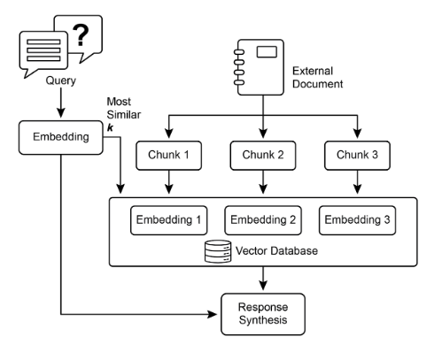
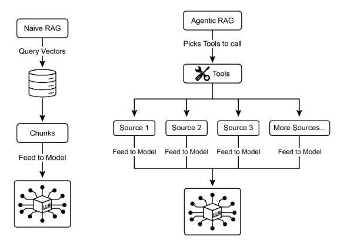
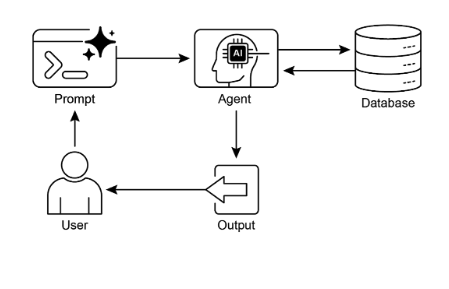
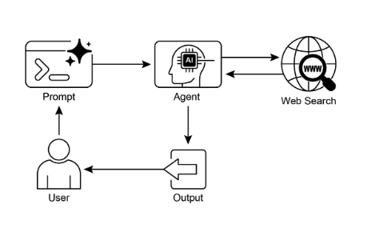

# 第 14 章：知识检索（RAG）

LLM 在生成类人文本方面表现出强大的能力。然而，它们的知识库通常局限于它们训练时使用的数据，限制了它们对实时信息、特定公司数据或高度专业化细节的访问。知识检索（RAG，即检索增强生成）解决了这一限制。RAG 使 LLM 能够访问和集成外部、当前和上下文特定的信息，从而增强其输出的准确性、相关性和事实基础。

对于 AI 智能体，这至关重要，因为它允许它们将行动和响应基于实时、可验证的数据，超越其静态训练。这种能力使它们能够准确执行复杂任务，例如访问最新公司政策以回答特定问题，或在下订单前检查当前库存。通过集成外部知识，RAG 将智能体从简单的对话者转变为能够执行有意义工作的有效、数据驱动的工具。

## 知识检索（RAG）模式概述

知识检索（RAG）模式通过授予 LLM 在生成响应之前访问外部知识库的能力，显著增强了 LLM 的能力。与其仅仅依赖其内部的、预训练的知识，RAG 允许 LLM "查找"信息，就像人类可能查阅书籍或搜索互联网一样。此过程使 LLM 能够提供更准确、最新和可验证的答案。

当用户向使用 RAG 的 AI 系统提出问题时，查询不会直接发送给 LLM。相反，系统首先在庞大的外部知识库中搜索相关信息——一个高度组织的文档、数据库或网页库。此搜索不是简单的关键词匹配；它是一种"语义搜索"，理解用户的意图和他们话语背后的含义。此初始搜索提取最相关的信息片段或"块"。然后，这些提取的片段被"增强"或添加到原始提示中，创建一个更丰富、更知情的查询。最后，此增强的提示被发送给 LLM。有了这个额外的上下文，LLM 可以生成不仅流畅和自然，而且基于检索数据的事实依据的响应。

RAG 框架提供了几个显著的好处。它允许 LLM 访问最新信息，从而克服其静态训练数据的限制。这种方法还通过将响应基于可验证的数据来减少"幻觉"的风险——生成虚假信息。此外，LLM 可以利用在公司内部文档或维基中找到的专业知识。此过程的一个关键优势是能够提供"引用"，这些引用精确指出了信息的来源，从而增强了 AI 响应的可信度和可验证性。

要充分理解 RAG 的工作原理，必须理解几个核心概念（见图 1）：

### 嵌入（Embeddings）

在 LLM 的上下文中，嵌入是文本的数值表示，如单词、短语或整个文档。这些表示是向量的形式，即数字列表。关键思想是在数学空间中捕获语义含义和不同文本片段之间的关系。具有相似含义的单词或短语将在此向量空间中具有彼此更接近的嵌入。例如，想象一个简单的 2D 图。单词"cat"可能由坐标 (2, 3) 表示，而"kitten"会非常接近 (2.1, 3.1)。相比之下，单词"car"会有一个遥远的坐标，如 (8, 1)，反映其不同的含义。实际上，这些嵌入在具有数百甚至数千维的高维空间中，允许对语言进行非常细致的理解。

### 文本相似性

文本相似性是指两段文本相似程度的度量。这可以在表面层次上，查看单词的重叠（词汇相似性），或在更深层次、基于含义的层次上。在 RAG 的上下文中，文本相似性对于在知识库中找到与用户查询对应的最相关信息至关重要。例如，考虑句子："What is the capital of France?"和"Which city is the capital of France?"。虽然措辞不同，但它们问的是同一个问题。一个好的文本相似性模型会识别这一点，并为这两个句子分配高相似性分数，即使它们只共享几个单词。这通常使用文本的嵌入来计算。

### 语义相似性和距离

语义相似性是文本相似性的更高级形式，纯粹关注文本的含义和上下文，而不仅仅是使用的单词。它旨在理解两段文本是否传达相同的概念或想法。语义距离是相反的；高语义相似性意味着低语义距离，反之亦然。在 RAG 中，语义搜索依赖于找到与用户查询具有最小语义距离的文档。例如，短语"a furry feline companion"和"a domestic cat"除了"a"之外没有共同的单词。然而，理解语义相似性的模型会识别它们指的是同一件事，并认为它们非常相似。这是因为它们的嵌入在向量空间中会非常接近，表明语义距离很小。这就是"智能搜索"，允许 RAG 在用户的措辞与知识库中的文本不完全匹配时找到相关信息。



图 1：RAG 核心概念：分块、嵌入和向量数据库

### 文档分块

分块是将大型文档分解为更小、更易管理的片段或"块"的过程。为了使 RAG 系统高效工作，它不能将整个大型文档输入 LLM。相反，它处理这些较小的块。文档的分块方式对于保留信息的上下文和含义很重要。例如，与其将 50 页的用户手册视为单个文本块，分块策略可能将其分解为章节、段落甚至句子。例如，"故障排除"部分将与"安装指南"分开成为不同的块。当用户询问特定问题时，RAG 系统可以检索最相关的故障排除块，而不是整个手册。这使检索过程更快，提供给 LLM 的信息更聚焦于用户的即时需求。一旦文档被分块，RAG 系统必须采用检索技术来找到给定查询最相关的片段。主要方法是向量搜索，它使用嵌入和语义距离来找到在概念上与用户问题相似的块。一个较旧但仍然有价值的技术是 BM25，这是一种基于关键词的算法，根据词频对块进行排名，但不理解语义含义。为了两全其美，通常使用混合搜索方法，将 BM25 的关键词精确性与语义搜索的上下文理解相结合。这种融合允许更强大和准确的检索，捕获字面匹配和概念相关性。

### 向量数据库

向量数据库是一种专门设计的数据库类型，用于高效存储和查询嵌入。在文档被分块并转换为嵌入后，这些高维向量被存储在向量数据库中。传统的检索技术，如基于关键词的搜索，在查找包含查询中确切单词的文档方面表现出色，但缺乏对语言的深入理解。它们不会识别"furry feline companion"的意思是"cat"。这就是向量数据库的擅长之处。它们专门为语义搜索而构建。通过将文本存储为数值向量，它们可以根据概念含义找到结果，而不仅仅是关键词重叠。当用户的查询也被转换为向量时，数据库使用高度优化的算法（如 HNSW - 分层导航小世界）快速搜索数百万个向量，并找到在含义上"最接近"的向量。这种方法对于 RAG 来说要优越得多，因为它即使在使用者的措辞与源文档完全不同时也能发现相关上下文。本质上，虽然其他技术搜索单词，但向量数据库搜索含义。这项技术以各种形式实现，从托管数据库如 Pinecone 和 Weaviate 到开源解决方案如 Chroma DB、Milvus 和 Qdrant。甚至现有数据库也可以通过向量搜索功能进行增强，如 Redis、Elasticsearch 和 Postgres（使用 pgvector 扩展）所见。核心检索机制通常由 Meta AI 的 FAISS 或 Google Research 的 ScaNN 等库提供支持，这些库对这些系统的效率至关重要。

### RAG 的挑战

尽管 RAG 功能强大，但 RAG 模式并非没有挑战。一个主要问题出现在回答查询所需的信息不局限于单个块，而是分布在文档的多个部分甚至多个文档中时。在这种情况下，检索器可能无法收集所有必要的上下文，导致不完整或不准确的答案。系统的有效性还高度依赖于分块和检索过程的质量；如果检索到不相关的块，它可能会引入噪声并使 LLM 混淆。此外，有效地综合来自可能矛盾来源的信息仍然是这些系统面临的重大障碍。除此之外，另一个挑战是 RAG 要求整个知识库被预处理并存储在专门的数据库中，如向量或图数据库，这是一项相当艰巨的任务。因此，这些知识需要定期协调以保持最新，在处理不断发展的来源（如公司维基）时，这是一项关键任务。整个过程可能对性能产生明显影响，增加延迟、运营成本以及最终提示中使用的令牌数量。

总之，检索增强生成（RAG）模式代表了使 AI 更加知识渊博和可靠的重要飞跃。通过将外部知识检索步骤无缝集成到生成过程中，RAG 解决了独立 LLM 的一些核心限制。嵌入和语义相似性的基础概念，结合关键词和混合搜索等检索技术，允许系统智能地找到相关信息，通过战略性分块使其变得可管理。整个检索过程由专门设计的向量数据库提供支持，用于大规模存储和高效查询数百万个嵌入。虽然检索碎片化或矛盾信息的挑战仍然存在，但 RAG 使 LLM 能够产生不仅在上下文中适当，而且基于可验证事实的答案，在 AI 中培养更大的信任和实用性。

### 图 RAG（GraphRAG）

GraphRAG 是检索增强生成的高级形式，它利用知识图而不是简单的向量数据库进行信息检索。它通过导航此结构化知识库中数据实体（节点）之间的显式关系（边）来回答复杂查询。一个关键优势是其综合来自分布在多个文档中的信息的答案的能力，这是传统 RAG 的常见失败。通过理解这些连接，GraphRAG 提供更上下文准确和细致的响应。

用例包括复杂的财务分析、将公司与市场事件联系起来，以及用于发现基因与疾病之间关系的科学研究。然而，主要缺点是构建和维护高质量知识图所需的显著复杂性、成本和专业知识。与更简单的向量搜索系统相比，这种设置也不太灵活，并可能引入更高的延迟。系统的有效性完全依赖于底层图结构的质量和完整性。因此，GraphRAG 为复杂问题提供了优越的上下文推理，但实施和维护成本要高得多。总之，它在深度、相互关联的洞察比标准 RAG 的速度和简单性更关键的情况下表现出色。

### 智能体 RAG（Agentic RAG）

此模式的演进，称为**智能体 RAG**（见图 2），引入了推理和决策层，以显著增强信息提取的可靠性。与其仅仅检索和增强，一个"智能体"——一个专门的 AI 组件——充当知识的关键看门人和精炼者。与其被动地接受最初检索的数据，此智能体主动询问其质量、相关性和完整性，如下面场景所示。

首先，智能体擅长反思和源验证。如果用户问："我们公司关于远程工作的政策是什么？"标准的 RAG 可能会同时拉出 2020 年的博客文章和官方的 2025 年政策文档。然而，智能体会分析文档的元数据，识别 2025 年政策为最新和权威的来源，并在将正确的上下文发送给 LLM 以获得精确答案之前丢弃过时的博客文章。



图 2：智能体 RAG 引入了一个推理智能体，主动评估、协调和精炼检索的信息，以确保更准确和可信的最终响应。

其次，智能体擅长协调知识冲突。想象一个财务分析师问："Project Alpha 的 Q1 预算是多少？"系统检索到两个文档：一个初始提案声明预算为 50,000 欧元，一个最终财务报告列出为 65,000 欧元。智能体 RAG 会识别此矛盾，优先考虑财务报告作为更可靠的来源，并向 LLM 提供验证的数字，确保最终答案基于最准确的数据。

第三，智能体可以执行多步推理以综合复杂答案。如果用户问："我们产品的功能和定价与竞争对手 X 相比如何？"智能体会将此分解为单独的子查询。它会启动对其自身产品功能、其定价、竞争对手 X 的功能和竞争对手 X 的定价的独立搜索。在收集这些单独的信息片段后，智能体会将它们综合成一个结构化的、比较性的上下文，然后再将其提供给 LLM，使能够产生简单检索无法产生的全面响应。

第四，智能体可以识别知识差距并使用外部工具。假设用户问："市场对我们昨天推出的新产品的即时反应是什么？"智能体搜索内部知识库，该知识库每周更新，但找不到相关信息。识别到此差距，它可以激活一个工具——如实时网络搜索 API——以查找最近的新闻文章和社交媒体情绪。然后，智能体使用此新收集的外部信息提供最新的答案，克服其静态内部数据库的限制。

### 智能体 RAG 的挑战

尽管功能强大，但智能体层引入了自己的一系列挑战。主要缺点是复杂性和成本的显著增加。设计、实施和维护智能体的决策逻辑和工具集成需要大量的工程工作，并增加了计算费用。这种复杂性还可能导致延迟增加，因为智能体的反思、工具使用和多步推理循环比标准的直接检索过程需要更多时间。此外，智能体本身可能成为新的错误源；有缺陷的推理过程可能导致它陷入无用的循环、误解任务或不适当地丢弃相关信息，最终降低最终响应的质量。

### 总结

智能体 RAG 代表了标准检索模式的复杂演进，将其从被动数据管道转变为主动的问题解决框架。通过嵌入一个可以评估来源、协调冲突、分解复杂问题并使用外部工具的推理层，智能体显著提高了生成答案的可靠性和深度。这一进步使 AI 更加可信和强大，尽管它带来了系统复杂性、延迟和成本方面的重要权衡，必须仔细管理。

## 实际应用与用例

知识检索（RAG）正在改变大型语言模型（LLM）在各个行业中的使用方式，增强它们提供更准确和上下文相关响应的能力。

应用包括：

* **企业搜索和问答：** 组织可以开发内部聊天机器人，使用内部文档（如 HR 政策、技术手册和产品规格）回答员工询问。RAG 系统从这些文档中提取相关部分，以告知 LLM 的响应。  
* **客户支持和帮助台：** 基于 RAG 的系统可以通过访问产品手册、常见问题（FAQ）和支持票中的信息，为客户查询提供精确和一致的响应。这可以减少对常规问题进行直接人工干预的需求。  
* **个性化内容推荐：** 与其基本关键词匹配，RAG 可以识别和检索在语义上与用户偏好或先前交互相关的内容（文章、产品），从而产生更相关的推荐。  
* **新闻和当前事件摘要：** LLM 可以与实时新闻源集成。当提示当前事件时，RAG 系统检索最近的文章，允许 LLM 产生最新的摘要。

通过纳入外部知识，RAG 将 LLM 的能力扩展到简单通信之外，使其作为知识处理系统发挥作用。

## 实践代码示例（ADK）

为了说明知识检索（RAG）模式，让我们看三个示例。

首先，是如何使用 Google Search 进行 RAG 并将 LLM 基于搜索结果。由于 RAG 涉及访问外部信息，Google Search 工具是内置检索机制的直接示例，可以增强 LLM 的知识。

```python
from google.adk.tools import google_search
from google.adk.agents import Agent


search_agent = Agent(
    name="research_assistant",
    model="gemini-2.0-flash-exp",
    instruction="You help users research topics. When asked, use the Google Search tool",
    tools=[google_search],
)
```

其次，本节解释了如何在 Google ADK 中使用 Vertex AI RAG 功能。提供的代码演示了从 ADK 初始化 VertexAiRagMemoryService。这允许建立与 Google Cloud Vertex AI RAG Corpus 的连接。通过指定语料库资源名称和可选参数（如 `SIMILARITY_TOP_K` 和 `VECTOR_DISTANCE_THRESHOLD`）来配置服务。这些参数影响检索过程。`SIMILARITY_TOP_K` 定义要检索的顶级相似结果的数量。`VECTOR_DISTANCE_THRESHOLD` 为检索结果设置语义距离的限制。此设置使智能体能够从指定的 RAG Corpus 执行可扩展和持久的语义知识检索。该过程有效地将 Google Cloud 的 RAG 功能集成到 ADK 智能体中，从而支持基于事实数据开发响应。

```python
# Import the necessary VertexAiRagMemoryService class from the google.adk.memory module.
from google.adk.memory import VertexAiRagMemoryService


RAG_CORPUS_RESOURCE_NAME = "projects/your-gcp-project-id/locations/us-central1/ragCorpora/your-corpus-id"

# Define an optional parameter for the number of top similar results to retrieve.
# This controls how many relevant document chunks the RAG service will return.
SIMILARITY_TOP_K = 5

# Define an optional parameter for the vector distance threshold.
# This threshold determines the maximum semantic distance allowed for retrieved results;
# results with a distance greater than this value might be filtered out.
VECTOR_DISTANCE_THRESHOLD = 0.7

# Initialize an instance of VertexAiRagMemoryService.
# This sets up the connection to your Vertex AI RAG Corpus.
# - rag_corpus: Specifies the unique identifier for your RAG Corpus.
# - similarity_top_k: Sets the maximum number of similar results to fetch.
# - vector_distance_threshold: Defines the similarity threshold for filtering results.
memory_service = VertexAiRagMemoryService(
    rag_corpus=RAG_CORPUS_RESOURCE_NAME,
    similarity_top_k=SIMILARITY_TOP_K,
    vector_distance_threshold=VECTOR_DISTANCE_THRESHOLD,
)
```

## 实践代码示例（LangChain）

第三，让我们通过使用 LangChain 的完整示例。

```python
import os
import requests
from typing import List, Dict, Any, TypedDict

from langchain_community.document_loaders import TextLoader
from langchain_core.documents import Document
from langchain_core.prompts import ChatPromptTemplate
from langchain_core.output_parsers import StrOutputParser
from langchain_community.embeddings import OpenAIEmbeddings
from langchain_community.vectorstores import Weaviate
from langchain_openai import ChatOpenAI
from langchain.text_splitter import CharacterTextSplitter
from langchain.schema.runnable import RunnablePassthrough
from langgraph.graph import StateGraph, END

import weaviate
from weaviate.embedded import EmbeddedOptions
import dotenv


# Load environment variables (e.g., OPENAI_API_KEY)
dotenv.load_dotenv()

# Set your OpenAI API key (ensure it's loaded from .env or set here)
# os.environ["OPENAI_API_KEY"] = "YOUR_OPENAI_API_KEY"


# --- 1. Data Preparation (Preprocessing) ---

# Load data
url = "https://github.com/langchain-ai/langchain/blob/master/docs/docs/how_to/state_of_the_union.txt"
res = requests.get(url)
with open("state_of_the_union.txt", "w") as f:
    f.write(res.text)

loader = TextLoader("./state_of_the_union.txt")
documents = loader.load()

# Chunk documents
text_splitter = CharacterTextSplitter(chunk_size=500, chunk_overlap=50)
chunks = text_splitter.split_documents(documents)

# Embed and store chunks in Weaviate
client = weaviate.Client(embedded_options=EmbeddedOptions())

vectorstore = Weaviate.from_documents(
    client=client,
    documents=chunks,
    embedding=OpenAIEmbeddings(),
    by_text=False,
)

# Define the retriever
retriever = vectorstore.as_retriever()

# Initialize LLM
llm = ChatOpenAI(model_name="gpt-3.5-turbo", temperature=0)


# --- 2. Define the State for LangGraph ---
class RAGGraphState(TypedDict):
    question: str
    documents: List[Document]
    generation: str


# --- 3. Define the Nodes (Functions) ---
def retrieve_documents_node(state: RAGGraphState) -> RAGGraphState:
    """Retrieves documents based on the user's question."""
    question = state["question"]
    documents = retriever.invoke(question)
    return {"documents": documents, "question": question, "generation": ""}


def generate_response_node(state: RAGGraphState) -> RAGGraphState:
    """Generates a response using the LLM based on retrieved documents."""
    question = state["question"]
    documents = state["documents"]

    # Prompt template from the PDF
    template = """You are an assistant for question-answering tasks. Use the following pieces of retrieved context to answer the question. If you don't know the answer, just say that you don't know. Use three sentences maximum and keep the answer concise.
Question: {question}
Context: {context}
Answer: """
    prompt = ChatPromptTemplate.from_template(template)

    # Format the context from the documents
    context = "\n\n".join([doc.page_content for doc in documents])

    # Create the RAG chain
    rag_chain = prompt | llm | StrOutputParser()

    # Invoke the chain
    generation = rag_chain.invoke({"context": context, "question": question})

    return {"question": question, "documents": documents, "generation": generation}


# --- 4. Build the LangGraph Graph ---
workflow = StateGraph(RAGGraphState)

# Add nodes
workflow.add_node("retrieve", retrieve_documents_node)
workflow.add_node("generate", generate_response_node)

# Set the entry point
workflow.set_entry_point("retrieve")

# Add edges (transitions)
workflow.add_edge("retrieve", "generate")
workflow.add_edge("generate", END)

# Compile the graph
app = workflow.compile()


# --- 5. Run the RAG Application ---
if __name__ == "__main__":
    print("\n--- Running RAG Query ---")
    query = "What did the president say about Justice Breyer"
    inputs = {"question": query}
    for s in app.stream(inputs):
        print(s)

    print("\n--- Running another RAG Query ---")
    query_2 = "What did the president say about the economy?"
    inputs_2 = {"question": query_2}
    for s in app.stream(inputs_2):
        print(s)
```

此 Python 代码演示了使用 LangChain 和 LangGraph 实现的检索增强生成（RAG）管道。该过程始于从文本文档创建知识库，该文档被分段为块并转换为嵌入。然后，这些嵌入存储在 Weaviate 向量存储中，促进高效的信息检索。LangGraph 中的 StateGraph 用于管理两个关键函数之间的工作流：`retrieve_documents_node` 和 `generate_response_node`。`retrieve_documents_node` 函数查询向量存储以根据用户输入识别相关文档块。随后，`generate_response_node` 函数使用检索的信息和预定义的提示模板，使用 OpenAI 大型语言模型（LLM）生成响应。`app.stream` 方法允许通过 RAG 管道执行查询，展示了系统生成上下文相关输出的能力。

## 概览

**什么：** LLM 拥有令人印象深刻的文本生成能力，但从根本上受到其训练数据的限制。这些知识是静态的，意味着它不包括实时信息或私有、领域特定的数据。因此，它们的响应可能是过时的、不准确的，或缺乏专业任务所需的特定上下文。这一差距限制了它们对需要当前和事实答案的应用程序的可靠性。

**为什么：** 检索增强生成（RAG）模式通过将 LLM 连接到外部知识源来提供标准化解决方案。当收到查询时，系统首先从指定的知识库中检索相关信息片段。然后，这些片段被附加到原始提示中，用及时和特定的上下文丰富它。然后，此增强的提示被发送给 LLM，使其能够生成准确、可验证并基于外部数据的响应。此过程有效地将 LLM 从闭卷推理者转变为开卷推理者，显著增强了其实用性和可信度。

**经验法则：** 当您需要 LLM 基于特定、最新或专有信息（这些信息不是其原始训练数据的一部分）回答问题时，使用此模式。它非常适合在内部文档上构建问答系统、客户支持机器人和需要可验证、基于事实的响应和引用的应用程序。

**可视化摘要：**



知识检索模式：AI 智能体查询和从结构化数据库检索信息



图 3：知识检索模式：AI 智能体从公共互联网查找和综合信息以响应用户查询。

## 关键要点

关键要点包括：

* 知识检索（RAG）通过允许 LLM 访问外部、最新和特定的信息来增强 LLM。  
* 该过程涉及检索（在知识库中搜索相关片段）和增强（将这些片段添加到 LLM 的提示中）。  
* RAG 帮助 LLM 克服过时训练数据等限制，减少"幻觉"，并实现领域特定知识集成。  
* RAG 允许可归因的答案，因为 LLM 的响应基于检索的来源。  
* GraphRAG 利用知识图来理解不同信息片段之间的关系，使其能够回答需要综合来自多个来源的数据的复杂问题。  
* 智能体 RAG 通过使用智能智能体主动推理、验证和精炼外部知识，超越简单的信息检索，确保更准确和可靠的答案。  
* 实际应用涵盖企业搜索、客户支持、法律研究和个性化推荐。

## 结论

总之，检索增强生成（RAG）通过将大型语言模型的静态知识连接到外部、最新的数据源来解决其核心限制。该过程通过首先检索相关信息片段，然后增强用户的提示，使 LLM 能够生成更准确和上下文感知的响应。这是通过嵌入、语义搜索和向量数据库等基础技术实现的，这些技术根据含义而不仅仅是关键词来查找信息。通过将输出基于可验证的数据，RAG 显著减少了事实错误，并允许使用专有信息，通过引用增强信任。

一个高级的演进，智能体 RAG，引入了一个推理层，主动验证、协调和综合检索的知识，以获得更高的可靠性。类似地，像 GraphRAG 这样的专门方法利用知识图来导航显式数据关系，使系统能够综合高度复杂、相互关联的查询的答案。此智能体可以解决冲突信息、执行多步查询，并使用外部工具查找缺失数据。虽然这些高级方法增加了复杂性和延迟，但它们显著提高了最终响应的深度和可信度。这些模式的实际应用已经在改变行业，从企业搜索和客户支持到个性化内容交付。尽管存在挑战，RAG 是使 AI 更加知识渊博、可靠和有用的关键模式。最终，它将 LLM 从闭卷对话者转变为强大的开卷推理工具。

## 参考文献

1. Lewis, P., et al. (2020). *Retrieval-Augmented Generation for Knowledge-Intensive NLP Tasks*. [https://arxiv.org/abs/2005.11401](https://arxiv.org/abs/2005.11401)
2. Google AI for Developers Documentation.  *Retrieval Augmented Generation - [https://cloud.google.com/vertex-ai/generative-ai/docs/rag-engine/rag-overview](https://cloud.google.com/vertex-ai/generative-ai/docs/rag-engine/rag-overview)*
3. Retrieval-Augmented Generation with Graphs (GraphRAG), [https://arxiv.org/abs/2501.00309](https://arxiv.org/abs/2501.00309)
4. LangChain and LangGraph: Leonie Monigatti, "Retrieval-Augmented Generation (RAG): From Theory to LangChain Implementation,"  [*https://medium.com/data-science/retrieval-augmented-generation-rag-from-theory-to-langchain-implementation-4e9bd5f6a4f2*](https://medium.com/data-science/retrieval-augmented-generation-rag-from-theory-to-langchain-implementation-4e9bd5f6a4f2)
5. Google Cloud Vertex AI RAG Corpus [*https://cloud.google.com/vertex-ai/generative-ai/docs/rag-engine/manage-your-rag-corpus#corpus-management*](https://cloud.google.com/vertex-ai/generative-ai/docs/rag-engine/manage-your-rag-corpus#corpus-management)
