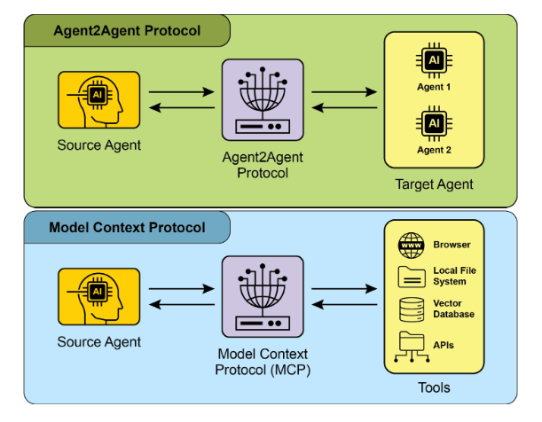
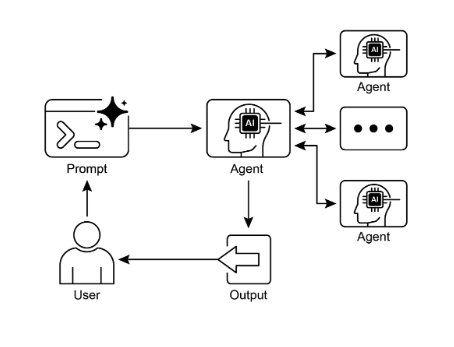

# 第 15 章：智能体间通信（A2A）

单个 AI 智能体在解决复杂的、多方面的问题时经常面临限制，即使具有先进的能力。为了克服这一点，智能体间通信（A2A）使不同的 AI 智能体（可能使用不同框架构建）能够有效协作。这种协作涉及无缝协调、任务委托和信息交换。

Google 的 A2A 协议是一个开放标准，旨在促进这种通用通信。本章将探讨 A2A、其实际应用及其在 Google ADK 中的实现。

## 智能体间通信模式概述

Agent2Agent（A2A）协议是一个开放标准，旨在实现不同 AI 智能体框架之间的通信和协作。它确保互操作性，允许使用 LangGraph、CrewAI 或 Google ADK 等技术开发的 AI 智能体一起工作，无论其来源或框架差异如何。

A2A 得到一系列技术公司和服务提供商的支持，包括 Atlassian、Box、LangChain、MongoDB、Salesforce、SAP 和 ServiceNow。Microsoft 计划将 A2A 集成到 Azure AI Foundry 和 Copilot Studio 中，展示了其对开放协议的承诺。此外，Auth0 和 SAP 正在将 A2A 支持集成到其平台和智能体中。

作为开源协议，A2A 欢迎社区贡献，以促进其演进和广泛采用。

## A2A 的核心概念

A2A 协议为智能体交互提供了结构化方法，建立在几个核心概念之上。对这些概念的透彻理解对于开发或集成 A2A 兼容系统的任何人来说都至关重要。A2A 的基础支柱包括核心参与者、智能体卡片、智能体发现、通信和任务、交互机制和安全，所有这些都将详细审查。

**核心参与者：** A2A 涉及三个主要实体：

* 用户：发起智能体协助请求。  
* A2A 客户端（客户端智能体）：代表用户请求操作或信息的应用程序或 AI 智能体。  
* A2A 服务器（远程智能体）：提供 HTTP 端点以处理客户端请求并返回结果的 AI 智能体或系统。远程智能体作为"不透明"系统运行，意味着客户端不需要理解其内部操作细节。

**智能体卡片：** 智能体的数字身份由其智能体卡片定义，通常是 JSON 文件。此文件包含客户端交互和自动发现的关键信息，包括智能体的身份、端点 URL 和版本。它还详细说明了支持的功能，如流式传输或推送通知、特定技能、默认输入/输出模式以及身份验证要求。以下是 WeatherBot 的智能体卡片示例。

```json
{
    "name": "WeatherBot",
    "description": "Provides accurate weather forecasts and historical data.",
    "url": "http://weather-service.example.com/a2a",
    "version": "1.0.0",
    "capabilities": {
        "streaming": true,
        "pushNotifications": false,
        "stateTransitionHistory": true
    },
    "authentication": {
        "schemes": [
            "apiKey"
        ]
    },
    "defaultInputModes": [
        "text"
    ],
    "defaultOutputModes": [
        "text"
    ],
    "skills": [
        {
            "id": "get_current_weather",
            "name": "Get Current Weather",
            "description": "Retrieve real-time weather for any location.",
            "inputModes": [
                "text"
            ],
            "outputModes": [
                "text"
            ],
            "examples": [
                "What's the weather in Paris?",
                "Current conditions in Tokyo"
            ],
            "tags": [
                "weather",
                "current",
                "real-time"
            ]
        },
        {
            "id": "get_forecast",
            "name": "Get Forecast",
            "description": "Get 5-day weather predictions.",
            "inputModes": [
                "text"
            ],
            "outputModes": [
                "text"
            ],
            "examples": [
                "5-day forecast for New York",
                "Will it rain in London this weekend?"
            ],
            "tags": [
                "weather",
                "forecast",
                "prediction"
            ]
        }
    ]
}
```

**智能体发现：** 它允许客户端找到智能体卡片，这些卡片描述了可用 A2A 服务器的功能。此过程存在几种策略：

* 已知 URI：智能体在标准化路径（例如，`/.well-known/agent.json`）托管其智能体卡片。此方法为公共或特定域使用提供广泛的、通常是自动化的可访问性。  
* 策划注册表：这些提供集中目录，智能体卡片在其中发布，并可以根据特定标准进行查询。这非常适合需要集中管理和访问控制的企业环境。  
* 直接配置：智能体卡片信息被嵌入或私下共享。此方法适用于紧密耦合或私有系统，其中动态发现并不重要。

无论选择哪种方法，保护智能体卡片端点都很重要。这可以通过访问控制、相互 TLS（mTLS）或网络限制来实现，特别是如果卡片包含敏感（尽管非秘密）信息。

**通信和任务：** 在 A2A 框架中，通信围绕异步任务构建，这些任务代表长时间运行过程的基本工作单元。每个任务都被分配一个唯一标识符，并经历一系列状态——如已提交、工作中或已完成——这是一种支持复杂操作中并行处理的设计。智能体之间的通信通过消息进行。

此通信包含属性，这些属性是描述消息的键值元数据（如其优先级或创建时间），以及一个或多个部分，这些部分携带实际传递的内容，如纯文本、文件或结构化 JSON 数据。智能体在任务期间生成的有形输出称为工件。像消息一样，工件也由一个或多个部分组成，并且可以在结果可用时增量流式传输。A2A 框架内的所有通信都通过 HTTP(S) 使用 JSON-RPC 2.0 协议进行有效负载。为了在多次交互中保持连续性，使用服务器生成的 contextId 来分组相关任务并保留上下文。

**交互机制：** 请求/响应（轮询）服务器发送事件（SSE）。A2A 提供多种交互方法以适应各种 AI 应用需求，每种方法都有独特的机制：

* 同步请求/响应：用于快速、即时操作。在此模型中，客户端发送请求并主动等待服务器处理它并在单个同步交换中返回完整响应。  
* 异步轮询：适用于需要较长时间处理的任务。客户端发送请求，服务器立即以"工作中"状态和任务 ID 确认它。然后，客户端可以自由执行其他操作，并可以定期轮询服务器，通过发送新请求来检查任务状态，直到它被标记为"已完成"或"失败"。  
* 流式更新（服务器发送事件 - SSE）：理想用于接收实时、增量结果。此方法建立从服务器到客户端的持久、单向连接。它允许远程智能体持续推送更新，如状态更改或部分结果，而客户端无需发出多个请求。  
* 推送通知（Webhooks）：设计用于非常长时间运行或资源密集的任务，其中维护恒定连接或频繁轮询效率低下。客户端可以注册 webhook URL，服务器将在任务状态发生重大变化（例如，完成时）向该 URL 发送异步通知（"推送"）。

智能体卡片指定智能体是否支持流式传输或推送通知功能。此外，A2A 是模态无关的，这意味着它不仅可以促进文本的这些交互模式，还可以促进其他数据类型（如音频和视频），从而实现丰富的多模态 AI 应用。流式传输和推送通知功能都在智能体卡片中指定。

```json
# Synchronous Request Example 
{
    "jsonrpc": "2.0",
    "id": "1",
    "method": "sendTask",
    "params": {
        "id": "task-001",
        "sessionId": "session-001",
        "message": {
            "role": "user",
            "parts": [
                {
                    "type": "text",
                    "text": "What is the exchange rate from USD to EUR?"
                }
            ]
        },
        "acceptedOutputModes": [
            "text/plain"
        ],
        "historyLength": 5
    }
}
```

同步请求使用 sendTask 方法，其中客户端请求并期望对其查询的单个、完整答案。相比之下，流式请求使用 sendTaskSubscribe 方法建立持久连接，允许智能体随时间发送多个增量更新或部分结果。

```json
# Streaming Request Example 
{
    "jsonrpc": "2.0",
    "id": "2",
    "method": "sendTaskSubscribe",
    "params": {
        "id": "task-002",
        "sessionId": "session-001",
        "message": {
            "role": "user",
            "parts": [
                {
                    "type": "text",
                    "text": "What's the exchange rate for JPY to GBP today?"
                }
            ]
        },
        "acceptedOutputModes": [
            "text/plain"
        ],
        "historyLength": 5
    }
}
```

**安全：** 智能体间通信（A2A）：智能体间通信（A2A）是系统架构的关键组件，实现智能体之间的安全和无缝数据交换。它通过几个内置机制确保健壮性和完整性。

相互传输层安全（TLS）：建立加密和身份验证的连接，以防止未经授权的访问和数据拦截，确保安全通信。

全面的审计日志：所有智能体间通信都被详细记录，详细说明信息流、涉及的智能体和操作。此审计跟踪对于问责、故障排除和安全分析至关重要。

智能体卡片声明：身份验证要求在智能体卡片中明确定义，这是一个配置工件，概述了智能体的身份、功能和安全策略。这集中并简化了身份验证管理。

凭据处理：智能体通常使用安全凭据（如 OAuth 2.0 令牌或 API 密钥）进行身份验证，通过 HTTP 标头传递。此方法防止凭据在 URL 或消息正文中暴露，增强了整体安全性。

## A2A vs. MCP

A2A 是一个补充 Anthropic 的模型上下文协议（MCP）的协议（见图 1）。虽然 MCP 专注于为智能体及其与外部数据和工具的交互构建上下文，但 A2A 促进了智能体之间的协调和通信，实现任务委托和协作。



图 1：A2A 和 MCP 协议的比较

A2A 的目标是提高效率、降低集成成本，并在开发复杂的多智能体 AI 系统中促进创新和互操作性。因此，对 A2A 的核心组件和操作方法的透彻理解对于其有效设计、实现以及在构建协作和互操作的 AI 智能体系统中的应用至关重要。

## 实际应用与用例

智能体间通信对于在不同领域构建复杂的 AI 解决方案至关重要，实现模块化、可扩展性和增强的智能。

* **多框架协作：** A2A 的主要用例是使独立的 AI 智能体能够通信和协作，无论其底层框架（例如，ADK、LangChain、CrewAI）如何。这对于构建复杂的多智能体系统至关重要，其中不同的智能体专门处理问题的不同方面。  
* **自动化工作流编排：** 在企业环境中，A2A 可以通过使智能体能够委托和协调任务来促进复杂工作流。例如，一个智能体可能处理初始数据收集，然后委托给另一个智能体进行分析，最后委托给第三个智能体生成报告，所有通信都通过 A2A 协议进行。  
* **动态信息检索：** 智能体可以通信以检索和交换实时信息。主要智能体可能从专门的"数据获取智能体"请求实时市场数据，然后该智能体使用外部 API 收集信息并将其发送回去。

## 实践代码示例

让我们检查 A2A 协议的实际应用。位于 [https://github.com/google-a2a/a2a-samples/tree/main/samples](https://github.com/google-a2a/a2a-samples/tree/main/samples) 的存储库提供了 Java、Go 和 Python 中的示例，说明了各种智能体框架（如 LangGraph、CrewAI、Azure AI Foundry 和 AG2）如何使用 A2A 进行通信。此存储库中的所有代码均在 Apache 2.0 许可下发布。为了进一步说明 A2A 的核心概念，我们将审查代码摘录，重点介绍使用基于 ADK 的智能体和 Google 身份验证工具设置 A2A 服务器。查看 [https://github.com/google-a2a/a2a-samples/blob/main/samples/python/agents/birthday_planner_adk/calendar_agent/adk_agent.py](https://github.com/google-a2a/a2a-samples/blob/main/samples/python/agents/birthday_planner_adk/calendar_agent/adk_agent.py)

```python
import datetime

from google.adk.agents import LlmAgent  # type: ignore[import-untyped]
from google.adk.tools.google_api_tool import CalendarToolset  # type: ignore[import-untyped]


async def create_agent(client_id: str, client_secret: str) -> LlmAgent:
    """Constructs the ADK agent."""
    toolset = CalendarToolset(client_id=client_id, client_secret=client_secret)
    return LlmAgent(
        model="gemini-2.0-flash-001",
        name="calendar_agent",
        description="An agent that can help manage a user's calendar",
        instruction=(
            f""" You are an agent that can help manage a user's calendar. Users will request information about the state of their calendar """
            f""" or to make changes to their calendar. Use the provided tools for interacting with the calendar API. """
            f""" If not specified, assume the calendar the user wants is the 'primary' calendar. """
            f""" When using the Calendar API tools, use well-formed RFC3339 timestamps. Today is {datetime.datetime.now()}. """
        ),
        tools=await toolset.get_tools(),
    )
```

此 Python 代码定义了一个异步函数 `create_agent`，它构造一个 ADK LlmAgent。它首先使用提供的客户端凭据初始化 `CalendarToolset` 以访问 Google Calendar API。随后，创建一个 `LlmAgent` 实例，配置了指定的 Gemini 模型、描述性名称以及管理用户日历的指令。智能体配备了来自 `CalendarToolset` 的日历工具，使其能够与 Calendar API 交互并响应用户关于日历状态或修改的查询。智能体的指令动态地包含当前日期以提供时间上下文。为了说明如何构造智能体，让我们检查来自 A2A 示例中 `calendar_agent` 的关键部分，这些示例位于 GitHub 上。

下面的代码显示了如何使用其特定指令和工具定义智能体。请注意，仅显示解释此功能所需的代码；您可以在此处访问完整文件：[https://github.com/a2aproject/a2a-samples/blob/main/samples/python/agents/birthday_planner_adk/calendar_agent/__main__.py](https://github.com/a2aproject/a2a-samples/blob/main/samples/python/agents/birthday_planner_adk/calendar_agent/__main__.py)

```python
def main(host: str = "0.0.0.0", port: int = 8000):
    # Verify an API key is set.
    # Not required if using Vertex AI APIs.
    if os.getenv("GOOGLE_GENAI_USE_VERTEXAI") != "TRUE" and not os.getenv("GOOGLE_API_KEY"):
        raise ValueError(
            "GOOGLE_API_KEY environment variable not set and "
            "GOOGLE_GENAI_USE_VERTEXAI is not TRUE."
        )

    skill = AgentSkill(
        id="check_availability",
        name="Check Availability",
        description="Checks a user's availability for a time using their Google Calendar",
        tags=["calendar"],
        examples=["Am I free from 10am to 11am tomorrow?"],
    )

    agent_card = AgentCard(
        name="Calendar Agent",
        description="An agent that can manage a user's calendar",
        url=f"http://{host}:{port}/",
        version="1.0.0",
        defaultInputModes=["text"],
        defaultOutputModes=["text"],
        capabilities=AgentCapabilities(streaming=True),
        skills=[skill],
    )

    adk_agent = asyncio.run(
        create_agent(
            client_id=os.getenv("GOOGLE_CLIENT_ID"),
            client_secret=os.getenv("GOOGLE_CLIENT_SECRET"),
        )
    )

    runner = Runner(
        app_name=agent_card.name,
        agent=adk_agent,
        artifact_service=InMemoryArtifactService(),
        session_service=InMemorySessionService(),
        memory_service=InMemoryMemoryService(),
    )
    agent_executor = ADKAgentExecutor(runner, agent_card)

    async def handle_auth(request: Request) -> PlainTextResponse:
        await agent_executor.on_auth_callback(
            str(request.query_params.get("state")),
            str(request.url),
        )
        return PlainTextResponse("Authentication successful.")

    request_handler = DefaultRequestHandler(
        agent_executor=agent_executor,
        task_store=InMemoryTaskStore(),
    )

    a2a_app = A2AStarletteApplication(
        agent_card=agent_card,
        http_handler=request_handler,
    )
    routes = a2a_app.routes()
    routes.append(
        Route(
            path="/authenticate",
            methods=["GET"],
            endpoint=handle_auth,
        )
    )
    app = Starlette(routes=routes)

    uvicorn.run(app, host=host, port=port)


if __name__ == "__main__":
    main()
```

此 Python 代码演示了如何设置符合 A2A 的"Calendar Agent"以使用 Google Calendar 检查用户可用性。它涉及验证 API 密钥或 Vertex AI 配置以进行身份验证。智能体的功能，包括"check_availability"技能，在 AgentCard 中定义，该卡片还指定智能体的网络地址。随后，创建一个 ADK 智能体，配置了用于管理工件、会话和内存的内存服务。然后，代码初始化 Starlette Web 应用程序，合并身份验证回调和 A2A 协议处理程序，并使用 Uvicorn 执行它以通过 HTTP 公开智能体。

这些示例说明了构建符合 A2A 的智能体的过程，从定义其功能到将其作为 Web 服务运行。通过利用智能体卡片和 ADK，开发人员可以创建能够与 Google Calendar 等工具集成的互操作 AI 智能体。此实践方法展示了 A2A 在建立多智能体生态系统中的应用。

建议通过代码演示进一步探索 A2A：[https://www.trickle.so/blog/how-to-build-google-a2a-project](https://www.trickle.so/blog/how-to-build-google-a2a-project)。此链接提供的资源包括 Python 和 JavaScript 中的示例 A2A 客户端和服务器、多智能体 Web 应用程序、命令行界面以及各种智能体框架的示例实现。

## 概览

**什么：** 单个 AI 智能体，特别是那些基于不同框架构建的智能体，经常难以独立处理复杂的、多方面的问题。主要挑战是缺乏允许它们有效通信和协作的通用语言或协议。这种隔离阻止了创建复杂的系统，其中多个专门的智能体可以结合其独特技能来解决更大的任务。没有标准化方法，集成这些不同的智能体成本高昂、耗时，并阻碍了更强大、更统一的 AI 解决方案的开发。

**为什么：** 智能体间通信（A2A）协议为此问题提供了一个开放的、标准化的解决方案。它是一个基于 HTTP 的协议，实现互操作性，允许不同的 AI 智能体协调、委托任务和共享信息，无论其底层技术如何。核心组件是智能体卡片，一个数字身份文件，描述智能体的功能、技能和通信端点，促进发现和交互。A2A 定义了各种交互机制，包括同步和异步通信，以支持各种用例。通过创建智能体协作的通用标准，A2A 促进了一个模块化和可扩展的生态系统，用于构建复杂的多智能体智能体系统。

**经验法则：** 当您需要在两个或多个 AI 智能体之间编排协作时，使用此模式，特别是如果它们使用不同框架（例如，Google ADK、LangGraph、CrewAI）构建。它非常适合构建复杂的、模块化的应用程序，其中专门的智能体处理工作流的特定部分，例如将数据分析委托给一个智能体，将报告生成委托给另一个智能体。当智能体需要动态发现和使用其他智能体的功能来完成任务时，此模式也是必需的。

**可视化摘要：**



图 2：A2A 智能体间通信模式

## 关键要点

关键要点：

* Google A2A 协议是一个开放的、基于 HTTP 的标准，促进使用不同框架构建的 AI 智能体之间的通信和协作。  
* 智能体卡片作为智能体的数字标识符，允许其他智能体自动发现和理解其功能。  
* A2A 提供同步请求-响应交互（使用 `tasks/send`）和流式更新（使用 `tasks/sendSubscribe`），以适应各种通信需求。  
* 该协议支持多轮对话，包括 `input-required` 状态，允许智能体请求附加信息并在交互期间保持上下文。  
* A2A 鼓励模块化架构，其中专门的智能体可以在不同端口上独立运行，实现系统可扩展性和分布式。  
* 诸如 Trickle AI 之类的工具有助于可视化和跟踪 A2A 通信，这有助于开发人员监控、调试和优化多智能体系统。  
* 虽然 A2A 是用于管理不同智能体之间的任务和工作流的高级协议，但模型上下文协议（MCP）为 LLM 与外部资源交互提供了标准化接口。

## 结论

智能体间通信（A2A）协议建立了一个关键的开放标准，以克服单个 AI 智能体的固有隔离。通过提供通用的基于 HTTP 的框架，它确保在不同平台上构建的智能体（如 Google ADK、LangGraph 或 CrewAI）之间的无缝协作和互操作性。核心组件是智能体卡片，它作为数字身份，明确定义智能体的功能并允许其他智能体动态发现。协议的灵活性支持各种交互模式，包括同步请求、异步轮询和实时流式传输，满足广泛的应用需求。

这使能够创建模块化和可扩展的架构，其中专门的智能体可以组合以编排复杂的自动化工作流。安全是一个基本方面，具有内置机制，如 mTLS 和明确的身份验证要求，以保护通信。虽然补充了其他标准（如 MCP），但 A2A 的独特重点是智能体之间的高级协调和任务委托。主要技术公司的强大支持和实际实现的可用性突出了其日益增长的重要性。此协议为开发人员构建更复杂、分布式和智能的多智能体系统铺平了道路。最终，A2A 是促进协作 AI 的创新和互操作生态系统的基础支柱。

## 参考文献

1. Chen, B. (2025, April 22). *How to Build Your First Google A2A Project: A Step-by-Step Tutorial*. Trickle.so Blog. [https://www.trickle.so/blog/how-to-build-google-a2a-project](https://www.trickle.so/blog/how-to-build-google-a2a-project)
2. Google A2A GitHub Repository. [https://github.com/google-a2a/A2A](https://github.com/google-a2a/A2A)
3. Google Agent Development Kit (ADK) [https://google.github.io/adk-docs/](https://google.github.io/adk-docs/)
4. Getting Started with Agent-to-Agent (A2A) Protocol: [https://codelabs.developers.google.com/intro-a2a-purchasing-concierge\#0](https://codelabs.developers.google.com/intro-a2a-purchasing-concierge#0)
5. Google AgentDiscovery \- [https://a2a-protocol.org/latest/](https://a2a-protocol.org/latest/)
6. Communication between different AI frameworks such as LangGraph, CrewAI, and Google ADK [https://www.trickle.so/blog/how-to-build-google-a2a-project](https://www.trickle.so/blog/how-to-build-google-a2a-project#setting-up-your-a2a-development-environment)
7. Designing Collaborative Multi-Agent Systems with the A2A Protocol [https://www.oreilly.com/radar/designing-collaborative-multi-agent-systems-with-the-a2a-protocol/](https://www.oreilly.com/radar/designing-collaborative-multi-agent-systems-with-the-a2a-protocol/)
