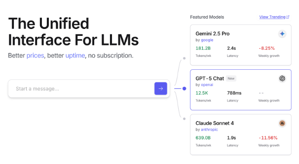
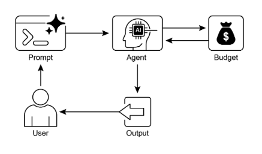

# 第 16 章：资源感知优化

资源感知优化使智能智能体能够在操作期间动态监控和管理计算、时间和财务资源。这与主要关注动作序列的简单规划不同。资源感知优化要求智能体做出关于动作执行的决策，以在指定的资源预算内实现目标或优化效率。这涉及在更准确但昂贵的模型和更快、成本更低的模型之间进行选择，或者决定是为更精细的响应分配额外的计算资源，还是返回更快、不太详细的答案。

例如，考虑一个负责为财务分析师分析大型数据集的智能体。如果分析师需要立即获得初步报告，智能体可能使用更快、更经济的模型来快速总结关键趋势。然而，如果分析师需要高度准确的预测来做出关键投资决策，并且有更大的预算和更多时间，智能体会分配更多资源来利用强大、较慢但更精确的预测模型。此类别中的关键策略是回退机制，当首选模型因过载或限制而不可用时，它充当保护措施。为了确保优雅降级，系统自动切换到默认或更经济的模型，保持服务连续性而不是完全失败。

## 实际应用与用例

实际用例包括：

* **成本优化的 LLM 使用：** 智能体根据预算约束决定是使用大型、昂贵的 LLM 处理复杂任务，还是使用较小、更经济的 LLM 处理简单查询。  
* **延迟敏感的操作：** 在实时系统中，智能体选择更快但可能不太全面的推理路径，以确保及时响应。  
* **能源效率：** 对于部署在边缘设备或功率有限的智能体，优化其处理以节省电池寿命。  
* **服务可靠性的回退：** 当主要选择不可用时，智能体自动切换到备用模型，确保服务连续性和优雅降级。  
* **数据使用管理：** 智能体选择检索汇总数据而不是完整数据集下载，以节省带宽或存储。  
* **自适应任务分配：** 在多智能体系统中，智能体根据其当前计算负载或可用时间自行分配任务。

## 实践代码示例

一个用于回答用户问题的智能系统可以评估每个问题的难度。对于简单查询，它利用经济高效的语言模型，如 Gemini Flash。对于复杂查询，考虑使用更强大但昂贵的语言模型（如 Gemini Pro）。使用更强大模型的决策还取决于资源可用性，特别是预算和时间约束。此系统动态选择适当的模型。

例如，考虑一个使用分层智能体构建的旅行规划器。高级规划涉及理解用户的复杂请求，将其分解为多步骤行程，并做出逻辑决策，将由复杂且更强大的 LLM（如 Gemini Pro）管理。这是需要深入理解上下文和推理能力的"规划器"智能体。

然而，一旦计划建立，该计划中的单个任务，如查找航班价格、检查酒店可用性或查找餐厅评论，本质上是简单、重复的网络查询。这些"工具函数调用"可以由更快、更经济的模型（如 Gemini Flash）执行。更容易理解为什么经济模型可以用于这些直接的网络搜索，而复杂的规划阶段需要更先进模型的更大智能，以确保连贯和逻辑的旅行计划。

Google 的 ADK 通过其多智能体架构支持此方法，该架构允许模块化和可扩展的应用程序。不同的智能体可以处理专门的任务。模型灵活性支持直接使用各种 Gemini 模型，包括 Gemini Pro 和 Gemini Flash，或通过 LiteLLM 集成其他模型。ADK 的编排功能支持动态、LLM 驱动的路由以实现自适应行为。内置评估功能允许系统地评估智能体性能，可用于系统改进（参见评估和监控章节）。

接下来，将定义两个具有相同设置但使用不同模型和成本的智能体。

```python
# Conceptual Python-like structure, not runnable code
from google.adk.agents import Agent
# from google.adk.models.lite_llm import LiteLlm  # If using models not directly supported by ADK's default Agent

# Agent using the more expensive Gemini Pro 2.5
gemini_pro_agent = Agent(
    name="GeminiProAgent",
    model="gemini-2.5-pro",  # Placeholder for actual model name if different
    description="A highly capable agent for complex queries.",
    instruction="You are an expert assistant for complex problem-solving.",
)

# Agent using the less expensive Gemini Flash 2.5
gemini_flash_agent = Agent(
    name="GeminiFlashAgent",
    model="gemini-2.5-flash",  # Placeholder for actual model name if different
    description="A fast and efficient agent for simple queries.",
    instruction="You are a quick assistant for straightforward questions.",
)
```

路由器智能体可以基于简单指标（如查询长度）指导查询，其中较短查询发送到较便宜的模型，较长查询发送到更强大的模型。然而，更复杂的路由器智能体可以利用 LLM 或 ML 模型来分析查询细微差别和复杂性。此 LLM 路由器可以确定哪个下游语言模型最合适。例如，请求事实回忆的查询被路由到 Flash 模型，而需要深入分析的复杂查询被路由到 Pro 模型。

优化技术可以进一步增强 LLM 路由器的有效性。提示调整涉及制作提示以指导路由器 LLM 做出更好的路由决策。在查询及其最优模型选择的数据集上微调 LLM 路由器可以提高其准确性和效率。此动态路由功能平衡响应质量和成本效益。

```python
# Conceptual Python-like structure, not runnable code
import asyncio
from typing import AsyncGenerator

from google.adk.agents import Agent, BaseAgent
from google.adk.events import Event
from google.adk.agents.invocation_context import InvocationContext


class QueryRouterAgent(BaseAgent):
    name: str = "QueryRouter"
    description: str = "Routes user queries to the appropriate LLM agent based on complexity."

    async def _run_async_impl(self, context: InvocationContext) -> AsyncGenerator[Event, None]:
        user_query = context.current_message.text  # Assuming text input
        query_length = len(user_query.split())  # Simple metric: number of words

        if query_length < 20:  # Example threshold for simplicity vs. complexity
            print(f"Routing to Gemini Flash Agent for short query (length: {query_length})")
            # In a real ADK setup, you would 'transfer_to_agent' or directly invoke
            # For demonstration, we'll simulate a call and yield its response
            response = await gemini_flash_agent.run_async(context.current_message)
            yield Event(author=self.name, content=f"Flash Agent processed: {response}")
        else:
            print(f"Routing to Gemini Pro Agent for long query (length: {query_length})")
            response = await gemini_pro_agent.run_async(context.current_message)
            yield Event(author=self.name, content=f"Pro Agent processed: {response}")
```

评论智能体评估语言模型的响应，提供反馈，这些反馈具有多种功能。对于自我纠正，它识别错误或不一致，提示回答智能体改进其输出以提高质量。它还系统地评估响应以进行性能监控，跟踪准确性和相关性等指标，这些指标用于优化。

此外，其反馈可以信号强化学习或微调；例如，一致识别 Flash 模型响应不足，可以改进路由器智能体的逻辑。虽然不直接管理预算，但评论智能体通过识别次优路由选择（如将简单查询路由到 Pro 模型或将复杂查询路由到 Flash 模型，这导致不良结果）来间接贡献预算管理。这告知改进资源分配和成本节约的调整。

评论智能体可以配置为仅审查来自回答智能体的生成文本，或同时审查原始查询和生成文本，从而能够全面评估响应与初始问题的一致性。

```python
CRITIC_SYSTEM_PROMPT = """
You are the **Critic Agent**, serving as the quality assurance arm of our collaborative research assistant system. Your primary function is to **meticulously review and challenge** information from the Researcher Agent, guaranteeing **accuracy, completeness, and unbiased presentation**. Your duties encompass: * **Assessing research findings** for factual correctness, thoroughness, and potential leanings. * **Identifying any missing data** or inconsistencies in reasoning. * **Raising critical questions** that could refine or expand the current understanding. * **Offering constructive suggestions** for enhancement or exploring different angles. * **Validating that the final output is comprehensive** and balanced. All criticism must be constructive. Your goal is to fortify the research, not invalidate it. Structure your feedback clearly, drawing attention to specific points for revision. Your overarching aim is to ensure the final research product meets the highest possible quality standards. 
"""
```

评论智能体基于预定义的系统提示运行，该提示概述了其角色、职责和反馈方法。为此智能体设计的良好提示必须清楚地建立其作为评估者的功能。它应该指定需要重点关注领域，并强调提供建设性反馈而不是仅仅驳回。提示还应鼓励识别优点和缺点，并且必须指导智能体如何构建和呈现其反馈。

## 实践代码（OpenAI）

此系统使用资源感知优化策略来高效处理用户查询。它首先将每个查询分类为三个类别之一，以确定最合适和最具成本效益的处理路径。此方法避免在简单请求上浪费计算资源，同时确保复杂查询得到必要的关注。三个类别是：

* simple：用于可以直接回答而无需复杂推理或外部数据的直接问题。  
* reasoning：用于需要逻辑推理或多步思维过程的查询，这些查询被路由到更强大的模型。  
* `internetsearch`：用于需要当前信息的问题，自动触发 Google Search 以提供最新答案。

代码在 MIT 许可下，可在 Github 上获得：([https://github.com/mahtabsyed/21-Agentic-Patterns/blob/main/16ResourceAwareOptLLMReflectionv2.ipynb](https://github.com/mahtabsyed/21-Agentic-Patterns/blob/main/16_Resource_Aware_Opt_LLM_Reflection_v2.ipynb))

```python
# MIT License
# Copyright (c) 2025 Mahtab Syed
# https://www.linkedin.com/in/mahtabsyed/

import os
import json
import requests
from dotenv import load_dotenv
from openai import OpenAI


# Load environment variables
load_dotenv()

OPENAI_API_KEY = os.getenv("OPENAI_API_KEY")
GOOGLE_CUSTOM_SEARCH_API_KEY = os.getenv("GOOGLE_CUSTOM_SEARCH_API_KEY")
GOOGLE_CSE_ID = os.getenv("GOOGLE_CSE_ID")

if not OPENAI_API_KEY or not GOOGLE_CUSTOM_SEARCH_API_KEY or not GOOGLE_CSE_ID:
    raise ValueError(
        "Please set OPENAI_API_KEY, GOOGLE_CUSTOM_SEARCH_API_KEY, and GOOGLE_CSE_ID in your .env file."
    )

client = OpenAI(api_key=OPENAI_API_KEY)


# --- Step 1: Classify the Prompt ---
def classify_prompt(prompt: str) -> dict:
    system_message = {
        "role": "system",
        "content": (
            "You are a classifier that analyzes user prompts and returns one of three categories ONLY:\n\n"
            "- simple\n"
            "- reasoning\n"
            "- internet_search\n\n"
            "Rules:\n"
            "- Use 'simple' for direct factual questions that need no reasoning or current events.\n"
            "- Use 'reasoning' for logic, math, or multi-step inference questions.\n"
            "- Use 'internet_search' if the prompt refers to current events, recent data, or things not in your training data.\n\n"
            "Respond ONLY with JSON like:\n"
            '{ "classification": "simple" }'
        ),
    }
    user_message = {"role": "user", "content": prompt}

    response = client.chat.completions.create(
        model="gpt-4o",
        messages=[system_message, user_message],
        temperature=1,
    )
    reply = response.choices[0].message.content
    return json.loads(reply)


# --- Step 2: Google Search ---
def google_search(query: str, num_results: int = 1) -> list:
    url = "https://www.googleapis.com/customsearch/v1"
    params = {
        "key": GOOGLE_CUSTOM_SEARCH_API_KEY,
        "cx": GOOGLE_CSE_ID,
        "q": query,
        "num": num_results,
    }
    try:
        response = requests.get(url, params=params)
        response.raise_for_status()
        results = response.json()
        if "items" in results and results["items"]:
            return [
                {
                    "title": item.get("title"),
                    "snippet": item.get("snippet"),
                    "link": item.get("link"),
                }
                for item in results["items"]
            ]
        else:
            return []
    except requests.exceptions.RequestException as e:
        return {"error": str(e)}


# --- Step 3: Generate Response ---
def generate_response(prompt: str, classification: str, search_results=None) -> tuple[str, str]:
    if classification == "simple":
        model = "gpt-4o-mini"
        full_prompt = prompt

    elif classification == "reasoning":
        model = "o4-mini"
        full_prompt = prompt

    elif classification == "internet_search":
        model = "gpt-4o"
        # Convert each search result dict to a readable string
        if search_results:
            search_context = "\n".join(
                [
                    f"Title: {item.get('title')}\nSnippet: {item.get('snippet')}\nLink: {item.get('link')}"
                    for item in search_results
                ]
            )
        else:
            search_context = "No search results found."
        full_prompt = (
            "Use the following web results to answer the user query: "
            f"{search_context}\nQuery: {prompt}"
        )
    else:
        # Fallback
        model = "gpt-4o"
        full_prompt = prompt

    response = client.chat.completions.create(
        model=model,
        messages=[{"role": "user", "content": full_prompt}],
        temperature=1,
    )
    return response.choices[0].message.content, model


# --- Step 4: Combined Router ---
def handle_prompt(prompt: str) -> dict:
    classification_result = classify_prompt(prompt)
    classification = classification_result["classification"]

    search_results = None
    if classification == "internet_search":
        search_results = google_search(prompt)

    answer, model = generate_response(prompt, classification, search_results)
    return {"classification": classification, "response": answer, "model": model}


if __name__ == "__main__":
    test_prompt = "What is the capital of Australia?"
    # test_prompt = "Explain the impact of quantum computing on cryptography."
    # test_prompt = "When does the Australian Open 2026 start, give me full date?"

    result = handle_prompt(test_prompt)

    print("🔍 Classification:", result["classification"])
    print("🧠 Model Used:", result["model"])
    print("🧠 Response:\n", result["response"])
```

此 Python 代码实现了一个提示路由系统来回答用户问题。它首先从 .env 文件加载 OpenAI 和 Google Custom Search 所需的 API 密钥。核心功能在于将用户的提示分类为三个类别：simple、reasoning 或 internet search。专用函数利用 OpenAI 模型进行此分类步骤。如果提示需要当前信息，则使用 Google Custom Search API 执行 Google 搜索。然后，另一个函数根据分类选择适当的 OpenAI 模型生成最终响应。对于互联网搜索查询，搜索结果作为上下文提供给模型。主 `handleprompt` 函数编排此工作流，在生成响应之前调用分类和搜索（如果需要）函数。它返回分类、使用的模型和生成的答案。此系统高效地将不同类型的查询定向到优化的方法以获得更好的响应。

# 实践代码示例（OpenRouter）

OpenRouter 通过单个 API 端点提供对数百个 AI 模型的统一接口。它提供自动故障转移和成本优化，通过您首选的 SDK 或框架轻松集成。

```python
import json
import requests

response = requests.post(
    url="https://openrouter.ai/api/v1/chat/completions",
    headers={
        "Authorization": "Bearer <OPENROUTER_API_KEY>",
        "HTTP-Referer": "<YOUR_SITE_URL>",  # Optional. Site URL for rankings on openrouter.ai.
        "X-Title": "<YOUR_SITE_NAME>",      # Optional. Site title for rankings on openrouter.ai.
    },
    data=json.dumps({
        "model": "openai/gpt-4o",  # Optional
        "messages": [
            {
                "role": "user",
                "content": "What is the meaning of life?"
            }
        ]
    }),
)
```

此代码片段使用 requests 库与 OpenRouter API 交互。它向聊天完成端点发送 POST 请求，其中包含用户消息。请求包括带有 API 密钥和可选站点信息的授权标头。目标是从指定的语言模型（在这种情况下为 "openai/gpt-4o"）获取响应。

OpenRouter 提供两种不同的方法来路由和确定用于处理给定请求的计算模型。

* **自动模型选择：** 此功能将请求路由到从可用模型的精选集合中选择的优化模型。选择基于用户提示的具体内容。最终处理请求的模型的标识符在响应的元数据中返回。

```json
{  
    "model": "openrouter/auto",  
    ... // Other params 
}
```

* **顺序模型回退：** 此机制通过允许用户指定模型的分层列表来提供操作冗余。系统将首先尝试使用序列中指定的主要模型处理请求。如果由于任何数量的错误条件（如服务不可用、速率限制或内容过滤），主要模型无法响应，系统将自动将请求重新路由到序列中的下一个指定模型。此过程持续到列表中的模型成功执行请求或列表耗尽。操作的最终成本和响应中返回的模型标识符将对应于成功完成计算的模型。

```json
{  
    "models": ["anthropic/claude-3.5-sonnet", "gryphe/mythomax-l2-13b"],  
    ... // Other params }
```

OpenRouter 提供详细的排行榜 ([https://openrouter.ai/rankings](https://openrouter.ai/rankings))，该排行榜根据其累积令牌产量对可用 AI 模型进行排名。它还提供来自不同提供商（ChatGPT、Gemini、Claude）的最新模型（见图 1）

 

图 1：OpenRouter 网站 ([https://openrouter.ai/](https://openrouter.ai/))

## 超越动态模型切换：智能体资源优化谱系

资源感知优化在开发智能智能体系统中至关重要，这些系统在现实世界约束内高效且有效地运行。让我们看看一些额外的技术：

**动态模型切换** 是一种关键技术，涉及根据手头任务的复杂性和可用计算资源战略性地选择大型语言模型。当面对简单查询时，可以部署轻量级、经济高效的 LLM，而复杂、多方面的问题需要使用更复杂和资源密集的模型。

**自适应工具使用和选择** 确保智能体可以从工具套件中智能选择，为每个特定子任务选择最合适和最高效的工具，仔细考虑 API 使用成本、延迟和执行时间等因素。此动态工具选择通过优化外部 API 和服务的使用来增强整体系统效率。

**上下文修剪和摘要** 在管理智能体处理的信息量方面发挥重要作用，通过智能摘要和选择性地仅保留交互历史中最相关信息，战略性地最小化提示令牌计数并降低推理成本，防止不必要的计算开销。

**主动资源预测** 涉及通过预测未来工作负载和系统需求来预测资源需求，这允许主动分配和管理资源，确保系统响应性并防止瓶颈。

**成本敏感探索** 在多智能体系统中，将优化考虑扩展到包括通信成本以及传统计算成本，影响智能体协作和共享信息所采用的策略，旨在最小化整体资源支出。

**能源高效部署** 专门针对具有严格资源约束的环境，旨在最小化智能智能体系统的能源足迹，延长运行时间并降低整体运行成本。

**并行化和分布式计算感知** 利用分布式资源来增强智能体的处理能力和吞吐量，在多个机器或处理器之间分配计算工作负载，以实现更高的效率和更快的任务完成。

**学习的资源分配策略** 引入学习机制，使智能体能够根据反馈和性能指标随时间适应和优化其资源分配策略，通过持续改进提高效率。

**优雅降级和回退机制** 确保智能智能体系统可以继续运行，尽管可能容量降低，即使在资源约束严重时也是如此，优雅地降低性能并回退到替代策略以保持运行并提供基本功能。

## 概览

**什么：** 资源感知优化解决了在智能系统中管理计算、时间和财务资源消耗的挑战。基于 LLM 的应用程序可能昂贵且缓慢，为每个任务选择最佳模型或工具通常效率低下。这在系统输出的质量和产生它所需的资源之间创造了基本权衡。没有动态管理策略，系统无法适应不同的任务复杂性或在预算和性能约束内运行。

**为什么：** 标准化解决方案是构建一个智能系统，根据手头的任务智能监控和分配资源。此模式通常采用"路由器智能体"首先对传入请求的复杂性进行分类。然后将请求转发到最合适的 LLM 或工具——用于简单查询的快速、廉价的模型，以及用于复杂推理的更强大的模型。"评论智能体"可以通过评估响应的质量进一步改进过程，提供反馈以随时间改进路由逻辑。此动态、多智能体方法确保系统高效运行，平衡响应质量和成本效益。

**经验法则：** 当在 API 调用或计算能力的严格财务预算下运行时，构建延迟敏感的应用程序（其中快速响应时间至关重要），在资源受限的硬件（如电池寿命有限的边缘设备）上部署智能体，以编程方式平衡响应质量和运营成本之间的权衡，以及管理复杂的多步骤工作流（其中不同任务具有不同的资源需求）时，使用此模式。

**可视化摘要：**



图 2：资源感知优化设计模式

## 关键要点

* 资源感知优化至关重要：智能智能体可以动态管理计算、时间和财务资源。关于模型使用和执行路径的决策基于实时约束和目标做出。  
* 用于可扩展性的多智能体架构：Google 的 ADK 提供多智能体框架，实现模块化设计。不同的智能体（回答、路由、评论）处理特定任务。  
* 动态、LLM 驱动的路由：路由器智能体根据查询复杂性和预算将查询定向到语言模型（Gemini Flash 用于简单，Gemini Pro 用于复杂）。这优化了成本和性能。  
* 评论智能体功能：专用评论智能体提供反馈以进行自我纠正、性能监控和改进路由逻辑，增强系统有效性。  
* 通过反馈和灵活性进行优化：评论的评估能力和模型集成灵活性有助于自适应和自我改进的系统行为。  
* 额外的资源感知优化：其他方法包括自适应工具使用和选择、上下文修剪和摘要、主动资源预测、多智能体系统中的成本敏感探索、能源高效部署、并行化和分布式计算感知、学习的资源分配策略、优雅降级和回退机制，以及关键任务的优先级。

## 结论

资源感知优化对于智能智能体的开发至关重要，使其能够在现实世界约束内高效运行。通过管理计算、时间和财务资源，智能体可以实现最佳性能和成本效益。诸如动态模型切换、自适应工具使用和上下文修剪等技术对于实现这些效率至关重要。高级策略，包括学习的资源分配策略和优雅降级，增强了智能体在不同条件下的适应性和弹性。将这些优化原则集成到智能体设计中是构建可扩展、健壮和可持续 AI 系统的基础。

## 参考文献

1. Google's Agent Development Kit (ADK): [https://google.github.io/adk-docs/](https://google.github.io/adk-docs/)
2. Gemini Flash 2.5 & Gemini 2.5 Pro:  [https://aistudio.google.com/](https://aistudio.google.com/)
3. OpenRouter: [https://openrouter.ai/docs/quickstart](https://openrouter.ai/docs/quickstart)
