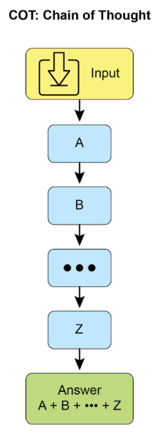
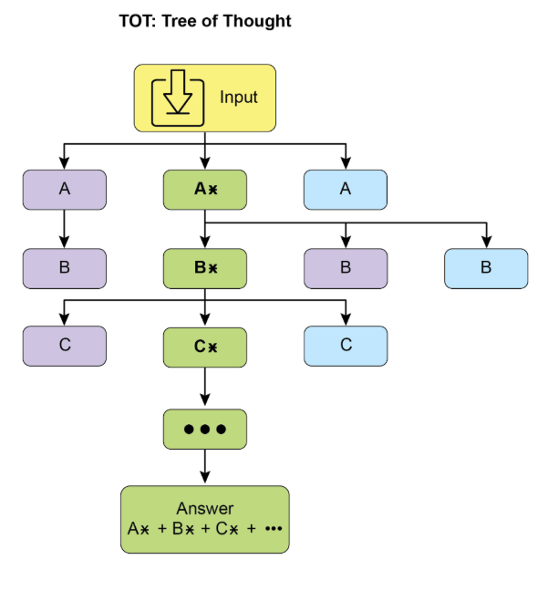
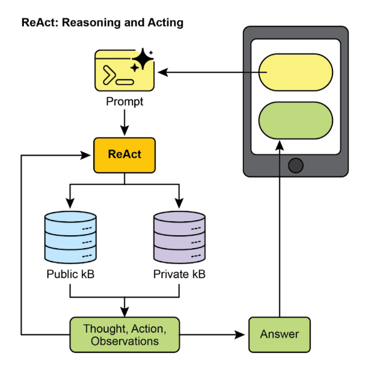
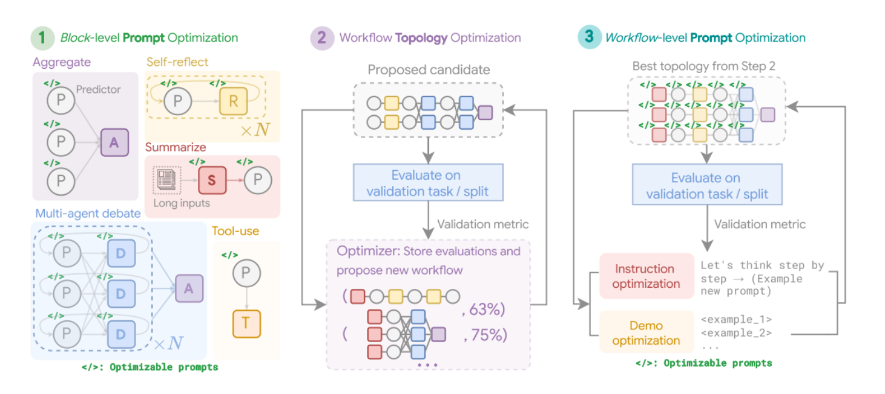
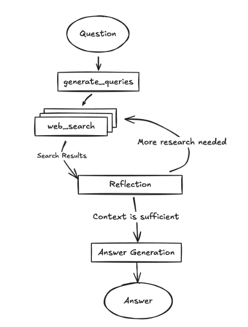
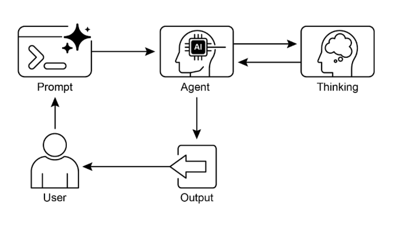

# 第 17 章：推理技术

本章深入探讨智能智能体的高级推理方法，重点关注多步逻辑推理和问题解决。这些技术超越了简单的顺序操作，使智能体的内部推理变得明确。这允许智能体分解问题、考虑中间步骤，并得出更强大和准确的结论。这些高级方法中的核心原则是在推理期间分配增加的计算资源。这意味着授予智能体或底层 LLM 更多的处理时间或步骤来处理查询并生成响应。与其快速、单次通过，智能体可以参与迭代改进、探索多个解决路径或利用外部工具。推理期间的此扩展处理时间通常显著增强准确性、连贯性和健壮性，特别是对于需要更深入分析和审议的复杂问题。

## 实际应用与用例

实际应用包括：

* **复杂问题回答：** 促进多跳查询的解决，这些查询需要整合来自不同来源的数据并执行逻辑推理，可能涉及检查多个推理路径，并从扩展推理时间中受益以综合信息。  
* **数学问题解决：** 使能够将数学问题分解为更小、可解决的组件，说明逐步过程，并采用代码执行进行精确计算，其中延长推理时间使更复杂的代码生成和验证成为可能。  
* **代码调试和生成：** 支持智能体解释其生成或纠正代码的理由，按顺序定位潜在问题，并根据测试结果迭代改进代码（自我纠正），利用扩展推理时间进行彻底的调试周期。  
* **战略规划：** 通过跨各种选项、后果和前提条件的推理协助制定全面计划，并根据实时反馈调整计划（ReAct），其中扩展审议可以导致更有效和可靠的计划。  
* **医疗诊断：** 帮助智能体系统地评估症状、测试结果和患者历史以得出诊断，在每个阶段阐述其推理，并可能利用外部工具进行数据检索（ReAct）。增加的推理时间允许更全面的鉴别诊断。  
* **法律分析：** 支持分析法律文件和先例以制定论点或提供指导，详细说明所采取的逻辑步骤，并通过自我纠正确保逻辑一致性。增加的推理时间允许更深入的法律研究和论点构建。

## 推理技术

首先，让我们深入探讨用于增强 AI 模型问题解决能力的核心推理技术。

**思维链（Chain-of-Thought，CoT）** 提示通过模拟逐步思考过程显著增强了 LLM 的复杂推理能力（见图 1）。与其提供直接答案，CoT 提示指导模型生成一系列中间推理步骤。这种明确的分解允许 LLM 通过将复杂问题分解为更小、更易管理的子问题来应对复杂问题。此技术显著提高了模型在需要多步推理的任务上的性能，如算术、常识推理和符号操作。CoT 的主要优势是它能够将困难、单步问题转变为一系列更简单的步骤，从而增加 LLM 推理过程的透明度。此方法不仅提高了准确性，还为模型的决策提供了有价值的见解，有助于调试和理解。CoT 可以使用各种策略实现，包括提供演示逐步推理的少量示例或简单地指示模型"逐步思考"。其有效性源于其引导模型内部处理朝着更谨慎和逻辑的进展的能力。因此，思维链已成为在当代 LLM 中实现高级推理能力的基石技术。这种增强的透明度和将复杂问题分解为可管理的子问题对于自主智能体尤其重要，因为它使它们能够在复杂环境中执行更可靠和可审计的行动。

  

图 1：CoT 提示以及智能体生成的详细、逐步响应。

让我们看一个例子。它从一组告诉 AI 如何思考的指令开始，定义其角色和要遵循的清晰五步过程。这是启动结构化思考的提示。

之后，示例展示了 CoT 过程的实际应用。标记为"智能体思考过程"的部分是模型执行指令步骤的内部独白。这是字面的"思维链"。最后，"智能体的最终答案"是作为仔细、逐步推理过程的结果生成的精炼、全面的输出。

```markdown
You are an Information Retrieval Agent. Your goal is to answer the user's question comprehensively and accurately by thinking step-by-step. 

Here's the process you must follow: 
1.  **Analyze the Query:** Understand the core subject and specific requirements of the user's question. Identify key entities, keywords, and the type of information being sought. 
2.  **Formulate Search Queries (for Knowledge Base):** Based on your analysis, generate a list of precise search queries that you would use to retrieve relevant information from a knowledge base or external tools. 
3.  **Simulate Information Retrieval (Self-Correction/Reasoning):** For each search query, mentally consider what kind of information you expect to find. If you were to retrieve the content, what would be the most relevant snippets? Think about potential ambiguities or missing pieces. 
4.  **Synthesize Information:** Based on the simulated retrieval and your understanding of the user's original query, synthesize the gathered information into a coherent and complete answer. Ensure all aspects of the query are addressed. 
5.  **Review and Refine:** Before finalizing, critically evaluate your answer. Is it accurate? Is it comprehensive? Is it easy to understand? Is it concise? If not, identify what needs to be improved and how. 

**User Query:** "Explain the main differences between classical computers and quantum computers, and briefly describe a potential application of quantum computing." 

**Agent's Thought Process (Internal CoT Output - encouraged by the prompt):** 

**Thought 1 (Analyze Query):** 
The user wants two things: 
    1.  Main differences between classical and quantum computers. 
    2.  One potential application of quantum computing. Keywords: classical computers, quantum computers, differences, potential application. 

**Thought 2 (Formulate Search Queries):** 
    - "differences classical vs quantum computers" 
    - "how quantum computers work" 
    - "how classical computers work" 
    - "applications of quantum computing" 
    
**Thought 3 (Simulate Information Retrieval & Identify Key Concepts):** 
    - From "differences": Expect concepts like bits vs. qubits, superposition, entanglement, probabilistic nature, computational power for specific problems. 
    - From "how they work": Classical uses transistors/binary. Quantum uses quantum mechanics. 
    - From "applications": Expect drug discovery, material science, cryptography, optimization. 

**Thought 4 (Synthesize Information):** 
Classical computers use bits (0 or 1), processing information sequentially. Quantum computers use qubits, which can be 0, 1, or both simultaneously (superposition), and can be entangled, allowing for vastly different computational approaches. This enables them to solve certain problems (like factoring large numbers or simulating complex molecules) far more efficiently than classical computers. A potential application is in drug discovery, where quantum computers could simulate molecular interactions with unprecedented accuracy, accelerating the development of new medicines. 

**Thought 5 (Review and Refine):** 
    - Differences are covered (bits vs qubits, superposition, entanglement, processing). 
    - Application is given (drug discovery). - Is it brief? Yes. - Is it clear? Yes. - Looks good. 

**Agent's Final Answer (Output to User):** 
Classical computers process information using bits, which can be either a 0 or a 1 at any given time, performing operations sequentially. In contrast, quantum computers utilize qubits, which can exist in multiple states simultaneously through superposition and can be linked through entanglement, allowing for exponentially more complex computations. This fundamental difference enables quantum machines to tackle certain problems, such as simulating molecular structures or breaking complex encryption, that are intractable for even the most powerful classical supercomputers. A significant potential application of quantum computing lies in drug discovery, where its ability to precisely model molecular behavior could revolutionize the development of new pharmaceuticals.
```

**思维树（Tree-of-Thought，ToT）** 是一种构建在思维链（CoT）之上的推理技术。它允许大型语言模型通过分支到不同的中间步骤来探索多个推理路径，形成树结构（见图 2）此方法通过使回溯、自我纠正和探索替代解决方案成为可能来支持复杂的问题解决。维护可能性的树允许模型在确定最终答案之前评估各种推理轨迹。此迭代过程增强了模型处理需要战略规划和决策的具有挑战性任务的能力。



图 2：思维树示例

**自我纠正**，也称为自我改进，是智能体推理过程的关键方面，特别是在思维链提示中。它涉及智能体对其生成的内容和中间思考过程的内部评估。此批判性审查使智能体能够识别其理解或解决方案中的歧义、信息差距或不准确。此审查和改进的迭代循环允许智能体调整其方法、提高响应质量，并在交付最终输出之前确保准确性和彻底性。此内部批评增强了智能体产生可靠和高质量结果的能力，如第 4 章中的示例所示。

此示例展示了自我纠正的系统过程，这对于改进 AI 生成的内容至关重要。它涉及草拟、根据原始要求审查和实施具体改进的迭代循环。该说明首先概述了 AI 作为"自我纠正智能体"的功能，具有定义的五步分析和修订工作流。之后，展示了一个不合格的社交媒体帖子的"初始草稿"。"自我纠正智能体的思考过程"构成了演示的核心。在这里，智能体根据其指令批判性地评估草稿，指出弱点，如低参与度和模糊的行动号召。然后，它建议具体改进，包括使用更有影响力的动词和表情符号。该过程以"最终修订内容"结束，这是一个精炼且显著改进的版本，整合了自我识别的调整。

```markdown
You are a highly critical and detail-oriented Self-Correction Agent. Your task is to review a previously generated piece of content against its original requirements and identify areas for improvement. Your goal is to refine the content to be more accurate, comprehensive, engaging, and aligned with the prompt. 

Here's the process you must follow for self-correction: 

1.  **Understand Original Requirements:** Review the initial prompt/requirements that led to the content's creation. What was the *original intent*? What were the key constraints or goals? 
2.  **Analyze Current Content:** Read the provided content carefully. 
3.  **Identify Discrepancies/Weaknesses:** Compare the current content against the original requirements. Look for:    
    * **Accuracy Issues:** Are there any factual errors or misleading statements?    
    * **Completeness Gaps:** Does it fully address all aspects of the original prompt? Is anything missing?    
    * **Clarity & Coherence:** Is the language clear, concise, and easy to understand? Does it flow logically?    
    * **Tone & Style:** Does it match the desired tone and style (e.g., professional, engaging, concise)?    
    * **Engagement:** Is it captivating? Does it hold the reader's attention?    
    * **Redundancy/Verbosity:** Can any parts be condensed or removed without losing meaning? 
4.  **Propose Specific Improvements:** For each identified weakness, suggest concrete and actionable changes. Do not just state the problem; propose a solution. 
5.  **Generate Revised Content:** Based on your proposed improvements, rewrite the original content to incorporate all the necessary changes. Ensure the revised content is polished and ready for final use. 

**Original Prompt/Requirements:** "Write a short, engaging social media post (max 150 characters) announcing a new eco-friendly product line: 'GreenTech Gadgets'." 

**Initial Draft (Content to be corrected):** "We have new products. They are green and techy. Buy GreenTech Gadgets now!" 

**Self-Correction Agent's Thought Process (Internal CoT Output - encouraged by the prompt):** 

**Thought 1 (Understand Original Requirements):** 
    - Short, engaging social media post. 
    - Max 150 characters. 
    - Announce "GreenTech Gadgets" - a new eco-friendly product line. 

**Thought 2 (Analyze Current Content):** 
"We have new products. They are green and techy. Buy GreenTech Gadgets now!" (64 characters) 

**Thought 3 (Identify Discrepancies/Weaknesses):** - **Engaging:** Not very engaging. Sounds generic. - **Eco-friendly:** Implied by "green," but not explicitly highlighted as a benefit. - **Call to Action:** "Buy now!" is okay, but could be more compelling. - **Conciseness:** It's short, but could use stronger verbs/phrasing. - **Impact:** Lacks excitement for a new product launch. 

**Thought 4 (Propose Specific Improvements):** - Make it more dynamic and exciting. - Emphasize "eco-friendly" and "innovation." - Use stronger verbs and more active voice. - Add a clear, engaging call to action. - Ensure it stays under 150 characters. **Thought 5 (Generate Revised Content):** Original: "We have new products. They are green and techy. Buy GreenTech Gadgets now!" Revised idea 1: "🌱 Discover GreenTech Gadgets! Our new eco-friendly line blends innovation with sustainability. Go green, go smart! Shop now! #EcoFriendly #GreenTech" (148 characters) This revision directly addresses eco-friendliness, uses emojis for engagement, adds a stronger call to action, and includes relevant hashtags while staying within the character limit. **Self-Correction Agent's Final Revised Content (Output to User):** 🌱 Discover GreenTech Gadgets! Our new eco-friendly line blends innovation with sustainability. Go green, go smart! Shop now! #EcoFriendly #GreenTech
```

从根本上说，此技术将质量控制措施直接集成到智能体的内容生成中，产生更精细、精确和优越的结果，更有效地满足复杂的用户需求。

**程序辅助语言模型（Program-Aided Language Models，PALMs）** 将 LLM 与符号推理能力集成。此集成允许 LLM 生成和执行代码（如 Python）作为其问题解决过程的一部分。PALMs 将复杂的计算、逻辑操作和数据操作卸载到确定性编程环境。此方法利用传统编程的优势来处理 LLM 可能在准确性或一致性方面表现限制的任务。当面对符号挑战时，模型可以生成代码、执行它，并将结果转换为自然语言。此混合方法将 LLM 的理解和生成能力与精确计算相结合，使模型能够以更高的可靠性和准确性解决更广泛的复杂问题。这对于智能体很重要，因为它允许它们通过利用精确计算以及其理解和生成能力来执行更准确和可靠的操作。一个例子是在 Google 的 ADK 中使用外部工具生成代码。

```python
from google.adk.tools import agent_tool
from google.adk.agents import Agent
from google.adk.tools import google_search
from google.adk.code_executors import BuiltInCodeExecutor


search_agent = Agent(
    model="gemini-2.0-flash",
    name="SearchAgent",
    instruction="""
    You're a specialist in Google Search
    """,
    tools=[google_search],
)

coding_agent = Agent(
    model="gemini-2.0-flash",
    name="CodeAgent",
    instruction="""
    You're a specialist in Code Execution
    """,
    code_executor=BuiltInCodeExecutor(),
)

root_agent = Agent(
    name="RootAgent",
    model="gemini-2.0-flash",
    description="Root Agent",
    tools=[
        agent_tool.AgentTool(agent=search_agent),
        agent_tool.AgentTool(agent=coding_agent),
    ],
)
```

**可验证奖励的强化学习（Reinforcement Learning with Verifiable Rewards，RLVR）：** 虽然有效，但许多 LLM 使用的标准思维链（CoT）提示是一种相当基本的推理方法。它生成单一的、预定的思维线，而不适应问题的复杂性。为了克服这些限制，已经开发了一类新的专门"推理模型"。这些模型通过在不同数量上花费"思考"时间，然后再提供答案来以不同方式运行。此"思考"过程产生更广泛和动态的思维链，可能长达数千个令牌。此扩展推理允许更复杂的行为，如自我纠正和回溯，模型为更难的问题投入更多努力。使这些模型成为可能的关键创新是一种称为可验证奖励的强化学习（RLVR）的训练策略。通过在已知正确答案的问题（如数学或代码）上训练模型，它通过试错学习生成有效的长形式推理。这允许模型在没有直接人工监督的情况下发展其问题解决能力。最终，这些推理模型不仅产生答案；它们生成"推理轨迹"，展示规划、监控和评估等高级技能。这种增强的推理和战略能力是自主 AI 智能体开发的基础，这些智能体可以分解并解决复杂任务，最少的人工干预。

**ReAct**（推理和行动，见图 3，其中 KB 代表知识库）是一种将思维链（CoT）提示与智能体通过工具与外部环境交互的能力相结合的范式。与生成最终答案的生成模型不同，ReAct 智能体推理要采取的行动。此推理阶段涉及内部规划过程，类似于 CoT，其中智能体确定其下一步、考虑可用工具并预测结果。之后，智能体通过执行工具或函数调用来行动，如查询数据库、执行计算或与 API 交互。



图 3：推理和行动

ReAct 以交错方式运行：智能体执行行动，观察结果，并将此观察纳入后续推理。此"思考、行动、观察、思考..."的迭代循环允许智能体动态调整其计划、纠正错误，并实现需要与环境进行多次交互的目标。与线性 CoT 相比，这提供了更强大和灵活的问题解决方法，因为智能体响应实时反馈。通过将语言模型的理解和生成与使用工具的能力相结合，ReAct 使智能体能够执行需要推理和实际执行的复杂任务。此方法对于智能体至关重要，因为它允许它们不仅推理，而且实际执行步骤并与动态环境交互。

**CoD**（辩论链，Chain of Debates）是 Microsoft 提出的正式 AI 框架，其中多个、不同的模型协作和争论以解决问题，超越单个 AI 的"思维链"。此系统就像 AI 理事会会议一样运行，其中不同的模型提出初始想法、相互批评推理并交换反驳论点。主要目标是通过利用集体智慧来提高准确性、减少偏见并提高最终答案的整体质量。作为 AI 版本的同行评审，此方法创建了推理过程的透明和可信记录。最终，它代表了从提供答案的单个智能体到协作智能体团队的转变，这些智能体一起工作以找到更强大和验证的解决方案。

**GoD**（辩论图，Graph of Debates）是一种高级智能体框架，将讨论重新构想为动态、非线性网络，而不是简单的链。在此模型中，论点是单独的节点，由表示"支持"或"反驳"等关系的边连接，反映真实辩论的多线程性质。此结构允许新的查询线动态分支、独立演进，甚至随时间合并。结论不是通过序列的结束到达，而是通过识别整个图内最强大和最有支持的论点集群来达成。在这种情况下，"有支持的"指的是牢固建立和可验证的知识。这可以包括被认为是基础真理的信息，这意味着它在本质上是正确的并被广泛接受为事实。此外，它还包括通过搜索基础获得的事实证据，其中信息针对外部来源和现实世界数据进行验证。最后，它还涉及多个模型在辩论期间达成的共识，表明对所呈现信息的高度一致和信心。此综合方法为正在讨论的信息确保了更强大和可靠的基础。此方法为复杂、协作的 AI 推理提供了更全面和现实的模型。

**MASS（可选高级主题）：** 对多智能体系统设计的深入分析表明，其有效性关键依赖于用于编程单个智能体的提示质量和决定其交互的拓扑结构。设计这些系统的复杂性是显著的，因为它涉及一个庞大而复杂的搜索空间。为了应对这一挑战，开发了一个称为多智能体系统搜索（Multi-Agent System Search，MASS）的新框架来自动化和优化 MAS 的设计。

MASS 采用多阶段优化策略，通过交错提示和拓扑优化系统地导航复杂的设计空间（见图 4）

**1. 块级提示优化：** 该过程从对单个智能体类型或"块"的提示进行本地优化开始，以确保每个组件在集成到更大系统之前有效执行其角色。此初始步骤至关重要，因为它确保随后的拓扑优化建立在性能良好的智能体之上，而不是遭受配置不良的智能体的复合影响。例如，在为 HotpotQA 数据集优化时，"辩论者"智能体的提示被创造性地构建，指示其充当"主要出版物的专家事实检查员"。其优化任务是仔细审查其他智能体提出的答案，将它们与提供的上下文段落交叉引用，并识别任何不一致或不受支持的声明。此专门的角色扮演提示，在块级优化期间发现，旨在使辩论者智能体在甚至被放置在更大的工作流中之前就非常有效地综合信息。

**2. 工作流拓扑优化：** 在本地优化之后，MASS 通过从可定制的设计空间中选择和安排不同的智能体交互来优化工作流拓扑。为了使此搜索高效，MASS 采用影响加权方法。此方法通过测量每个拓扑相对于基线智能体的性能增益来计算其"增量影响"，并使用这些分数引导搜索朝着更有希望的组合。例如，在为 MBPP 编码任务优化时，拓扑搜索发现特定的混合工作流最有效。找到的最佳拓扑不是简单结构，而是迭代改进过程与外部工具使用的组合。具体来说，它由一个预测智能体组成，该智能体参与多轮反思，其代码由一个执行智能体验证，该执行智能体对测试用例运行代码。此发现的工作流表明，对于编码，将迭代自我纠正与外部验证相结合的结构优于更简单的 MAS 设计。



图 4：（由作者提供）：多智能体系统搜索（MASS）框架是一个三阶段优化过程，它导航一个包含可优化提示（指令和演示）和可配置智能体构建块（聚合、反思、辩论、摘要和工具使用）的搜索空间。第一阶段，块级提示优化，独立优化每个智能体模块的提示。第二阶段，工作流拓扑优化，从影响加权的设计空间中采样有效系统配置，集成优化的提示。最后阶段，工作流级提示优化，涉及在第二阶段识别最优工作流后，对整个多智能体系统进行第二轮提示优化。

**3. 工作流级提示优化：** 最后阶段涉及对整个系统提示的全局优化。在识别最佳执行拓扑之后，提示作为单个、集成实体进行微调，以确保它们为编排量身定制，并且智能体相互依赖性得到优化。例如，在为 DROP 数据集找到最佳拓扑后，最终优化阶段改进了"预测者"智能体的提示。最终、优化的提示非常详细，首先为智能体提供数据集本身的摘要，指出其关注"提取式问题回答"和"数值信息"。然后，它包含正确问答行为的少量示例，并将核心指令框架为高风险场景："您是一个高度专业化的 AI，负责为紧急新闻报道提取关键数值信息。现场直播依赖您的准确性和速度"。此多方面提示，结合元知识、示例和角色扮演，专门为最终工作流调整以最大化准确性。

关键发现和原则：实验表明，由 MASS 优化的 MAS 在一系列任务上显著优于现有手动设计的系统和其他自动化设计方法。有效 MAS 的关键设计原则，从这项研究中得出，有三方面：

* 在组合之前，使用高质量提示优化单个智能体。  
* 通过组合有影响力的拓扑而不是探索无约束的搜索空间来构建 MAS。  
* 通过最终的工作流级联合优化来建模和优化智能体之间的相互依赖性。

基于我们对关键推理技术的讨论，让我们首先检查一个核心性能原则：LLM 的扩展推理定律。该定律指出，模型性能随着分配给它的计算资源的增加而可预测地改善。我们可以在复杂系统（如 Deep Research）中看到此原则的实际应用，其中 AI 智能体利用这些资源通过将主题分解为子问题、使用 Web 搜索作为工具并综合其发现来自主调查主题。

**Deep Research。** 术语"Deep Research"描述了一类 AI 智能体工具，设计为不知疲倦、有条不紊的研究助手。此领域的主要平台包括 Perplexity AI、Google 的 Gemini 研究功能和 OpenAI 在 ChatGPT 中的高级功能（见图 5）。


图 5：Google Deep Research 用于信息收集

这些工具引入的根本转变是搜索过程本身的变化。标准搜索提供即时链接，将综合工作留给您。Deep Research 以不同的模式运行。在这里，您将复杂查询分配给 AI，并授予它"时间预算"——通常几分钟。作为此耐心的回报，您收到详细报告。

在此期间，AI 以智能体方式代表您工作。它自主执行一系列复杂的步骤，这些步骤对于一个人来说将非常耗时：

1. 初始探索：它基于您的初始提示运行多个、有针对性的搜索。  
2. 推理和改进：它阅读和分析第一波结果，综合发现，并批判性地识别差距、矛盾或需要更多细节的领域。  
3. 后续查询：基于其内部推理，它进行新的、更细致的搜索以填补这些差距并加深其理解。  
4. 最终综合：经过几轮此迭代搜索和推理后，它将所有验证的信息编译成单个、连贯和结构化的摘要。

此系统方法确保了全面和推理良好的响应，显著增强了信息收集的效率和深度，从而促进更智能体的决策。

## 扩展推理定律

此关键原则规定了 LLM 的性能与其在推理期间分配的计算资源之间的关系。推理扩展定律与更熟悉的训练扩展定律不同，后者关注模型质量如何随着模型创建期间数据量和计算能力的增加而改善。相反，此定律专门研究 LLM 主动生成输出或答案时发生的动态权衡。

该定律的基石是揭示，通过在推理时增加计算投资，通常可以从相对较小的 LLM 获得更好的结果。这不一定意味着使用更强大的 GPU，而是采用更复杂或资源密集的推理策略。此策略的一个典型例子是指示模型生成多个潜在答案——可能通过多样化束搜索或自一致性方法等技术——然后采用选择机制来识别最优输出。此迭代改进或多候选生成过程需要更多计算周期，但可以显著提高最终响应的质量。

此原则为智能体系统的部署提供了关键框架，用于明智和经济合理的决策。它挑战了更大的模型总是产生更好性能的直观概念。该定律认为，较小的模型在推理时被授予更多的"思考预算"时，可以偶尔超过依赖更简单、计算密集度较低的生成过程的更大模型的性能。这里的"思考预算"指的是在推理期间应用的额外计算步骤或复杂算法，允许较小的模型探索更广泛的可能性或在确定答案之前应用更严格的内部检查。

因此，扩展推理定律成为构建高效和成本效益的智能体系统的基础。它提供了一种方法，用于仔细平衡几个相互关联的因素：

* **模型大小：** 较小的模型在内存和存储方面固有要求较低。  
* **响应延迟：** 虽然增加的推理时间计算可以增加延迟，但该定律有助于识别性能增益超过此增加的点，或如何战略性地应用计算以避免过度延迟。  
* **运营成本：** 部署和运行较大的模型通常由于增加的功耗和基础设施需求而产生更高的持续运营成本。该定律展示了如何在不过度增加这些成本的情况下优化性能。

通过理解和应用扩展推理定律，开发人员和组织可以做出战略选择，为特定智能体应用带来最佳性能，确保计算资源分配在它们将对 LLM 输出的质量和实用性产生最重大影响的地方。这允许更细致和经济可行的 AI 部署方法，超越简单的"越大越好"范式。

## 实践代码示例

DeepSearch 代码，由 Google 开源，可通过 gemini-fullstack-langgraph-quickstart 存储库获得（图 6）。此存储库为开发人员提供了一个模板，使用 Gemini 2.5 和 LangGraph 编排框架构建全栈 AI 智能体。此开源堆栈促进基于智能体的架构实验，并可以与本地 LLLM（如 Gemma）集成。它利用 Docker 和模块化项目脚手架进行快速原型设计。应该注意的是，此版本作为结构良好的演示，不打算作为生产就绪的后端。




图 6：（由作者提供）具有多个反思步骤的 DeepSearch 示例

此项目提供了一个全栈应用程序，具有 React 前端和 LangGraph 后端，设计用于高级研究和对话 AI。LangGraph 智能体使用 Google Gemini 模型动态生成搜索查询，并通过 Google Search API 集成网络研究。系统采用反思推理来识别知识差距、迭代改进搜索，并综合带引用的答案。前端和后端支持热重载。项目的结构包括单独的 frontend/ 和 backend/ 目录。设置要求包括 Node.js、npm、Python 3.8+ 和 Google Gemini API 密钥。在 backend 的 .env 文件中配置 API 密钥后，可以安装后端（使用 pip install .）和前端的依赖（npm install）。可以使用 make dev 或单独运行开发服务器。后端智能体在 backend/src/agent/graph.py 中定义，生成初始搜索查询、进行网络研究、执行知识差距分析、迭代改进查询，并使用 Gemini 模型综合带引用的答案。生产部署涉及后端服务器交付静态前端构建，并需要 Redis 用于流式传输实时输出和 Postgres 数据库用于管理数据。可以使用 docker-compose up 构建和运行 Docker 镜像，这还需要 LangSmith API 密钥用于 docker-compose.yml 示例。应用程序利用 React with Vite、Tailwind CSS、Shadcn UI、LangGraph 和 Google Gemini。该项目在 Apache License 2.0 下获得许可。

| ``# Create our Agent Graph builder = StateGraph(OverallState, config_schema=Configuration) # Define the nodes we will cycle between builder.add_node("generate_query", generate_query) builder.add_node("web_research", web_research) builder.add_node("reflection", reflection) builder.add_node("finalize_answer", finalize_answer) # Set the entrypoint as `generate_query` # This means that this node is the first one called builder.add_edge(START, "generate_query") # Add conditional edge to continue with search queries in a parallel branch builder.add_conditional_edges(    "generate_query", continue_to_web_research, ["web_research"] ) # Reflect on the web research builder.add_edge("web_research", "reflection") # Evaluate the research builder.add_conditional_edges(    "reflection", evaluate_research, ["web_research", "finalize_answer"] ) # Finalize the answer builder.add_edge("finalize_answer", END) graph = builder.compile(name="pro-search-agent")`` |
| :---- |

图 4：使用 LangGraph 的 DeepSearch 示例（来自 backend/src/agent/graph.py 的代码）

## 那么，智能体在想什么？

总之，智能体的思考过程是一种结合推理和行动来解决问题的结构化方法。此方法允许智能体明确规划其步骤、监控其进度，并与外部工具交互以收集信息。

在其核心，智能体的"思考"由强大的 LLM 促进。此 LLM 生成一系列指导智能体后续行动的想法。该过程通常遵循思考-行动-观察循环：

1. **思考：** 智能体首先生成文本思考，分解问题、制定计划或分析当前情况。此内部独白使智能体的推理过程透明和可引导。  
2. **行动：** 基于思考，智能体从预定义的、离散的选项集合中选择行动。例如，在问答场景中，行动空间可能包括在线搜索、从特定网页检索信息或提供最终答案。  
3. **观察：** 然后，智能体根据所采取的行动从其环境接收反馈。这可能是网络搜索结果或网页内容。

此循环重复，每个观察都为下一个思考提供信息，直到智能体确定它已达到最终解决方案并执行"完成"行动。

此方法的有效性依赖于底层 LLM 的高级推理和规划能力。为了指导智能体，ReAct 框架通常采用少量学习，其中为 LLM 提供类人问题解决轨迹的示例。这些示例演示如何有效结合思考和行动来解决类似任务。

智能体的思考频率可以根据任务进行调整。对于像事实检查这样的知识密集型推理任务，思考通常与每个行动交错，以确保信息收集和推理的逻辑流程。相比之下，对于需要许多行动的决策任务，如导航模拟环境，思考可能更谨慎地使用，允许智能体决定何时需要思考。

## 概览

**什么：** 复杂的问题解决通常需要的不仅仅是一个单一的、直接的答案，这对 AI 构成了重大挑战。核心问题是使 AI 智能体能够处理需要逻辑推理、分解和战略规划的多步任务。没有结构化方法，智能体可能无法处理复杂性，导致不准确或不完整的结论。这些高级推理方法旨在使智能体的内部"思考"过程明确，允许它系统地解决挑战。

**为什么：** 标准化解决方案是一套推理技术，为智能体的问题解决过程提供结构化框架。诸如思维链（CoT）和思维树（ToT）之类的方法指导 LLM 分解问题并探索多个解决路径。自我纠正允许迭代改进答案，确保更高的准确性。像 ReAct 这样的智能体框架将推理与行动集成，使智能体能够与外部工具和环境交互以收集信息并调整其计划。这种明确推理、探索、改进和工具使用的组合创建了更强大、透明和强大的 AI 系统。

**经验法则：** 当问题对于单次通过答案来说太复杂，需要分解、多步逻辑、与外部数据源或工具的交互，或战略规划和适应时，使用这些推理技术。它们非常适合"工作"或思考过程与最终答案同样重要的任务。

**可视化摘要：**



图 7：推理设计模式

## 关键要点

* 通过使其推理明确，智能体可以制定透明、多步计划，这是自主行动和用户信任的基础能力。  
* ReAct 框架为智能体提供了核心操作循环，使它们能够超越仅仅推理并与外部工具交互，以在环境中动态行动和适应。  
* 扩展推理定律意味着智能体的性能不仅仅取决于其底层模型大小，还取决于其分配的"思考时间"，允许更谨慎和更高质量的自主行动。  
* 思维链（CoT）作为智能体的内部独白，提供了一种结构化方法，通过将复杂目标分解为一系列可管理的行动来制定计划。  
* 思维树和自我纠正为智能体提供了关键的审议能力，允许它们评估多种策略、从错误中回溯，并在执行之前改进自己的计划。  
* 像辩论链（CoD）这样的协作框架标志着从单个智能体向多智能体系统的转变，其中智能体团队可以一起推理以解决更复杂的问题并减少个人偏见。  
* 像 Deep Research 这样的应用程序展示了这些技术如何在智能体中达到顶峰，这些智能体可以代表用户完全自主地执行复杂的、长时间运行的任务，如深入调查。  
* 为了构建有效的智能体团队，像 MASS 这样的框架自动优化单个智能体的指令方式以及它们的交互方式，确保整个多智能体系统最佳执行。  
* 通过集成这些推理技术，我们构建的智能体不仅仅是自动化的，而且是真正自主的，能够被信任在没有直接监督的情况下规划、行动和解决复杂问题。

## 结论

现代 AI 正在从被动工具演变为自主智能体，能够通过结构化推理处理复杂目标。此智能体行为始于内部独白，由思维链（CoT）等技术提供支持，允许智能体在行动之前制定连贯计划。真正的自主需要审议，智能体通过自我纠正和思维树（ToT）实现这一点，使它们能够评估多种策略并独立改进自己的工作。向完全智能体系统的关键飞跃来自 ReAct 框架，它使智能体能够超越思考并开始通过使用外部工具行动。这建立了思考、行动和观察的核心智能体循环，允许智能体基于环境反馈动态调整其策略。

智能体的深度审议能力由扩展推理定律推动，其中更多的计算"思考时间"直接转化为更强大的自主行动。下一个前沿是多智能体系统，其中像辩论链（CoD）这样的框架创建协作智能体社会，它们一起推理以实现共同目标。这不是理论上的；像 Deep Research 这样的智能体应用程序已经展示了自主智能体如何代表用户执行复杂的多步调查。总体目标是设计可靠和透明的自主智能体，能够被信任独立管理和解决复杂问题。最终，通过将明确推理与行动能力相结合，这些方法正在完成 AI 向真正智能体问题解决者的转变。

## 参考文献

相关研究包括：

1. "Chain-of-Thought Prompting Elicits Reasoning in Large Language Models" by Wei et al. (2022)  
2. "Tree of Thoughts: Deliberate Problem Solving with Large Language Models" by Yao et al. (2023)  
3. "Program-Aided Language Models" by Gao et al. (2023)  
4. "ReAct: Synergizing Reasoning and Acting in Language Models" by Yao et al. (2023)  
5. Inference Scaling Laws: An Empirical Analysis of Compute-Optimal Inference for LLM Problem-Solving, 2024  
6. Multi-Agent Design: Optimizing Agents with Better Prompts and Topologies, [https://arxiv.org/abs/2502.02533](https://arxiv.org/abs/2502.02533)
