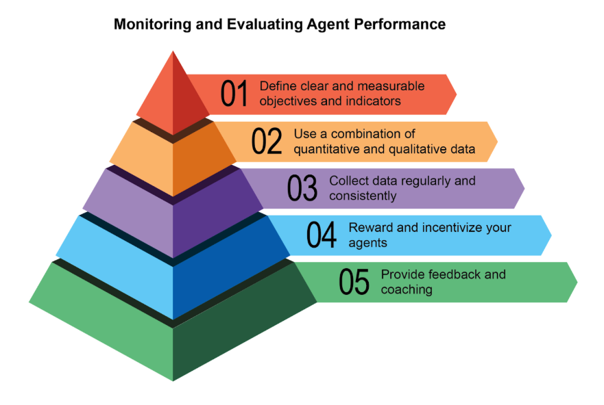
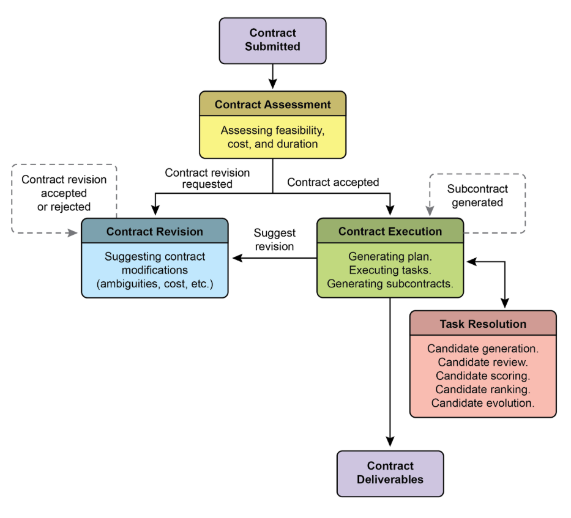
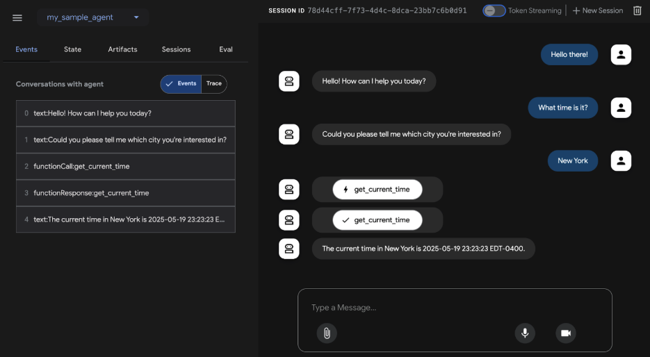
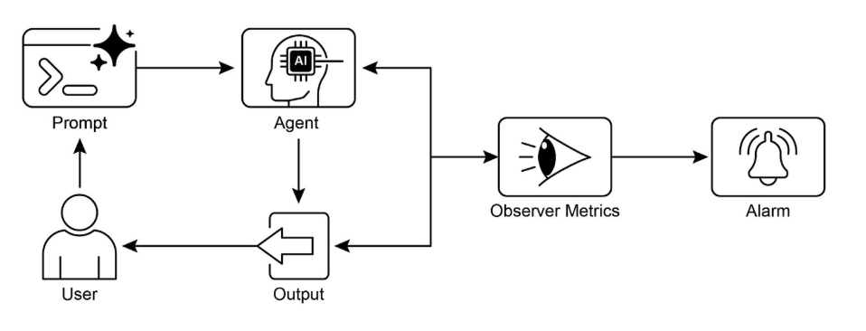

# 第 19 章：评估和监控

本章探讨允许智能智能体系统评估其性能、监控目标进展并检测操作异常的方法。虽然第 11 章概述了目标设置和监控，第 17 章讨论了推理机制，但本章重点关注对智能体有效性、效率和对要求的合规性的持续、通常是外部的测量。这包括定义指标、建立反馈循环和实现报告系统，以确保智能体性能在操作环境中与期望保持一致（见图 1）



图 1：评估和监控的最佳实践

## 实际应用与用例

最常见的应用和用例：

* **实时系统中的性能跟踪：** 持续监控部署在生产环境中的智能体的准确性、延迟和资源消耗（例如，客户服务聊天机器人的解决率、响应时间）。  
* **智能体改进的 A/B 测试：** 系统地并行比较不同智能体版本或策略的性能，以确定最优方法（例如，为物流智能体尝试两种不同的规划算法）。  
* **合规性和安全审计：** 生成自动审计报告，跟踪智能体对道德准则、法规要求和安全协议的合规性随时间的变化。这些报告可以由人在回路或另一个智能体验证，并可以在识别问题时生成 KPI 或触发警报。  
* **企业系统：** 为了管理企业系统中的智能体 AI，需要一种新的控制工具，AI"合同"。此动态协议将 AI 委托任务的目标、规则和控制编成代码。  
* **漂移检测：** 监控智能体输出随时间的相关性或准确性，检测当其性能由于输入数据分布的变化（概念漂移）或环境变化而退化时。  
* **智能体行为中的异常检测：** 识别智能体采取的异常或意外行动，这些行动可能表示错误、恶意攻击或突发的非期望行为。  
* **学习进度评估：** 对于设计为学习的智能体，跟踪其学习曲线、特定技能的改进或在不同任务或数据集上的泛化能力。

## 实践代码示例

开发 AI 智能体的全面评估框架是一项具有挑战性的工作，其复杂性可与学科或实质性出版物相媲美。这种困难源于需要考虑的众多因素，如模型性能、用户交互、道德影响和更广泛的社会影响。然而，对于实际实现，重点可以缩小到对 AI 智能体高效和有效运行至关重要的关键用例。

**智能体响应评估：** 此核心过程对于评估智能体输出的质量和准确性至关重要。它涉及确定智能体是否针对给定输入提供相关、正确、逻辑、无偏见和准确的信息。评估指标可能包括事实正确性、流畅性、语法精确性和对用户预期目的的遵守。

```python
def evaluate_response_accuracy(agent_output: str, expected_output: str) -> float:
    """Calculates a simple accuracy score for agent responses."""
    # This is a very basic exact match; real-world would use more sophisticated metrics
    return 1.0 if agent_output.strip().lower() == expected_output.strip().lower() else 0.0


# Example usage
agent_response = "The capital of France is Paris."
ground_truth = "Paris is the capital of France."
score = evaluate_response_accuracy(agent_response, ground_truth)
print(f"Response accuracy: {score}")
```

Python 函数 `evaluate_response_accuracy` 通过在智能体的输出和预期输出之间执行精确的、不区分大小写的比较来计算 AI 智能体响应的基本准确性分数，在去除前导或尾随空白之后。对于完全匹配，它返回 1.0 的分数，否则返回 0.0，表示二进制正确或不正确评估。此方法虽然对于简单检查来说很直接，但不考虑诸如释义或语义等价性之类的变化。

问题在于其比较方法。该函数对两个字符串执行严格的、逐字符的比较。在提供的示例中：

* `agent_response`: "The capital of France is Paris."  
* `ground_truth`: "Paris is the capital of France."

即使在去除空白并转换为小写之后，这两个字符串也不相同。因此，该函数将错误地返回准确性分数 `0.0`，尽管两个句子传达了相同的含义。

简单的比较在评估语义相似性方面不足，只有在智能体的响应与预期输出完全匹配时才能成功。更有效的评估需要先进的自然语言处理（NLP）技术来识别句子之间的含义。对于现实世界场景中的全面 AI 智能体评估，更复杂的指标通常必不可少。这些指标可以包括字符串相似性度量，如 Levenshtein 距离和 Jaccard 相似性、关键词分析用于特定关键词的存在或不存在、使用嵌入模型的余弦相似性的语义相似性、LLM-as-a-Judge 评估（稍后讨论用于评估细微的正确性和有用性），以及 RAG 特定指标，如忠实度和相关性。

**延迟监控：** 智能体操作的延迟监控在 AI 智能体的响应或操作速度是关键因素的应用中至关重要。此过程测量智能体处理请求并生成输出所需的持续时间。增加的延迟可能对用户体验和智能体的整体有效性产生不利影响，特别是在实时或交互式环境中。在实际应用中，简单地将延迟数据打印到控制台是不够的。建议将此信息记录到持久存储系统。选项包括结构化日志文件（例如，JSON）、时间序列数据库（例如，InfluxDB、Prometheus）、数据仓库（例如，Snowflake、BigQuery、PostgreSQL）或可观察性平台（例如，Datadog、Splunk、Grafana Cloud）。

**跟踪 LLM 交互的令牌使用：** 对于基于 LLM 的智能体，跟踪令牌使用对于管理成本和优化资源分配至关重要。LLM 交互的计费通常取决于处理的令牌数量（输入和输出）。因此，高效的令牌使用直接降低了运营费用。此外，监控令牌计数有助于识别提示工程或响应生成过程中的潜在改进领域。

```python
# This is conceptual as actual token counting depends on the LLM API
class LLMInteractionMonitor:
    def __init__(self):
        self.total_input_tokens = 0
        self.total_output_tokens = 0

    def record_interaction(self, prompt: str, response: str):
        # In a real scenario, use LLM API's token counter or a tokenizer
        input_tokens = len(prompt.split())  # Placeholder
        output_tokens = len(response.split())  # Placeholder
        self.total_input_tokens += input_tokens
        self.total_output_tokens += output_tokens
        print(f"Recorded interaction: Input tokens={input_tokens}, Output tokens={output_tokens}")

    def get_total_tokens(self):
        return self.total_input_tokens, self.total_output_tokens


# Example usage
monitor = LLMInteractionMonitor()
monitor.record_interaction("What is the capital of France?", "The capital of France is Paris.")
monitor.record_interaction("Tell me a joke.", "Why don't scientists trust atoms? Because they make up everything!")
input_t, output_t = monitor.get_total_tokens()
print(f"Total input tokens: {input_t}, Total output tokens: {output_t}")
```

本节介绍了一个概念性 Python 类 `LLMInteractionMonitor`，开发用于跟踪大型语言模型交互中的令牌使用。该类包含输入和输出令牌的计数器。其 `record_interaction` 方法通过分割提示和响应字符串来模拟令牌计数。在实际实现中，将使用特定的 LLM API 分词器进行精确的令牌计数。随着交互的发生，监视器累积总输入和输出令牌计数。`get_total_tokens` 方法提供对这些累积总数的访问，这对于成本管理和优化 LLM 使用至关重要。

**使用 LLM-as-a-Judge 的"有用性"自定义指标：** 评估主观品质（如 AI 智能体的"有用性"）提出了超越标准客观指标的挑战。一个潜在的框架涉及使用 LLM 作为评估者。此 LLM-as-a-Judge 方法根据预定义的"有用性"标准评估另一个 AI 智能体的输出。利用 LLM 的高级语言能力，此方法提供细致、类人的主观品质评估，超越简单关键词匹配或基于规则的评估。虽然在开发中，但此技术显示出自动化和扩展定性评估的前景。

```python
import os
import json
import logging
from typing import Optional

import google.generativeai as genai

# --- Configuration ---
logging.basicConfig(level=logging.INFO, format='%(asctime)s - %(levelname)s - %(message)s')

# Set your API key as an environment variable to run this script
# For example, in your terminal: export GOOGLE_API_KEY='your_key_here'
try:
    genai.configure(api_key=os.environ["GOOGLE_API_KEY"])
except KeyError:
    logging.error("Error: GOOGLE_API_KEY environment variable not set.")
    exit(1)

# --- LLM-as-a-Judge Rubric for Legal Survey Quality ---
LEGAL_SURVEY_RUBRIC = """
 You are an expert legal survey methodologist and a critical legal reviewer. Your task is to evaluate the quality of a given legal survey question. Provide a score from 1 to 5 for overall quality, along with a detailed rationale and specific feedback.

 Focus on the following criteria:

 1.  **Clarity & Precision (Score 1-5):**
    * 1: Extremely vague, highly ambiguous, or confusing.
    * 3: Moderately clear, but could be more precise.
    * 5: Perfectly clear, unambiguous, and precise in its legal terminology (if applicable) and intent.

 2.  **Neutrality & Bias (Score 1-5):**
    * 1: Highly leading or biased, clearly influencing the respondent towards a specific answer.
    * 3: Slightly suggestive or could be interpreted as leading.
    * 5: Completely neutral, objective, and free from any leading language or loaded terms.

 3.  **Relevance & Focus (Score 1-5):**
    * 1: Irrelevant to the stated survey topic or out of scope.
    * 3: Loosely related but could be more focused.
    * 5: Directly relevant to the survey's objectives and well-focused on a single concept.

 4.  **Completeness (Score 1-5):**
    * 1: Omits critical information needed to answer accurately or provides insufficient context.
    * 3: Mostly complete, but minor details are missing.
    * 5: Provides all necessary context and information for the respondent to answer thoroughly.

 5.  **Appropriateness for Audience (Score 1-5):**
    * 1: Uses jargon inaccessible to the target audience or is overly simplistic for experts.
    * 3: Generally appropriate, but some terms might be challenging or oversimplified.
    * 5: Perfectly tailored to the assumed legal knowledge and background of the target survey audience.

 **Output Format:**
 Your response MUST be a JSON object with the following keys:
 * `overall_score`: An integer from 1 to 5 (average of criterion scores, or your holistic judgment).
 * `rationale`: A concise summary of why this score was given, highlighting major strengths and weaknesses.
 * `detailed_feedback`: A bullet-point list detailing feedback for each criterion (Clarity, Neutrality, Relevance, Completeness, Audience Appropriateness). Suggest specific improvements.
 * `concerns`: A list of any specific legal, ethical, or methodological concerns.
 * `recommended_action`: A brief recommendation (e.g., "Revise for neutrality", "Approve as is", "Clarify scope").
"""

class LLMJudgeForLegalSurvey:
    """A class to evaluate legal survey questions using a generative AI model."""

    def __init__(self, model_name: str = 'gemini-1.5-flash-latest', temperature: float = 0.2):
        """
        Initializes the LLM Judge.

        Args:
            model_name (str): The name of the Gemini model to use.
                              'gemini-1.5-flash-latest' is recommended for speed and cost.
                              'gemini-1.5-pro-latest' offers the highest quality.
            temperature (float): The generation temperature. Lower is better for deterministic evaluation.
        """
        self.model = genai.GenerativeModel(model_name)
        self.temperature = temperature

    def _generate_prompt(self, survey_question: str) -> str:
        """Constructs the full prompt for the LLM judge."""
        return f"{LEGAL_SURVEY_RUBRIC}\n\n---\n**LEGAL SURVEY QUESTION TO EVALUATE:**\n{survey_question}\n---"

    def judge_survey_question(self, survey_question: str) -> Optional[dict]:
        """
        Judges the quality of a single legal survey question using the LLM.

        Args:
            survey_question (str): The legal survey question to be evaluated.

        Returns:
            Optional[dict]: A dictionary containing the LLM's judgment, or None if an error occurs.
        """
        full_prompt = self._generate_prompt(survey_question)

        try:
            logging.info(f"Sending request to '{self.model.model_name}' for judgment...")
            response = self.model.generate_content(
                full_prompt,
                generation_config=genai.types.GenerationConfig(
                    temperature=self.temperature,
                    response_mime_type="application/json"
                )
            )

            # Check for content moderation or other reasons for an empty response.
            if not response.parts:
                safety_ratings = response.prompt_feedback.safety_ratings
                logging.error(f"LLM response was empty or blocked. Safety Ratings: {safety_ratings}")
                return None

            return json.loads(response.text)
        except json.JSONDecodeError:
            logging.error(f"Failed to decode LLM response as JSON. Raw response: {response.text}")
            return None
        except Exception as e:
            logging.error(f"An unexpected error occurred during LLM judgment: {e}")
            return None


# --- Example Usage ---
if __name__ == "__main__":
    judge = LLMJudgeForLegalSurvey()

    # --- Good Example ---
    good_legal_survey_question = """
    To what extent do you agree or disagree that current intellectual property laws in Switzerland adequately protect emerging AI-generated content, assuming the content meets the originality criteria established by the Federal Supreme Court?
    (Select one: Strongly Disagree, Disagree, Neutral, Agree, Strongly Agree)
    """
    print("\n--- Evaluating Good Legal Survey Question ---")
    judgment_good = judge.judge_survey_question(good_legal_survey_question)
    if judgment_good:
        print(json.dumps(judgment_good, indent=2))

    # --- Biased/Poor Example ---
    biased_legal_survey_question = """
    Don't you agree that overly restrictive data privacy laws like the FADP are hindering essential technological innovation and economic growth in Switzerland?
    (Select one: Yes, No)
    """
    print("\n--- Evaluating Biased Legal Survey Question ---")
    judgment_biased = judge.judge_survey_question(biased_legal_survey_question)
    if judgment_biased:
        print(json.dumps(judgment_biased, indent=2))

    # --- Ambiguous/Vague Example ---
    vague_legal_survey_question = """
    What are your thoughts on legal tech?
    """
    print("\n--- Evaluating Vague Legal Survey Question ---")
    judgment_vague = judge.judge_survey_question(vague_legal_survey_question)
    if judgment_vague:
        print(json.dumps(judgment_vague, indent=2))
```

Python 代码定义了一个类 LLMJudgeForLegalSurvey，设计用于使用生成 AI 模型评估法律调查问题的质量。它利用 `google.generativeai` 库与 Gemini 模型交互。

核心功能涉及将调查问题与详细的评估标准一起发送到模型。该标准指定了判断调查问题的五个标准：清晰度和精确性、中立性和偏见、相关性和焦点、完整性和受众适当性。对于每个标准，分配 1 到 5 的分数，并且输出中需要详细的理由和反馈。代码构建一个包含标准和要评估的调查问题的提示。

`judge_survey_question` 方法将此提示发送到配置的 Gemini 模型，请求根据定义的结构格式化的 JSON 响应。预期的输出 JSON 包括总体分数、摘要理由、每个标准的详细反馈、关注列表和建议的操作。该类处理 AI 模型交互期间的潜在错误，如 JSON 解码问题或空响应。脚本通过评估法律调查问题的示例来演示其操作，说明 AI 如何根据预定义标准评估质量。

在结束之前，让我们检查各种评估方法，考虑它们的优缺点。

| 评估方法 | 优点 | 缺点 |
| :---- | :---- | :---- |
| 人工评估  | 捕获细微行为 | 难以扩展、昂贵且耗时，因为它考虑主观人为因素。 |
| LLM-as-a-Judge | 一致、高效且可扩展。  | 可能忽略中间步骤。受 LLM 能力限制。 |
| 自动指标  | 可扩展、高效且客观 | 在捕获完整能力方面可能存在限制。 |

## 智能体轨迹

评估智能体轨迹至关重要，因为传统软件测试不足。标准代码产生可预测的通过/失败结果，而智能体以概率方式运行，需要对最终输出和智能体轨迹进行定性评估——达到解决方案所采取的步骤序列。评估多智能体系统具有挑战性，因为它们不断变化。这需要开发超越个人性能来衡量沟通和团队合作有效性的复杂指标。此外，环境本身不是静态的，要求评估方法（包括测试用例）随时间适应。

这涉及检查决策质量、推理过程和整体结果。实现自动评估是有价值的，特别是对于超越原型阶段的开发。分析轨迹和工具使用包括评估智能体为实现目标而采用的步骤，如工具选择、策略和任务效率。例如，处理客户产品查询的智能体理想情况下可能遵循涉及意图确定、数据库搜索工具使用、结果审查和报告生成的轨迹。将智能体的实际行动与此预期的或基础事实轨迹进行比较，以识别错误和低效率。比较方法包括精确匹配（要求与理想序列完全匹配）、顺序匹配（按顺序的正确行动，允许额外步骤）、任意顺序匹配（任何顺序的正确行动，允许额外步骤）、精确度（测量预测行动的相关性）、召回率（测量捕获了多少基本行动）和单一工具使用（检查特定行动）。指标选择取决于特定智能体要求，高风险场景可能需要精确匹配，而更灵活的情况可能使用顺序或任意顺序匹配。

AI 智能体的评估涉及两种主要方法：使用测试文件和使用评估集文件。测试文件，以 JSON 格式，表示单个、简单的智能体-模型交互或会话，非常适合在积极开发期间进行单元测试，专注于快速执行和简单会话复杂性。每个测试文件包含一个具有多个回合的单个会话，其中回合是用户-智能体交互，包括用户的查询、预期的工具使用轨迹、中间智能体响应和最终响应。例如，测试文件可能详细说明用户请求"在卧室中关闭 `device_2`"，指定智能体使用 `set_device_info` 工具，参数如 location: Bedroom、`device_id: device_2` 和 status: OFF，以及预期的最终响应"I have set the `device_2` status to off."。测试文件可以组织到文件夹中，并可能包括 `test_config`.json 文件来定义评估标准。评估集文件利用称为"评估集"的数据集来评估交互，包含多个可能冗长的会话，适合模拟复杂的多轮对话和集成测试。评估集文件包含多个"评估"，每个表示具有一个或多个"回合"的不同会话，包括用户查询、预期工具使用、中间响应和参考最终响应。例如，评估集可能包括一个会话，其中用户首先问"你能做什么？"然后说"掷一个 10 面骰子两次，然后检查 9 是否是质数"，定义预期的 `roll_die` 工具调用和 `check_prime` 工具调用，以及总结骰子掷数和质数检查的最终响应。

**多智能体：** 评估具有多个智能体的复杂 AI 系统很像评估团队项目。因为有许多步骤和交接，其复杂性是一个优势，允许您检查每个阶段的工作质量。您可以检查每个单独的"智能体"执行其特定工作的好坏，但您还必须评估整个系统作为一个整体的执行情况。

为此，您询问有关团队动态的关键问题，由具体示例支持：

* 智能体是否有效合作？例如，在"航班预订智能体"确保航班后，它是否成功将正确的日期和目的地传递给"酒店预订智能体"？合作失败可能导致酒店预订错误的一周。  
* 他们是否制定了一个好计划并坚持执行？想象计划是先预订航班，然后预订酒店。如果"酒店智能体"在航班确认之前尝试预订房间，它已经偏离了计划。您还检查智能体是否卡住，例如，无限搜索"完美"的租车并且永远不继续下一步。  
* 是否为正确的任务选择了正确的智能体？如果用户询问他们旅行的天气，系统应该使用提供实时数据的专门"天气智能体"。如果它使用给出诸如"夏天通常很暖和"之类的通用答案的"通用知识智能体"，它已经为工作选择了错误的工具。  
* 最后，添加更多智能体是否提高了性能？如果您向团队添加新的"餐厅预订智能体"，它是否使整体旅行规划更好、更高效？或者它是否造成冲突并减慢系统速度，表明可扩展性问题？

## 从智能体到高级承包商

最近，有人提出（Agent Companion，gulli 等人）从简单 AI 智能体到高级"承包商"的演进，从概率性、通常不可靠的系统转变为更确定和可问责的系统，设计用于复杂、高风险环境（见图 2）

当今常见的 AI 智能体在简短、未充分指定的指令上运行，这使得它们适合简单演示，但在生产中很脆弱，其中歧义导致失败。"承包商"模型通过建立用户和 AI 之间的严格、正式化关系来解决这一问题，建立在一套明确定义和相互同意的条款基础上，就像人类世界中的法律服务协议一样。此转变由四个关键支柱支持，这些支柱共同确保清晰度、可靠性和以前超出自主系统范围的任务的健壮执行。

第一个是正式化合同支柱，一个详细规范，作为任务的单一事实来源。它远远超出了简单的提示。例如，财务分析任务的合同不会只说"分析上一季度的销售额"；它会要求"一份 20 页的 PDF 报告，分析 2025 年第一季度的欧洲市场销售额，包括五个特定的数据可视化、与 2024 年第一季度的比较分析，以及基于包含的供应链中断数据集的风险评估。"此合同明确定义了所需的可交付成果、它们的精确规范、可接受的数据源、工作范围，甚至预期的计算成本和完成时间，使结果可以客观验证。

第二个是谈判和反馈的动态生命周期支柱。合同不是静态命令，而是对话的开始。承包商智能体可以分析初始条款并谈判。例如，如果合同要求使用智能体无法访问的特定专有数据源，它可以返回反馈，说明"指定的 XYZ 数据库无法访问。请提供凭据或批准使用替代公共数据库，这可能会略微改变数据的粒度。"此谈判阶段，也允许智能体标记歧义或潜在风险，在执行开始之前解决误解，防止代价高昂的失败，并确保最终输出完全符合用户的实际意图。



图 2：智能体之间的合同执行示例

第三个支柱是质量导向的迭代执行。与为低延迟响应设计的智能体不同，承包商优先考虑正确性和质量。它基于自我验证和纠正的原则运行。例如，对于代码生成合同，智能体不仅会编写代码；它会生成多种算法方法，针对合同中定义的一套单元测试编译和运行它们，在性能、安全性和可读性等指标上对每个解决方案评分，并且仅提交通过所有验证标准的版本。此生成、审查和改进自己工作的内部循环，直到满足合同规范，对于建立对其输出的信任至关重要。

最后，第四个支柱是通过子合同进行层次分解。对于显著复杂的任务，主要承包商智能体可以充当项目经理，将主要目标分解为更小、更易管理的子任务。它通过生成新的、正式的"子合同"来实现这一点。例如，构建电子商务移动应用程序的主合同可以由主要智能体分解为"设计 UI/UX"、"开发用户认证模块"、"创建产品数据库模式"和"集成支付网关"的子合同。这些子合同中的每一个都是具有自己可交付成果和规范的完整、独立合同，可以分配给其他专门的智能体。此结构化分解允许系统以高度组织化和可扩展的方式处理巨大的、多方面的项目，标志着 AI 从简单工具向真正自主和可靠的问题解决引擎的转变。

最终，此承包商框架通过将正式规范、谈判和可验证执行的原则直接嵌入智能体的核心逻辑来重新构想 AI 交互。此有条不紊的方法将人工智能从一个有前途但往往不可预测的助手提升为一个能够在关键任务领域中以可审计精度自主管理复杂项目的可靠系统。通过解决歧义和可靠性的关键挑战，此模型为在信任和问责至关重要的关键任务域中部署 AI 铺平了道路。

## Google 的 ADK

在结束之前，让我们看一个支持评估的框架的具体示例。使用 Google 的 ADK 进行智能体评估（见图 3）可以通过三种方法进行：基于 Web 的 UI（adk web）用于交互式评估和数据集生成、使用 pytest 的程序化集成用于集成到测试管道中，以及直接命令行接口（adk eval）用于适合常规构建生成和验证过程的自动评估。



图 3：Google ADK 的评估支持

基于 Web 的 UI 支持交互式会话创建并保存到现有或新的评估集中，显示评估状态。Pytest 集成允许通过调用 AgentEvaluator.evaluate 将测试文件作为集成测试的一部分运行，指定智能体模块和测试文件路径。

命令行接口通过提供智能体模块路径和评估集文件来促进自动评估，具有指定配置文件或打印详细结果的选项。可以通过在评估集文件名之后列出它们来选择较大评估集中的特定评估以执行，用逗号分隔。

## 概览

**什么：** 智能体系统和 LLM 在复杂的、动态的环境中运行，它们的性能可能随时间退化。它们的概率性和非确定性性质意味着传统软件测试不足以确保可靠性。评估动态多智能体系统是一个重大挑战，因为它们不断变化的性质及其环境要求开发自适应测试方法和复杂指标，这些指标可以衡量超越个人性能的协作成功。数据漂移、意外交互、工具调用和偏离预期目标等问题可能在部署后出现。因此，持续评估对于测量智能体的有效性、效率以及对操作和安全要求的遵守是必要的。

**为什么：** 标准化评估和监控框架提供了系统评估和确保智能智能体持续性能的方法。这涉及定义清晰的指标，用于准确性、延迟和资源消耗，如 LLM 的令牌使用。它还包括先进技术，如分析智能体轨迹以理解推理过程，以及使用 LLM-as-a-Judge 进行细致、定性的评估。通过建立反馈循环和报告系统，此框架允许持续改进、A/B 测试以及异常或性能漂移的检测，确保智能体与其目标保持一致。

**经验法则：** 当在实时、生产环境中部署智能体时使用此模式，其中实时性能和可靠性至关重要。此外，当需要系统地比较智能体或其底层模型的不同版本以推动改进时，以及在需要合规性、安全性和道德审计的受监管或高风险域中操作时使用它。此模式也适用于当智能体的性能可能由于数据或环境的变化（漂移）而随时间退化时，或评估复杂的智能体行为时，包括行动序列（轨迹）和主观输出（如有用性）的质量。

**可视化摘要：**



图 4：评估和监控设计模式

## 关键要点

* 评估智能智能体超越了传统测试，持续测量它们在现实世界环境中的有效性、效率和对要求的遵守。  
* 智能体评估的实际应用包括实时系统中的性能跟踪、改进的 A/B 测试、合规性审计以及检测行为中的漂移或异常。  
* 基本智能体评估涉及评估响应准确性，而现实世界场景需要更复杂的指标，如延迟监控和基于 LLM 的智能体的令牌使用跟踪。  
* 智能体轨迹，智能体采取的步骤序列，对于评估至关重要，将实际行动与理想的、基础事实路径进行比较，以识别错误和低效率。  
* ADK 通过用于单元测试的单独测试文件和用于集成测试的综合评估集文件提供结构化评估方法，两者都定义预期的智能体行为。  
* 智能体评估可以通过基于 Web 的 UI 进行交互式测试、使用 pytest 以编程方式进行 CI/CD 集成，或通过命令行接口进行自动工作流来执行。  
* 为了使 AI 在复杂、高风险任务中可靠，我们必须从简单提示转向精确定义可验证可交付成果和范围的正式"合同"。此结构化协议允许智能体谈判、澄清歧义并迭代验证自己的工作，将其从不可预测的工具转变为可问责和可信的系统。

## 结论

总之，有效评估 AI 智能体需要超越简单的准确性检查，对它们在动态环境中的性能进行持续、多方面的评估。这涉及对延迟和资源消耗等指标的实用监控，以及通过其轨迹对智能体决策过程的复杂分析。对于像有用性这样的细微品质，诸如 LLM-as-a-Judge 之类的创新方法正变得越来越重要，而像 Google 的 ADK 这样的框架为单元测试和集成测试提供了结构化工具。随着多智能体系统，挑战加剧，重点转向评估协作成功和有效合作。

为了确保关键应用程序的可靠性，范式正在从简单的、提示驱动的智能体转向受正式协议约束的高级"承包商"。这些承包商智能体在明确、可验证的条款上运行，允许它们谈判、分解任务并自我验证其工作以满足严格的质量标准。此结构化方法将智能体从不可预测的工具转变为能够处理复杂、高风险任务的可问责系统。最终，此演进对于建立将复杂智能体 AI 部署到关键任务域所需的信任至关重要。

## 参考文献

相关研究包括：

1. ADK Web: [https://github.com/google/adk-web](https://github.com/google/adk-web)
2. ADK Evaluate: [https://google.github.io/adk-docs/evaluate/](https://google.github.io/adk-docs/evaluate/)  
3. Survey on Evaluation of LLM-based Agents, [https://arxiv.org/abs/2503.16416](https://arxiv.org/abs/2503.16416)
4. Agent-as-a-Judge: Evaluate Agents with Agents, [https://arxiv.org/abs/2410.10934](https://arxiv.org/abs/2410.10934)
5. Agent Companion, gulli et al: [https://www.kaggle.com/whitepaper-agent-companion](https://www.kaggle.com/whitepaper-agent-companion)
