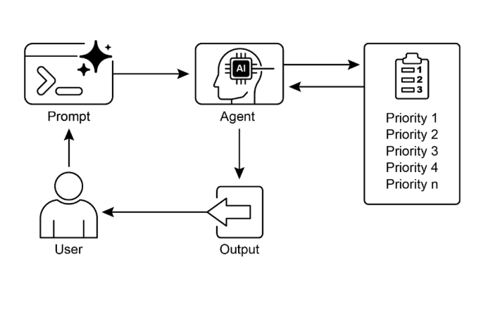

# 第 20 章：优先级排序

在复杂的、动态的环境中，智能体经常遇到许多潜在行动、冲突目标和有限资源。没有确定后续行动的既定过程，智能体可能会效率降低、操作延迟或无法实现关键目标。优先级排序模式通过使智能体能够根据其重要性、紧急性、依赖性和既定标准评估和排序任务、目标或行动来解决此问题。这确保智能体将精力集中在最关键的任务上，从而增强有效性和目标一致性。

## 优先级排序模式概述

智能体采用优先级排序来有效管理任务、目标和子目标，指导后续行动。此过程在解决多个需求时促进明智的决策，将重要或紧急的活动优先于不太关键的活动。这在资源受限、时间有限和目标可能冲突的现实场景中特别相关。

智能体优先级排序的基本方面通常涉及几个要素。首先，标准定义建立了任务评估的规则或指标。这些可能包括紧急性（任务的时间敏感性）、重要性（对主要目标的影响）、依赖性（任务是否是其他任务的前提）、资源可用性（必要工具或信息的准备情况）、成本/效益分析（努力与预期结果），以及用于个性化智能体的用户偏好。其次，任务评估涉及根据这些定义的标准评估每个潜在任务，使用从简单规则到复杂评分或 LLM 推理的方法。第三，调度或选择逻辑指的是基于评估选择最优下一个行动或任务序列的算法，可能利用队列或高级规划组件。最后，动态重新优先级排序允许智能体在情况变化时修改优先级，例如出现新的关键事件或接近截止日期，确保智能体适应性和响应性。

优先级排序可以在各个级别发生：选择总体目标（高级目标优先级排序）、排序计划内的步骤（子任务优先级排序），或从可用选项中选择下一个立即行动（行动选择）。有效的优先级排序使智能体能够表现出更智能、高效和健壮的行为，特别是在复杂的、多目标环境中。这反映了人类团队组织，其中管理者通过考虑所有成员的输入来优先排序任务。

## 实际应用与用例

在各种现实应用中，AI 智能体展示了优先级排序的复杂使用，以做出及时和有效的决策。

* **自动化客户支持：** 智能体优先处理紧急请求，如系统中断报告，而不是常规事项，如密码重置。它们还可能优先处理高价值客户。  
* **云计算：** AI 通过在高峰需求期间优先分配资源给关键应用程序来管理和调度资源，同时将不太紧急的批处理作业推迟到非高峰时段以优化成本。  
* **自动驾驶系统：** 持续优先排序行动以确保安全和效率。例如，制动以避免碰撞优先于保持车道纪律或优化燃油效率。  
* **金融交易：** 机器人通过分析市场条件、风险承受能力、利润率和实时新闻等因素来优先排序交易，使高优先级交易能够及时执行。  
* **项目管理：** AI 智能体根据截止日期、依赖性、团队可用性和战略重要性在项目板上优先排序任务。  
* **网络安全：** 监控网络流量的智能体通过评估威胁严重性、潜在影响和资产关键性来优先排序警报，确保对最危险威胁的即时响应。  
* **个人助手 AI：** 利用优先级排序来管理日常生活，根据用户定义的重要性、即将到来的截止日期和当前上下文组织日历事件、提醒和通知。

这些示例共同说明了优先级排序能力如何成为 AI 智能体在广泛情况下的增强性能和决策能力的基础。

## 实践代码示例

以下演示了使用 LangChain 开发项目管理器 AI 智能体。此智能体促进任务的创建、优先级排序和分配给团队成员，说明了大型语言模型与定制工具在自动化项目管理中的应用。

```python
import os
import asyncio
from typing import List, Optional, Dict, Type

from dotenv import load_dotenv
from pydantic import BaseModel, Field
from langchain_core.prompts import ChatPromptTemplate
from langchain_core.tools import Tool
from langchain_openai import ChatOpenAI
from langchain.agents import AgentExecutor, create_react_agent
from langchain.memory import ConversationBufferMemory


# --- 0. Configuration and Setup ---
# Loads the OPENAI_API_KEY from the .env file.
load_dotenv()

# The ChatOpenAI client automatically picks up the API key from the environment.
llm = ChatOpenAI(temperature=0.5, model="gpt-4o-mini")


# --- 1. Task Management System ---
class Task(BaseModel):
    """Represents a single task in the system."""
    id: str
    description: str
    priority: Optional[str] = None  # P0, P1, P2
    assigned_to: Optional[str] = None  # Name of the worker


class SuperSimpleTaskManager:
    """An efficient and robust in-memory task manager."""

    def __init__(self):
        # Use a dictionary for O(1) lookups, updates, and deletions.
        self.tasks: Dict[str, Task] = {}
        self.next_task_id = 1

    def create_task(self, description: str) -> Task:
        """Creates and stores a new task."""
        task_id = f"TASK-{self.next_task_id:03d}"
        new_task = Task(id=task_id, description=description)
        self.tasks[task_id] = new_task
        self.next_task_id += 1
        print(f"DEBUG: Task created - {task_id}: {description}")
        return new_task

    def update_task(self, task_id: str, **kwargs) -> Optional[Task]:
        """Safely updates a task using Pydantic's model_copy."""
        task = self.tasks.get(task_id)
        if task:
            # Use model_copy for type-safe updates.
            update_data = {k: v for k, v in kwargs.items() if v is not None}
            updated_task = task.model_copy(update=update_data)
            self.tasks[task_id] = updated_task
            print(f"DEBUG: Task {task_id} updated with {update_data}")
            return updated_task

        print(f"DEBUG: Task {task_id} not found for update.")
        return None

    def list_all_tasks(self) -> str:
        """Lists all tasks currently in the system."""
        if not self.tasks:
            return "No tasks in the system."

        task_strings = []
        for task in self.tasks.values():
            task_strings.append(
                f"ID: {task.id}, Desc: '{task.description}', "
                f"Priority: {task.priority or 'N/A'}, "
                f"Assigned To: {task.assigned_to or 'N/A'}"
            )
        return "Current Tasks:\n" + "\n".join(task_strings)


task_manager = SuperSimpleTaskManager()


# --- 2. Tools for the Project Manager Agent ---
# Use Pydantic models for tool arguments for better validation and clarity.
class CreateTaskArgs(BaseModel):
    description: str = Field(description="A detailed description of the task.")


class PriorityArgs(BaseModel):
    task_id: str = Field(description="The ID of the task to update, e.g., 'TASK-001'.")
    priority: str = Field(description="The priority to set. Must be one of: 'P0', 'P1', 'P2'.")


class AssignWorkerArgs(BaseModel):
    task_id: str = Field(description="The ID of the task to update, e.g., 'TASK-001'.")
    worker_name: str = Field(description="The name of the worker to assign the task to.")


def create_new_task_tool(description: str) -> str:
    """Creates a new project task with the given description."""
    task = task_manager.create_task(description)
    return f"Created task {task.id}: '{task.description}'."


def assign_priority_to_task_tool(task_id: str, priority: str) -> str:
    """Assigns a priority (P0, P1, P2) to a given task ID."""
    if priority not in ["P0", "P1", "P2"]:
        return "Invalid priority. Must be P0, P1, or P2."
    task = task_manager.update_task(task_id, priority=priority)
    return f"Assigned priority {priority} to task {task.id}." if task else f"Task {task_id} not found."


def assign_task_to_worker_tool(task_id: str, worker_name: str) -> str:
    """Assigns a task to a specific worker."""
    task = task_manager.update_task(task_id, assigned_to=worker_name)
    return f"Assigned task {task.id} to {worker_name}." if task else f"Task {task_id} not found."


# All tools the PM agent can use
pm_tools = [
    Tool(
        name="create_new_task",
        func=create_new_task_tool,
        description="Use this first to create a new task and get its ID.",
        args_schema=CreateTaskArgs
    ),
    Tool(
        name="assign_priority_to_task",
        func=assign_priority_to_task_tool,
        description="Use this to assign a priority to a task after it has been created.",
        args_schema=PriorityArgs
    ),
    Tool(
        name="assign_task_to_worker",
        func=assign_task_to_worker_tool,
        description="Use this to assign a task to a specific worker after it has been created.",
        args_schema=AssignWorkerArgs
    ),
    Tool(
        name="list_all_tasks",
        func=task_manager.list_all_tasks,
        description="Use this to list all current tasks and their status."
    ),
]


# --- 3. Project Manager Agent Definition ---
pm_prompt_template = ChatPromptTemplate.from_messages([
    ("system", """You are a focused Project Manager LLM agent. Your goal is to manage project tasks efficiently.
      When you receive a new task request, follow these steps:
    1.  First, create the task with the given description using the `create_new_task` tool. You must do this first to get a `task_id`.
    2.  Next, analyze the user's request to see if a priority or an assignee is mentioned.
        - If a priority is mentioned (e.g., "urgent", "ASAP", "critical"), map it to P0. Use `assign_priority_to_task`.
        - If a worker is mentioned, use `assign_task_to_worker`.
    3.  If any information (priority, assignee) is missing, you must make a reasonable default assignment (e.g., assign P1 priority and assign to 'Worker A').
    4.  Once the task is fully processed, use `list_all_tasks` to show the final state.

    Available workers: 'Worker A', 'Worker B', 'Review Team'
    Priority levels: P0 (highest), P1 (medium), P2 (lowest)
    """),
    ("placeholder", "{chat_history}"),
    ("human", "{input}"),
    ("placeholder", "{agent_scratchpad}")
])

# Create the agent executor
pm_agent = create_react_agent(llm, pm_tools, pm_prompt_template)
pm_agent_executor = AgentExecutor(
    agent=pm_agent,
    tools=pm_tools,
    verbose=True,
    handle_parsing_errors=True,
    memory=ConversationBufferMemory(memory_key="chat_history", return_messages=True)
)


# --- 4. Simple Interaction Flow ---
async def run_simulation():
    print("--- Project Manager Simulation ---")

    # Scenario 1: Handle a new, urgent feature request
    print("\n[User Request] I need a new login system implemented ASAP. It should be assigned to Worker B.")
    await pm_agent_executor.ainvoke({"input": "Create a task to implement a new login system. It's urgent and should be assigned to Worker B."})

    print("\n" + "-" * 60 + "\n")

    # Scenario 2: Handle a less urgent content update with fewer details
    print("[User Request] We need to review the marketing website content.")
    await pm_agent_executor.ainvoke({"input": "Manage a new task: Review marketing website content."})

    print("\n--- Simulation Complete ---")


# Run the simulation
if __name__ == "__main__":
    asyncio.run(run_simulation())
```

此代码使用 Python 和 LangChain 实现了一个简单的任务管理系统，设计用于模拟由大型语言模型驱动的项目经理智能体。

系统采用 SuperSimpleTaskManager 类来高效管理内存中的任务，利用字典结构进行快速数据检索。每个任务由 Task Pydantic 模型表示，该模型包含属性，如唯一标识符、描述性文本、可选优先级级别（P0、P1、P2）和可选的被分配人指定。内存使用根据任务类型、工作人数和其他贡献因素而变化。任务管理器提供任务创建、任务修改和检索所有任务的方法。

智能体通过定义的工具集与任务管理器交互。这些工具促进新任务的创建、任务优先级的分配、任务分配给人员以及列出所有任务。每个工具都被封装以启用与 SuperSimpleTaskManager 实例的交互。Pydantic 模型用于描述工具的必需参数，从而确保数据验证。

AgentExecutor 配置有语言模型、工具集和对话内存组件以保持上下文连续性。定义特定的 ChatPromptTemplate 以指导智能体在其项目管理角色中的行为。提示指示智能体首先创建任务，随后分配优先级和人员（如指定），最后以综合任务列表结束。默认分配，如 P1 优先级和"Worker A"，在提示中规定，用于信息缺失的情况。

代码包含一个异步性质的模拟函数（`run_simulation`）以演示智能体的操作能力。模拟执行两个不同的场景：管理具有指定人员的紧急任务，以及管理具有最少输入的较不紧急任务。由于在 AgentExecutor 中激活了 verbose=True，智能体的行动和逻辑过程被输出到控制台。

# 概览

**什么：** 在复杂环境中运行的 AI 智能体面临许多潜在行动、冲突目标和有限资源。没有明确的方法来确定下一步行动，这些智能体可能变得低效和无效。这可能导致显著的操作延迟或完全无法完成主要目标。核心挑战是管理这大量的选择，以确保智能体有目的和逻辑地行动。

**为什么：** 优先级排序模式通过使智能体能够排序任务和目标来为此问题提供标准化解决方案。这通过建立明确的标准（如紧急性、重要性、依赖性和资源成本）来实现。然后，智能体根据这些标准评估每个潜在行动，以确定最关键和及时的行动方案。此智能体能力允许系统动态适应不断变化的情况并有效管理受限资源。通过专注于最高优先级项目，智能体的行为变得更加智能、健壮并与战略目标保持一致。

**经验法则：** 当智能体系统必须在资源约束下自主管理多个、通常冲突的任务或目标以在动态环境中有效运行时，使用优先级排序模式。

**可视化摘要：**



图 1：优先级排序设计模式

# 关键要点

* 优先级排序使 AI 智能体能够在复杂的、多方面的环境中有效运行。  
* 智能体利用既定标准（如紧急性、重要性和依赖性）来评估和排序任务。  
* 动态重新优先级排序允许智能体响应实时变化调整其操作重点。  
* 优先级排序在各个级别发生，包括总体战略目标和即时战术决策。  
* 有效的优先级排序导致 AI 智能体的效率提高和操作健壮性增强。

# 结论

总之，优先级排序模式是有效智能体 AI 的基石，使系统能够以目的和智能导航动态环境的复杂性。它允许智能体自主评估许多冲突的任务和目标，就将其有限资源集中在哪里做出合理决策。此智能体能力超越了简单的任务执行，使系统能够充当主动的、战略决策者。通过权衡紧急性、重要性和依赖性等标准，智能体展示了复杂的、类人的推理过程。

此智能体行为的一个关键特征是动态重新优先级排序，它授予智能体自主权，以在条件变化时实时调整其重点。如代码示例所示，智能体解释模糊请求，自主选择和使用适当的工具，并逻辑地排序其行动以实现其目标。这种自我管理工作流的能力是将真正的智能体系统与简单自动化脚本分开的原因。最终，掌握优先级排序对于创建能够在任何复杂的、现实场景中有效和可靠运行的健壮和智能智能体至关重要。

# 参考文献

1. Examining the Security of Artificial Intelligence in Project Management: A Case Study of AI-driven Project Scheduling and Resource Allocation in Information Systems Projects ; [https://www.irejournals.com/paper-details/1706160](https://www.irejournals.com/paper-details/1706160)
2. AI-Driven Decision Support Systems in Agile Software Project Management: Enhancing Risk Mitigation and Resource Allocation; [https://www.mdpi.com/2079-8954/13/3/208](https://www.mdpi.com/2079-8954/13/3/208)  
