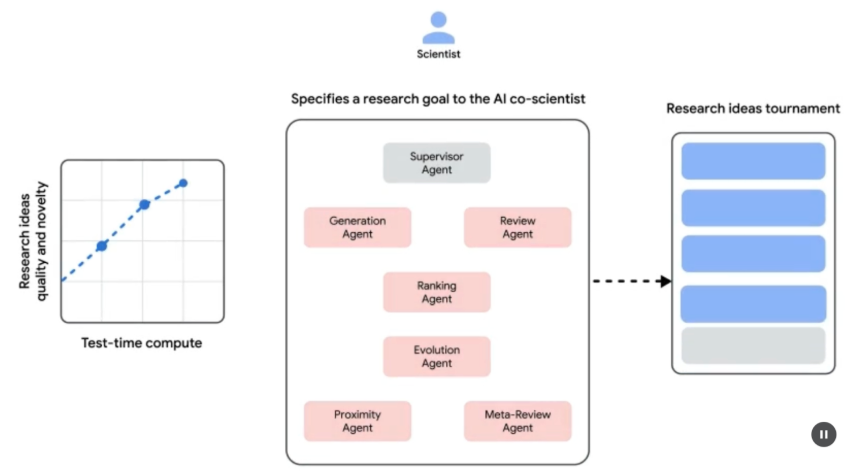
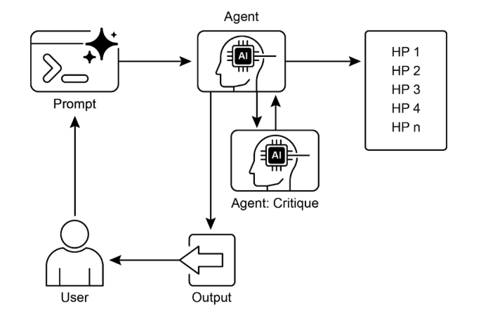

# 第 21 章：探索和发现

本章探讨使智能智能体能够在其操作环境中主动寻找新信息、发现新可能性并识别未知未知的模式。探索和发现不同于反应行为或预定义解决方案空间内的优化。相反，它们专注于智能体主动进入不熟悉的领域、尝试新方法并生成新知识或理解。此模式对于在静态知识或预编程解决方案不足的开放式、复杂或快速演化的域中运行的智能体至关重要。它强调智能体扩展其理解和能力的能力。

## 实际应用与用例

AI 智能体具有智能优先级排序和探索的能力，这导致了跨各个域的应用。通过自主评估和排序潜在行动，这些智能体可以导航复杂环境、发现隐藏洞察并推动创新。此优先级探索能力使它们能够优化过程、发现新知识并生成内容。

示例：

* **科学研究自动化：** 智能体设计和运行实验、分析结果并制定新假设，以发现新材料、候选药物或科学原理。  
* **游戏和策略生成：** 智能体探索游戏状态，发现突发策略或识别游戏环境中的漏洞（例如，AlphaGo）。  
* **市场研究和趋势发现：** 智能体扫描非结构化数据（社交媒体、新闻、报告）以识别趋势、消费者行为或市场机会。  
* **安全漏洞发现：** 智能体探测系统或代码库以查找安全漏洞或攻击向量。  
* **创意内容生成：** 智能体探索风格、主题或数据的组合，以生成艺术作品、音乐作品或文学作品。  
* **个性化教育和培训：** AI 导师根据学生的进度、学习风格和需要改进的领域优先排序学习路径和内容交付。

Google Co-Scientist

AI co-scientist（AI 联合科学家）是由 Google Research 开发的 AI 系统，设计为计算科学合作者。它协助人类科学家进行研究方面，如假设生成、提案改进和实验设计。此系统在 Gemini LLM 上运行。

AI co-scientist 的开发解决了科学研究中的挑战。这些包括处理大量信息、生成可测试假设和管理实验规划。AI co-scientist 通过执行涉及大规模信息处理和综合的任务来支持研究人员，可能揭示数据内的关系。其目的是通过处理早期研究的计算密集型方面来增强人类认知过程。

**系统架构和方法：** AI co-scientist 的架构基于多智能体框架，结构化为模拟协作和迭代过程。此设计集成专门的 AI 智能体，每个智能体在贡献研究目标方面具有特定角色。监督智能体在允许灵活扩展计算资源的异步任务执行框架内管理和协调这些单独智能体的活动。

核心智能体及其功能包括（见图 1）：

* **生成智能体：** 通过文献探索和模拟科学辩论产生初始假设来启动过程。  
* **反思智能体：** 充当同行评审者，批判性评估生成假设的正确性、新颖性和质量。  
* **排序智能体：** 采用基于 Elo 的锦标赛，通过模拟科学辩论比较、排序和优先排序假设。  
* **演进智能体：** 通过简化概念、综合想法和探索非常规推理，持续改进排名最高的假设。  
* **邻近智能体：** 计算邻近图以聚类相似想法并协助探索假设景观。  
* **元评审智能体：** 综合所有评审和辩论的洞察，以识别常见模式并提供反馈，使系统能够持续改进。

系统的操作基础依赖于 Gemini，它提供语言理解、推理和生成能力。系统采用"测试时计算扩展"，这是一种分配增加计算资源以迭代推理并增强输出的机制。系统处理和综合来自不同来源的信息，包括学术文献、基于网络的数据和数据库。



图 1：（由作者提供）AI Co-Scientist：从构思到验证

系统遵循迭代的"生成、辩论和演进"方法，反映了科学方法。在人类科学家输入科学问题后，系统参与假设生成、评估和改进的自我改进循环。假设经过系统评估，包括智能体之间的内部评估和基于锦标赛的排序机制。

**验证和结果：** AI co-scientist 的实用性已在多项验证研究中得到证明，特别是在生物医学中，通过自动基准测试、专家评审和端到端湿实验室实验评估其性能。

**自动和专家评估：** 在具有挑战性的 GPQA 基准测试中，系统的内部 Elo 评分显示与其结果的准确性一致，在困难的"diamond set"上实现了 78.4% 的 top-1 准确性。对 200 多个研究目标的分析表明，扩展测试时计算持续提高假设质量，以 Elo 评分衡量。在精选的 15 个具有挑战性的问题集上，AI co-scientist 优于其他最先进的 AI 模型和人类专家提供的"最佳猜测"解决方案。在小规模评估中，生物医学专家将 co-scientist 的输出评为比其他基线模型更新颖和更有影响。系统提出的药物再利用提案，格式化为 NIH Specific Aims 页面，也被六名专家肿瘤学家小组判定为高质量。

**端到端实验验证：**

药物再利用：对于急性髓系白血病（AML），系统提出了新的候选药物。其中一些，如 KIRA6，是完全新颖的建议，没有用于 AML 的先前临床前证据。随后的体外实验证实，KIRA6 和其他建议的药物在多个 AML 细胞系中以临床相关浓度抑制肿瘤细胞活力。

新靶点发现：系统识别了肝纤维化的新表观遗传靶点。使用人肝类器官的实验室实验验证了这些发现，显示针对建议的表观遗传修饰剂的药物具有显著的抗纤维化活性。其中一种已识别的药物已获得 FDA 批准用于另一种适应症，为再利用开辟了机会。

抗微生物耐药性：AI co-scientist 独立地重现了未发表的实验发现。它被要求解释为什么某些移动遗传元件（cf-PICIs）在多种细菌物种中被发现。在两天内，系统排名最高的假设是 cf-PICIs 与不同的噬菌体尾部相互作用以扩展其宿主范围。这反映了独立研究小组经过十多年的研究才达到的新颖、实验验证的发现。

**增强和限制：** AI co-scientist 背后的设计理念强调增强而不是完全自动化人类研究。研究人员通过自然语言与系统交互并指导系统，提供反馈、贡献自己的想法，并在"科学家在回路"协作范式中指导 AI 的探索过程。然而，系统有一些限制。其知识受到对开放访问文献依赖的限制，可能错过付费墙后的关键先前工作。它也无法访问负面实验结果，这些结果很少发表但对经验丰富的科学家至关重要。此外，系统继承了底层 LLM 的限制，包括事实不准确或"幻觉"的可能性。

**安全：** 安全是一个关键考虑因素，系统包含多个保护措施。所有研究目标在输入时都经过安全审查，生成的假设也会被检查，以防止系统被用于不安全或不道德的研究。使用 1,200 个对抗性研究目标的初步安全评估发现，系统可以健壮地拒绝危险输入。为了确保负责任的开发，系统正在通过受信任测试者计划向更多科学家提供，以收集现实世界的反馈。

## 实践代码示例

让我们看一个探索和发现的智能体 AI 的实际示例：Agent Laboratory，这是 Samuel Schmidgall 在 MIT 许可下开发的项目。

"Agent Laboratory"是一个自主研究工作流框架，旨在增强而不是替代人类科学努力。此系统利用专门的 LLM 来自动化科学研究过程的各个阶段，从而使人类研究人员能够将更多认知资源投入到概念化和批判性分析。

该框架集成了"AgentRxiv"，一个用于自主研究智能体的去中心化存储库。AgentRxiv 促进研究输出的存储、检索和开发。

Agent Laboratory 通过不同阶段指导研究过程：

1. **文献综述：** 在此初始阶段，专门的 LLM 驱动智能体被分配自主收集和批判性分析相关学术文献的任务。这涉及利用外部数据库（如 arXiv）来识别、综合和分类相关研究，有效地为后续阶段建立综合知识库。  
2. **实验：** 此阶段包括协作制定实验设计、数据准备、执行实验和分析结果。智能体利用集成工具（如 Python 用于代码生成和执行，Hugging Face 用于模型访问）来进行自动实验。系统设计用于迭代改进，智能体可以根据实时结果适应和优化实验程序。  
3. **报告写作：** 在最后阶段，系统自动化生成综合研究报告。这涉及将实验阶段的发现与文献综述的洞察相结合，根据学术惯例构建文档，并集成外部工具（如 LaTeX）用于专业格式化和图形生成。  
4. **知识共享：** AgentRxiv 是一个平台，使自主研究智能体能够共享、访问和协作推进科学发现。它允许智能体在先前发现的基础上构建，促进累积研究进展。

Agent Laboratory 的模块化架构确保计算灵活性。目标是通过自动化任务来提高研究生产力，同时保持人类研究人员的参与。

**代码分析：** 虽然全面的代码分析超出了本书的范围，但我想为您提供一些关键洞察，并鼓励您自己深入研究代码。

**判断：** 为了模拟人类评估过程，系统采用三方智能体判断机制来评估输出。这涉及部署三个不同的自主智能体，每个智能体配置为从特定角度评估产出，从而共同模拟人类判断的细致和多方面性质。此方法允许更健壮和全面的评估，超越单一指标以捕获更丰富的定性评估。

```python
class ReviewersAgent:
    def __init__(self, model="gpt-4o-mini", notes=None, openai_api_key=None):
        if notes is None:
            self.notes = []
        else:
            self.notes = notes
        self.model = model
        self.openai_api_key = openai_api_key

    def inference(self, plan, report):
        reviewer_1 = "You are a harsh but fair reviewer and expect good experiments that lead to insights for the research topic."
        review_1 = get_score(
            outlined_plan=plan,
            latex=report,
            reward_model_llm=self.model,
            reviewer_type=reviewer_1,
            openai_api_key=self.openai_api_key
        )

        reviewer_2 = "You are a harsh and critical but fair reviewer who is looking for an idea that would be impactful in the field."
        review_2 = get_score(
            outlined_plan=plan,
            latex=report,
            reward_model_llm=self.model,
            reviewer_type=reviewer_2,
            openai_api_key=self.openai_api_key
        )

        reviewer_3 = "You are a harsh but fair open-minded reviewer that is looking for novel ideas that have not been proposed before."
        review_3 = get_score(
            outlined_plan=plan,
            latex=report,
            reward_model_llm=self.model,
            reviewer_type=reviewer_3,
            openai_api_key=self.openai_api_key
        )

        return f"Reviewer #1:\n{review_1}, \nReviewer #2:\n{review_2}, \nReviewer #3:\n{review_3}"
```

判断智能体设计有特定的提示，密切模拟人类评审者通常采用的认知框架和评估标准。此提示指导智能体通过类似人类专家的视角分析输出，考虑相关性、连贯性、事实准确性和整体质量等因素。通过制作这些提示以反映人类评审协议，系统旨在实现接近人类辨别力的评估复杂程度。

````python
def get_score(outlined_plan, latex, reward_model_llm, reviewer_type=None, attempts=3, openai_api_key=None):
   e = str()
   for _attempt in range(attempts):
       try:
          
           template_instructions = """
           Respond in the following format:

           THOUGHT:
           <THOUGHT>

           REVIEW JSON:
           ```json
           <JSON>
           ```

           In <THOUGHT>, first briefly discuss your intuitions 
           and reasoning for the evaluation.
           Detail your high-level arguments, necessary choices 
           and desired outcomes of the review.
           Do not make generic comments here, but be specific 
           to your current paper.
           Treat this as the note-taking phase of your review.

           In <JSON>, provide the review in JSON format with 
           the following fields in the order:
           - "Summary": A summary of the paper content and 
           its contributions.
           - "Strengths": A list of strengths of the paper.
           - "Weaknesses": A list of weaknesses of the paper.
           - "Originality": A rating from 1 to 4 
             (low, medium, high, very high).
           - "Quality": A rating from 1 to 4 
             (low, medium, high, very high).
           - "Clarity": A rating from 1 to 4 
             (low, medium, high, very high).
           - "Significance": A rating from 1 to 4 
             (medium, high, very high).
           - "Questions": A set of clarifying questions to be
              answered by the paper authors.
           - "Limitations": A set of limitations and potential
              negative societal impacts of the work.
           - "Ethical Concerns": A boolean value indicating 
              whether there are ethical concerns.
           - "Soundness": A rating from 1 to 4 
              (poor, fair, good, excellent).
           - "Presentation": A rating from 1 to 4 
              (poor, fair, good, excellent).
           - "Contribution": A rating from 1 to 4 
             (poor, fair, good, excellent).
           - "Overall": A rating from 1 to 10 
             (very strong reject to award quality).
           - "Confidence": A rating from 1 to 5 
             (low, medium, high, very high, absolute).
           - "Decision": A decision that has to be one of the
             following: Accept, Reject.

           For the "Decision" field, don't use Weak Accept,   
           Borderline Accept, Borderline Reject, or Strong Reject.  
           Instead, only use Accept or Reject.
           This JSON will be automatically parsed, so ensure 
           the format is precise.
           """
````

在此多智能体系统中，研究过程围绕专门角色构建，反映典型的学术层次结构，以简化工作流并优化输出。

**教授智能体：** 教授智能体充当主要研究主管，负责建立研究议程、定义研究问题并将任务委托给其他智能体。此智能体设置战略方向并确保与项目目标保持一致。

````python
class ProfessorAgent(BaseAgent):
   def __init__(self, model="gpt4omini", notes=None, max_steps=100, openai_api_key=None):
       super().__init__(model, notes, max_steps, openai_api_key)
       self.phases = ["report writing"]

   def generate_readme(self):
       sys_prompt = f"""You are {self.role_description()} \n Here is the written paper \n{self.report}. Task instructions: Your goal is to integrate all of the knowledge, code, reports, and notes provided to you and generate a readme.md for a github repository."""
       history_str = "\n".join([_[1] for _ in self.history])
       prompt = (
           f"""History: {history_str}\n{'~' * 10}\n"""
           f"Please produce the readme below in markdown:\n")
       model_resp = query_model(model_str=self.model, system_prompt=sys_prompt, prompt=prompt, openai_api_key=self.openai_api_key)
       return model_resp.replace("```markdown", "")
````

**博士后智能体：** 博士后智能体的作用是执行研究。这包括进行文献综述、设计和实施实验，以及生成研究输出（如论文）。重要的是，博士后智能体具有编写和执行代码的能力，使实验协议和数据分析的实际实现成为可能。此智能体是研究工件的主要生产者。

```python
class PostdocAgent(BaseAgent):
    def __init__(self, model="gpt4omini", notes=None, max_steps=100, openai_api_key=None):
        super().__init__(model, notes, max_steps, openai_api_key)
        self.phases = ["plan formulation", "results interpretation"]

    def context(self, phase):
        sr_str = str()
        if self.second_round:
            sr_str = (
                f"The following are results from the previous experiments\n",
                f"Previous Experiment code: {self.prev_results_code}\n"
                f"Previous Results: {self.prev_exp_results}\n"
                f"Previous Interpretation of results: {self.prev_interpretation}\n"
                f"Previous Report: {self.prev_report}\n"
                f"{self.reviewer_response}\n\n\n"
            )

        if phase == "plan formulation":
            return (
                sr_str,
                f"Current Literature Review: {self.lit_review_sum}",
            )
        elif phase == "results interpretation":
            return (
                sr_str,
                f"Current Literature Review: {self.lit_review_sum}\n"
                f"Current Plan: {self.plan}\n"
                f"Current Dataset code: {self.dataset_code}\n"
                f"Current Experiment code: {self.results_code}\n"
                f"Current Results: {self.exp_results}"
            )

        return ""
```

**评审者智能体：** 评审者智能体对来自博士后智能体的研究输出进行批判性评估，评估论文和实验结果的质量、有效性和科学严谨性。此评估阶段模拟学术环境中的同行评审过程，以确保在最终确定之前的高标准研究输出。

**ML 工程智能体：** 机器学习工程智能体充当机器学习工程师，与博士生进行对话协作以开发代码。它们的核心功能是生成简单的数据预处理代码，整合从提供的文献综述和实验协议中得出的洞察。这确保数据被适当地格式化并准备好用于指定的实验。

```markdown
"You are a machine learning engineer being directed by a PhD student who will help you write the code, and you can interact with them through dialogue.\n"
"Your goal is to produce code that prepares the data for the provided experiment. You should aim for simple code to prepare the data, not complex code. You should integrate the provided literature review and the plan and come up with code to prepare data for this experiment.\n"
```

**SWEngineerAgents：** 软件工程智能体指导机器学习工程师智能体。它们的主要目的是协助机器学习工程师智能体为特定实验创建简单的数据准备代码。软件工程师智能体整合提供的文献综述和实验计划，确保生成的代码简单且与研究目标直接相关。

```markdown
"You are a software engineer directing a machine learning engineer, where the machine learning engineer will be writing the code, and you can interact with them through dialogue.\n"
"Your goal is to help the ML engineer produce code that prepares the data for the provided experiment. You should aim for very simple code to prepare the data, not complex code. You should integrate the provided literature review and the plan and come up with code to prepare data for this experiment.\n"
```

总之，"Agent Laboratory"代表了一个复杂的自主科学研究框架。它旨在通过自动化关键研究阶段和促进协作 AI 驱动的知识生成来增强人类研究能力。系统旨在通过管理常规任务来提高研究效率，同时保持人工监督。

## 概览

**什么：** AI 智能体通常在预定义知识内运行，限制了它们处理新情况或开放式问题的能力。在复杂和动态环境中，这种静态、预编程的信息对于真正的创新或发现来说是不足的。基本挑战是使智能体能够超越简单优化，主动寻找新信息并识别"未知未知"。这需要从纯粹反应行为向主动、智能体探索的范式转变，扩展系统自己的理解和能力。

**为什么：** 标准化解决方案是构建专门为自主探索和发现设计的智能体 AI 系统。这些系统通常利用多智能体框架，其中专门的 LLM 协作以模拟科学方法等过程。例如，不同的智能体可以被分配生成假设、批判性评审它们并演进最有前景的概念的任务。此结构化、协作方法使系统能够智能地导航庞大的信息景观、设计和执行实验，并生成真正的新知识。通过自动化探索的劳动密集型方面，这些系统增强了人类智力并显著加速了发现的步伐。

**经验法则：** 当在解决方案空间未完全定义的开放式、复杂或快速演化的域中运行时，使用探索和发现模式。它非常适合需要生成新假设、策略或洞察的任务，如科学研究、市场分析和创意内容生成。当目标是发现"未知未知"而不是仅仅优化已知过程时，此模式至关重要。

**可视化摘要：**



图 2：探索和发现设计模式

## 关键要点

* AI 中的探索和发现使智能体能够主动追求新信息和可能性，这对于导航复杂和演化的环境至关重要。  
* 诸如 Google Co-Scientist 之类的系统展示了智能体如何自主生成假设并设计实验，补充人类科学研究。  
* 多智能体框架，以 Agent Laboratory 的专门角色为例，通过自动化文献综述、实验和报告写作来改进研究。  
* 最终，这些智能体旨在通过管理计算密集型任务来增强人类创造力和问题解决能力，从而加速创新和发现。

## 结论

总之，探索和发现模式是真正智能体系统的本质，定义了其超越被动指令遵循以主动探索环境的能力。这种固有的智能体驱动力是使 AI 能够在复杂域中自主运行的原因，不仅执行任务而且独立设置子目标以发现新信息。这种高级智能体行为通过多智能体框架得到最有力的实现，其中每个智能体在更大的协作过程中体现特定的、主动的角色。例如，Google 的 Co-scientist 的高度智能体系统具有自主生成、辩论和演进科学假设的智能体。

像 Agent Laboratory 这样的框架通过创建模仿人类研究团队的智能体层次结构进一步构建这一点，使系统能够自我管理整个发现生命周期。此模式的核心在于编排突发智能体行为，允许系统以最少的人工干预追求长期、开放式目标。这提升了人类-AI 伙伴关系，将 AI 定位为处理探索任务自主执行的真正智能体合作者。通过将这种主动发现工作委托给智能体系统，人类智力得到显著增强，加速了创新。开发如此强大的智能体能力也需要对安全和道德监督的强烈承诺。最终，此模式为创建真正的智能体 AI 提供了蓝图，将计算工具转变为追求知识的独立、目标寻求合作伙伴。

## 参考文献

1. Exploration-Exploitation Dilemma**：** 强化学习和不确定性下决策的基本问题。 [https://en.wikipedia.org/wiki/Exploration%E2%80%93exploitation_dilemma](https://en.wikipedia.org/wiki/Exploration%E2%80%93exploitation_dilemma)
2. Google Co-Scientist: [https://research.google/blog/accelerating-scientific-breakthroughs-with-an-ai-co-scientist/](https://research.google/blog/accelerating-scientific-breakthroughs-with-an-ai-co-scientist/)
3. Agent Laboratory: Using LLM Agents as Research Assistants [https://github.com/SamuelSchmidgall/AgentLaboratory](https://github.com/SamuelSchmidgall/AgentLaboratory)
4. AgentRxiv: Towards Collaborative Autonomous Research: [https://agentrxiv.github.io/](https://agentrxiv.github.io/)
