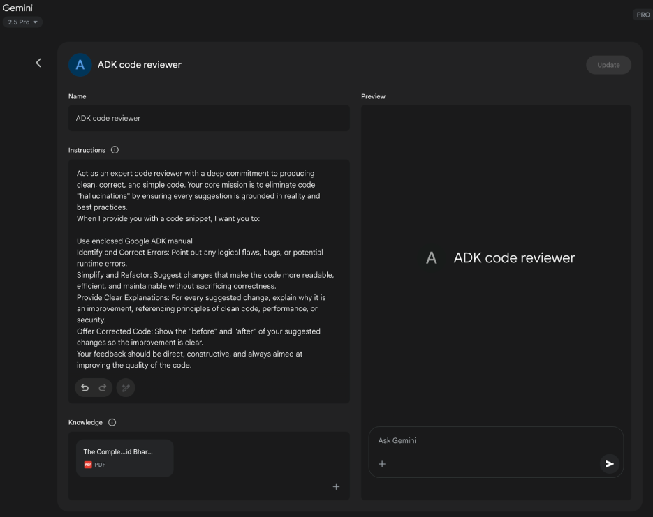

# 附录 A：高级提示技术

## 提示介绍

提示（Prompting）是与语言模型交互的主要接口，是制作输入以引导模型生成所需输出的过程。这涉及构建请求、提供相关上下文、指定输出格式以及演示预期的响应类型。精心设计的提示可以最大化语言模型的潜力，产生准确、相关和创造性的响应。相比之下，设计不当的提示可能导致模糊、无关或错误的输出。

提示工程的目标是从语言模型中持续引出高质量响应。这需要理解模型的能力和限制，并有效传达预期目标。它涉及通过学习如何最好地指导 AI 来发展与 AI 沟通的专业知识。

本附录详细介绍了各种提示技术，这些技术扩展了基本交互方法。它探讨了构建复杂请求、增强模型的推理能力、控制输出格式以及集成外部信息的方法。这些技术适用于构建从简单聊天机器人到复杂多智能体系统的各种应用程序，并可以提高智能体应用程序的性能和可靠性。

智能体模式是构建智能系统的架构结构，在主要章节中详细说明。这些模式定义了智能体如何规划、使用工具、管理内存和协作。这些智能体系统的有效性取决于它们与语言模型进行有意义交互的能力。

## 核心提示原则

语言模型有效提示的核心原则：

有效提示建立在指导与语言模型沟通的基本原则之上，适用于各种模型和任务复杂性。掌握这些原则对于持续生成有用和准确的响应至关重要。

**清晰度和特异性：** 指令应该明确和精确。语言模型解释模式；多种解释可能导致意外响应。定义任务、所需的输出格式以及任何限制或要求。避免模糊的语言或假设。不充分的提示会产生模糊和不准确的响应，阻碍有意义的输出。

**简洁性：** 虽然特异性至关重要，但它不应损害简洁性。指令应该直接。不必要的措辞或复杂的句子结构可能使模型困惑或掩盖主要指令。提示应该简单；对用户来说令人困惑的内容对模型来说也可能令人困惑。避免复杂的语言和多余的信息。使用直接措辞和主动动词来清楚地描述所需的行动。有效的动词包括：行动、分析、分类、对比、比较、创建、描述、定义、评估、提取、查找、生成、识别、列出、测量、组织、解析、选择、预测、提供、排序、推荐、返回、检索、重写、选择、显示、排序、总结、翻译、编写。

**使用动词：** 动词选择是一个关键的提示工具。行动动词指示预期的操作。与其"思考总结这个"，不如直接指令如"总结以下文本"更有效。精确的动词引导模型激活相关训练数据和该特定任务的过程。

**指令优于约束：** 积极的指令通常比消极约束更有效。指定所需的行动优于概述不应该做什么。虽然约束在安全或严格格式化方面有其位置，但过度依赖可能导致模型专注于避免而不是目标。构建提示以直接指导模型。积极指令与人类指导偏好一致，减少困惑。

**实验和迭代：** 提示工程是一个迭代过程。识别最有效的提示需要多次尝试。从草稿开始，测试它，分析输出，识别缺点，并改进提示。模型变化、配置（如温度或 top-p）以及轻微的措辞变化可能产生不同的结果。记录尝试对于学习和改进至关重要。实验和迭代是实现所需性能所必需的。

这些原则构成了与语言模型有效沟通的基础。通过优先考虑清晰度、简洁性、行动动词、积极指令和迭代，建立了应用更高级提示技术的强大框架。

## 基本提示技术

基于核心原则，基础技术为语言模型提供不同级别的信息或示例来指导其响应。这些方法作为提示工程的初始阶段，对广泛的应用程序有效。

### Zero-Shot Prompting（零样本提示）

零样本提示是最基本的提示形式，其中语言模型被提供指令和输入数据，而没有任何所需输入-输出对的示例。它完全依赖模型的预训练来理解任务并生成相关响应。本质上，零样本提示包括任务描述和开始过程的初始文本。

* **何时使用：** 零样本提示通常对于模型在其训练期间可能广泛遇到的任务来说是足够的，例如简单的问题回答、文本完成或简单文本的基本摘要。这是首先尝试的最快方法。  
* **示例：**  
  将以下英语句子翻译成法语：'Hello, how are you?'

### One-Shot Prompting（单样本提示）

单样本提示涉及在呈现实际任务之前为语言模型提供输入和相应所需输出的单个示例。此方法作为初始演示，以说明模型预期复制的模式。目的是为模型提供一个具体实例，它可以用作模板来有效执行给定任务。

* **何时使用：** 单样本提示在所需输出格式或风格特定或不常见时很有用。它给模型一个具体实例来学习。对于需要特定结构或语调的任务，它可以比零样本提高性能。  
* **示例：**  
  将以下英语句子翻译成西班牙语：  
  English: 'Thank you.'  
  Spanish: 'Gracias.'

  English: 'Please.'  
  Spanish:

### Few-Shot Prompting（少样本提示）

少样本提示通过提供几个输入-输出对示例（通常三到五个）来增强单样本提示。这旨在演示更清晰的预期响应模式，提高模型为新输入复制此模式的可能性。此方法提供多个示例来指导模型遵循特定的输出模式。

* **何时使用：** 少样本提示对于所需输出需要遵循特定格式、风格或表现细微变化的任务特别有效。它非常适合分类、具有特定模式的数据提取或生成特定风格的文本等任务，特别是当零样本或单样本不能产生一致结果时。使用至少三到五个示例是一个通用经验法则，根据任务复杂性和模型令牌限制进行调整。  
* **示例质量和多样性的重要性：** 少样本提示的有效性在很大程度上依赖于提供的示例的质量和多样性。示例应该准确、代表任务，并涵盖模型可能遇到的潜在变化或边缘情况。高质量、精心编写的示例至关重要；即使是小错误也可能使模型困惑并导致不期望的输出。包含多样化的示例有助于模型更好地泛化到未见过的输入。  
* **在分类示例中混合类别：** 当使用少样本提示进行分类任务（其中模型需要将输入分类到预定义类别中）时，最佳实践是混合来自不同类别的示例顺序。这防止模型可能过度拟合到特定示例序列，并确保它学习独立识别每个类别的关键特征，从而在未见数据上产生更健壮和可泛化的性能。  
* **演进到"Many-Shot"学习：** 随着像 Gemini 这样的现代 LLM 在长上下文建模方面变得更强大，它们在利用"Many-Shot"学习方面变得非常有效。这意味着对于复杂任务，现在可以通过在提示中直接包含更多数量的示例（有时甚至数百个）来实现最佳性能，允许模型学习更复杂的模式。  
* **示例：**  
  将以下电影评论的情感分类为 POSITIVE、NEUTRAL 或 NEGATIVE：

  Review: "The acting was superb and the story was engaging."  
  Sentiment: POSITIVE

  Review: "It was okay, nothing special."  
  Sentiment: NEUTRAL

  Review: "I found the plot confusing and the characters unlikable."  
  Sentiment: NEGATIVE

  Review: "The visuals were stunning, but the dialogue was weak."  
  Sentiment:

理解何时应用零样本、单样本和少样本提示技术，以及深思熟虑地制作和组织示例，对于增强智能体系统的有效性至关重要。这些基本方法作为各种提示策略的基础。

## 构建提示

除了提供示例的基本技术之外，您构建提示的方式在指导语言模型方面起着关键作用。构建涉及在提示内使用不同的部分或元素，以清晰有序的方式提供不同类型的信息，如指令、上下文或示例。这有助于模型正确解析提示并理解每段文本的特定角色。

### 系统提示

系统提示为语言模型设置整体上下文和目的，定义其在交互或会话中的预期行为。这涉及提供建立规则、角色或整体行为的指令或背景信息。与特定用户查询不同，系统提示为模型的响应提供基础指南。它影响模型在整个交互过程中的语调、风格和一般方法。例如，系统提示可以指示模型一致地简洁和有用地响应，或确保响应适合一般受众。系统提示还用于安全性和毒性控制，包括保持尊重语言等指南。

此外，为了最大化其有效性，系统提示可以通过基于 LLM 的迭代改进进行自动提示优化。诸如 Vertex AI Prompt Optimizer 之类的服务通过基于用户定义的指标和目标数据系统地改进提示来促进这一点，确保给定任务的最高可能性能。

* **示例：**  
  您是一个有用且无害的 AI 助手。以礼貌和信息丰富的方式响应所有查询。不要生成有害、有偏见或不适当的内容

### 角色提示

角色提示为语言模型分配特定的角色、人物或身份，通常与系统或上下文提示结合使用。这涉及指示模型采用与该角色相关的知识、语调和沟通风格。例如，诸如"充当旅行指南"或"您是专家数据分析师"之类的提示指导模型反映该分配角色的视角和专业知识。定义角色为语调、风格和专注的专业知识提供了一个框架，旨在增强输出的质量和相关性。还可以指定角色内的所需风格，例如，"幽默和鼓舞人心的风格"。

* **示例：**  
  充当经验丰富的旅行博主。写一段简短、引人入胜的关于罗马最佳隐藏宝石的段落。

### 使用分隔符

有效提示涉及清楚地区分语言模型的指令、上下文、示例和输入。分隔符，如三个反引号（```）、XML 标签（<instruction>、<context>）或标记（---），可用于在视觉和程序上分离这些部分。这种在提示工程中广泛使用的实践最小化了模型的误解，确保关于提示每个部分角色的清晰度。

* **示例：**  
  <instruction>总结以下文章，重点关注作者提出的主要论点。</instruction>  
  <article>  
  [在此处插入文章全文]  
  </article>

## 上下文工程

上下文工程（Context Engineering），与静态系统提示不同，动态提供对任务和对话至关重要的背景信息。这种不断变化的信息帮助模型掌握细微差别、回忆过去的交互并整合相关细节，从而产生基于事实的响应和更流畅的交换。示例包括先前的对话、相关文档（如检索增强生成中）或特定的操作参数。例如，在讨论去日本旅行时，可能会要求提供东京的三个适合家庭的活动，利用现有的对话上下文。在智能体系统中，上下文工程对于核心智能体行为（如内存持久性、决策制定和跨子任务协调）至关重要。具有动态上下文管道的智能体可以随时间维持目标、适应策略并与其他智能体或工具无缝协作——这些特性对于长期自主性至关重要。此方法认为模型输出的质量更多地取决于提供上下文的丰富性，而不是模型的架构。它标志着从传统提示工程的重要演进，后者主要关注优化即时用户查询的措辞。上下文工程扩展其范围以包括多层信息。

这些层包括：

* **系统提示：** 定义 AI 操作参数的基础指令（例如，"您是一名技术作家；您的语调必须正式和精确"）。  
* **外部数据：**  
  * **检索的文档：** 从知识库中主动获取以告知响应的信息（例如，拉取技术规格）。  
  * **工具输出：** AI 使用外部 API 获取实时数据的结果（例如，查询日历以获取可用性）。  
* **隐式数据：** 关键信息，如用户身份、交互历史和环境状态。纳入隐式上下文提出了与隐私和道德数据管理相关的挑战。因此，强大的治理对于上下文工程至关重要，特别是在企业、医疗保健和金融等部门。

核心原则是，即使是高级模型，在对其操作环境的有限或构建不良的视图下也会表现不佳。此实践将任务从仅仅回答问题重新构建为为智能体构建全面的操作图景。例如，上下文工程智能体在响应查询之前会整合用户的日历可用性（工具输出）、与电子邮件接收者的专业关系（隐式数据）以及先前会议的笔记（检索的文档）。这使模型能够生成高度相关、个性化和实用的输出。"工程"方面涉及创建强大的管道以在运行时获取和转换此数据，并建立反馈循环以持续改进上下文质量。

为了实现这一点，专门的调整系统，如 Google 的 Vertex AI 提示优化器，可以大规模自动化改进过程。通过系统地评估响应与样本输入和预定义指标，这些工具可以增强模型性能，并在不同模型之间适应提示和系统指令，而无需大量手动重写。为优化器提供样本提示、系统指令和模板，允许它以编程方式改进上下文输入，为实施复杂的上下文工程所需的反馈循环提供结构化方法。  
此结构化方法将基础 AI 工具与更复杂、上下文感知的系统区分开来。它将上下文视为主要组件，强调智能体知道什么、何时知道以及如何使用该信息。此实践确保模型对用户的意图、历史和当前环境有全面的理解。最终，上下文工程是将无状态聊天机器人转变为高度强大、情境感知系统的关键方法。

## 结构化输出

通常，提示的目标不仅仅是获得自由形式的文本响应，而是以特定的、机器可读的格式提取或生成信息。请求结构化输出，如 JSON、XML、CSV 或 Markdown 表，是一种关键的构建技术。通过明确要求特定格式的输出，并可能提供所需结构的模式或示例，您指导模型以可以轻松解析并被智能体系统或应用程序的其他部分使用的方式组织其响应。为数据提取返回 JSON 对象是有益的，因为它强制模型创建结构并可以限制幻觉。建议尝试输出格式，特别是对于像提取或分类数据这样的非创造性任务。

* **示例：**  
  从以下文本中提取以下信息，并将其作为具有键 `name`、`address` 和 `phone.number` 的 JSON 对象返回。

  Text: "Contact John Smith at 123 Main St, Anytown, CA or call (555) 123-4567."

有效利用系统提示、角色分配、上下文信息、分隔符和结构化输出显著增强了与语言模型交互的清晰度、控制力和实用性，为开发可靠的智能体系统提供了强大的基础。请求结构化输出对于创建语言模型的输出作为后续系统或处理步骤的输入的管道至关重要。

**利用 Pydantic 实现面向对象的外观：** 一个强大的强制执行结构化输出并增强互操作性的技术是使用 LLM 生成的数据来填充 Pydantic 对象的实例。Pydantic 是一个使用 Python 类型注释进行数据验证和设置管理的 Python 库。通过定义 Pydantic 模型，您为所需数据结构创建清晰且可执行的模式。此方法有效地为提示的输出提供面向对象的外观，将原始文本或半结构化数据转换为验证的、类型提示的 Python 对象。

您可以使用 `model.validate.json` 方法直接将来自 LLM 的 JSON 字符串解析为 Pydantic 对象。这特别有用，因为它在一个步骤中结合了解析和验证。

```python
from pydantic import BaseModel, EmailStr, Field, ValidationError
from typing import List, Optional
from datetime import date


# --- Pydantic Model Definition (from above) ---
class User(BaseModel):
    name: str = Field(..., description="The full name of the user.")
    email: EmailStr = Field(..., description="The user's email address.")
    date_of_birth: Optional[date] = Field(None, description="The user's date of birth.")
    interests: List[str] = Field(default_factory=list, description="A list of the user's interests.")


# --- Hypothetical LLM Output ---
llm_output_json = """
{
    "name": "Alice Wonderland",
    "email": "alice.w@example.com",
    "date_of_birth": "1995-07-21",
    "interests": [
        "Natural Language Processing",
        "Python Programming",
        "Gardening"
    ]
}
"""


# --- Parsing and Validation ---
try:
    # Use the model_validate_json class method to parse the JSON string.
    # This single step parses the JSON and validates the data against the User model.
    user_object = User.model_validate_json(llm_output_json)

    # Now you can work with a clean, type-safe Python object.
    print("Successfully created User object!")
    print(f"Name: {user_object.name}")
    print(f"Email: {user_object.email}")
    print(f"Date of Birth: {user_object.date_of_birth}")
    print(f"First Interest: {user_object.interests[0]}")

    # You can access the data like any other Python object attribute.
    # Pydantic has already converted the 'date_of_birth' string to a datetime.date object.
    print(f"Type of date_of_birth: {type(user_object.date_of_birth)}")
except ValidationError as e:
    # If the JSON is malformed or the data doesn't match the model's types,
    # Pydantic will raise a ValidationError.
    print("Failed to validate JSON from LLM.")
    print(e)
```

此 Python 代码演示了如何使用 Pydantic 库定义数据模型并验证 JSON 数据。它定义了一个 User 模型，具有 name、email、date_of_birth 和 interests 字段，包括类型提示和描述。然后，代码使用 User 模型的 `model.validate.json` 方法解析来自大型语言模型（LLM）的假设 JSON 输出。此方法根据模型的结构和类型处理 JSON 解析和数据验证。最后，代码从生成的 Python 对象访问验证的数据，并包括针对 ValidationError 的错误处理，以防 JSON 无效。

对于 XML 数据，可以使用 xmltodict 库将 XML 转换为字典，然后可以将其传递给 Pydantic 模型进行解析。通过在 Pydantic 模型中使用 Field 别名，您可以无缝地将 XML 通常冗长或属性繁重的结构映射到对象的字段。

此方法对于确保基于 LLM 的组件与更大系统的其他部分的互操作性非常宝贵。当 LLM 的输出封装在 Pydantic 对象中时，它可以可靠地传递给其他函数、API 或数据处理管道，并保证数据符合预期结构和类型。在系统组件边界处"解析，不验证"的实践导致更健壮和可维护的应用程序。

有效利用系统提示、角色分配、上下文信息、分隔符和结构化输出显著增强了与语言模型交互的清晰度、控制力和实用性，为开发可靠的智能体系统提供了强大的基础。请求结构化输出对于创建语言模型的输出作为后续系统或处理步骤的输入的管道至关重要。

构建提示 除了提供示例的基本技术之外，您构建提示的方式在指导语言模型方面起着关键作用。构建涉及在提示内使用不同的部分或元素，以清晰有序的方式提供不同类型的信息，如指令、上下文或示例。这有助于模型正确解析提示并理解每段文本的特定角色。

# 推理和思考过程技术

大型语言模型擅长模式识别和文本生成，但经常面临需要复杂、多步推理的任务的挑战。本附录重点介绍通过鼓励模型揭示其内部思考过程来增强这些推理能力的技术。具体而言，它涉及改进逻辑推理、数学计算和规划的方法。

## 思维链（Chain of Thought，CoT）

思维链（CoT）提示技术是一种通过明确提示模型在得出最终答案之前生成中间推理步骤来提高语言模型推理能力的强大方法。不仅仅要求结果，您指示模型"逐步思考"。此过程反映了人类如何将问题分解为更小、更易管理的部分并按顺序解决它们。

CoT 帮助 LLM 生成更准确的答案，特别是对于需要某种形式计算或逻辑推理的任务，在这些任务中模型可能难以处理并产生不正确的结果。通过生成这些中间步骤，模型更有可能保持在正轨上并正确执行必要的操作。

CoT 有两个主要变体：

* **Zero-Shot CoT：** 这涉及简单地在提示中添加"Let's think step by step"（或类似措辞）的短语，而不提供推理过程的任何示例。令人惊讶的是，对于许多任务，这个简单的添加可以通过触发其暴露内部推理轨迹的能力来显著提高模型的性能。  
  * **示例（Zero-Shot CoT）：**  
    如果火车以每小时 60 英里的速度行驶并覆盖 240 英里的距离，旅程需要多长时间？让我们逐步思考。

* **Few-Shot CoT：** 这结合了 CoT 和少样本提示。您为模型提供几个示例，其中显示输入、逐步推理过程和最终输出。这为模型提供了如何执行推理并构建其响应的更清晰模板，通常与零样本 CoT 相比，在更复杂的任务上产生更好的结果。  
  * **示例（Few-Shot CoT）：**  
    Q: 三个连续整数的和是 36。这些整数是什么？  
    A: 设第一个整数为 x。下一个连续整数是 x+1，第三个是 x+2。和是 x + (x+1) + (x+2) = 3x + 3。我们知道和是 36，所以 3x + 3 = 36。两边减去 3：3x = 33。除以 3：x = 11。整数是 11、11+1=12 和 11+2=13。整数是 11、12 和 13。

    Q: Sarah 有 5 个苹果，她买了 8 个。她吃了 3 个苹果。她还剩多少个苹果？让我们逐步思考。  
    A: 让我们逐步思考。Sarah 从 5 个苹果开始。她买了 8 个，所以她将 8 添加到初始数量：5 + 8 = 13 个苹果。然后，她吃了 3 个苹果，所以我们从总数中减去 3：13 - 3 = 10。Sarah 还剩 10 个苹果。答案是 10。

CoT 提供了几个优点。它相对容易实现，并且可以在现成的 LLM 上非常有效，无需微调。一个显著的好处是模型输出的可解释性增加；您可以看到它遵循的推理步骤，这有助于理解它为什么得出特定答案，并在出现问题时进行调试。此外，CoT 似乎提高了提示在不同版本语言模型中的健壮性，这意味着当模型更新时，性能不太可能退化。主要缺点是生成推理步骤增加了输出的长度，导致更高的令牌使用，这可以增加成本和响应时间。

CoT 的最佳实践包括确保最终答案在推理步骤*之后*呈现，因为推理的生成影响后续令牌对答案的预测。此外，对于具有单个正确答案的任务（如数学问题），在使用 CoT 时建议将模型的温度设置为 0（贪婪解码），以确保在每个步骤中确定性选择最可能的下一个令牌。

## 自一致性（Self-Consistency）

基于思维链的想法，自一致性技术旨在通过利用语言模型的概率性质来提高推理的可靠性。与其依赖单一的贪婪推理路径（如基本 CoT），自一致性为同一问题生成多个不同的推理路径，然后从它们中选择最一致的答案。

自一致性涉及三个主要步骤：

1. **生成不同的推理路径：** 相同的提示（通常是 CoT 提示）被多次发送给 LLM。通过使用更高的温度设置，鼓励模型探索不同的推理方法并生成不同的逐步解释。  
2. **提取答案：** 从每个生成的推理路径中提取最终答案。  
3. **选择最常见的答案：** 对提取的答案执行多数投票。在不同推理路径中最频繁出现的答案被选为最终、最一致的答案。

此方法提高了响应的准确性和连贯性，特别是对于可能存在多个有效推理路径或模型在单次尝试中可能容易出错的任务。好处是答案正确的伪概率可能性，增加了整体准确性。然而，显著的成本是需要对同一查询多次运行模型，导致更高的计算和费用。

* **示例（概念性）：**  
  * *提示：* "陈述'所有鸟都能飞'是真的还是假的？解释您的推理。"  
  * *模型运行 1（高温）：* 推理大多数鸟会飞，得出结论 True。  
  * *模型运行 2（高温）：* 推理企鹅和鸵鸟，得出结论 False。  
  * *模型运行 3（高温）：* 推理鸟*一般来说*，简要提及例外，得出结论 True。  
  * *自一致性结果：* 基于多数投票（True 出现两次），最终答案是"True"。（注意：更复杂的方法会权衡推理质量）。

## Step-Back Prompting（后退提示）

后退提示通过首先要求语言模型在解决具体细节之前考虑与任务相关的一般原则或概念来增强推理。然后，对此更广泛问题的响应被用作解决原始问题的上下文。

此过程允许语言模型激活相关的背景知识和更广泛的推理策略。通过专注于基本原则或更高级别的抽象，模型可以生成更准确和深入的答案，较少受表面元素的影响。最初考虑一般因素可以为生成特定的创造性输出提供更强的基础。后退提示鼓励批判性思维和知识应用，可能通过强调一般原则来减轻偏见。

* **示例：**  
  * *提示 1（后退）：* "使好的侦探故事的关键因素是什么？"  
  * *模型响应 1：* （列出元素，如红鲱鱼、引人入胜的动机、有缺陷的主角、逻辑线索、令人满意的解决方案）。  
  * *提示 2（原始任务 + 后退上下文）：* "使用好侦探故事的关键因素[在此处插入模型响应 1]，为设定在小镇的新推理小说写一个简短的剧情摘要。"

## 思维树（Tree of Thoughts，ToT）

思维树（ToT）是一种扩展思维链方法的高级推理技术。它使语言模型能够并发探索多个推理路径，而不是遵循单一的线性进展。此技术利用树结构，其中每个节点代表一个"思考"——充当中间步骤的连贯语言序列。从每个节点，模型可以分支，探索替代推理路线。

ToT 特别适合需要探索、回溯或评估多种可能性才能得出解决方案的复杂问题。虽然比线性思维链方法在计算上要求更高且实现更复杂，但 ToT 可以在需要慎重和探索性问题解决的任务上实现卓越的结果。它允许智能体考虑不同的观点，并通过在"思维树"内调查替代分支来可能从初始错误中恢复。

* **示例（概念性）：** 对于复杂的创意写作任务，如"基于这些情节点开发故事的三个不同可能结局"，ToT 将允许模型从关键转折点探索不同的叙述分支，而不仅仅是生成一个线性延续。

这些推理和思考过程技术对于构建能够处理超越简单信息检索或文本生成的任务的智能体至关重要。通过提示模型暴露其推理、考虑多种观点或后退到一般原则，我们可以显著增强它们在智能体系统中执行复杂认知任务的能力。

# 行动和交互技术

智能智能体具有主动与环境交互的能力，超越生成文本。这包括使用工具、执行外部函数以及参与观察、推理和行动的迭代循环。本节探讨旨在实现这些主动行为的提示技术。

## 工具使用 / 函数调用

智能体的关键能力是使用外部工具或调用函数来执行超越其内部能力的行动。这些行动可能包括网络搜索、数据库访问、发送电子邮件、执行计算或与外部 API 交互。工具使用的有效提示涉及设计提示，指示模型在工具使用的适当时机和方法论。

现代语言模型经常针对"函数调用"或"工具使用"进行微调。这使它们能够解释可用工具的描述，包括其目的和参数。收到用户请求后，模型可以确定工具使用的必要性，识别适当的工具，并格式化调用所需的参数。模型不直接执行工具。相反，它生成结构化输出，通常为 JSON 格式，指定工具及其参数。然后，智能体系统处理此输出，执行工具，并将工具的结果提供给模型，将其集成到正在进行的交互中。

* **示例：**  
  您可以访问一个天气工具，可以获取指定城市的当前天气。该工具称为 '`get.current.weather`' 并接受 '`city`' 参数（字符串）。

  User: 现在伦敦的天气怎么样？

  * *预期模型输出（函数调用）：*  
    {  
      "tool.code": "get.current.weather",  
      "tool.name": "get.current.weather",  
      "parameters": {  
        "city": "London"  
      }  
    }

## ReAct（推理和行动）

ReAct，即推理和行动（Reason and Act）的缩写，是一种提示范式，结合了思维链风格的推理和使用工具以交错方式执行行动的能力。ReAct 模拟人类如何操作——我们进行语言推理并采取行动以收集更多信息或朝着目标取得进展。

ReAct 模式涉及一个循环：

1. **思考：** 模型生成思考过程，解释其当前理解和计划。  
2. **行动：** 基于思考，模型决定执行行动，通常使用工具（例如，搜索、计算器、API 调用）。它输出工具的名称和所需的输入。  
3. **观察：** 智能体系统执行工具并提供结果（观察）返回给模型。  
4. 循环继续，模型基于最新的"观察"生成新的"思考"，导致进一步的"行动"和"观察"，直到任务完成，模型输出"最终答案"。

这种思考和行动的交错过程允许智能体动态收集信息、响应工具输出并改进其方法，使其特别适用于需要与动态环境或外部知识源交互的任务。

* **示例（说明性 ReAct 轨迹）：**  
  User: 法国的首都是什么？它当前的人口是多少？

  Thought: 用户询问两条信息：法国的首都和它的人口。我可以使用搜索工具来查找此信息。我将通过确认首都开始，虽然我可能知道它。  
  Action: Search({"query": "capital of France"})  
  Observation: Paris

  Thought: 好的，首都是巴黎。现在我需要找到巴黎的人口。  
  Action: Search({"query": "current population of Paris"})  
  Observation: 巴黎的人口在 2023 年估计约为 210 万人。

  Thought: 我已经找到了两条信息。我现在可以向用户提供最终答案。  
  Final Answer: 法国的首都是巴黎，其 2023 年的估计人口约为 210 万人。

这些技术对于构建能够主动与世界交互、检索实时信息并执行需要与外部系统交互的任务的智能体至关重要。

## 高级技术

除了基础、结构和推理模式之外，还有其他几种提示技术可以进一步增强智能体系统的能力和效率。这些范围从使用 AI 优化提示到纳入外部知识和基于用户特征定制响应。

### 自动提示工程（APE）

认识到制作有效提示可能是一个复杂和迭代的过程，自动提示工程（APE）探索使用语言模型本身来生成、评估和改进提示。此方法旨在自动化提示编写过程，可能增强模型性能，而无需在提示设计中投入大量人力。

一般想法是拥有一个"元模型"或一个过程，接受任务描述并生成多个候选提示。然后根据它们在给定输入集上产生的输出质量来评估这些提示（可能使用诸如 BLEU 或 ROUGE 之类的指标，或人工评估）。可以选择表现最好的提示，可能进一步改进，并用于目标任务。使用 LLM 为用户查询生成变体以训练聊天机器人就是这样的一个示例。

* **示例（概念性）：** 开发人员提供描述："我需要一个可以从电子邮件中提取日期和发件人的提示。"APE 系统生成几个候选提示。这些在样本电子邮件上进行测试，选择一致提取正确信息的提示。

当然。以下是使用 DSPy 等框架进行程序化提示优化的重新措辞和略微扩展的解释：

另一种强大的提示优化技术，特别是由 DSPy 框架推广的技术，涉及将提示不是作为静态文本，而是作为可以自动优化的程序化模块。此方法超越了手动试错，进入了更系统、数据驱动的方法论。

此技术的核心依赖于两个关键组件：

1. **Goldset（或高质量数据集）：** 这是一个高质量输入-输出对的代表性集合。它作为定义给定任务的成功响应看起来像什么的"基础事实"。  
2. **目标函数（或评分指标）：** 这是一个自动评估 LLM 输出与数据集中相应"黄金"输出的函数。它返回指示响应质量、准确性或正确性的分数。

使用这些组件，优化器（如贝叶斯优化器）系统地改进提示。此过程通常涉及两个主要策略，可以独立或协同使用：

* **Few-Shot 示例优化：** 与其让开发人员手动为少样本提示选择示例，优化器从 goldset 中以编程方式采样不同的示例组合。然后，它测试这些组合，以识别最有效指导模型生成所需输出的特定示例集。

* **指令提示优化：** 在此方法中，优化器自动改进提示的核心指令。它使用 LLM 作为"元模型"来迭代地变异和重新措辞提示的文本——调整措辞、语调或结构——以发现哪种措辞从目标函数产生最高分数。

两种策略的最终目标是最大化目标函数的分数，有效地"训练"提示以产生更接近高质量 goldset 的结果。通过结合这两种方法，系统可以同时优化*给模型的指令*和*向它展示的示例*，从而产生针对特定任务进行机器优化的高效且健壮的提示。

### 迭代提示 / 改进

此技术涉及从简单、基本的提示开始，然后根据模型的初始响应迭代地改进它。如果模型的输出不太正确，您分析缺点并修改提示以解决它们。这与其说是自动化过程（如 APE），不如说是人类驱动的迭代设计循环。

* **示例：**  
  * *尝试 1：* "为新类型的咖啡机写一个产品描述。"（结果太通用）。  
  * *尝试 2：* "为新类型的咖啡机写一个产品描述。突出其速度和易于清洁。"（结果更好，但缺乏细节）。  
  * *尝试 3：* "为'SpeedClean Coffee Pro'写一个产品描述。强调其能够在 2 分钟内冲泡一壶及其自清洁循环。面向忙碌的专业人士。"（结果更接近期望）。

### 提供负面示例

虽然"指令优于约束"的原则通常成立，但在某些情况下，提供负面示例可能会有帮助，尽管需要谨慎使用。负面示例向模型展示输入和*不期望的*输出，或输入和*不应该*生成的输出。这可以帮助澄清边界或防止特定类型的不正确响应。

* **示例：**  
  生成巴黎的流行旅游景点列表。不要包括埃菲尔铁塔。

  不应该做什么的示例：  
  Input: 列出巴黎的流行地标。  
  Output: 埃菲尔铁塔、卢浮宫、巴黎圣母院。

### 使用类比

使用类比构建任务有时可以帮助模型通过将其与熟悉的事物联系起来来理解所需的输出或过程。这对于创造性任务或解释复杂角色特别有用。

* **示例：**  
  充当"数据厨师"。取原材料（数据点）并准备"摘要菜"（报告），突出关键风味（趋势）供商业受众使用。

### 分解认知 / 分解

对于非常复杂的任务，将总体目标分解为更小、更易管理的子任务并分别提示模型每个子任务可能是有效的。然后合并子任务的结果以实现最终结果。这与提示链和规划相关，但强调问题的有意分解。

* **示例：** 为了写一篇研究论文：  
  * 提示 1："生成一篇关于 AI 对就业市场影响的论文的详细大纲。"  
  * 提示 2："基于此大纲写引言部分：[插入大纲引言]。"  
  * 提示 3："基于此大纲写'对白领工作的影响'部分：[插入大纲部分]。"（为其他部分重复）。  
  * 提示 N："合并这些部分并写一个结论。"

### 检索增强生成（RAG）

RAG 是一种强大的技术，通过在提示过程中给予它们访问外部、最新或领域特定信息来增强语言模型。当用户提出问题时，系统首先从知识库（例如，数据库、文档集、网络）中检索相关文档或数据。然后，此检索的信息作为上下文包含在提示中，允许语言模型基于该外部知识生成响应。这减轻了诸如幻觉之类的问题，并提供了对模型未训练过的信息或非常新的信息的访问。这是需要处理动态或专有信息的智能体系统的关键模式。

* **示例：**  
  * *用户查询：* "Python 库'X'的最新版本有哪些新功能？"  
  * *系统操作：* 在文档数据库中搜索"Python 库 X 最新功能"。  
  * *给 LLM 的提示：* "基于以下文档片段：[插入检索的文本]，解释 Python 库'X'的最新版本中的新功能。"

### 角色模式（用户角色）

虽然角色提示为*模型*分配角色，但角色模式涉及描述用户或模型输出的目标受众。这有助于模型在语言、复杂性、语调以及它提供的信息类型方面定制其响应。

* **示例：**  
  您正在解释量子物理学。目标受众是对该主题没有先验知识的高中生。简单解释并使用他们可能理解的类比。

  解释量子物理学：[插入基本解释请求]

这些高级和补充技术为提示工程师提供了进一步的工具，以优化模型行为、集成外部信息并在智能体工作流中为特定用户和任务定制交互。

## 使用 Google Gems

Google 的 AI "Gems"（见图 1）代表其大型语言模型架构中的用户可配置功能。每个"Gem"作为核心 Gemini AI 的专门实例，针对特定、可重复的任务量身定制。用户通过为其提供一组明确的指令来创建 Gem，这建立了其操作参数。此初始指令集定义了 Gem 的指定目的、响应风格和知识域。底层模型设计为在整个对话中一致地遵守这些预定义指令。

这允许创建高度专业化的 AI 智能体用于专注的应用程序。例如，可以配置 Gem 以充当仅引用特定编程库的代码解释器。另一个可以指示分析数据集，生成摘要而不进行推测性评论。不同的 Gem 可能充当遵循特定正式风格指南的翻译器。此过程为人工智能创建了持久的、任务特定的上下文。

因此，用户避免了在每次新查询时重新建立相同上下文信息的需要。此方法减少了对话冗余并提高了任务执行的效率。由此产生的交互更加专注，产生与用户初始要求一致一致的输出。此框架允许将细粒度、持久的用户方向应用于通用 AI 模型。最终，Gems 使从通用交互转向专门的、预定义的 AI 功能成为可能。



图 1：Google Gem 使用示例。

## 使用 LLM 改进提示（元方法）

我们已经探索了许多制作有效提示的技术，强调清晰度、结构以及提供上下文或示例。然而，此过程可能是迭代的，有时具有挑战性。如果我们能够利用大型语言模型（如 Gemini）的强大功能来帮助我们*改进*我们的提示会怎样？这就是使用 LLM 进行提示改进的本质——一个"元"应用程序，其中 AI 协助优化给予 AI 的指令。

此功能特别"酷"，因为它代表了一种 AI 自我改进的形式，或者至少是 AI 辅助的人类在与 AI 交互方面的改进。与其仅依赖人类直觉和试错，我们可以利用 LLM 对语言、模式甚至常见提示陷阱的理解来获得改进提示的建议。它将 LLM 转变为提示工程过程中的协作合作伙伴。

这在实践中是如何工作的？您可以为语言模型提供一个您正在尝试改进的现有提示，以及您希望它完成的任务，甚至可能是您当前获得的输出示例（以及为什么它不满足您的期望）。然后，您提示 LLM 分析提示并提出改进建议。

像 Gemini 这样的模型，具有强大的推理和语言生成能力，可以分析您现有提示的潜在歧义、缺乏特异性或低效措辞的领域。它可以建议纳入我们讨论过的技术，如添加分隔符、澄清所需的输出格式、建议更有效的角色，或推荐包含少样本示例。

此元提示方法的好处包括：

* **加速迭代：** 比纯手动试错更快地获得改进建议。  
* **识别盲点：** LLM 可能会发现您忽略的提示中的歧义或潜在误解。  
* **学习机会：** 通过查看 LLM 提出的建议类型，您可以更多地了解什么使提示有效并提高您自己的提示工程技能。  
* **可扩展性：** 可能自动化提示优化过程的某些部分，特别是在处理大量提示时。

重要的是要注意，LLM 的建议并不总是完美的，应该像任何手动工程的提示一样进行评估和测试。然而，它提供了一个强大的起点，可以显著简化改进过程。

* **改进提示的示例：**  
  分析以下语言模型的提示，并提出改进方法，以一致地从新闻文章中提取主要主题和关键实体（人员、组织、位置）。当前提示有时会遗漏实体或误解主要主题。

  现有提示：  
  "总结本文的要点并列出重要名称和地点：[插入文章文本]"

  改进建议：

在此示例中，我们使用 LLM 来批评和增强另一个提示。此元级别交互展示了这些模型的灵活性和强大功能，允许我们首先优化它们收到的基本指令来构建更有效的智能体系统。这是一个迷人的循环，其中 AI 帮助我们更好地与 AI 对话。

## 特定任务的提示

虽然到目前为止讨论的技术广泛适用，但某些任务受益于特定的提示考虑。这些在代码和多模态输入领域特别相关。

### 代码提示

语言模型，特别是那些在大型代码数据集上训练的模型，可能是开发人员的强大助手。代码提示涉及使用 LLM 生成、解释、翻译或调试代码。存在各种用例：

* **编写代码的提示：** 要求模型基于所需功能的描述生成代码片段或函数。  
  * **示例：** "编写一个接受数字列表并返回平均值的 Python 函数。"  
* **解释代码的提示：** 提供代码片段并要求模型解释它的作用，逐行或摘要形式。  
  * **示例：** "解释以下 JavaScript 代码片段：[插入代码]。"  
* **翻译代码的提示：** 要求模型将代码从一种编程语言翻译到另一种。  
  * **示例：** "将以下 Java 代码翻译为 C++：[插入代码]。"  
* **调试和审查代码的提示：** 提供有错误或可以改进的代码，要求模型识别问题、建议修复或提供重构建议。  
  * **示例：** "以下 Python 代码给出'NameError'。问题是什么，我如何修复它？[插入代码和跟踪]。"

有效的代码提示通常需要提供足够的上下文、指定所需的语言和版本，并清楚地说明功能或问题。

### 多模态提示

虽然本附录的重点和当前 LLM 交互的大部分是基于文本的，但该领域正在快速转向可以跨不同模态（文本、图像、音频、视频等）处理和生成信息的多模态模型。多模态提示涉及使用输入组合来指导模型。这指的是使用多种输入格式而不仅仅是文本。

* **示例：** 提供图表的图像并要求模型解释图表中显示的过程（图像输入 + 文本提示）。或提供图像并要求模型生成描述性标题（图像输入 + 文本提示 -> 文本输出）。

随着多模态能力变得更加复杂，提示技术将演进以有效利用这些组合的输入和输出。

## 最佳实践和实验

成为熟练的提示工程师是一个涉及持续学习和实验的迭代过程。几个有价值的最佳实践值得重申和强调：

* **提供示例：** 提供一个或几个示例是指导模型的最有效方法之一。  
* **设计简单：** 保持您的提示简洁、清晰且易于理解。避免不必要的术语或过于复杂的措辞。  
* **对输出要具体：** 清楚地定义模型响应的所需格式、长度、风格和内容。  
* **使用指令优于约束：** 专注于告诉模型您希望它做什么，而不是您不希望它做什么。  
* **控制最大令牌长度：** 使用模型配置或明确的提示指令来管理生成输出的长度。  
* **在提示中使用变量：** 对于应用程序中使用的提示，使用变量使其动态和可重用，避免硬编码特定值。  
* **尝试输入格式和写作风格：** 尝试不同的措辞提示方式（问题、陈述、指令）并尝试不同的语调或风格，以查看哪种产生最佳结果。  
* **对于分类任务的少样本提示，混合类别：** 随机化来自不同类别的示例顺序以防止过度拟合。  
* **适应模型更新：** 语言模型不断更新。准备在新模型版本上测试您现有的提示，并调整它们以利用新功能或保持性能。  
* **尝试输出格式：** 特别是对于非创造性任务，尝试请求结构化输出，如 JSON 或 XML。  
* **与其他提示工程师一起实验：** 与他人协作可以提供不同的观点并导致发现更有效的提示。  
* **CoT 最佳实践：** 记住思维链的特定实践，如将答案放在推理之后，对于具有单个正确答案的任务将温度设置为 0。  
* **记录各种提示尝试：** 这对于跟踪什么有效、什么无效以及为什么至关重要。维护您的提示、配置和结果的结构化记录。  
* **在代码库中保存提示：** 当将提示集成到应用程序中时，将它们存储在单独的、组织良好的文件中，以便于维护和版本控制。  
* **依赖自动测试和评估：** 对于生产系统，实施自动测试和评估程序以监控提示性能并确保对新数据的泛化。

提示工程是一种通过实践提高的技能。通过应用这些原则和技术，并保持对实验和文档的系统方法，您可以显著增强构建有效智能体系统的能力。

## 结论

本附录提供了提示的全面概述，将其重新构建为一种严格的工程实践，而不是简单的提问行为。其核心目的是演示如何将通用语言模型转变为针对特定任务的专门的、可靠的和高度强大的工具。旅程从非协商的核心原则开始，如清晰度、简洁性和迭代实验，这些是与 AI 有效沟通的基础。这些原则至关重要，因为它们减少了自然语言中的固有歧义，帮助将模型的概率输出引导向单一、正确的意图。基于此基础，基本技术（如零样本、单样本和少样本提示）作为通过示例演示预期行为的主要方法。这些方法提供不同级别的上下文指导，有力地塑造模型的响应风格、语调和格式。除了示例之外，使用明确角色、系统级别指令和清晰分隔符构建提示为模型提供了精细控制的必要架构层。

这些技术的重要性在构建自主智能体的背景下变得至关重要，它们为复杂、多步骤操作提供了必要的控制和可靠性。为了使智能体有效地创建和执行计划，它必须利用高级推理模式，如思维链和思维树。这些复杂方法迫使模型外部化其逻辑步骤，系统地将复杂目标分解为一系列可管理的子任务。整个智能体系统的操作可靠性取决于每个组件输出的可预测性。这就是为什么请求结构化数据（如 JSON）并使用诸如 Pydantic 之类的工具以编程方式验证它不仅仅是便利，而是健壮自动化的绝对必要。没有这种纪律，智能体的内部认知组件无法可靠地通信，导致自动化工作流中的灾难性失败。最终，这些构建和推理技术成功地将模型的概率文本生成转换为智能体的确定性和可信的认知引擎。

此外，这些提示授予智能体感知环境并对环境采取行动的关键能力，弥合了数字思维与现实世界交互之间的差距。面向行动的框架（如 ReAct）和本机函数调用是作为智能体手的重要机制，允许它使用工具、查询 API 和操作数据。同时，诸如检索增强生成（RAG）之类的技术和更广泛的上下文工程学科作为智能体的感官。它们主动从外部知识库中检索相关的、实时的信息，确保智能体的决策基于当前、事实的现实。此关键能力防止智能体在真空中运行，在这种情况下，它将局限于其静态和可能过时的训练数据。因此，掌握这一全面的提示是决定性技能，它将通用语言模型从简单的文本生成器提升为真正复杂的智能体，能够以自主性、意识和智能执行复杂任务。

## 参考文献

以下是进一步阅读和深入探索提示工程技术的资源列表：

1. Prompt Engineering, [https://www.kaggle.com/whitepaper-prompt-engineering](https://www.kaggle.com/whitepaper-prompt-engineering)
2. Chain-of-Thought Prompting Elicits Reasoning in Large Language Models, [https://arxiv.org/abs/2201.11903](https://arxiv.org/abs/2201.11903)
3. Self-Consistency Improves Chain of Thought Reasoning in Language Models,  [https://arxiv.org/pdf/2203.11171](https://arxiv.org/pdf/2203.11171)
4. ReAct: Synergizing Reasoning and Acting in Language Models, [https://arxiv.org/abs/2210.03629](https://arxiv.org/abs/2210.03629)  
5. Tree of Thoughts: Deliberate Problem Solving with Large Language Models,  [https://arxiv.org/pdf/2305.10601](https://arxiv.org/pdf/2305.10601)
6. Take a Step Back: Evoking Reasoning via Abstraction in Large Language Models, [https://arxiv.org/abs/2310.06117](https://arxiv.org/abs/2310.06117)
7. DSPy: Programming—not prompting—Foundation Models [https://github.com/stanfordnlp/dspy](https://github.com/stanfordnlp/dspy)
