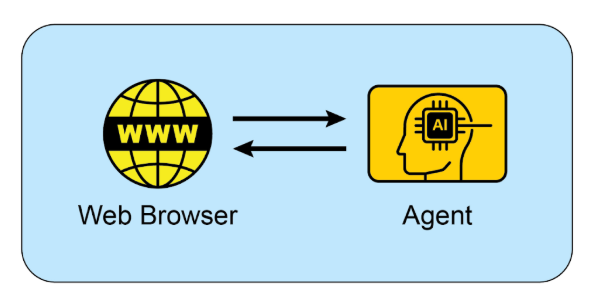

# 附录 B - AI 智能体交互：从 GUI 到现实世界环境

AI 智能体越来越多地通过与数字接口和物理世界交互来执行复杂任务。它们在这些不同环境中感知、处理和行动的能力正在从根本上改变自动化、人机交互和智能系统。本附录探讨智能体如何与计算机及其环境交互，突出进展和项目。

## 交互：智能体与计算机

AI 从对话伙伴到主动、面向任务的智能体的演进正在由智能体-计算机接口（Agent-Computer Interfaces，ACIs）驱动。这些接口允许 AI 直接与计算机的图形用户界面（GUI）交互，使其能够像人类一样感知和操作视觉元素（如图标和按钮）。此新方法超越了传统的、依赖开发人员的脚本自动化，这些脚本依赖于 API 和系统调用。通过使用软件的视觉"前门"，AI 现在可以以更灵活和强大的方式自动化复杂的数字任务，此过程涉及几个关键阶段：

* **视觉感知：** 智能体首先捕获屏幕的视觉表示，本质上拍摄截图。  
* **GUI 元素识别：** 然后它分析此图像以区分各种 GUI 元素。它必须学会将屏幕"看到"不仅仅是像素集合，而是具有交互组件的结构化布局，区分可点击的"提交"按钮与静态横幅图像或可编辑文本字段与简单标签。  
* **上下文解释：** ACI 模块充当视觉数据和智能体核心智能（通常是大型语言模型或 LLM）之间的桥梁，在任务上下文中解释这些元素。它理解放大镜图标通常意味着"搜索"，或者一系列单选按钮代表选择。此模块对于增强 LLM 的推理至关重要，允许它基于视觉证据形成计划。  
* **动态行动和响应：** 然后，智能体以编程方式控制鼠标和键盘以执行其计划——点击、输入、滚动和拖拽。关键的是，它必须不断监控屏幕以获取视觉反馈，动态响应变化、加载屏幕、弹出通知或错误，以成功导航多步骤工作流。

此技术不再是理论上的。几个领先的 AI 实验室已经开发了功能性智能体，展示了 GUI 交互的强大功能：

**ChatGPT Operator（OpenAI）：** 作为数字合作伙伴设想，ChatGPT Operator 旨在直接从桌面自动化跨各种应用程序的任务。它理解屏幕元素，使其能够执行诸如将数据从电子表格传输到客户关系管理（CRM）平台、在航空公司和酒店网站之间预订复杂旅行行程，或填写详细的在线表单等操作，而无需为每个服务提供专门的 API 访问。这使其成为旨在通过接管重复性数字杂务来提高个人和企业生产力的通用适配工具。

**Google Project Mariner：** 作为研究原型，Project Mariner 在 Chrome 浏览器内作为智能体运行（见图 1）。其目的是理解用户的意图并代表他们自主执行基于网络的任务。例如，用户可以要求它在特定预算和社区内找到三套出租公寓；然后，Mariner 将导航到房地产网站、应用过滤器、浏览列表，并将相关信息提取到文档中。此项目代表了 Google 对创建真正有用和"智能体"网络体验的探索，其中浏览器积极为用户工作。

图 1：智能体与 Web 浏览器之间的交互

**Anthropic 的 Computer Use：** 此功能使 Anthropic 的 AI 模型 Claude 能够成为计算机桌面环境的直接用户。通过捕获截图以感知屏幕并以编程方式控制鼠标和键盘，Claude 可以编排跨越多个、未连接应用程序的工作流。用户可以要求它分析 PDF 报告中的数据，打开电子表格应用程序对该数据执行计算，生成图表，然后将该图表粘贴到电子邮件草稿中——这是以前需要持续人工输入的任务序列。

**Browser Use：** 这是一个开源库，为程序化浏览器自动化提供高级 API。它通过授予 AI 智能体访问和控制文档对象模型（DOM）的能力，使它们能够与网页交互。API 将浏览器控制协议的复杂、低级命令抽象为更简化和直观的函数集。这允许智能体执行复杂的动作序列，包括从嵌套元素中提取数据、提交表单以及跨多个页面自动导航。因此，该库促进了将非结构化 Web 数据转换为结构化格式，AI 智能体可以系统地处理并利用它进行分析或决策。

## 交互：智能体与环境

除了计算机屏幕的限制之外，AI 智能体越来越多地被设计为与复杂、动态的环境交互，通常反映现实世界。这需要复杂的感知、推理和驱动能力。

Google 的**Project Astra**是推动智能体与环境交互边界的主要示例。Astra 旨在创建一个在日常生活中有用的通用 AI 智能体，利用多模态输入（视觉、声音、语音）和输出来上下文地理解和与世界交互。此项目专注于快速理解、推理和响应，允许智能体通过摄像头和麦克风"看到"和"听到"其周围环境，并在提供实时协助时进行自然对话。Astra 的愿景是一个智能体，可以通过理解它观察到的环境，无缝地协助用户完成从寻找丢失物品到调试代码的任务。这超越了简单的语音命令，实现了对用户即时物理上下文的真正具体理解。

Google 的**Gemini Live**将标准 AI 交互转变为流畅和动态的对话。用户可以与 AI 对话并以自然声音接收响应，延迟最小，甚至可以中断或在句子中途改变话题，促使 AI 立即适应。接口扩展到语音之外，允许用户通过使用手机的摄像头、共享屏幕或上传文件来纳入视觉信息，进行更具上下文感知的讨论。更高级的版本甚至可以感知用户的语调并智能地过滤无关的背景噪音，以更好地理解对话。这些能力结合在一起创造了丰富的交互，例如通过简单地将摄像头指向任务来接收任务的实时指令。

OpenAI 的**GPT-4o 模型**是为"全模态"交互设计的替代方案，意味着它可以跨语音、视觉和文本进行推理。它以低延迟处理这些输入，反映人类响应时间，这允许实时对话。例如，用户可以向 AI 显示实时视频流以询问正在发生的事情，或将其用于语言翻译。OpenAI 为开发人员提供"Realtime API"以构建需要低延迟、语音到语音交互的应用程序。

OpenAI 的**ChatGPT Agent**代表了对前身的显著架构进步，具有集成的新功能框架。其设计包含几个关键功能模式：自主导航实时互联网以进行实时数据提取的能力、动态生成和执行计算代码以进行数据分析等任务的能力，以及直接与第三方软件应用程序交互的功能。这些功能的综合允许智能体从单一用户指令编排和完成复杂的、顺序的工作流。因此，它可以自主管理整个过程，如执行市场分析并生成相应的演示文稿，或规划物流安排并执行必要的交易。与发布并行，OpenAI 已经主动解决了此类系统固有的新兴安全考虑。随附的"System Card"描述了与能够在线执行操作的 AI 相关的潜在操作危险，承认了新的滥用向量。为了降低这些风险，智能体的架构包括工程安全措施，如要求用户对某些类别的操作进行明确授权，以及部署强大的内容过滤机制。公司现在正在与其初始用户群接触，通过反馈驱动的迭代过程进一步完善这些安全协议。

**Seeing AI**，来自 Microsoft 的免费移动应用程序，通过提供周围环境的实时叙述，使失明或视力低下的人能够使用。该应用程序通过设备的摄像头利用人工智能来识别和描述各种元素，包括物体、文本甚至人员。其核心功能包括阅读文档、识别货币、通过条形码识别产品，以及描述场景和颜色。通过提供对视觉信息的增强访问，Seeing AI 最终为视力受损用户培养了更大的独立性。

**Anthropic 的 Claude 4 系列** Anthropic 的 Claude 4 是具有高级推理和分析能力的另一种替代方案。虽然历史上专注于文本，但 Claude 4 包括强大的视觉能力，允许它处理来自图像、图表和文档的信息。该模型适合处理复杂的、多步骤任务并提供详细分析。虽然与其他模型相比，实时对话方面不是其主要重点，但其底层智能旨在构建高度强大的 AI 智能体。

## Vibe Coding：使用 AI 的直观开发

除了直接与 GUI 和物理世界交互之外，开发人员使用 AI 构建软件的新范式正在出现："vibe coding"。此方法远离精确的、逐步的指令，而是依赖于开发人员和 AI 编码助手之间更直观、对话式和迭代的交互。开发人员提供高级目标、所需的"vibe"或一般方向，AI 生成匹配的代码。

此过程的特点是：

* **对话式提示：** 与其编写详细的规范，开发人员可能会说，"为新应用程序创建一个简单、现代外观的着陆页"，或"重构此函数使其更 Pythonic 和可读。"AI 解释"现代"或"Pythonic"的"vibe"并生成相应的代码。  
* **迭代改进：** 来自 AI 的初始输出通常是一个起点。然后，开发人员以自然语言提供反馈，例如，"这是一个好的开始，但你能把按钮变成蓝色吗？"或"给那个添加一些错误处理。"这种来回继续，直到代码满足开发人员的期望。  
* **创意伙伴关系：** 在 vibe coding 中，AI 充当创意合作伙伴，建议开发人员可能没有考虑过的想法和解决方案。这可以加速开发过程并导致更创新的结果。  
* **专注于'什么'而不是'如何'：** 开发人员专注于期望的结果（"什么"），并将实现细节（"如何"）留给 AI。这允许快速原型设计和探索不同方法，而不会陷入样板代码。  
* **可选内存库：** 为了在更长的交互中保持上下文，开发人员可以使用"内存库"来存储关键信息、偏好或约束。例如，开发人员可能将特定的编码风格或一组项目要求保存到 AI 的内存中，确保未来的代码生成与建立的"vibe"保持一致，而无需重复指令。

随着强大的 AI 模型（如 GPT-4、Claude 和 Gemini）集成到开发环境中，Vibe coding 正变得越来越流行。这些工具不仅仅是自动完成代码；它们正在积极参与软件开发的创意过程，使其更加易于访问和高效。这种新的工作方式正在改变软件工程的性质，强调创造力和高级思维，而不是对语法和 API 的死记硬背。

## 关键要点

* AI 智能体正在从简单自动化演进为通过图形用户界面视觉控制软件，就像人类一样。  
* 下一个前沿是现实世界交互，像 Google 的 Astra 这样的项目使用摄像头和麦克风来看到、听到和理解它们的物理周围环境。  
* 领先的技术公司正在融合这些数字和物理能力，以创建在两个域中无缝运行的通用 AI 助手。  
* 这种转变正在创建一类新的主动、上下文感知的 AI 伴侣，能够协助用户日常生活中的广泛任务。

## 结论

智能体正在经历重大转变，从基本自动化转向与数字和物理环境的复杂交互。通过利用视觉感知来操作图形用户界面，这些智能体现在可以像人类一样操作软件，绕过对传统 API 的需求。主要技术实验室正在通过能够直接在用户桌面上自动化复杂的、多应用程序工作流的智能体来开拓这一领域。同时，下一个前沿正在扩展到物理世界，像 Google 的 Project Astra 这样的倡议使用摄像头和麦克风来上下文地与其周围环境交互。这些高级系统设计用于多模态、实时理解，反映人类交互。

最终愿景是融合这些数字和物理能力，创建在所有用户环境中无缝运行的通用 AI 助手。这种演进也通过"vibe coding"重塑软件创建本身，这是开发人员和 AI 之间更直观和对话的伙伴关系。此新方法优先考虑高级目标和创意意图，允许开发人员专注于期望的结果而不是实现细节。这种转变通过将 AI 视为创意合作伙伴来加速开发并促进创新。最终，这些进步正在为新的主动、上下文感知 AI 伴侣时代铺平道路，这些伴侣能够协助我们日常生活中的广泛任务。

## 参考文献

1. Open AI Operator, [https://openai.com/index/introducing-operator/](https://openai.com/index/introducing-operator/)
2. Open AI ChatGPT Agent: [https://openai.com/index/introducing-chatgpt-agent/](https://openai.com/index/introducing-chatgpt-agent/)
3. Browser Use: [https://docs.browser-use.com/introduction](https://docs.browser-use.com/introduction)
4. Project Mariner, [https://deepmind.google/models/project-mariner/](https://deepmind.google/models/project-mariner/)
5. Anthropic Computer use: [https://docs.anthropic.com/en/docs/build-with-claude/computer-use](https://docs.anthropic.com/en/docs/build-with-claude/computer-use)  
6. Project Astra, [https://deepmind.google/models/project-astra/](https://deepmind.google/models/project-astra/)
7. Gemini Live, [https://gemini.google/overview/gemini-live/?hl=en](https://gemini.google/overview/gemini-live/?hl=en)
8. OpenAI's GPT-4,  [https://openai.com/index/gpt-4-research/](https://openai.com/index/gpt-4-research/)
9. Claude 4, [https://www.anthropic.com/news/claude-4](https://www.anthropic.com/news/claude-4)
