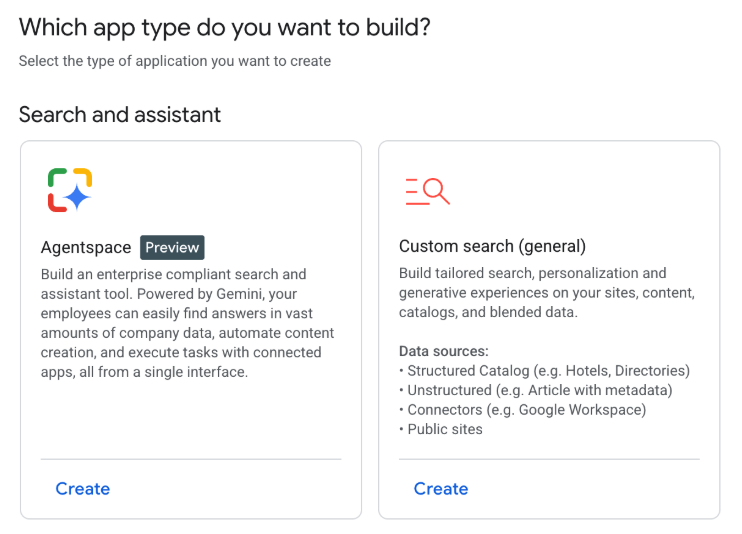
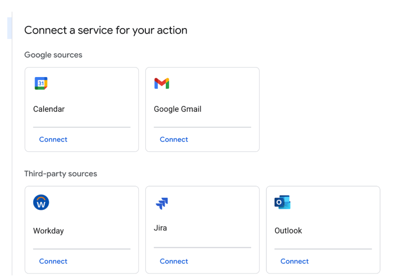
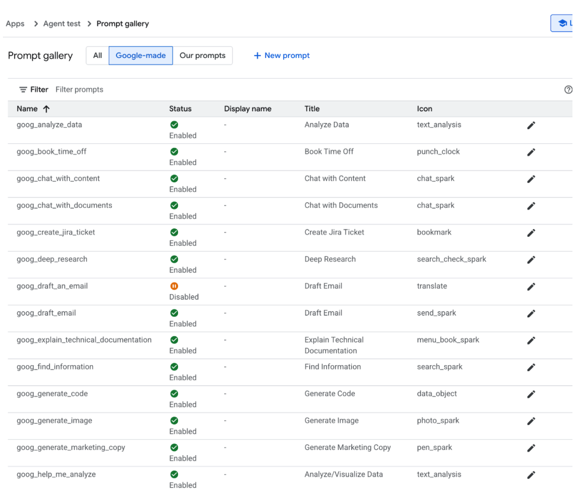
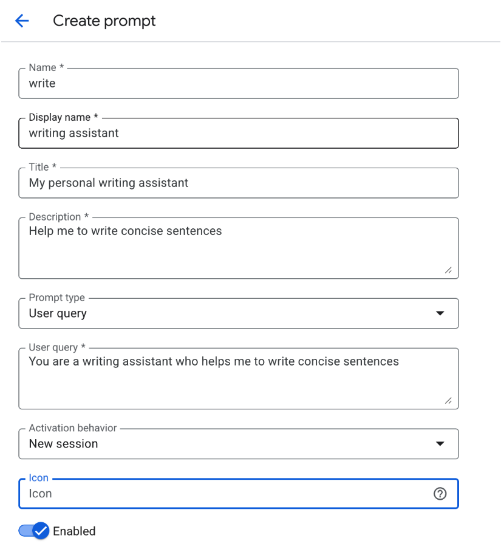
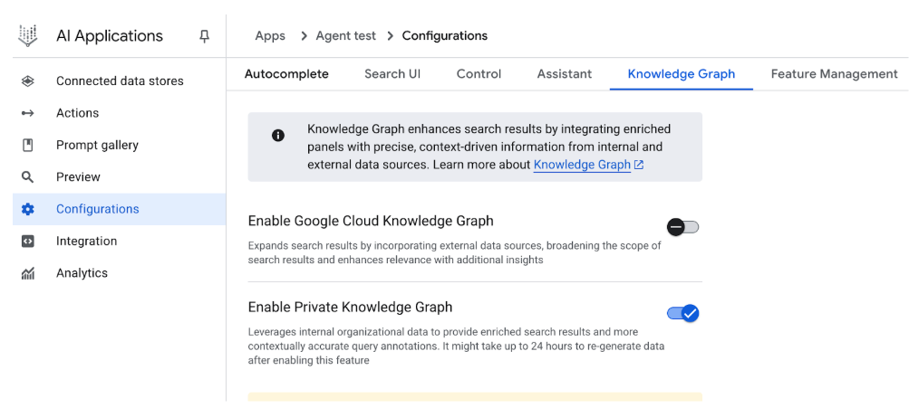
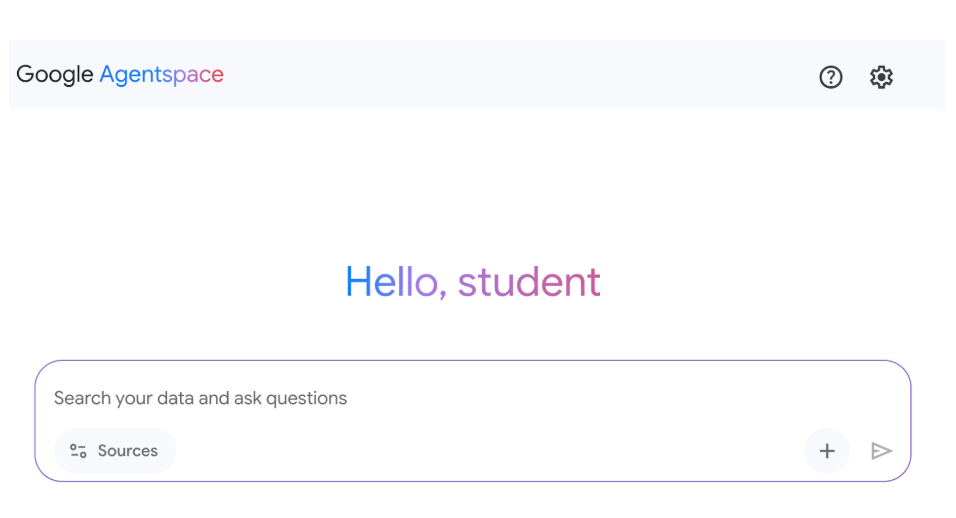

# 附录 D - 使用 AgentSpace 构建 Agent

## 概述

AgentSpace 是一个旨在通过将人工智能集成到日常工作流程中来促进"由 Agent 驱动的企业"的平台。其核心是提供跨组织整个数字足迹的统一搜索能力，包括文档、电子邮件和数据库。该系统利用先进的 AI 模型（如 Google 的 Gemini）来理解和综合来自这些不同来源的信息。

该平台支持创建和部署能够执行复杂任务并自动化流程的专用 AI "agent"。这些 agent 不仅仅是聊天机器人；它们可以自主地进行推理、规划和执行多步骤操作。例如，一个 agent 可以研究一个主题，编译一份带有引用的报告，甚至生成音频摘要。

为了实现这一目标，AgentSpace 构建了一个企业知识图谱，映射人员、文档和数据之间的关系。这使得 AI 能够理解上下文并提供更相关和个性化的结果。该平台还包括一个名为 Agent Designer 的无代码界面，用于创建自定义 agent，无需深厚的技术专业知识。

此外，AgentSpace 支持多 agent 系统，不同的 AI agent 可以通过称为 Agent2Agent (A2A) 协议的开源协议进行通信和协作。这种互操作性允许更复杂和编排的工作流程。安全性是一个基础组件，具有基于角色的访问控制和数据加密等功能，以保护敏感的企业信息。最终，AgentSpace 旨在通过将智能、自主的系统直接嵌入到组织的运营结构中，来提高生产力和决策能力。

## 如何使用 AgentSpace UI 构建 Agent

图 1 说明了如何通过从 Google Cloud Console 中选择 AI Applications 来访问 AgentSpace。

图 1：如何使用 Google Cloud Console 访问 AgentSpace

您的 agent 可以连接到各种服务，包括 Calendar、Google Mail、Workaday、Jira、Outlook 和 Service Now（见图 2）。

图 2：集成各种服务，包括 Google 和第三方平台。

然后，Agent 可以利用自己的 prompt，从 Google 提供的预制 prompt 库中选择，如图 3 所示。

图 3：Google 的预制 prompt 库

或者，您可以如图 4 所示创建自己的 prompt，该 prompt 随后将被您的 agent 使用。

图 4：自定义 Agent 的 Prompt

AgentSpace 提供了许多高级功能，例如与数据存储集成以存储您自己的数据、与 Google Knowledge Graph 或您的私有 Knowledge Graph 集成、用于向 Web 公开您的 agent 的 Web 界面，以及用于监控使用情况的 Analytics 等（见图 5）。

图 5：AgentSpace 高级功能

完成后，AgentSpace 聊天界面（图 6）将可访问。

图 6：用于启动与您的 Agent 的聊天的 AgentSpace 用户界面。

## 结论

总之，AgentSpace 提供了一个功能性框架，用于在组织现有的数字基础设施内开发和部署 AI agent。该系统的架构将复杂的后端流程（如自主推理和企业知识图谱映射）链接到用于 agent 构建的图形用户界面。通过此界面，用户可以通过集成各种数据服务并通过 prompt 定义其操作参数来配置 agent，从而产生定制的、上下文感知的自动化系统。

这种方法抽象了底层技术复杂性，使得无需深厚的编程专业知识即可构建专用的多 agent 系统。主要目标是将自动化分析和操作能力直接嵌入到工作流程中，从而提高流程效率并增强数据驱动分析。对于实际指导，可以使用实践学习模块，例如 Google Cloud Skills Boost 上的"使用 Agentspace 构建 Gen AI Agent"实验室，它提供了一个结构化的技能获取环境。

## 参考文献

1. 使用 Agent Designer 创建无代码 agent，[https://cloud.google.com/agentspace/agentspace-enterprise/docs/agent-designer](https://cloud.google.com/agentspace/agentspace-enterprise/docs/agent-designer)
2. Google Cloud Skills Boost，[https://www.cloudskillsboost.google/](https://www.cloudskillsboost.google/)
