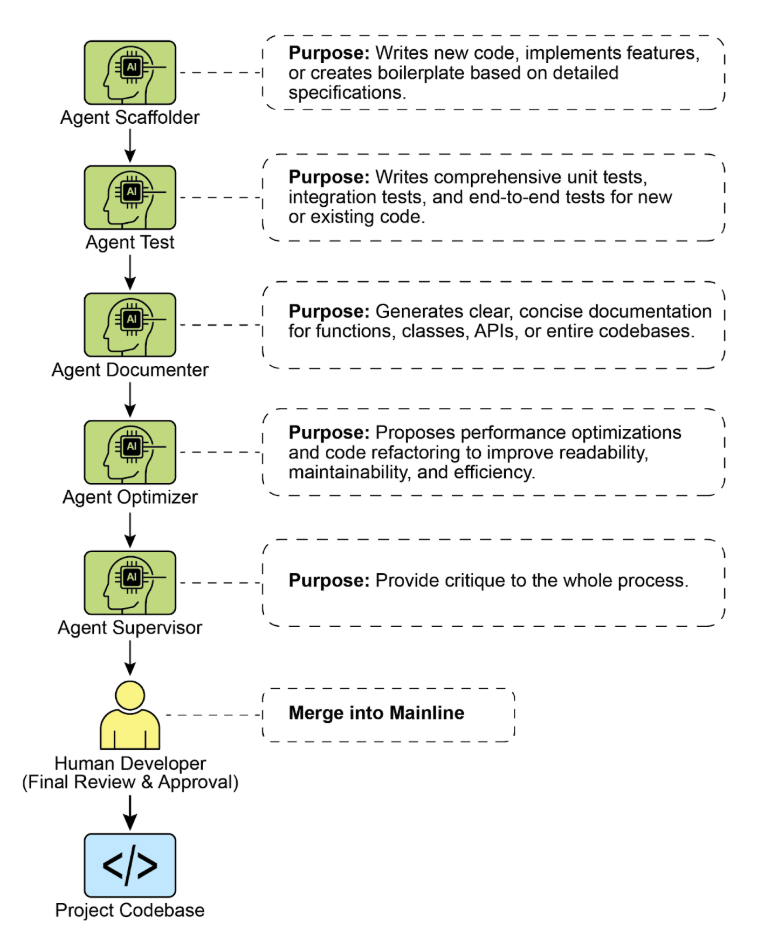

# 附录 G - 编码 Agent

## Vibe Coding：起点

"Vibe coding"已成为快速创新和创意探索的强大技术。这种实践涉及使用 LLM 生成初始草稿、概述复杂逻辑或构建快速原型，显著减少了初始摩擦。它对于克服"空白页"问题非常宝贵，使开发者能够快速从模糊概念转换为有形的、可运行的代码。Vibe coding 在探索不熟悉的 API 或测试新颖的架构模式时特别有效，因为它绕过了立即需要完美实现的需求。生成的代码通常作为创意催化剂，为开发者提供批判、重构和扩展的基础。其主要优势在于加速软件生命周期的初始发现和构思阶段的能力。然而，虽然 vibe coding 在头脑风暴方面表现出色，但开发健壮、可扩展和可维护的软件需要更结构化的方法，从纯生成转向与专业编码 agent 的协作伙伴关系。

## Agent 作为团队成员

虽然最初的浪潮专注于原始代码生成——适合构思的"vibe code"——但行业现在正在转向用于生产工作的更集成和强大的范式。最有效的开发团队不仅仅将任务委托给 Agent；他们正在用一套复杂的编码 agent 增强自己。这些 agent 充当不知疲倦的专业团队成员，放大人类创造力并显著提高团队的可扩展性和速度。

这种演变反映在行业领导者的声明中。2025 年初，Alphabet 首席执行官 Sundar Pichai 指出，在 Google，**"超过 30% 的新代码现在由我们的 Gemini 模型辅助或生成，从根本上改变了我们的开发速度。"** Microsoft 也做出了类似的声明。这种行业范围的转变表明，真正的前沿不是替代开发者，而是增强他们。目标是增强关系，人类指导架构愿景和创造性问题解决，而 agent 处理专业的、可扩展的任务，如测试、文档和审查。

本章提出了一个基于核心理念组织人-agent 团队的框架，即人类开发者充当创意领导和架构师，而 AI agent 充当力量倍增器。该框架基于三个基本原则：

1. **人类主导的编排：** 开发者是团队领导和项目架构师。他们始终处于循环中，编排工作流程，设定高级目标，并做出最终决策。Agent 很强大，但它们是支持性协作者。开发者指导哪个 agent 参与，提供必要的上下文，最重要的是，对任何 Agent 生成的输出行使最终判断，确保它符合项目的质量标准和长期愿景。
2. **上下文的优先性：** Agent 的性能完全取决于其上下文的质量和完整性。具有不良上下文的强大 LLM 是无用的。因此，我们的框架优先考虑细致的人类主导的上下文管理方法。避免自动化的、黑盒的上下文检索。开发者负责为他们的 Agent 团队成员组装完美的"简报"。这包括：
   * **完整的代码库：** 提供所有相关的源代码，以便 agent 理解现有模式和逻辑。
   * **外部知识：** 提供特定的文档、API 定义或设计文档。
   * **人类简报：** 阐述清晰的目标、需求、pull request 描述和样式指南。
3. **直接模型访问：** 为了实现最先进的结果，agent 必须由对前沿模型（例如，Gemini 2.5 PRO、Claude Opus 4、OpenAI、DeepSeek 等）的直接访问提供支持。使用功能较弱的模型或通过隐藏或截断上下文的中间平台路由请求将降低性能。该框架建立在人类领导和底层模型的原始能力之间尽可能纯的对话基础上，确保每个 agent 在其峰值潜力下运行。

该框架被构建为一个专业 agent 团队，每个 agent 都为开发生命周期中的核心功能而设计。人类开发者充当中心编排器，委派任务并整合结果。

## 核心组件

为了有效利用前沿大型语言模型，该框架将不同的开发角色分配给专业 agent 团队。这些 agent 不是独立的应用程序，而是通过精心制作的、特定角色的 prompt 和上下文在 LLM 内调用的概念角色。这种方法确保模型的广泛能力精确地集中在手头的任务上，从编写初始代码到执行细致的、批判性的审查。

**编排器：人类开发者：** 在这个协作框架中，人类开发者充当编排器，充当中心智能和对 AI agent 的最终权威。

* **角色：** 团队领导、架构师和最终决策者。编排器定义任务、准备上下文并验证 agent 完成的所有工作。
* **界面：** 开发者自己的终端、编辑器和所选 Agent 的原生 Web UI。

**上下文准备区：** 作为任何成功的 agent 交互的基础，上下文准备区是人类开发者细致地准备完整且特定任务的简报的地方。

* **角色：** 每个任务的专用工作空间，确保 agent 收到完整和准确的简报。
* **实现：** 一个临时目录（task-context/），包含用于目标、代码文件和相关文档的 markdown 文件

**专业 Agent：** 通过使用有针对性的 prompt，我们可以构建一个专业 agent 团队，每个 agent 都针对特定的开发任务量身定制。

* **脚手架 Agent：实施者**  
  * **目的：** 编写新代码、实现功能或基于详细规范创建样板。
    * **调用 Prompt：** "你是一名高级软件工程师。基于 01_BRIEF.md 中的要求和 02_CODE/ 中的现有模式，实现功能..."
* **测试工程师 Agent：质量守卫**  
  * **目的：** 为新代码或现有代码编写全面的单元测试、集成测试和端到端测试。
    * **调用 Prompt：** "你是一名质量保证工程师。对于 02_CODE/ 中提供的代码，使用 [测试框架，例如 pytest] 编写一套完整的单元测试。涵盖所有边缘情况并遵循项目的测试理念。"
* **文档编写 Agent：记录员**  
  * **目的：** 为函数、类、API 或整个代码库生成清晰、简洁的文档。
    * **调用 Prompt：** "你是一名技术作家。为提供的代码中定义的 API 端点生成 markdown 文档。包括请求/响应示例并解释每个参数。"
* **优化 Agent：重构伙伴**  
  * **目的：** 提出性能优化和代码重构，以提高可读性、可维护性和效率。
    * **调用 Prompt：** "分析提供的代码中的性能瓶颈或可以为清晰度而重构的区域。提出具体更改并解释为什么它们是改进。"
* **流程 Agent：代码主管**  
  * **批判：** Agent 执行初始传递，识别潜在的错误、样式违规和逻辑缺陷，很像静态分析工具。
    * **反思：** Agent 然后分析自己的批判。它综合发现，优先考虑最关键的问题，驳回迂腐的或低影响的建议，并为人类开发者提供高级的、可操作的摘要。
    * **调用 Prompt：** "你是一名进行代码审查的首席工程师。首先，对更改进行详细批判。其次，反思你的批判，提供最重要反馈的简洁、优先的摘要。"

最终，这种人类主导的模型在开发者的战略方向和 agent 的战术执行之间创造了强大的协同作用。因此，开发者可以超越常规任务，将他们的专业知识集中在提供最大价值的创意和架构挑战上。

## 实际实现

### 设置清单

为了有效实现人-agent 团队框架，建议进行以下设置，专注于在提高效率的同时保持控制。

1. **提供对前沿模型的访问** 为至少两个领先的大型语言模型（例如 Gemini 2.5 Pro 和 Claude 4 Opus）获取 API 密钥。这种双提供商方法允许进行比较分析并防范单平台限制或停机。这些凭证应该像任何其他生产秘密一样安全地管理。
2. **实现本地上下文编排器** 不要使用临时脚本，而是使用轻量级 CLI 工具或本地 agent 运行器来管理上下文。这些工具应该允许您在项目根目录中定义一个简单的配置文件（例如，context.toml），该文件指定哪些文件、目录甚至 URL 要编译为 LLM prompt 的单个有效负载。这确保您对模型在每个请求上看到的内容保持完全、透明的控制。
3. **建立版本控制的 Prompt 库** 在项目的 Git 仓库中创建一个专门的 /prompts 目录。在其中，将每个专业 agent 的调用 prompt（例如，reviewer.md、documenter.md、tester.md）存储为 markdown 文件。将您的 prompt 视为代码允许整个团队协作、完善和版本控制随时间给予您的 AI agent 的指令。
4. **将 Agent 工作流程与 Git Hooks 集成** 使用本地 Git hooks 自动化您的审查节奏。例如，可以配置 pre-commit hook 以自动触发对您暂存更改的 Reviewer Agent。Agent 的批判和反思摘要可以直接显示在您的终端中，在您最终提交之前提供即时反馈，并将质量保证步骤直接烘焙到您的开发过程中。

图 1：编码专业示例

### 领导增强团队的原则

成功领导此框架需要从唯一贡献者演变为人-AI 团队的领导，遵循以下原则：

* **保持架构所有权** 您的角色是设定战略方向并拥有高级架构。您定义"什么"和"为什么"，使用 agent 团队加速"如何"。您是设计的最终 **仲裁者**，确保每个组件都符合项目的长期愿景和质量标准。
* **掌握简报的艺术** Agent 输出的质量直接反映其输入的质量。通过为每个任务提供清晰、明确和全面的上下文来掌握简报的艺术。不要将您的 prompt 视为简单的命令，而是将其视为新成员、高能力团队成员的完整简报包。
* **充当最终质量门** Agent 的输出始终是一个提议，而不是命令。将 Reviewer Agent 的反馈视为强大的信号，但您是最终的质量门。应用您的领域专业知识和项目特定知识来验证、挑战和批准所有更改，充当代码库完整性的最终守护者。
* **参与迭代对话** 最佳结果来自对话，而不是独白。如果 agent 的初始输出不完美，不要丢弃它——完善它。提供纠正性反馈，添加澄清上下文，并提示再次尝试。这种迭代对话至关重要，特别是与 Reviewer Agent，其"反思"输出旨在成为协作讨论的开始，而不仅仅是最终报告。

## 结论

代码开发的未来已经到来，并且是增强的。孤独编码者的时代已经让位于新范式，开发者领导专业 AI agent 团队。这个模型并没有削弱人类的作用；它通过自动化常规任务、扩展个人影响并实现以前无法想象的开发速度来提升它。

通过将战术执行卸载给 Agent，开发者现在可以将他们的认知能量投入到真正重要的事情上：战略创新、弹性架构设计以及构建让用户满意的产品所需的创造性问题解决。基本关系已被重新定义；它不再是人与机器的竞争，而是人类智慧和 AI 之间的伙伴关系，作为一个单一的、无缝集成的团队工作。

## 参考文献

1. AI 负责生成 Google 超过 30% 的代码 [https://www.reddit.com/r/singularity/comments/1k7rxo0/ai_is_now_writing_well_over_30_of_the_code_at/](https://www.reddit.com/r/singularity/comments/1k7rxo0/ai_is_now_writing_well_over_30_of_the_code_at/)
2. AI 负责生成 Microsoft 超过 30% 的代码 [https://www.businesstoday.in/tech-today/news/story/30-of-microsofts-code-is-now-ai-generated-says-ceo-satya-nadella-474167-2025-04-30](https://www.businesstoday.in/tech-today/news/story/30-of-microsofts-code-is-now-ai-generated-says-ceo-satya-nadella-474167-2025-04-30)
