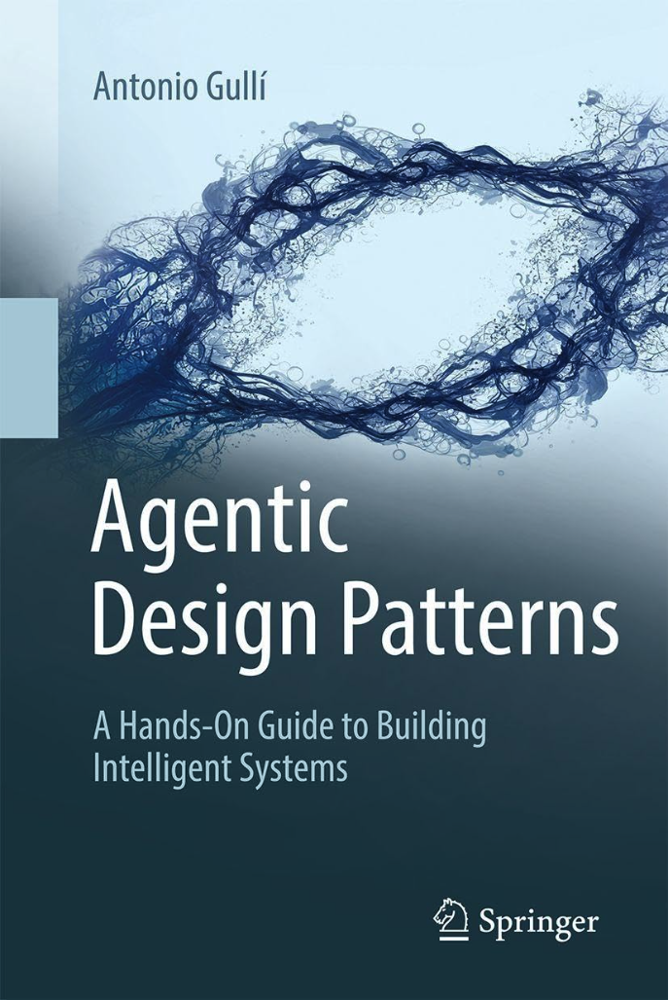

# Agentic Design Patterns（智能体设计模式）

本仓库包含 Antonio Gulli 和 Mauro Sauco 所著的《Agentic Design Patterns》一书的完整文本。内容由 Tom Mathews 编译和组织，便于社区访问和参考。

## 作者与致谢

- **作者:** [Antonio Gulli](https://www.linkedin.com/in/searchguy/) 和 [Mauro Sauco](https://www.linkedin.com/in/maurosauco/)
- **编译者:** [Tom Mathews](https://www.linkedin.com/in/mathews-tom/)

### 这本书的独特之处是什么？

这本 424 页的指南直面我们在构建智能、自主 AI 系统时遇到的真实挑战。它弥合了理论与实践之间的差距——这正是我们领域目前最需要的。这是任何认真构建真实 AI 系统的开发者的最佳资源。如果你是一位工程师、研究员或产品经理，准备超越基础 LLM 应用并构建真正强大的 AI 智能体，那么这本书正适合你。

本书涵盖了包括 Prompt Chaining（提示链）、Routing（路由）、Planning（规划）和 Multi-Agent Systems（多智能体系统）在内的核心智能体模式，所有内容都配有实用的代码示例。你将找到关于 Tool Use（工具使用）、Memory Management（内存管理）和 RAG 实现的全面覆盖，以及 Reasoning Techniques（推理技术）和 Inter-Agent Communication（智能体间通信）等高级主题。

本书内容包括：

- **真实代码示例：** 不仅仅是理论，而是可运行的实现。
- **经过验证的模式：** 内存处理、异常逻辑、资源控制、安全护栏。
- **高级技术：** 多智能体编排、智能体间消息传递、人机协作循环。
- **关于 MCP（Model Context Protocol，模型上下文协议）的完整章节：** 将工具与智能体集成的关键框架。

本书涵盖 4 个部分的 21 个核心模式：

1. 基础模式（提示链、路由、工具使用）
2. 高级系统（内存、学习、监控）
3. 生产关注点（错误处理、安全性、评估）
4. 多智能体架构

大多数 AI 内容只停留在"如何调用 API"。但在现实世界的系统中，你需要考虑：

- 如果智能体在执行任务过程中卡住了怎么办？
- 如何在长时间会话中保持内存？
- 当你运行 10+ 个智能体时，如何防止混乱？

本书通过你可以实际应用的模式回答了所有这些问题。仅 70+ 页的附录就值得投资，其中包含 Advanced Prompting（高级提示）技术和 Agentic Frameworks（智能体框架）概述。

## 目录

### 引言

- [献词](00-Introduction/01-Dedication-1cQ61mNpiWn6eSORmWjEjF44vN2Lpba8kyKmNwIC60ig.md)
- [致谢](00-Introduction/02-Acknowledgment-1u2y6tY48bw8nriDUuwWEf9s8g66vyIqBKSKZDOS-n0s.md)
- [前言](00-Introduction/03-Foreword-18Q9kfZuCTL37ztrSjLxwf8Elr5UfAiAavmnj0IqSpbU.md)
- [思想领袖视角：权力与责任](00-Introduction/04-A_Thought_Leaders_Perspective_Power_and_Responsibility-1PWhaXD_UNKgJaxYe3JBxRFRt3_B8Wm67CFxtSBQ4LkU.md)
- [引言](00-Introduction/05-Introduction-1K5jwqB6jh20uHL0TTWxqWOxFk-dzFxRvHzrRRV79hrg.md)
- [什么使 AI 系统成为智能体？](00-Introduction/06-What_makes_an_AI_system_an_Agent-1Nw6hRa7ItdLr_Tj5hF2q-OH8B_uPKb--RLn8SXZKA94.md)

### 第一部分：基础模式

- [第 1 章：Prompt Chaining（提示链）](01-Part_One/Chapter_1-Prompt_Chaining-1flxKGrbnF2g8yh3F-oVD5Xx7ZumId56HbFpIiPdkqLI.md)
- [第 2 章：Routing（路由）](01-Part_One/Chapter_2-Routing-1ux_n8n3T4bYndOjs1DKW5ccpC802KISdy2IWnlvYbas.md)
- [第 3 章：Parallelization（并行化）](01-Part_One/Chapter_3-Parallelization-1XVMp4RcRkoUJTVbrP2foWZX703CUJpWkrhyFU2cfUOA.md)
- [第 4 章：Reflection（反思）](01-Part_One/Chapter_4-Reflection-1HXXJOQIMWowtLw4WMiSR360caDAlZPtl5dPPgvq9IT4.md)
- [第 5 章：Tool Use（工具使用，函数调用）](01-Part_One/Chapter_5-Tool_Use_(Function_Calling)-1bE4iMljhppqGY1p48gQWtZvk6MfRuJRCiba1yRykGNE.md)
- [第 6 章：Planning（规划）](01-Part_One/Chapter_6-Planning-18vvNESEwHnVUREzIipuaDNCnNAREGqEfy9MQYC9wb4o.md)
- [第 7 章：Multi-Agent Collaboration（多智能体协作）](01-Part_One/Chapter_7-Multi-Agent_Collaboration-1RZ5-2fykDQKOBx01pwfKkDe0GCs5ydca7xW9Q4wqS_M.md)

### 第二部分：高级系统

- [第 8 章：Memory Management（内存管理）](02-Part_Two/Chapter_8-Memory_Management-1asVTObtzIye0I9ypAztaeeI_sr_Hx2TORE02uUuqH_c.md)
- [第 9 章：Learning and Adaptation（学习与适应）](02-Part_Two/Chapter_9-Learning_and_Adaptation-1UHTEDCmSM1nwB-iyMoHuYzVcu_B_4KkJ2ITGGUKqo8s.md)
- [第 10 章：Model Context Protocol (MCP)（模型上下文协议）](02-Part_Two/Chapter_10-Model_Context_Protocol_(MCP)-1e6XimYczKmhX9zpqEyxLFWPQgGuG0brp7Hic2sFl_qw.md)
- [第 11 章：Goal Setting and Monitoring（目标设定与监控）](02-Part_Two/Chapter_11-Goal_Setting_and_Monitoring-10ndlCB39BWjyFRWKpcoKib4vuPD1ojD-x0-ynMaf5uw.md)

### 第三部分：生产关注点

- [第 12 章：Exception Handling and Recovery（异常处理与恢复）](03-Part_Three/Chapter_12-Exception_Handling_and_Recovery-1C07AuMur6-infwE0viCp4QtAy_wWI-uceFm6MaYHQGk.md)
- [第 13 章：Human in the Loop（人机协作循环）](03-Part_Three/Chapter_13-Human_in_the_Loop-1ImOZcw6yeb7a-uRBMNP1VdovYfyip4IdsAcLu9yue-0.md)
- [第 14 章：Knowledge Retrieval (RAG)（知识检索）](03-Part_Three/Chapter_14-Knowledge_Retrieval_(RAG)-1v96Oobio6xDOqbK8ejsXjmOc4Dp2uoLMo5_gfJgi-NE.md)

### 第四部分：多智能体架构

- [第 15 章：Inter-Agent Communication (A2A)（智能体间通信）](04-Part_Four/Chapter_15-Inter_Agent_Communication_(A2A)-1H6HmUYcy5kugt5gt7Kh2Zzb8C62d5pu36RsgMNDCX24.md)
- [第 16 章：Resource-Aware Optimization（资源感知优化）](04-Part_Four/Chapter_16-Resource_Aware_Optimization-1nAN58l6JjqEJHk43126uh7xgdEblCpcbsNUHXgtBmJQ.md)
- [第 17 章：Reasoning Techniques（推理技术）](04-Part_Four/Chapter_17-Reasoning_Techniques-1Yt1W_hLaC6ZNgJXfT4W6NrCL4TzNVdKOX50kgpHiIq4.md)
- [第 18 章：Guardrails and Safety Patterns（护栏与安全模式）](04-Part_Four/Chapter_18-Guardrails_Safety_Patterns-1Gpc5af_okze1kprRLohP6-81e1KwL6HggjeLvxQyIuk.md)
- [第 19 章：Evaluation and Monitoring（评估与监控）](04-Part_Four/Chapter_19-Evaluation_and_Monitoring-1G3zOZM2ZOd0gUp5dy66FUjKMOcALh9l-JpvPxgGMm8w.md)
- [第 20 章：Prioritization（优先级排序）](04-Part_Four/Chapter_20-Prioritization-1qyXxGM2hNqW_qjXuBFxrEUeoYVO79BoW1ogKu1bfdCY.md)
- [第 21 章：Exploration and Discovery（探索与发现）](04-Part_Four/Chapter_21-Exploration_and_Discovery-1zeeMVTqjqRIli6G9MMWThhoQhvKqLOjJF2EHHUXLhdk.md)

### 附录

- [附录 A：Advanced Prompting Techniques（高级提示技术）](05-Appendix/Appendix_A-Advanced_Prompting_Techniques-1V7EKEWibOH6IhHD_PtbFZiml492-2191jDQCcTkhtTI.md)
- [附录 B：AI Agentic Interactions: From GUI to Real-World Environment（AI 智能体交互：从 GUI 到真实世界环境）](05-Appendix/Appendix_B-AI_Agentic_Interactions_From_GUI_to_Real_World_Environment-11pma_tCoC7uZ2SFKjcR5KyIq0_ooMGSoadI6f9mxG2I.md)
- [附录 C：Quick Overview of Agentic Frameworks（智能体框架快速概述）](05-Appendix/Appendix_C-Quick_Overview_of_Agentic_Frameworks-151rGsiEYOkXUcNDRus_N8TxxuvjoyTDViBhzt9z0Mfw.md)
- [附录 D：Building an Agent with AgentSpace (online only)（使用 AgentSpace 构建智能体，仅在线）](05-Appendix/Appendix_D-Building_an_Agent_with_AgentSpace_(on_line_only)-1bDRJ8mKtLTeWNC-cGD0Cr8pEJQgJHNcjqz5ekloAjaE.md)
- [附录 E - AI Agents on the CLI（命令行界面上的 AI 智能体）](05-Appendix/Appendix_E-AI_Agents_on_the_CLI-1W4znto0a8Ikajw5a4tEyRAaB2nJPJw_iFc4w4qNnjho.md)
- [附录 F：Under the Hood: An Inside Look at the Agent's Reasoning Engines（深入底层：智能体推理引擎内部解析）](05-Appendix/Appendix_F-Under_the_Hood_An_Inside_Look_at_the_Agents_Reasoning_Engines-14q3fQ-FZmDgiughno_WLSILMWkURvUgR7mlGiFtvwd4.md)
- [附录 G：Coding Agents（编码智能体）](05-Appendix/Appendix_G-Coding_Agents-1tVyhgwrD4fu_D_pHUrwhNxoguRG3tLc1KObXFxrxE_s.md)

## 许可证

本仓库采用 [MIT License](LICENSE) 许可证。

